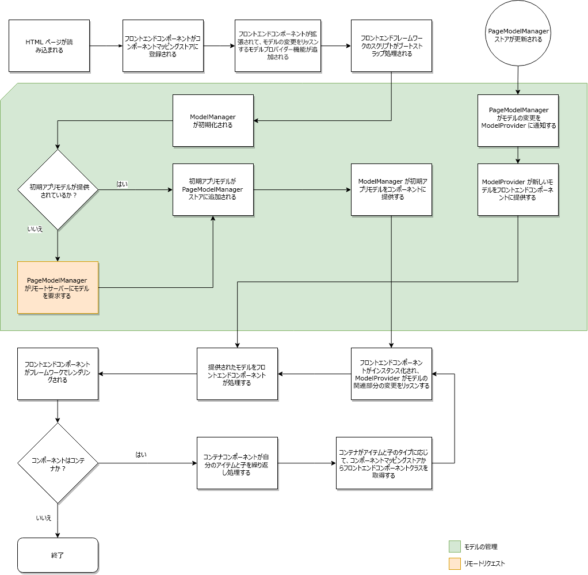

# SPA の動的モデルとコンポーネントのマッピング {#dynamic-model-to-component-mapping-for-spas}

このドキュメントでは、AEM 用 JavaScript SPA SDK で動的モデルとコンポーネントのマッピングがどのようにおこなわれるかを説明します。

## ComponentMapping モジュール {#componentmapping-module}

`ComponentMapping` モジュールは、プロントエンドプロジェクトに NPM パッケージとして提供されます。フロントエンドコンポーネントを格納し、単一ページアプリケーションがフロントエンドコンポーネントを AEM リソースタイプにマップする方法を提供します。これにより、アプリケーションの JSON モデルを構文解析する際に、コンポーネントの動的な解決が可能になります。

モデル内の各項目には、AEM リソースタイプを表示する `:type` フィールドが含まれます。フロントエンドコンポーネントは、マウントされると、基になるライブラリから受け取ったモデルのフラグメントを使用して自分自身をレンダリングできます。

モデル解析とモデルへのフロントエンドコンポーネントアクセスの詳細については、[SPA ブループリント](blueprint.md)ドキュメントを参照してください。

Npm パッケージ[@adobe/aem-spa-component-mapping](https://www.npmjs.com/package/@adobe/aem-spa-component-mapping) も参照してください。

## モデル駆動型単一ページアプリケーション{#model-driven-single-page-application}

AEM 用 JavaScript SPA SDK を利用する単一ページアプリケーションは、モデル主導です。

1. フロントエンドコンポーネントは、自らを[コンポーネントマッピングストア](#componentmapping-module)に登録します。
1. 次に、[コンテナ](blueprint.md#container)は、 [モデルプロバイダー](blueprint.md#the-model-provider)がモデルを提供した後、そのモデルコンテンツ（`:items`）を反復します。

1. ページの場合、その子（`:children`）は、最初に  コンポーネントマッピングからコンポーネントクラスを取得し、次にインスタンス化します。

## アプリの初期化 {#app-initialization}

各コンポーネントは、[`ModelProvider`](blueprint.md#the-model-provider) の機能で拡張されます。初期化は、次の一般的な形式をとります。

1. 各モデルプロバイダーは自身を初期化し、内部コンポーネントに対応するモデルの部分に対しておこなわれる変更をリッスンします。
1. [初期化フロー](blueprint.md)で示されるとおりに、[`PageModelManager`](blueprint.md#pagemodelmanager) は初期化される必要があります。

1. 保存されると、ページモデルマネージャーはアプリの完全なモデルを返します。
1. 次に、このモデルは、アプリケーションのフロントエンドルート[コンテナ](blueprint.md#container)コンポーネントに渡されます。
1. モデルの断片は、最後に個々の子コンポーネントに伝播されます。

