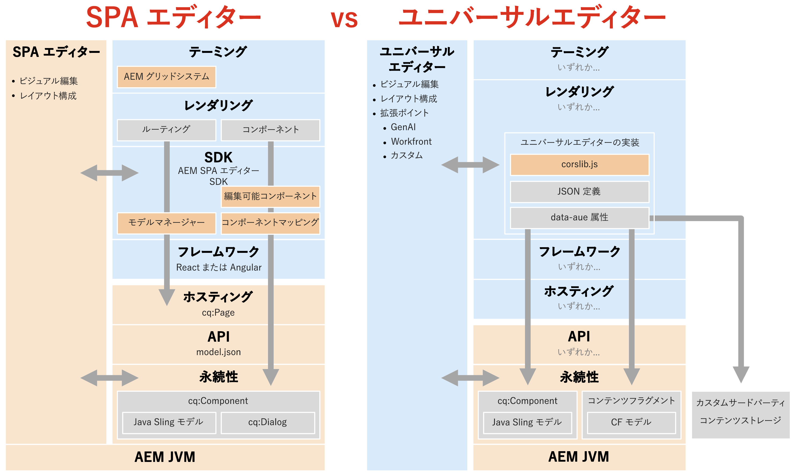

# SPA エディターの廃止 {#spa-editor-deprecation}

SPA エディターは、アドビで引き続きサポートしますが、プロジェクトに対するその廃止の意味と、今後のプロジェクトに対して使用できるオプションについて説明します。

## 概要 {#summary}

アドビでは、[AEM as a Cloud Service のリリース 2025.01](/help/release-notes/release-notes-cloud/2025/release-notes-2025-1-0.md#spa-editor) で SPA エディターを廃止しました。つまり、SDK に対して追加の機能強化や更新は行いません。アドビでは、AEM の最新のイノベーションの活用に、新しいプロジェクトに対しては[ユニバーサルエディター](/help/implementing/universal-editor/introduction.md)を使用することをお勧めします。

## 廃止の詳細 {#details}

SPA エディターの廃止は、**すぐに削除することを意味するものではなく**、既存の実装がある場合は、**ニーズを満たしている限り引き続き使用できます。**&#x200B;ただし、廃止には次の影響があります。

* 今後、アドビでは、P1 および P2 の問題と、セキュリティの脆弱性にのみ対処します。
* SDK に対して追加の開発、機能強化、更新は行いません。

廃止とは、つまり、次の SDK の機能を凍結することです。

* [AEM プロジェクトアーキタイプ](https://github.com/adobe/aem-project-archetype/)
* [AEM SPA プロジェクトコア](https://github.com/adobe/aem-spa-project-core)
* [AEM SPA ページモデルマネージャー](https://github.com/adobe/aem-spa-page-model-manager)
* [AEM SPA コンポーネントマッピング](https://github.com/adobe/aem-spa-component-mapping)
* [AEM SPA React 編集可能コンポーネント](https://github.com/adobe/aem-react-editable-components)
   * [AEM React コアコンポーネント](https://github.com/adobe/aem-react-core-wcm-components)
   * [AEM React コアコンポーネントベース](https://github.com/adobe/aem-react-core-wcm-components-base)
   * [AEM React コアコンポーネント SPA](https://github.com/adobe/aem-react-core-wcm-components-spa)
   * [AEM React コアコンポーネントの例](https://github.com/adobe/aem-react-core-wcm-components-examples)
* [AEM SPA Angular 編集可能コンポーネント](https://github.com/adobe/aem-angular-editable-components)
   * [AEM Angular コアコンポーネント](https://github.com/adobe/aem-angular-core-wcm-components)
   * [AEM Angular コアコンポーネントベース](https://github.com/adobe/aem-angular-core-wcm-components-base)
   * [AEM Angular コアコンポーネント SPA](https://github.com/adobe/aem-angular-core-wcm-components-spa)
   * [AEM Angular コアコンポーネントの例](https://github.com/adobe/aem-angular-core-wcm-components-examples)
* [AEM SPA Vue 編集可能コンポーネント](https://github.com/mavicellc/aem-vue-editable-components)

## SPA エディターの代替手段 {#alternatives}

SPA エディターに代わる最適な代替手段は、プロジェクトのニーズに応じて異なります。

* **[ユニバーサルエディター](/help/edge/wysiwyg-authoring/authoring.md)**&#x200B;は、SPA エディターに代わる直接的な代替手段として最適です。
   * ユニバーサルエディターは、ビジュアルエディターでもあり、アドビの SPA エディターでのエクスペリエンスをすべて組み込んで、分離された実装向けに特別に設計しました。
   * ユニバーサルエディターは、[AEM 6.5 用にもリリース](https://experienceleague.adobe.com/ja/docs/experience-manager-65/content/implementing/developing/headless/universal-editor/introduction)しているので（AEM 6.5 のリリース 2024.11.05 を含む）、Cloud Service に加えて AMS とオンプレミスのユースケースもサポートしています。
* **[コンテンツフラグメントエディター](/help/assets/content-fragments/content-fragments-managing.md)**&#x200B;は、フォームベースのエディターを使用するユーザー向けの代替手段です。
   * コンテンツフラグメントエディターは、コンテンツがページではなくコンテンツフラグメントとして構造化されている場合に最適です。

コンテンツフラグメントを使用してコンテンツを構造化すると、ビジュアルエディターとしてユニバーサルエディターの使用が除外されるわけではなく、両方のエディターを併用できます。

## ユニバーサルエディターへの移行 {#migrate-ue}

ユニバーサルエディターには多くのメリットがあり、移行することは新しいプロジェクトにとって優れたソリューションになります。

* **ビジュアル編集：** SPA エディターと同様に、作成者はプレビュー内でコンテンツを直接編集し、訪問者エクスペリエンスに影響する変更を即座に確認できます。
* **今後の校正：** AEM のロードマップでは、ビジュアルエディターとしてユニバーサルエディターが優先されています。これを採用することで、最新のイノベーションと機能強化にアクセスできます。
* **よりシンプルな統合：**&#x200B;ユニバーサルエディターを使用するのに AEM 固有の SDK は必要ないので、テクニカルスタックのロックインが軽減されます。
* **独自のアプリを導入：**&#x200B;ユニバーサルエディターは任意の web フレームワークやアーキテクチャをサポートしているので、複雑なリファクタリングを必要とせずに導入できます。
* **拡張性：**&#x200B;ユニバーサルエディターは、生成 AI、Workfront などとの統合を含む強力な[拡張フレームワーク](/help/implementing/universal-editor/extending.md)のメリットを受けます。

SPA エディターからユニバーサルエディターへの直接的な移行パスはありません。これは、2 つのテクノロジーの基本的な違いによるものです。

* ユニバーサルエディターでは、テンプレートエディター、スタイルシステム、レスポンシブグリッドなどの機能は再導入されません。
   * これらのユースケースでは、Edge Delivery Services またはヘッドレスプロジェクトの無駄のないフロントエンド CSS と JS を使用して、より効率的に処理できるようになりました。
* ユニバーサルエディターはサービスとしてのエディターなので、実装者がコンポーネントダイアログに CSS または JS を挿入できません。
   * これにより、ページエディターからのコンポーネントダイアログの自動変換を防ぐことができます。
   * これは、カスタムウィジェット、フィールド検証、表示／非表示ルール、テンプレートベースのカスタマイズなど、ダイアログの多くの領域に影響を与えます。

これらの技術的な違いを考慮して、アドビでは次の操作をお勧めします。

* サポートは継続されるので、既存の SPA エディターサイトはそのままにしておきます。
* 新しいサイト、セクション、ページなど、すべての新しい開発にユニバーサルエディターを採用します。

ユニバーサルエディターには、特定の SPA エディター機能が直接実装されていませんが、ユニバーサルエディターの新しい柔軟性を使用して同じ問題を解決する新しい方法があります。

## SPA エディターとユニバーサルエディターの比較 {#spa-vs-ue}

ユニバーサルエディターを使用すると、次の図に示すように、web アプリの実装者の自由度が大幅に向上します。

|  | SPA エディター | ユニバーサルエディター |
|---|---|---|
| **テーマ設定** | アプリでは、AEM のグリッド CSS を使用してレイアウトを実装する必要があります。 | アプリでは、レイアウトに最新の CSS テクニックを使用できます。 |
| **レンダリング** | アプリでは、SPA エディターのルーティング構造に従う必要があります。 | アプリは、従うべきルールやパターンを課されることなく、自由に実装できます。 |
| **SDK** | 実装では、SDK を緊密に統合する必要があります。 | オーサー層では、アプリは `corlib.js` を読み込み、HTML 注釈を介してユニバーサルエディターに指示を出すのみです。 |
| **フレームワーク** | アプリでは、サポートされているバージョンの React または Angular を使用する必要があります。 | アプリでは、任意のフレームワークまたはアーキテクチャを使用できます。 |
| **ホスティング** | アプリは、AEM のドメインでホストされている必要があります。 | アプリは、任意の場所で完全に分離してホストできます。 |
| **API** | アプリでは、`model.json` API からコンテンツを取得する必要があります。 | アプリでは、カスタムの API を含む任意の API を使用できます。 |
| **永続性** | SPA エディターは、ビジュアル編集のページコンテンツのみをサポートしています。 | ユニバーサルエディターは、ページとコンテンツフラグメントのビジュアル編集をネイティブにサポートしています。 |
|  |  | ユニバーサルエディターを拡張すると、同じ視覚的機能で外部コンテンツを編集できます。 |
|  | 開発者は、Sling モデルと `cq:Dialog` を AEM にデプロイする必要があります。 | 開発者は AEM の経験はほとんど必要ありません。また、Java を記述する必要もありません。 |
