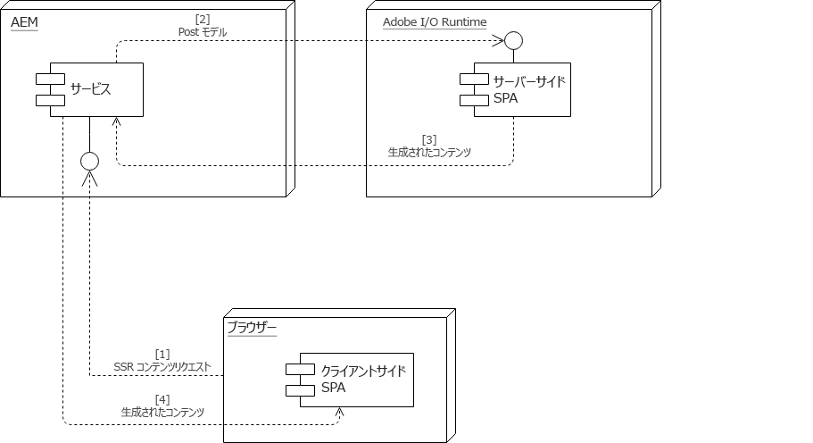

# SPA およびサーバーサイドレンダリング {#spa-and-server-side-rendering}

単一ページアプリケーション（SPA）では、使い慣れたネイティブアプリケーションと同様に反応して動作するリッチで動的なエクスペリエンスを提供できます。[この機能は、クライアントに依存して前もってコンテンツを読み込み、ユーザーの操作を処理する手間を省くことで実現されます](introduction.md#how-does-a-spa-work). このプロセスにより、クライアントとサーバーの間で必要な通信量を最小限に抑え、アプリの反応性を高めることができます。

ただし、SPAのサイズが大きくコンテンツが豊富な場合などは特に、このプロセスにより、初期読み込み時間が長くなる可能性があります。 読み込み時間を最適化するために、コンテンツの一部はサーバーサイドでレンダリングできます。 サーバーサイドレンダリング (SSR) を使用すると、ページの初期読み込みが高速化し、その後、クライアントにさらにレンダリングを渡すことができます。

## SSR を使用するタイミング {#when-to-use-ssr}

SSR が必要なのは一部のプロジェクトだけです。AEM は SPA 向けに JS SSR を完全にサポートしていますが、すべてのプロジェクトに対して体系的に JS SSR を実装することは推奨していません。

SSR の実装を決定する際は、まず、長期的なメンテナンスを含め、SSR を追加することがプロジェクトにとって現実的にどの程度の複雑さ、労力、コストを生み出すかを見積もる必要があります。 SSR アーキテクチャは、付加価値が予測コストを明確に上回る場合にのみ選択する必要があります。

次の質問のいずれかへの答えが明確に「はい」である場合、通常、SSR には価値があります。

* **SEO:** トラフィックをもたらす検索エンジンで、サイトのインデックスを適切に作成するために SSR が引き続き必要ですか？ メインの検索エンジンクローラーが JS を評価するようになったことに注意してください。
* **ページ速度：** SSR によって実際の環境の速度が大幅に上がり、全体的なユーザーエクスペリエンスが向上しますか。

この 2 つの質問のうち少なくとも 1 つに対して明確な「はい」で回答した場合にのみ、プロジェクトで SSR の実装をAdobeにお勧めします。 次の節では、[App Builder](https://developer.adobe.com/app-builder) の一部である Adobe I/O Runtime を使用してこれを行う方法について説明します。

## Adobe I/O Runtime {#adobe-i-o-runtime}

[プロジェクトに SSR の実装が必要であると確信できる](#when-to-use-ssr)場合、Adobe I/O Runtime を使用したソリューションが推奨されます。

Adobe I/O Runtimeについて詳しくは、以下を参照してください。

* [https://developer.adobe.com/runtime](https://developer.adobe.com/runtime) - App Builder のランタイム機能の概要
* [https://developer.adobe.com/app-builder](https://developer.adobe.com/app-builder) - App Builder 製品全体の詳細
* [https://developer.adobe.com/runtime/docs/](https://developer.adobe.com/runtime/docs) - 詳細なドキュメント

次の節では、2 つの異なるモデルで、SPA に SSR を実装する際に Adobe I/O Runtime を使用する方法について詳しく説明します。

* [AEM 主導の通信フロー](#aem-driven-communication-flow)
* [Adobe I/O Runtime 主導の通信フロー](#adobe-i-o-runtime-driven-communication-flow)

>[!NOTE]
>
>Adobeでは、環境（ステージング、実稼動、テストなど）ごとに個別のAdobe I/O Runtimeワークスペースを使用することをお勧めします。 これにより、異なる環境にデプロイされた単一アプリケーションの異なるバージョンを使用する、一般的なシステム開発ライフサイクル (SDLC) パターンを使用できます。 詳しくは、 [App Builder アプリケーション用 CI/CD](https://developer.adobe.com/app-builder/docs/guides/deployment/ci_cd_for_firefly_apps/) を参照してください。
>
>インスタンスタイプごとのランタイム実装に違いがない限り、インスタンス（オーサー、パブリッシュ）ごとに個別のワークスペースは必要ありません。

>[!NOTE]
>
>Cloud Manager は、Adobe I/O Runtimeへのデプロイメントをサポートしていません。 その結果、SSR コードをAdobe I/O Runtimeにデプロイするには、独自のインフラストラクチャを設定する必要があります。

## リモートレンダラーの設定 {#remote-content-renderer-configuration}

AEMは、リモートでレンダリングされたコンテンツをどこで取得できるかを把握している必要があります。 次に関係なく [SSR に実装するモデル](#adobe-i-o-runtime) このリモートレンダリングサービスへのアクセス方法をAEMに指定する必要があります。

このサービスは、 **RemoteContentRenderer - Configuration Factory OSGi サービス**. `http://<host>:<port>/system/console/configMgr` の Web コンソール設定コンソールで、文字列「RemoteContentRenderer」を検索します。


この設定では、次のフィールドを使用できます。

* **コンテンツパスパターン**  — 必要に応じて、コンテンツの一部を一致させる正規表現。
* **リモートエンドポイント URL** - コンテンツの生成を担当するエンドポイントの URL。
   * ローカルネットワークにない場合は、保護された HTTPS プロトコルを使用します。
* **追加の要求ヘッダー** - リモートエンドポイントに送信される要求に追加するヘッダー。
   * パターン：`key=value`
* **要求タイムアウト** - リモートホスト要求のタイムアウト（ミリ秒）。

>[!NOTE]
>
>[AEM 駆動の通信フロー](#aem-driven-communication-flow)と [Adobe I/O Runtime 駆動のフロー](#adobe-i-o-runtime-driven-communication-flow)のどちらを実装するかに関係なく、リモートコンテンツレンダラー設定を定義する必要があります。

>[!NOTE]
>
>この設定では、 [リモートコンテンツレンダラー](#remote-content-renderer) 追加の拡張機能とカスタマイズオプションを使用できます。

## AEM 主導の通信フロー {#aem-driven-communication-flow}

SSR を使用する場合、AEM にある SPA の[コンポーネントインタラクションワークフロー](introduction.md#interaction-with-the-spa-editor)には、Adobe I/O Runtime でアプリの初期コンテンツが生成される段階が含まれます。

1. ブラウザーは AEM から SSR コンテンツを要求します。
1. AEM は、モデルを Adobe I/O Runtime に投稿します。
1. Adobe I/O Runtime は生成されたコンテンツを返します。
1. AEM は、バックエンドページコンポーネントの HTL テンプレートを介して Adobe I/O Runtime から返される HTML を提供します。



## Adobe I/O Runtime 主導の通信フロー {#adobe-i-o-runtime-driven-communication-flow}

前の節では、AEMがブートストラップとコンテンツの提供を実行するAEMのSPAに関するサーバーサイドレンダリングの標準および推奨の実装について説明しました。

あるいは、SSR を実装して通信フローを効果的に逆転させ、Adobe I/O Runtime がブートストラップをおこなうようにすることもできます。

どちらのモデルも AEM で有効でサポートされています。ただし、特定のモデルを実装する前に、それぞれのメリットとデメリットを考慮する必要があります。

<table>
 <tbody>
  <tr>
   <th><strong>ブートストラップ</strong></th>
   <th><strong>メリット</strong></th>
   <th><strong>デメリット</strong></th>
  </tr>
  <tr>
   <th><strong>AEM 経由</strong><br /> </th>
   <td>
    <ul>
     <li>AEM は必要に応じてライブラリの挿入を管理する</li>
     <li>AEMでのリソースのみの管理<br /> </li>
    </ul> </td>
   <td>
    <ul>
     <li>SPA デベロッパーに馴染みのない場合がある<br /> </li>
    </ul> </td>
  </tr>
  <tr>
   <th><strong>Adobe I/O Runtime 経由<br /> </strong></th>
   <td>
    <ul>
     <li>SPA デベロッパーに馴染みがある<br /> </li>
    </ul> </td>
   <td>
    <ul>
     <li>CSS や JavaScript など、アプリケーションで必要な Clientlib リソースは、AEMデベロッパーが、 <code><a href="/help/implementing/developing/introduction/clientlibs.md">allowProxy</a></code> プロパティ<br /> </li>
     <li>リソースは AEM と Adobe I/O Runtime の間で同期する必要がある<br /> </li>
     <li>SPA のオーサリングを可能にするには、Adobe I/O Runtime のプロキシサーバーが必要になる場合がある</li>
    </ul> </td>
  </tr>
 </tbody>
</table>

## SSR の計画 {#planning-for-ssr}

一般に、アプリケーションの一部のみがサーバーサイドでレンダリングされる必要があります。 一般的な例としては、ページの初回読み込み時に一画面に表示されるコンテンツがサーバーサイドでレンダリングされます。 このプロセスにより、既にレンダリングされたコンテンツをクライアントに配信することで時間を節約できます。 ユーザーが SPA とやり取りすると、追加のコンテンツがクライアントによってレンダリングされます。

SPAにサーバーサイドレンダリングを実装する場合を考慮して、アプリケーションのどの部分について必要かを確認します。

## SSR を使用した SPA の開発 {#developing-an-spa-using-ssr}

SPA コンポーネントは、クライアント（ブラウザー内）またはサーバーサイドでレンダリングできます。サーバーサイドでレンダリングすると、ウィンドウのサイズや位置などのブラウザーのプロパティは存在しません。したがって、SPAのコンポーネントは、レンダリングされる場所を前提としない、同型のものである必要があります。

SSR を使用するには、サーバーサイドレンダリングを担当するAEMとAdobe I/O Runtimeにコードをデプロイする必要があります。 ほとんどのコードは同じですが、サーバー固有のタスクは異なります。

## AEM の SPA 向け SSR {#ssr-for-spas-in-aem}

AEMのSPA向け SSR には、Adobe I/O Runtimeが必要です。この呼び出しは、アプリコンテンツサーバー側のレンダリングに呼び出されます。 アプリの HTL 内で、コンテンツをレンダリングするために Adobe I/O Runtime のリソースが呼び出されます。

AEMが標準でAngularおよび React SPAフレームワークをサポートするのと同様に、Angularおよび React アプリでもサーバーサイドのレンダリングがサポートされます。 詳しくは、両方のフレームワークの NPM ドキュメントを参照してください。

## リモートコンテンツレンダラー {#remote-content-renderer}

AEM で SSR を SPA と使用するために必要な[リモートコンテンツレンダラー設定](#remote-content-renderer-configuration)は、ニーズに合わせて拡張およびカスタマイズできる、より一般化されたレンダリングサービスです。

### RemoteContentRenderingService {#remotecontentrenderingservice}

`RemoteContentRenderingService` リモートサーバーでレンダリングされるコンテンツ (Adobe I/Oからなど ) を取得する OSGi サービス。リモートサーバーに送信されるコンテンツは、渡されたリクエストパラメーターに基づきます。

`RemoteContentRenderingService` 追加のコンテンツ操作が必要な場合に、カスタム Sling モデルまたはサーブレットに依存関係を反転してインジェクトできます。

このサービスは、[RemoteContentRendererRequestHandlerServlet](#remotecontentrendererrequesthandlerservlet) によって内部的に使用されます。

### RemoteContentRendererRequestHandlerServlet {#remotecontentrendererrequesthandlerservlet}

The `RemoteContentRendererRequestHandlerServlet` を使用して、要求の設定をプログラムで設定します。 `DefaultRemoteContentRendererRequestHandlerImpl`では、デフォルトのリクエストハンドラーの実装が提供されており、複数の OSGi 設定を作成して、コンテンツ構造内の場所をリモートエンドポイントにマッピングできます。

カスタム要求ハンドラーを追加するには、`RemoteContentRendererRequestHandler` インターフェイスを実装します。`Constants.SERVICE_RANKING` コンポーネントプロパティは、100（`DefaultRemoteContentRendererRequestHandlerImpl` のランク）より大きい整数に設定してください。

```javascript
@Component(immediate = true,
        service = RemoteContentRendererRequestHandler.class,
        property={
            Constants.SERVICE_RANKING +":Integer=1000"
        })
public class CustomRemoteContentRendererRequestHandlerImpl implements RemoteContentRendererRequestHandler {}
```

### デフォルトハンドラーの OSGi 設定の作成 {#configure-default-handler}

デフォルトハンドラーの設定は、「[リモートコンテンツレンダラーの設定](#remote-content-renderer-configuration)」の説明に従って作成する必要があります。

### リモートコンテンツレンダラーの使用 {#usage}

サーブレットで、ページにインジェクトされたコンテンツを取得して返します。

1. リモートサーバーがアクセス可能であることを確認します。
1. AEM コンポーネントの HTL テンプレートに次のスニペットのいずれかを追加します。
1. 必要に応じて、OSGi 設定を作成または変更します。
1. サイトコンテンツの参照

通常、ページコンポーネントの HTL テンプレートは、この機能のメイン受信者です。

```html
<sly data-sly-resource="${resource @ resourceType='cq/remote/content/renderer/request/handler'}" />
```

### 要件 {#requirements}

このサーブレットでは、Sling Model Exporter を使用してコンポーネントデータをシリアル化します。 デフォルトでは、`com.adobe.cq.export.json.ContainerExporter` および `com.adobe.cq.export.json.ComponentExporter` の両方が Sling モデルアダプターとしてサポートされています。必要に応じて、`RemoteContentRendererServlet` を使用して `RemoteContentRendererRequestHandler#getSlingModelAdapterClasses` を実装するように要求を適合させる必要があるクラスを追加できます。追加のクラスは、`ComponentExporter` を拡張する必要があります。
