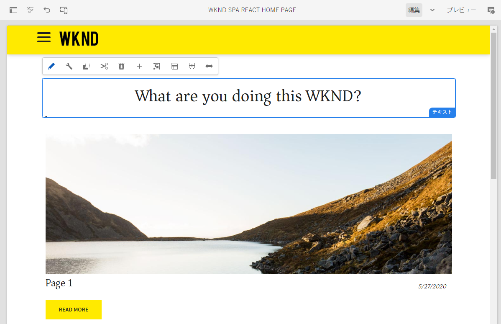

# WKND SPA プロジェクト {#wknd-spa-project}

{{ue-over-spa}}

複数のパートで構成されているこのチュートリアルを実行すると、プロジェクトの設定、コンポーネントのマッピング、フロントエンド開発ツール、アプリケーションのルーティングなどを理解して、独自の SPA を実装できるようになります。このチュートリアルを活用して SPA 開発に習熟しください。

AEM WKND チュートリアルと同様に、SPA に的を絞ったこのチュートリアルでは、編集可能な独自の単一ページアプリケーションを AEM で作成する包括的な例を示します。プロジェクトの設定から始まり、アプリケーションのルーティングまでを紹介します。

* [AEM での Angular SPA の作成（チュートリアル）](https://experienceleague.adobe.com/docs/experience-manager-learn/getting-started-with-aem-headless/spa-editor/angular/overview.html?lang=ja)
* [AEM での React SPA の作成（チュートリアル）](https://experienceleague.adobe.com/docs/experience-manager-learn/getting-started-with-aem-headless/spa-editor/react/overview.html?lang=ja)

AEM 対応の独自の SPA プロジェクトを開始する前に、[AEM 対応 SPA の開発](developing.md)のドキュメントに目を通すことをお勧めします。
