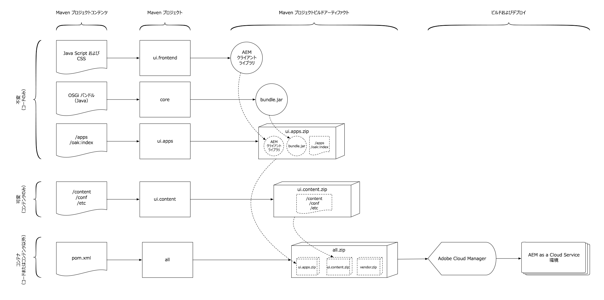
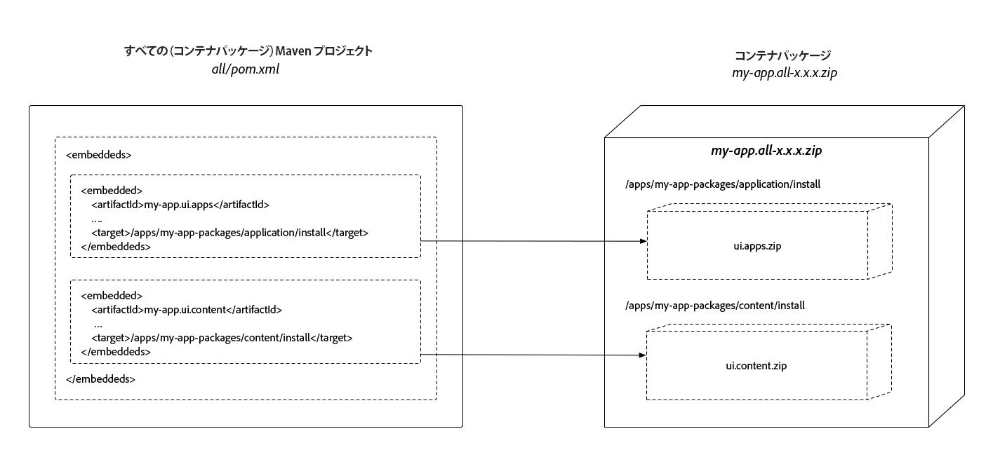

# AEM プロジェクトの構造

>[!TIP]
>
>[AEM プロジェクトアーキタイプ](https://docs.adobe.com/content/help/ja-JP/experience-manager-core-components/using/developing/archetype/overview.html)の基本的な使用法と、[FileVault コンテンツパッケージ Maven プラグイン](https://helpx.adobe.com/jp/experience-manager/6-5/sites/developing/using/vlt-mavenplugin.html)について説明します。この記事では、これらの概念の理解を前提としています。

この記事では、可変コンテンツと不変コンテンツの分割を確実に反映し、AEMとしてAdobe Experience Managerプロジェクトに必要な変更点について説明します。競合しない決定的なデプロイメントを作成するための依存関係が確立され、デプロイ可能な構造にパッケージ化されます。

AEM アプリケーションのデプロイメントは、単一の AEM パッケージで構成する必要があります。次に、そのパッケージには、コード、設定、補助的なベースラインコンテンツなど、アプリケーションが機能するのに必要なあらゆるもので構成されるサブパッケージが含まれている必要があります。

AEM では、**コンテンツ**&#x200B;と&#x200B;**コード**&#x200B;を分離する必要があります。つまり、リポジトリの `/apps` と実行時に書き込み可能な領域（例：`/content`、`/conf`、`/home`、その他 `/apps` 以外のすべて）の&#x200B;**両方**&#x200B;に 1 つのコンテンツパッケージをデプロイすることは&#x200B;**できません**。代わりに、アプリケーションを AEM にデプロイするには、コードとコンテンツを別々のパッケージに分離する必要があります。

このドキュメントで概要を説明しているパッケージ構造は、ローカル開発デプロイメントと AEM as a Cloud Service デプロイメントの&#x200B;**両方**&#x200B;に対応しています。

>[!TIP]
>
>このドキュメントで概要を説明している設定は、[AEM プロジェクト Maven アーキタイプ 24 以降](https://github.com/adobe/aem-project-archetype/releases)で提供されます。

## リポジトリの可変領域と不変領域 {#mutable-vs-immutable}

`/apps` と `/libs` は AEM の&#x200B;**不変**&#x200B;領域と見なされます。AEM の起動後（例：実行時）に変更（作成、更新、削除）できないからです。実行時に不変領域を変更しようとすると失敗します。

リポジトリ内のそれ以外の領域（`/content`、`/conf`、`/var`、`/etc`、`/oak:index`、`/system`、`/tmp`、など）はすべて&#x200B;**可変**&#x200B;領域です。つまり、実行時に変更できます。

>[!WARNING]
>
>以前のバージョンの AEM と同様に、`/libs` は変更しないでください。`/libs` にデプロイできるのは、AEM 製品コードだけです。

### Oak インデックス {#oak-indexes}

Oak indexes (`/oak:index`) are specifically managed by the AEM as a Cloud Service deployment process. これは、新しいインデックスが展開され、完全にインデックスが再構築された後で、新しいコードイメージに切り替えるまで、Cloud Managerは待機する必要があるからです。

このため、Oak インデックスは実行時に可変ですが、可変パッケージがインストールされる前にインストールできるように、コードとしてデプロイする必要があります。Therefore `/oak:index` configurations are part of the Code Package and not part of the Content Package [as described below](#recommended-package-structure).

>[!TIP]
>
>For further details about indexing in AEM as a Cloud Service, please see the document [Content Search and Indexing](/help/operations/indexing.md).

## 推奨されるパッケージ構造 {#recommended-package-structure}



この図は、推奨されるプロジェクト構造とパッケージデプロイメントアーティファクトの概要を示しています。

推奨されるアプリケーションデプロイメント構造は次のとおりです。

### コードパッケージ/OSGiバンドル

+ OSGiバンドルのJarファイルが生成され、すべてのプロジェクトに直接埋め込まれます。

+ The `ui.apps` package contains all the code to be deployed and only deploys to `/apps`. `ui.apps` パッケージの共通要素には次のものがありますが、これらに限定されるわけではありません。
   + [コンポーネントの定義とHTL](https://docs.adobe.com/content/help/ja-JP/experience-manager-htl/using/overview.html) スクリプト
      + `/apps/my-app/components`
   + JavaScript と CSS（クライアントライブラリ経由）
      + `/apps/my-app/clientlibs`
   + [オーバーレイ](/help/implementing/developing/introduction/overlays.md) / `/libs`
      + `/apps/cq`、`/apps/dam/` など
   + コンテキスト対応のフォールバック設定
      + `/apps/settings`
   + ACL（権限）
      + `/apps` の配下にある任意のパスの任意の `rep:policy`

+ この `ui.config` パッケージには、すべての [OSGi設定が含まれます](/help/implementing/deploying/configuring-osgi.md)。
   + 実行モード固有のOSGi構成定義を含む組織フォルダー
      + `/apps/my-app/osgiconfig`
   + 共通のOSGi設定ターゲットには、Cloud Service展開としてすべてのターゲットAEMに適用されるデフォルトのOSGi設定が含まれています
      + `/apps/my-app/osgiconfig/config`
   + ターゲット固有のOSGi設定フォルダを実行します。このフォルダには、Cloud Service展開ターゲットとしてすべてのAEMに適用されるデフォルトのOSGi設定が含まれます
      + `/apps/my-app/osgiconfig/config.<author|publish>.<dev|stage|prod>`
   + 初期化OSGi設定スクリプトの削除
      + AEM アプリケーションの論理的な一部である（可変）コンテンツをデプロイする方法として、[Repo Init](#repo-init) を使用することをお勧めします。Repo Init OSGi設定は、上述のように適切な `config.<runmode>` フォルダに配置し、次の定義に使用します。
         + ベースラインコンテンツの構造
         + ユーザー
         + サービスユーザー
         + グループ
         + ACL（権限）

### コンテンツパッケージ

+ パッケージには、すべてのコンテンツと設定が含まれています。 `ui.content` コンテンツパッケージには、またはパッケージに含まれないすべてのノード定義 `ui.apps` が含まれます。また `ui.config` 、またはに含まれないすべてのノード定義が含まれ `/apps` ま `/oak:index`す。 `ui.content` パッケージの共通要素には次のものがありますが、これらに限定されるわけではありません。
   + コンテキスト対応の設定
      + `/conf`
   + 必須の、複雑なコンテンツの構造。すなわち、Repo Init で定義された過去のベースラインコンテンツの構造に基づいて構築され、拡張されるコンテンツの構築。）
      + `/content`、`/content/dam` など
   + 管理されるタグ付け分類
      + `/content/cq:tags`
   + レガシーetcノード（理想的には、これらのノードを他の場所に移行）
      + `/etc`

### コンテナパッケージ

+ この `all` パッケージはコンテナパッケージで、展開可能なアーティファクト、OSGIバンドルJARファイル、 `ui.apps`および `ui.config``ui.content` パッケージが埋め込まれたパッケージのみが含まれます。 The `all` package must not have **any content or code** of its own, but rather delegate all deployment to the repository to its sub-packages or OSGi bundle Jar files.

   `<subPackages>` 設定ではなく、[FileVault パッケージ Maven プラグインの埋め込み設定](#embeddeds)を使用して、パッケージが組み込まれるようになりました。

   For complex Experience Manager deployments, it may be desirable to create multiple `ui.apps`, `ui.config` and `ui.content` projects/packages that represent specific sites or tenants in AEM. If this is done, ensure the split between mutable and immutable content is respected, and the required content packages and OSGi bundle Jar files are embedded as sub-packages in the `all` container content package.

   例えば、複雑な展開コンテンツのパッケージ構造は次のようになります。

   + `all` コンテンツパッケージに次のパッケージが埋め込まれて、単一のデプロイメントアーティファクトが作成されます。
      + `common.ui.apps`：サイト A とサイト B の&#x200B;**両方**&#x200B;に必要なコードをデプロイします
      + `site-a.core` サイトAに必要なOSGiバンドルJAR
      + `site-a.ui.apps`：サイト A に必要なコードをデプロイします
      + `site-a.ui.config` サイトAに必要なOSGi設定を展開
      + `site-a.ui.content`：サイト A に必要なコンテンツと設定をデプロイします
      + `site-b.core` サイトBに必要なOSGiバンドルJAR
      + `site-b.ui.apps`：サイト B に必要なコードをデプロイします
      + `site-b.ui.config` サイトBに必要なOSGi設定を展開
      + `site-b.ui.content`：サイト B に必要なコンテンツと設定をデプロイします

### 追加のアプリケーションパッケージ{#extra-application-packages}

独自のコードとコンテンツパッケージで構成される他のAEMプロジェクトをAEMの展開で使用する場合は、そのコンテナパッケージをプロジェクトの `all` パッケージに埋め込む必要があります。

例えば、2つのベンダーのAEMアプリケーションを含むAEMプロジェクトは、次のようになります。

+ `all` コンテンツパッケージに次のパッケージが埋め込まれて、単一のデプロイメントアーティファクトが作成されます。
   + `core` AEMアプリケーションで必要なOSGiバンドルJAR
   + `ui.apps` aemアプリケーションで必要なコードをデプロイします
   + `ui.config` aemアプリケーションで必要なOSGi設定をデプロイします
   + `ui.content` aemアプリケーションで必要なコンテンツと設定をデプロイします。
   + `vendor-x.all` ベンダーXアプリケーションが必要とするすべて（コードとコンテンツ）を展開
   + `vendor-y.all` ベンダーYアプリケーションが必要とするすべて（コードとコンテンツ）を導入

## パッケージタイプ {#package-types}

パッケージは、宣言済みのパッケージタイプでマークされる必要があります。

+ Container packages must set their `packageType` to `container`.
+ コード（不変）パッケージは、`packageType` を `application` に設定する必要があります。
+ コンテンツ（可変）パッケージは、`packageType` を `content` に設定する必要があります。

詳しくは、[Apache Jackrabbit FileVault - Package Maven Plugin](https://jackrabbit.apache.org/filevault-package-maven-plugin/package-mojo.html#packageType) のドキュメントと、以下の [FileVault Maven 設定スニペット](#marking-packages-for-deployment-by-adoube-cloud-manager)を参照してください。

>[!TIP]
>
>完全なスニペットについては、この後の [POM XML スニペット](#xml-package-types)の節を参照してください。

## Adobe Cloud Manager によるデプロイメント用のパッケージのマーク {#marking-packages-for-deployment-by-adoube-cloud-manager}

デフォルトでは、Adobe Cloud Manager は Maven ビルドで生成されたすべてのパッケージを組み込みますが、コンテナ（`all`）パッケージはすべてのコードパッケージおよびコンテンツパッケージを含んだ単一のデプロイメントアーティファクトなので、必ず、コンテナ（`all`）パッケージ&#x200B;**のみ**&#x200B;をデプロイします。これを確実におこなうには、Maven ビルドで生成される他のパッケージを、`<properties><cloudManagerTarget>none</cloudManageTarget></properties>` という FileVault コンテンツパッケージ Maven プラグイン設定でマークする必要があります。

>[!TIP]
>
>完全なスニペットについては、この後の [POM XML スニペット](#pom-xml-snippets)の節を参照してください。

## Repo Init {#repo-init}

Repo Init は、フォルダーツリーなどの一般的なノード構造から、ユーザー、サービスユーザー、グループ、ACL 定義まで、JCR 構造を定義する手順（スクリプト）を提供します。

Repo Init の主な利点は、スクリプトで定義されたすべてのアクションを実行する暗黙の権限があり、デプロイのライフサイクルの早い段階で呼び出され、必要な JCR 構造がすべて実行されることです。

Repo Init スクリプト自体はスクリプトとして `ui.config` プロジェクト内に存在しますが、スクリプトは次の可変構造を定義するために使用でき、また使用する必要があります。

+ ベースラインコンテンツの構造
+ サービスユーザー
+ ユーザー
+ グループ
+ ACL

Repo Init scripts are stored as `scripts` entries of `RepositoryInitializer` OSGi factory configurations, and thus, can be implicitly targeted by run mode, allowing for differences between AEM Author and AEM Publish Services&#39; Repo Init scripts, or even between environments (Dev, Stage and Prod).

Repo Init OSGiの設定は、複数行をサポートするため [`.config` OSGi設定形式で書き込むのが最適です](https://sling.apache.org/documentation/bundles/configuration-installer-factory.html#configuration-files-config-1) 。これは、OSGi設定の定義に使用するベストプラクティス [`.cfg.json` の例外です](https://sling.apache.org/documentation/bundles/configuration-installer-factory.html#configuration-files-cfgjson-1)。

ユーザーとグループを定義する場合、グループのみがアプリケーションの一部と見なされ、またここで定義される必要がある機能に不可欠なものと見なされます。組織のユーザーとグループは、実行時に AEM で定義する必要があります。例えば、カスタムワークフローが名前付きのグループに作業を割り当てる場合、そのグループは AEM アプリケーションの Repo Init を介して定義する必要がありますが、グループ化が単なる組織（「Wendy のチーム」や「Sean のチーム」など）の場合、これらは最適な定義で、実行時に AEM で管理されます。

>[!TIP]
>
>Repo Init スクリプトは、インライン `scripts` フィールドで定義する&#x200B;*必要があり*、`references` 設定は機能しません。

Repo Init スクリプトの全語彙は、[Apache Sling Repo Init ドキュメント](https://sling.apache.org/documentation/bundles/repository-initialization.html#the-repoinit-repository-initialization-language)で入手できます。

>[!TIP]
>
>完全なスニペットについては、この後の [Repo Init スニペット](#snippet-repo-init)の節を参照してください。

## リポジトリ構造パッケージ {#repository-structure-package}

コードパッケージでは、（あるコードパッケージが別のコードパッケージをオーバーライドしないように）正しい構造的依存関係を確保する `<repositoryStructurePackage>` を参照するように、FileVault Maven プラグインの設定を指定する必要があります。[プロジェクト用に独自のリポジトリ構造パッケージを作成](repository-structure-package.md)することができます。

これは、コードパッケージ（`<packageType>application</packageType>` でマークされた任意のパッケージ）に&#x200B;**のみ必要**&#x200B;です。

アプリケーション用のリポジトリ構造パッケージの作成方法については、[リポジトリ構造パッケージの作成](repository-structure-package.md)を参照してください。

なお、コンテンツパッケージ（`<packageType>content</packageType>`）には、このリポジトリ構造パッケージは必要&#x200B;**ありません**。

>[!TIP]
>
>完全なスニペットについては、この後の [POM XML スニペット](#xml-repository-structure-package)の節を参照してください。

## コンテナパッケージへのサブパッケージの埋め込み {#embeddeds}

コンテンツパッケージまたはコードパッケージは、特別な「サイドカー」フォルダーに格納され、FileVault Maven プラグインの `<embeddeds>` 設定を使用して、AEM オーサーと AEM パブリッシュのどちらか一方または両方へのインストールの対象とすることができます。`<subPackages>` 設定は使用しないでください。

一般的な使用例は次のとおりです。

+ AEM オーサーユーザーと AEM パブリッシュユーザーで異なる ACL／権限
+ AEM オーサーでのみアクティビティをサポートするために使用される設定
+ AEM オーサーでのみ実行する必要があるコード（バックオフィスシステムとの統合など）



AEM オーサーか AEM パブリッシュまたはその両方をターゲットにするには、パッケージを次の形式で `all` コンテナパッケージ内の特別なフォルダー位置に埋め込みます。

`/apps/<app-name>-packages/(content|application|container)/install(.author|.publish)?`

このフォルダー構造の詳細は次のとおりです。

+ 第 1 レベルのフォルダーは `/apps` に&#x200B;**する必要があります**。
+ 第 2 レベルのフォルダーは、フォルダー名の末尾に `-packages` が付いたアプリケーションを表します。多くの場合、すべてのサブパッケージが配下に埋め込まれる第 2 レベルのフォルダーは 1 つだけですが、アプリケーションの論理構造を最も適切に表すために、第 2 レベルのフォルダーをいくつでも作成できます。
   + `/apps/my-app-packages`
   + `/apps/my-other-app-packages`
   + `/apps/vendor-packages`

   >[!WARNING]
   >
   >慣例により、サブパッケージが埋め込まれるフォルダーの名前には、`-packages` というサフィックスが付けられます。これにより、デプロイメントコードパッケージとコンテンツパッケージが任意のサブパッケージの対象フォルダー `/apps/<app-name>/...` にデプロイ&#x200B;**されなくなり**、破壊的な循環インストール動作を避けることができます。

+ 第 3 レベルのフォルダーは、
   `application`, `content` または `container`
   + `application` フォルダーにはコードパッケージが格納されます。
   + The `content` folder holds content packages
   + この `container` フォルダーには、AEMアプリケーションに含まれる [可能性のある](#extra-application-packages) 追加のアプリケーションパッケージが格納されます。
このフォルダー名は、そのフォルダーに含まれるパッケージの [パッケージの種類](#package-types) に対応します。
+ 第 4 レベルのフォルダーはサブパッケージを格納するもので、次のいずれかにする必要があります。
   + `install`：AEM オーサーと AEM パブリッシュの&#x200B;**両方**&#x200B;にインストールする場合
   + `install.author`：AEM オーサーに&#x200B;**のみ**&#x200B;インストールする場合
   + `install.publish`：AEM パブリッシュに&#x200B;**のみ**&#x200B;インストールする場合。なお、サポートされているターゲットは `install.author` と `install.publish` のみです。その他の実行モードはサポートされて&#x200B;**いません**。

例えば、AEM オーサーおよびパブリッシュに固有のパッケージを含んだデプロイメントは、次のようになります。

+ `all` コンテナパッケージに次のパッケージが埋め込まれて、単一のデプロイメントアーティファクトが作成されます。
   + `ui.apps` が `/apps/my-app-packages/application/install` に埋め込まれると、AEM オーサーと AEM パブリッシュの両方にコードがデプロイされます
   + `ui.apps.author` が `/apps/my-app-packages/application/install.author` に埋め込まれると、AEM オーサーにのみコードがデプロイされます
   + `ui.content` が `/apps/my-app-packages/content/install` に埋め込まれると、AEM オーサーと AEM パブリッシュの両方にコンテンツと設定がデプロイされます
   + `ui.content.publish` が `/apps/my-app-packages/content/install.publish` に埋め込まれると、AEM パブリッシュにのみコンテンツと設定がデプロイされます

>[!TIP]
>
>完全なスニペットについては、この後の [POM XML スニペット](#xml-embeddeds)の節を参照してください。

### コンテナパッケージのフィルター定義 {#container-package-filter-definition}

コンテナパッケージにコードおよびコンテンツ用のサブパッケージが埋め込まれるので、埋め込まれるターゲットのパスをコンテナプロジェクトの `filter.xml` に追加して、埋め込まれたパッケージがビルド時にコンテナパッケージに確実に組み込まれるようにする必要があります。

デプロイするサブパッケージを格納した第 2 レベルのフォルダーに対応する `<filter root="/apps/<my-app>-packages"/>` エントリを追加するだけです。

>[!TIP]
>
>完全なスニペットについては、この後の [POM XML スニペット](#xml-container-package-filters)の節を参照してください。

## サードパーティパッケージの埋め込み {#embedding-3rd-party-packages}

すべてのパッケージは、[アドビが公開している Maven アーティファクトリポジトリ](https://repo.adobe.com/nexus/content/groups/public/com/adobe/)または公開されている参照可能なサードパーティ Maven アーティファクトリポジトリを通じて入手できる必要があります。

**アドビが公開している Maven アーティファクトリポジトリ**&#x200B;にサードパーティパッケージがある場合、Adobe Cloud Manager でアーティファクトを解決するための設定は、それ以上必要ありません。

**公開されているサードパーティ Maven アーティファクトリポジトリ**&#x200B;にサードパーティパッケージがある場合は、このリポジトリをプロジェクトの `pom.xml` に登録し、[上記](#embeddeds)の方法に従って埋め込む必要があります。

サードパーティのアプリケーション/コネクタは、その `all` パッケージをプロジェクトのコンテナ(`all`)パッケージのコンテナとして使用して埋め込む必要があります。

Maven の依存関係を追加する場合は、Maven の標準的な手法に従います。サードパーティアーティファクト（コードパッケージとコンテンツパッケージ）の埋め込みについては、[上記](#embedding-3rd-party-packages)のとおりです。

>[!TIP]
>
>完全なスニペットについては、この後の [POM XML スニペット](#xml-3rd-party-maven-repositories)の節を参照してください。

## `ui.apps` パッケージと `ui.content` パッケージの依存関係 {#package-dependencies}

パッケージの適切なインストールを確実におこなうために、パッケージ間の依存関係を設定することをお勧めします。

一般的なルールとしては、可変コンテンツを格納したパッケージ（`ui.content`）は、可変コンテンツのレンダリングと使用をサポートする不変コード（`ui.apps`）に依存します。

この一般的なルールの例外として重要なのは、不変コードパッケージ（`ui.apps` など）に OSGi バンドル&#x200B;__のみ__&#x200B;含まれている場合です。この場合、AEM パッケージでは不変コードパッケージへの依存関係を宣言する必要はありません。その理由は、OSGi バンドル&#x200B;__のみ__&#x200B;を含んだ不変コードパッケージは AEM パッケージマネージャーには登録されていないので、そのコードパッケージに依存するあらゆる AEM パッケージは依存関係の設定が十分でなく、インストールに失敗するからです。

>[!TIP]
>
>完全なスニペットについては、この後の [POM XML スニペット](#xml-package-dependencies)の節を参照してください。

コンテンツパッケージの依存関係の一般的なパターンは以下のとおりです。

### デプロイメントパッケージ間のシンプルな依存関係 {#simple-deployment-package-dependencies}

シンプルな依存関係は、可変コンテンツパッケージ `ui.content` が不変コードパッケージ `ui.apps` に依存するように設定する場合です。

+ `all` には依存関係がありません
   + `ui.apps` には依存関係がありません
   + `ui.content` は `ui.apps` に依存しています

### デプロイメントパッケージ間の複雑な依存関係 {#complex-deploxment-package-dependencies}

複雑なデプロイメントは、シンプルなケースをさらに拡張したもので、対応する可変コンテンツパッケージと不変コードパッケージの間に依存関係を設定します。必要に応じて、不変コードパッケージ間にも依存関係を設定できます。

+ `all` には依存関係がありません
   + `common.ui.apps.common` には依存関係がありません
   + `site-a.ui.apps` は `common.ui.apps` に依存しています
   + `site-a.ui.content` は `site-a.ui.apps` に依存しています
   + `site-b.ui.apps` は `common.ui.apps` に依存しています
   + `site-b.ui.content` は `site-b.ui.apps` に依存しています

## ローカル開発とデプロイメント {#local-development-and-deployment}

この記事で概要を説明しているプロジェクト構造および編成は、ローカル開発 AEM インスタンスに&#x200B;**完全に対応**&#x200B;しています。

## POM XML スニペット {#pom-xml-snippets}

上記の推奨事項に合わせて Maven プロジェクトに追加できる Maven `pom.xml` 設定スニペットを以下に示します。

### パッケージタイプ {#xml-package-types}

サブパッケージとしてデプロイされるコードパッケージとコンテンツパッケージでは、パッケージに含まれる内容に応じて、**アプリケーション**&#x200B;か&#x200B;**コンテンツ**&#x200B;のパッケージタイプを宣言する必要があります。

#### コンテナパッケージタイプ {#container-package-types}

コンテナ `all/pom.xml` プロジェクトでは `<packageType>` を宣言&#x200B;**しません**。

#### コード（不変）パッケージタイプ {#immutable-package-types}

コードパッケージでは、`packageType` を `application` に設定する必要があります。

`ui.apps/pom.xml` では、プラグイン宣言 `filevault-package-maven-plugin` のビルド設定ディレクティブ `<packageType>application</packageType>` でパッケージタイプを宣言します。

```xml
...
<build>
  <plugins>
    <plugin>
      <groupId>org.apache.jackrabbit</groupId>
      <artifactId>filevault-package-maven-plugin</artifactId>
      <extensions>true</extensions>
      <configuration>
        <group>${project.groupId}</group>
        <name>my-app.ui.apps</name>
        <packageType>application</packageType>
        <accessControlHandling>merge</accessControlHandling>
        <properties>
          <cloudManagerTarget>none</cloudManagerTarget>
        </properties>
      </configuration>
    </plugin>
    ...
```

#### コンテンツ（可変）パッケージタイプ {#mutable-package-types}

コンテンツパッケージでは、`packageType` を `content` に設定する必要があります。

`ui.content/pom.xml` では、プラグイン宣言 `filevault-package-maven-plugin` のビルド設定ディレクティブ `<packageType>content</packageType>` でパッケージタイプを宣言します。

```xml
...
<build>
  <plugins>
    <plugin>
      <groupId>org.apache.jackrabbit</groupId>
      <artifactId>filevault-package-maven-plugin</artifactId>
      <extensions>true</extensions>
      <configuration>
        <group>${project.groupId}</group>
        <name>my-app.ui.content</name>
        <packageType>content</packageType>
        <accessControlHandling>merge</accessControlHandling>
        <properties>
          <cloudManagerTarget>none</cloudManagerTarget>
        </properties>
      </configuration>
    </plugin>
    ...
```

### Adobe Cloud Manager によるデプロイメント用のパッケージのマーク {#cloud-manager-target}

コンテナ（`all`）プロジェクトを&#x200B;**除き**、パッケージを生成するすべてのプロジェクトでは、プラグイン宣言 `filevault-package-maven-plugin` の `<properties>` 設定に `<cloudManagerTarget>none</cloudManagerTarget>` を追加して、プロジェクトが Adobe Cloud Manager でデプロイ&#x200B;**されない**&#x200B;ようにします。コンテナ（`all`）パッケージは、Cloud Manager を通じてデプロイされる単一のパッケージでなければなりません。このパッケージに、必要なすべてのコードパッケージとコンテンツパッケージが埋め込まれます。

```xml
...
<build>
  <plugins>
    <plugin>
      <groupId>org.apache.jackrabbit</groupId>
      <artifactId>filevault-package-maven-plugin</artifactId>
      <extensions>true</extensions>
      <configuration>
        ...
        <properties>
          <cloudManagerTarget>none</cloudManagerTarget>
        </properties>
      </configuration>
    </plugin>
    ...
```

### Repo Init {#snippet-repo-init}

Repo Init スクリプトを含む Repo Init スクリプトは、`scripts` プロパティを介して `RepositoryInitializer` OSGi ファクトリ設定で定義されます。Note that since these scripts defined within OSGi configurations, they can be easily scoped by run mode using the usual `../config.<runmode>` folder semantics.

Note that because scripts are typically multi-line declaration, it is easier to define them in the `.config` file, than the JSON-based `.cfg.json` format.

`/apps/my-app/config.author/org.apache.sling.jcr.repoinit.RepositoryInitializer-author.config`

```plain
scripts=["
    create service user my-data-reader-service

    set ACL on /var/my-data
        allow jcr:read for my-data-reader-service
    end

    create path (sling:Folder) /conf/my-app/settings
"]
```

`scripts` OSGi プロパティには、[Apache Sling の Repo Init 言語](https://sling.apache.org/documentation/bundles/repository-initialization.html#the-repoinit-repository-initialization-language)で定義されたディレクティブが含まれます。

### リポジトリ構造パッケージ {#xml-repository-structure-package}

`ui.apps/pom.xml` と、コードパッケージ（`<packageType>application</packageType>`）を宣言する他の任意の `pom.xml` で、次のリポジトリ構造パッケージ設定を FileVault Maven プラグインに追加します。[プロジェクト用に独自のリポジトリ構造パッケージを作成](repository-structure-package.md)することができます。

```xml
...
<build>
  <plugins>
    <plugin>
      <groupId>org.apache.jackrabbit</groupId>
      <artifactId>filevault-package-maven-plugin</artifactId>
      <extensions>true</extensions>
      <configuration>
        ...
        <repositoryStructurePackages>
          <repositoryStructurePackage>
              <groupId>${project.groupId}</groupId>
              <artifactId>ui.apps.structure</artifactId>
              <version>${project.version}</version>
          </repositoryStructurePackage>
        </repositoryStructurePackages>
      </configuration>
    </plugin>
    ...
```

### コンテナパッケージへのサブパッケージの埋め込み {#xml-embeddeds}

`all/pom.xml` で、次の `<embeddeds>` ディレクティブをプラグイン宣言 `filevault-package-maven-plugin` に追加します。なお、`<subPackages>` 設定は&#x200B;**使用しない**&#x200B;でください。この設定では、`/apps/my-app-packages/<application|content|container>/install(.author|.publish)?` ではなく `/etc/packages` 内のサブパッケージを組み込むことになるからです。

```xml
...
<plugin>
  <groupId>org.apache.jackrabbit</groupId>
  <artifactId>filevault-package-maven-plugin</artifactId>
  <extensions>true</extensions>
  <configuration>
      ...
      <embeddeds>

          <!-- Include the application's ui.apps and ui.content packages -->
          <!-- Ensure the artifactIds are correct -->

          <!-- OSGi Bundle Jar file that deploys to BOTH AEM Author and AEM Publish -->
          <embedded>
              <groupId>${project.groupId}</groupId>
              <artifactId>my-app.core</artifactId>
              <type>jar</type>
              <target>/apps/my-app-packages/application/install</target>
          </embedded>

          <!-- Code package that deploys to BOTH AEM Author and AEM Publish -->
          <embedded>
              <groupId>${project.groupId}</groupId>
              <artifactId>my-app.ui.apps</artifactId>
              <type>zip</type>
              <target>/apps/my-app-packages/application/install</target>
          </embedded>

           <!-- OSGi configuration code package that deploys to BOTH AEM Author and AEM Publish -->
          <embedded>
              <groupId>${project.groupId}</groupId>
              <artifactId>my-app.ui.config</artifactId>
              <type>zip</type>
              <target>/apps/my-app-packages/application/install</target>
          </embedded>

          <!-- Code package that deploys ONLY to AEM Author -->
          <embedded>
              <groupId>${project.groupId}</groupId>
              <artifactId>my-app.ui.apps.author</artifactId>
              <type>zip</type>
              <target>/apps/my-app-packages/application/install.author</target>
          </embedded>

          <!-- Content package that deploys to BOTH AEM Author and AEM Publish -->
          <embedded>
              <groupId>${project.groupId}</groupId>
              <artifactId>my-app.ui.content</artifactId>
              <type>zip</type>
              <target>/apps/my-app-packages/content/install</target>
          </embedded>

          <!-- Content package that deploys ONLY to AEM Publish -->
          <embedded>
              <groupId>${project.groupId}</groupId>
              <artifactId>my-app.ui.content.publish-only</artifactId>
              <type>zip</type>
              <target>/apps/my-app-packages/content/install.publish</target>
          </embedded>

          <!-- Include any other extra packages  -->
          <embedded>
              <groupId>com.vendor.x</groupId>
              <artifactId>vendor.plug-in.all</artifactId>
              <type>zip</type>
              <target>/apps/vendor-packages/container/install</target>
          </embedded>
      <embeddeds>
  </configuration>
</plugin>
...
```

### コンテナパッケージのフィルター定義 {#xml-container-package-filters}

`all` プロジェクトの `filter.xml`（`all/src/main/content/jcr_root/META-INF/vault/definition/filter.xml`）に、デプロイするサブパッケージを格納したすべての `-packages` フォルダーを&#x200B;**含めます**。

```xml
<filter root="/apps/my-app-packages"/>
```

埋め込まれるターゲットで複数の `/apps/*-packages` が使用されている場合は、それらをすべてここに列挙する必要があります。

### サードパーティ Maven リポジトリ {#xml-3rd-party-maven-repositories}

>[!WARNING]
>
>Maven リポジトリをさらに追加すると、Maven リポジトリの依存関係がチェックされるので、Maven のビルド時間が延長される場合があります。

公開されているサードパーティ Maven リポジトリで必要なものがあれば、それらのリポジトリディレクティブをリアクタープロジェクトの `pom.xml` に追加します。完全な `<repository>` 設定は、サードパーティリポジトリプロバイダから入手できるはずです。

```xml
<repositories>
  ...
  <repository>
      <id>3rd-party-repository</id>
      <name>Public 3rd Party Repository</name>
      <url>https://repo.3rdparty.example.com/...</url>
      <releases>
          <enabled>true</enabled>
          <updatePolicy>never</updatePolicy>
      </releases>
      <snapshots>
          <enabled>false</enabled>
      </snapshots>
  </repository>
  ...
</repositories>
```

### `ui.apps` パッケージと `ui.content` パッケージの依存関係 {#xml-package-dependencies}

`ui.content/pom.xml` で、次の `<dependencies>` ディレクティブをプラグイン宣言 `filevault-package-maven-plugin` に追加します。

```xml
...
<plugin>
  <groupId>org.apache.jackrabbit</groupId>
  <artifactId>filevault-package-maven-plugin</artifactId>
  <extensions>true</extensions>
  <configuration>
      ...
      <dependencies>
        <!-- Declare the content package dependency in the ui.content/pom.xml on the ui.apps project -->
        <dependency>
            <groupId${project.groupId}</groupId>
            <artifactId>my-app.ui.apps</artifactId>
            <version>${project.version}</version>
        </dependency>
      </dependencies>
    ...
  </configuration>
</plugin>
...
```

### コンテナプロジェクトのターゲットフォルダーのクリーンアップ {#xml-clean-container-package}

Maven ビルドの前にターゲットディレクトリをクリーンアップする `maven-clean-plugin` プラグインを `all/pom.xml` に追加します。

```xml
<plugins>
  ...
  <plugin>
    <artifactId>maven-clean-plugin</artifactId>
    <executions>
      <execution>
        <id>auto-clean</id>
        <!-- Run at the beginning of the build rather than the default, which is after the build is done -->
        <phase>initialize</phase>
        <goals>
          <goal>clean</goal>
        </goals>
      </execution>
    </executions>
  </plugin>
  ...
</plugins>
```

## その他のリソース {#additional-resources}

+ [Maven を使用したパッケージの管理](https://helpx.adobe.com/jp/experience-manager/6-5/sites/developing/using/vlt-mavenplugin.html)
+ [FileVault コンテンツパッケージ Maven プラグイン](http://jackrabbit.apache.org/filevault-package-maven-plugin/)