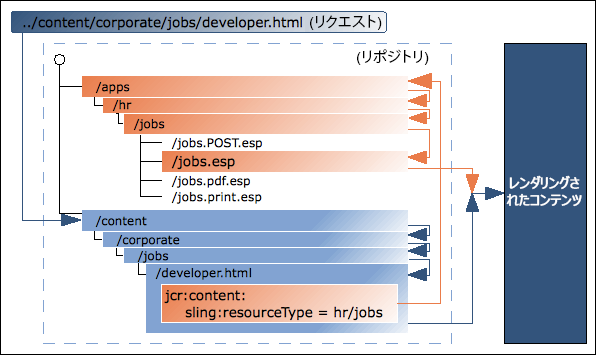

# AEM技術基盤 {#aem-technical-foundations}

AEMは、実証済みで拡張性が高く柔軟なテクノロジーに基づいて構築された堅牢なプラットフォームです。 このドキュメントでは、AEMを構成する様々な部分の詳細な概要を説明し、フルスタックのAEM開発者向けの技術的な付録として使用します。 これは、入門用のガイドとしての意図はありません。 AEM開発を初めて使用する場合は、最初の手順として、 [『AEM Sites開発の手引き — WKNDチュートリアル](develop-wknd-tutorial.md) 』を参照してください。

>[!TIP]
>
>AEMの主要なテクノロジーに進む前に、Adobeは『AEM Sites開発の [手引き — WKNDチュートリアル』を完了することをお勧めします。](develop-wknd-tutorial.md)

## 基本事項 {#fundamentals}

最新のコンテンツ管理システムでは、AEMは次の標準的なWebテクノロジーに依存しています。

* リクエスト応答(XMLHttpRequest / XMLHttpResponse)サイクル
* HTML
* CSS
* JavaScript

基盤となるコンテンツリポジトリとビジネスロジックレイヤーは、Javaテクノロジーに基づいて構築されています。

* JCR
* Sling
* OSGi

## Java コンテンツリポジトリ {#java-content-repository}

Java コンテンツリポジトリ（JCR）の規格である [JSR 283](https://docs.adobe.com/content/docs/en/spec/jcr/2.0/index.html) では、コンテンツリポジトリ内で、任意の精度レベルでコンテンツに双方向アクセスするための、ベンダーにも実装にも依存しない方法が指定されています。スペック・リードは、Adobe・リサーチ( SWIS . S)が保有する。

The [JCR API 2.0](https://docs.adobe.com/docs/en/spec/javax.jcr/javadocs/jcr-2.0/index.html) package, `javax.jcr.*` is used for the direct access and manipulation of repository content.

AEMはJCR上に構築されています。

## Apache Jackrabbit Oak を基盤として構築されています。{#jackrabbit-oak}

[Apache Jackrabbit Oak](https://jackrabbit.apache.org/oak/) は、JCR標準に準拠した最新の世界クラスのWebサイトやその他の要求の厳しいコンテンツアプリケーションの基盤として使用する、スケーラブルで高パフォーマンスの階層コンテンツリポジトリの実装です。

Jackrabbit Oak（単にOakとも呼ばれる）は、AEMを構築するJCR標準の実装です。

## Sling のリクエスト処理 {#sling-request-processing}

AEMは、 [](https://sling.apache.org/site/index.html)Slingを使用して構築されています。Slingは、コンテンツ指向アプリケーションの開発を容易にする、REST原則に基づくWeb アプリケーションフレームワークです。 Slingは、Apache Jackrabbit OakなどのJCRリポジトリをデータストアとして使用します。 SlingはApache Software Foundationに寄稿されています。詳しい情報はApacheにあります。

### Sling の概要 {#introduction-to-sling}

Sling を使用する場合、レンダリングされるコンテンツのタイプは、処理に関する第一の考慮事項ではありません。主な考慮事項は、URL を解決して得られるコンテンツオブジェクト用に、レンダリングを実行するためのスクリプトが見つかるかどうかです。このことは、要件に合わせて簡単にカスタマイズ可能なページを Web コンテンツ作成者が構築する際に非常に役立ちます。

この柔軟性の利点は、様々なコンテンツ要素を持つアプリ、または容易にカスタマイズできるページが必要な場合に明らかです。 特に、AEMなどのWebコンテンツ管理システムを実装する場合。

See [Discover Sling in 15 minutes](https://sling.apache.org/documentation/getting-started/discover-sling-in-15-minutes.html) for the first steps for developing with Sling.

次の図は、Sling のスクリプト解決の説明です。HTTP リクエストからコンテンツノード、コンテンツノードからリソースタイプ、リソースタイプからスクリプトを得る方法と、使用可能なスクリプト変数を示しています。


The following diagram explains all the hidden, but powerful, request parameters you can use when dealing with the `SlingPostServlet`, the default handler for all POST requests that gives you endless options for creating, modifying, deleting, copying and moving nodes in the repository.


### Sling はコンテンツ中心型 {#sling-is-content-centric}

Sling はコンテンツ中心型です。**&#x200B;つまり、（HTTP）要求がそれぞれ JCR リソース（リポジトリノード）の形式でコンテンツにマップされるので、コンテンツに焦点を当てた処理がおこなわれるということです。

* 最初のターゲットは、コンテンツを保持するリソース（JCRノード）です
* 第2に、表現（スクリプト）は、リクエストの特定の部分（セレクターや拡張子など）と組み合わせて、リソースプロパティから配置されます

### RESTful Sling {#restful-sling}

コンテンツ中心の考え方を持つSlingは、REST指向のサーバーを実装し、Webアプリケーションフレームワークに新しい概念を提供します。 利点は次のとおりです。

* 表面だけでなく、非常にRESTfulも。リソースとリプレゼンテーションは、サーバー内で正しくモデル化されます。
* 1つ以上のデータモデルを削除します
   * その他のコンテンツ管理フレームワークでは、リソースにアクセスするためにURL構造、ビジネスオブジェクト、DBスキーマが必要になる場合があります。
   * Slingを使用すると、次のように減少します。URL = resource = JCR構造

### URL の分解 {#url-decomposition}

Sling では、処理はユーザーリクエストの URL によって駆動されます。これにより、適切なスクリプトによって表示されるコンテンツが定義されます。これをおこなうために、URL から情報が抽出されます。

次の URL を分析する場合、

```text
https://myhost/tools/spy.printable.a4.html/a/b?x=12
```

以下の複合部分に分割できます。

| プロトコル | ホスト |  | コンテンツのパス | セレクター | 拡張子 |  | サフィックス |  | パラメーター |
|---|---|---|---|---|---|---|---|---|---|
| `https://` | `myhost` | `/` | `tools/spy` | `.printable.a4.` | `html` | `/` | `a/b` | `?` | `x=12` |

* **protocol** - HTTPS
* **host** — サイトのドメイン
* **content path** — レンダリングするコンテンツを指定し、拡張子と組み合わせて使用するパス。この例では、 `tools/spy.html`
* **selector(s)** — コンテンツをレンダリングする別の方法で使用します。この例では、A4形式のプリンターに適したバージョンです。
* **extension** — コンテンツ形式；レンダリングに使用するスクリプトも指定します
* **suffix** — 追加情報を指定するために使用できます。
* **param(s)** — 動的コンテンツに必要なパラメーター

#### URL からコンテンツおよびスクリプトへ {#from-url-to-content-and-scripts}

URL分解の原則を使用します。

* マッピングは、要求から抽出されたコンテンツパスを使用して、リソースを特定します。
* 適切なリソースが見つかると、Slingリソースタイプが抽出され、コンテンツのレンダリングに使用するスクリプトの検索に使用されます。

次の図に、使用するメカニズムを示します。このメカニズムについては、以降の節で詳しく説明します。



Slingを使用して、特定のエンティティをレンダリングするスクリプトを指定します(JCRノードで `sling:resourceType` プロパティを設定します)。 このメカニズムは、スクリプトが（PHPスクリプトのSQL文のように）データエンティティにアクセスする複数の自由度をオファーに持たせ、リソースに複数のレンディションを持たせることができます。

#### Mapping Requests to Resources {#mapping-requests-to-resources}

リクエストは分解され、必要な情報が抽出されます。リポジトリで、リクエストされたリソース（コンテンツノード）の検索がおこなわれます。

* First Sling checks whether a node exists at the location specified in the request; e.g. `../content/corporate/jobs/developer.html`
* If no node is found, the extension is dropped and the search repeated; e.g. `../content/corporate/jobs/developer`
* ノードが見つからない場合、Slingはhttpコード404（見つかりません）を返します。

Sling では JCR ノード以外のものをリソースとすることもできますが、これは高度な機能です。

### Locating the Script {#locating-the-script}

適切なリソース（コンテンツノード）が見つかると、**sling リソースタイプ**&#x200B;が抽出されます。これは、コンテンツのレンダリングに使用するスクリプトを見つけるパスです。

The path specified by the `sling:resourceType` can be either:

* 絶対
* 設定パラメーターに対する相対

>[!TIP]
>
>移植性を高めるため、相対パスはAdobeが推奨します。

すべてのSlingスクリプトは、 `/apps` （可変、ユーザースクリプト）または `/libs` （不変、システムスクリプト）のサブフォルダーに保存され、この順序で検索されます。

その他の注意点は次のとおりです。

* When the method (GET, POST) is required, it will be specified in uppercase as according to the HTTP specification e.g. `jobs.POST.esp`
* 様々なスクリプトエンジンがサポートされていますが、一般的な推奨スクリプトはHTLとJavaScriptです。

The list of script engines supported by the given instance of AEM are listed on the Felix Management Console ( `http://<host>:<port>/system/console/slingscripting`).

Using the previous example, if the `sling:resourceType` is `hr/jobs` then for:

* で終わるGET/HEADリクエストとURL `.html` （デフォルトのリクエストタイプ、デフォルトの形式）
   * スクリプトは次のとおりで `/apps/hr/jobs/jobs.esp`す。ファイル名は、の最後のセクション `sling:resourceType` に置き換えられます。
* POST要求(GET/HEADを除くすべての要求タイプ。メソッド名は大文字にする必要があります)
   * スクリプト名にPOSTが使用されます。
   * スクリプトは次のようになり `/apps/hr/jobs/jobs.POST.esp`ます。
* 他の形式のURL(末尾が `.html`
   * 例：`../content/corporate/jobs/developer.pdf`
   * スクリプトは次のとおりで `/apps/hr/jobs/jobs.pdf.esp`す。スクリプト名にサフィックスが追加されます。
* セレクターを含むURL
   * セレクターを使用して、同じコンテンツを別の形式で表示できます。 例えば、プリンターに適したバージョン、rssフィード、サマリなどです。
   * プリンターに適したバージョンを見てみると、セレクターが表示され `print`ます。～と同様に `../content/corporate/jobs/developer.print.html`
   * スクリプトは次のとおりで `/apps/hr/jobs/jobs.print.esp`す。セレクターがスクリプト名に追加されます。
* If no `sling:resourceType` has been defined then:
   * コンテンツパスは、適切なスクリプトを検索するために使用されます（パスに基づくものがアクティブな場合）。 `ResourceTypeProvider`
   * 例えば、のスクリプトはで検索 `../content/corporate/jobs/developer.html` を生成し `/apps/content/corporate/jobs/`ます。
   * プライマリノードタイプが使用されます。
* スクリプトがまったく見つからない場合は、デフォルトのスクリプトが使用されます。
   * デフォルトのレンディションは現在、プレーンテキスト(`.txt`)、HTML(`.html`)、JSON(`.json`)としてサポートされています。これらのレンディションでは、ノードのプロパティ（適切な形式）がリストされます。 拡張機能のデフォルトのレンディション `.res`、または要求拡張が指定されていない要求は、（可能な場合は）リソースをスプールします。
* HTTP エラー処理（コード 403 または 404）の場合、Sling は以下のいずれかの場所でスクリプトを検索します。
   * カスタマイズされたスクリプト `/apps/sling/servlet/errorhandler` の場所
   * または標準スクリプトの場所 `/libs/sling/servlet/errorhandler/404.jsp`

特定のリクエストに複数のスクリプトが該当する場合は、一致率が最も高いスクリプトが選択されます。一致は具体的であるほど良くなります。つまり、リクエスト拡張子であれ、メソッド名の一致であれ、セレクターの一致が多いほど良くなります。

例えば、リソースにアクセスする要求があるとします

* `/content/corporate/jobs/developer.print.a4.html`

タイプ

* `sling:resourceType="hr/jobs"`

また、次のリストのスクリプトが正しい場所にあると仮定します。

1. `GET.esp`
1. `jobs.esp`
1. `html.esp`
1. `print.esp`
1. `print.html.esp`
1. `print/a4.esp`
1. `print/a4/html.esp`
1. `print/a4.html.esp`

この場合、優先順位は (8) - (7) - (6) - (5) - (4) - (3) - (2) - (1) となります。

リソースタイプ(主に `sling:resourceType` プロパティで定義)に加えて、リソースのスーパータイプもあります。 これは、通常、 `sling:resourceSuperType` プロパティで示されます。 これらのスーパータイプは、スクリプトを検索する際にも考慮されます。 リソース・スーパー・タイプのメリットは、デフォルトのリソース・タイプ `sling/servlet/default` （デフォルト・サーブレットで使用）が実際にルートである場合に、リソースの階層を形成できる点です。

リソースのリソーススーパータイプは次の 2 つの方法で定義できます。

* by the `sling:resourceSuperType` property of the resource.
* by the `sling:resourceSuperType` property of the node to which the `sling:resourceType` points.

次に例を示します。

* `/`
   * `a`
   * `b`
      * `sling:resourceSuperType = a`
   * `c`
      * `sling:resourceSuperType = b`
   * `x`
      * `sling:resourceType = c`
   * `y`
      * `sling:resourceType = c`
      * `sling:resourceSuperType = a`

タイプの階層：

* `/x`
   * Is `[ c, b, a, <default>]`
* 対象 `/y`
   * 階層は `[ c, a, <default>]`

This is because `/y` has the `sling:resourceSuperType` property whereas `/x` does not and therefore its supertype is taken from its resource type.

#### Sling Scripts Cannot be Called Directly {#sling-scripts-cannot-be-called-directly}

Sling 内では、スクリプトを直接呼び出しできません。REST サーバーの厳格な概念に違反して、リソースと表現を混在させることになるからです。

表現（スクリプト）を直接呼び出す場合、リソースがスクリプト内に隠され、フレームワーク（Sling）では認識できなくなります。これにより、次のような機能が失われます。

* GET以外のhttpメソッドの自動処理：
   * Sling のデフォルトの実装で処理される POST、PUT、DELETE
   * The `POST.jsp` script in your `sling:resourceType` location
* あなたのコードアーキテクチャはもはやクリーンでなく、あるべき構造であるほど明確ではありません。大規模開発にとって最も重要である

### Sling API {#sling-api}

This uses the Sling API package, `org.apache.sling.*`, and tag libraries.

### sling:include を使用した既存の要素の参照 {#referencing-existing-elements-using-sling-include}

最後の考慮事項は、スクリプト内にある既存の要素の参照の必要性です。

More complex scripts (aggregating scripts) might need to access multiple resources (for example navigation, sidebar, footer, elements of a list) and do so by including the *resource*.

これを行うには、 `sling:include("/<path>/<resource>")` コマンドを使用します。 これは、参照されるリソースの定義を効果的に含めます。

## OSGi {#osgi}

OSGi (Open Services Gateway Initiative)は、モジュラー型アプリケーションとライブラリを開発および展開するためのアーキテクチャを定義します(Java用Dynamic Module System(Dynamic Module System for Java)とも呼ばれます)。 OSGiコンテナを使用すると、アプリケーションを個々のモジュール（追加のメタ情報を含むjarファイルで、OSGi用語のバンドルと呼ばれる）に分割し、それらの間の相互依存関係を次の機能で管理できます。

* コンテナ内で実装されるサービス
* コンテナと申し込みの間の契約

これらのサービスおよび契約によって提供されるアーキテクチャでは、コラボレーションのために個々の要素が相互に動的に検出し合うことができます。

その後、OSGi フレームワークによって、これらのバンドルの動的読み込み／読み込み解除、設定および制御が可能になります。再起動は不要です。

>[!NOTE]
>
>Full information on OSGi technology can be found at the [OSGi website](https://www.osgi.org).
>
>特に、基礎教育に関するページには、プレゼンテーションやチュートリアルのコレクションが収められています。

このアーキテクチャにより、Slingをアプリケーション固有のモジュールで拡張できます。 Sling、つまりAEMは、 [Apache Felix](https://felix.apache.org/) 実装のOSGiを使用します。 どちらも、OSGiフレームワーク内で実行されるOSGiバンドルの集まりです。

これにより、インストール内のどのパッケージでも、以下のアクションを実行できます。

* インストール
* 開始
* 停止
* 更新
* アンインストール
* 現在のステータスの確認
* 特定のバンドルに関する詳細な情報（シンボリック名、バージョン、場所など）にアクセス

詳しくは、「 [AEM用のOSGiのCloud Serviceとしての設定](/help/implementing/deploying/configuring-osgi.md) 」を参照してください。

## リポジトリ内の構造 {#structure-within-the-repository}

以下のリストは、リポジトリ内で見られる構造の概要を示しています。

* `/apps`  — 申請に関する事項には、webサイトに固有のコンポーネント定義が含まれます。 開発するコンポーネントは、で使用可能な既製のコンポーネントに基づくことができ `/libs/core/wcm/components`ます。
* `/content` - Webサイト用に作成されたコンテンツ。
* `/etc`
* `/home`  — ユーザーとグループの情報。
* `/libs` - AEMのコアに属するライブラリと定義。 のサブフォルダーは、標準搭載されたAEMの機能を `/libs` 表します。 のコンテンツは変更 `/libs` できません。 Webサイトに固有の機能は、の下で作成する必要があり `/apps`ます。
* `/tmp`  — 仮作業場
* `/var`  — システムによって変更および更新されるファイル監査ログ、統計、イベント処理など。

>[!CAUTION]
>
>この構造、またはその中のファイルの変更は、注意しておこなう必要があります。変更が及ぼす影響を十分に理解しておく必要があります。
>
>`/libs` パス内の設定は一切変更しないでください。設定やその他の変更の場合は、からにアイテムをコピーし、内で変更 `/libs` を行い `/apps``/apps`ます。
