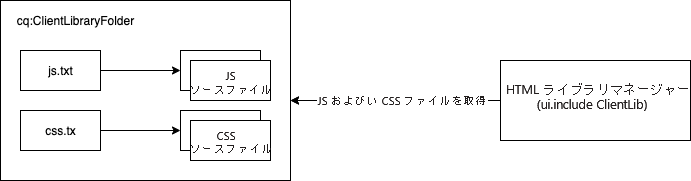

# AEMでのクライアント側ライブラリのCloud Serviceとしての使用 {#using-client-side-libraries}

デジタルエクスペリエンスは、複雑なJavaScriptとCSSコードによるクライアントサイドの処理に大きく依存しています。 AEMクライアント側ライブラリ(clientlibs)を使用すると、これらのクライアント側ライブラリをリポジトリ内に整理し、一元的に保存できます。 AEMプロジェクトのアーキタイプで [フロントエンドビルドプロセスと組み合わせると](https://docs.adobe.com/content/help/ja-JP/experience-manager-core-components/using/developing/archetype/uifrontend.html) 、AEMプロジェクトのフロントエンドコードの管理が簡単になります。

AEMでclientlibsを使用する利点は次のとおりです。

* クライアント側のコードは、他のすべてのアプリケーションコードやコンテンツと同様に、リポジトリに保存されます
* AEMのClientlibは、すべてのCSSとJSを1つのファイルに集計できます。
* ディス [パッチャー経由でアクセス可能なパスを介してclientlibを公開します。](/help/implementing/dispatcher/disp-overview.md)
* 参照先ファイルまたは画像のパスの書き換えを許可します

clientlibsは、AEMからCSSとJavaScriptを配信するための組み込みソリューションです。

>[!TIP]
>
>AEMプロジェクト用にCSSとJavaScriptを作成するフロントエンド開発者も、 [AEMプロジェクトのアーキタイプと、自動化されたフロントエンドビルドプロセスに慣れている必要があります。](https://docs.adobe.com/content/help/ja-JP/experience-manager-core-components/using/developing/archetype/uifrontend.html)

## クライアント側ライブラリとは {#what-are-clientlibs}

サイトを処理するには、JavaScriptとCSSに加えて、アイコンやWebフォントなどの静的リソースがクライアントサイドで必要です。 clientlibは、(必要に応じてカテゴリが)参照し、そのようなリソースを提供するAEMのメカニズムです。

AEMは、サイトのCSSとJavaScriptを1つのファイルに1つの中央の場所に収集し、1つのリソースのコピーのみがHTML出力に含まれるようにします。 これにより、配信の効率が最大化され、プロキシを介してリポジトリ内でリソースを一元的に管理でき、アクセスの安全性を確保できます。

## Cloud ServiceとしてのAEM向けフロントエンド開発 {#fed-for-aemaacs}

すべてのJavaScript、CSS、およびその他のフロントエンドアセットは、AEMプロジェクトアーキタイプの [ui.frontendモジュールで管理する必要があります。](https://docs.adobe.com/content/help/ja-JP/experience-manager-core-components/using/developing/archetype/uifrontend.html) アーキタイプの柔軟性により、選択した最新のWebツールを使用して、これらのリソースを作成および管理できます。

次に、アーキタイプは、リソースを単一のCSSファイルとJSファイルにコンパイルし、自動的にリポジトリのに埋め込むこ `cq:clientLibraryFolder` とができます。

## クライアント側ライブラリフォルダー構造 {#clientlib-folders}

A client-side library folder is a repository node of type `cq:ClientLibraryFolder`. Its definition in [CND notation](https://jackrabbit.apache.org/node-type-notation.html) is

```text
[cq:ClientLibraryFolder] > sling:Folder
  - dependencies (string) multiple
  - categories (string) multiple
  - embed (string) multiple
  - channels (string) multiple
```

* `cq:ClientLibraryFolder` ノードは、リポジトリの `/apps` サブツリー内の任意の場所に配置できます。
* ノードの `categories` プロパティを使用して、ノードが属するライブラリカテゴリを特定します。

各ファイル `cq:ClientLibraryFolder` には、JSファイルやCSSファイルのセットと、いくつかのサポートファイルが入力されます（以下を参照）。 の重要なプロパティ `cq:ClientLibraryFolder` は、次のように設定します。

* `allowProxy`:すべてのclientlibはに保存する必要があるため `apps`、このプロパティを使用すると、プロキシサーブレットを介してclientlibrariesにアクセスできます。 See [Locating a Client Library Folder and Using the Proxy Client Libraries Servlet](#locating-a-client-library-folder-and-using-the-proxy-client-libraries-servlet) below.
* `categories`:この秋に含まれるJSファイルやCSSファイルのセットのカテゴリを特定 `cq:ClientLibraryFolder` します。 この `categories` プロパティは複数の値を取るため、ライブラリフォルダーを複数のカテゴリーの一部にすることができます（このプロパティの役立ちについては以下を参照）。

クライアントライブラリフォルダーに1つ以上のソースファイルが含まれている場合は、そのソースファイルが実行時に単一のJSファイルやCSSファイルに結合されます。 生成されるファイルの名前は、ノード名の拡張子が `.js` またはフ `.css` ァイル名です。 例えば、という名前のライブラリノードは、 `cq.jquery` またはという名前の生成されたファイル `cq.jquery.js` に結果を返し `cq.jquery.css`ます。

クライアントライブラリフォルダーには次の項目が含まれます。

* JSまたはCSSソースファイル
* アイコン、Webフォントなど、CSSスタイルをサポートする静的リソース。
* One `js.txt` file and/or one `css.txt` file which identify the source files to merge in the generated JS and/or CSS files



## クライアント側ライブラリフォルダーの作成 {#creating-clientlib-folders}

クライアントライブラリは、の下に配置する必要があり `/apps`ます。 これは、コードをコンテンツと設定からより詳細に分離するために使用します。

In order for the client libraries under `/apps` to be accessible, a proxy servelt is used. The ACLs are still enforced on the client library folder, but the servlet allows for the content to be read via `/etc.clientlibs/` if the `allowProxy` property is set to `true`.

1. Open CRXDE Lite in a web browser (`https://<host>:<port>/crx/de`).
1. Select the `/apps` folder and click **Create > Create Node**.
1. ライブラリフォルダーの名前を入力し、 **タイプ** リストでを選択 `cq:ClientLibraryFolder`します。 「**OK**」をクリックし、「**すべて保存**」をクリックします。
1. ライブラリが所属するカテゴリ（1 つまたは複数）を指定するには、`cq:ClientLibraryFolder` ノードを選択し、次のプロパティを追加して、「**すべて保存**」をクリックします。
   * 名前：`categories`
   * タイプ：String
   * 値：カテゴリ名
   * 複数：選択
1. クライアントライブラリをプロキシ経由でアクセスできるようにするに `/etc.clientlibs`は、 `cq:ClientLibraryFolder` ノードを選択し、次のプロパティを追加して、「 **すべて保存**」をクリックします。
   * 名前：`allowProxy`
   * タイプ：Boolean
   * 値：`true`
1. 静的リソースを管理する必要がある場合は、クライアントライブラリフォルダーの `resources` 下にサブフォルダーを作成します。
   * フォルダーの下に静的リソースを格納した場合、静的リソース `resources`は発行インスタンスで参照できません。
1. 追加ソースファイルをlibraryフォルダーに格納します。
   * これは、通常、 [AEMプロジェクトアーキタイプのフロントエンドビルドプロセスで行われます。](https://docs.adobe.com/content/help/ja-JP/experience-manager-core-components/using/developing/archetype/uifrontend.html)
   * 必要に応じて、サブフォルダー内のソースファイルを整理できます。
1. クライアントライブラリフォルダーを選択して、**作成／ファイルを作成**&#x200B;をクリックします。
1. ファイル名ボックスに、次のいずれかのファイル名を入力して、「OK」をクリックします。
   * **`js.txt`：** JavaScript ファイルを生成する場合はこのファイル名を使用します。
   * **`css.txt`：** カスケーディングスタイルシート（CSS）を生成する場合はこのファイル名を使用します。
1. ファイルを開き、ソースファイルのパスのルートを識別する次のテキストを入力します。
   * `#base=*[root]*`
   * TXTファイル `[root]` を基準とした、ソースファイルが格納されているフォルダーのパスに置き換えます。 例えば、ソースファイルがTXTファイルと同じフォルダーにある場合は、次のテキストを使用します。
      * `#base=.`
   * 次のコードで、`cq:ClientLibraryFolder` ノードの下の mobile という名前のフォルダーをルートに設定します。
      * `#base=mobile`
1. 下の行に、ルートを基準としたソースファイルのパス `#base=[root]`を入力してください。 各ファイル名を別々の行に配置します。
1. 「**すべて保存**」をクリックします。

## クライアント側ライブラリの提供 {#serving-clientlibs}

必要に応じてクライアントライブラリフォルダーを [設定したら](#creating-clientlib-folders) 、クライアントライブラリをプロキシ経由でリクエストできます。 次に例を示します。

* You have a clientlib in `/apps/myproject/clientlibs/foo`
* You have a static image in `/apps/myprojects/clientlibs/foo/resources/icon.png`

この `allowProxy` プロパティを使用して、次をリクエストできます。

* jを介したclientlib`/etc.clientlibs/myprojects/clientlibs/foo.js`
* 次を介した静的な画像 `/etc.clientlibs/myprojects/clientlibs/foo/resources/icon.png`

### HTLを使用したクライアントライブラリの読み込み {#loading-via-htl}

クライアントライブラリがクライアントライブラリフォルダーに正常に保存および管理されると、HTLを介してアクセスできます。

Client libraries are loaded through a helper template provided by AEM, which can be accessed through `data-sly-use`. Helper templates are available in this file, which can be called through `data-sly-call`.

各ヘルパーテンプレートには、必要なクライアントライブラリを参照するための `categories` オプションを指定できます。このオプションには、文字列値の配列またはコンマ区切り値のリストを含む文字列を指定できます。

[HTLを使用したclientlibの読み込みについて詳しくは、HTLのドキュメント](https://docs.adobe.com/content/help/en/experience-manager-htl/using/getting-started/getting-started.html#loading-client-libraries) を参照してください。

<!--
### Setting Cache Timestamps {#setting-cache-timestamps}

This is possible. Still need detail.
-->

## 作成者のクライアントライブラリと発行 {#clientlibs-author-publish}

ほとんどのclientlibは、AEM発行インスタンスで必要です。 つまり、clientlibのほとんどの目的は、コンテンツのエンドユーザーエクスペリエンスを生み出すことです。 発行インスタンスのclientlibの場合、 [フロントエンドビルドツール](#fed-for-aemaacs) は [、前述のように、クライアントライブラリフォルダーを介して使用およびデプロイできます。](#creating-clientlib-folders)

ただし、オーサリングエクスペリエンスのカスタマイズにクライアントライブラリが必要な場合があります。 例えば、ダイアログのカスタマイズには、AEMオーサリングインスタンスに小さなCSSまたはJSのデプロイが必要になる場合があります。

### 作成者でのクライアントライブラリの管理 {#clientlibs-on-author}

作成者にクライアントライブラリを使用する必要がある場合は、パブリッシュと同じ方法でクライアントライブラリを作成できますが、管理するプロジェクト全体を作成する代わりに、直接 `/apps``/apps/.../clientlibs/foo` 下に書き込むことができます。

その後、すぐに使用できるクライアントライブラリカテゴリにクライアントライブラリを追加することで、オーサリングJSに「フック」できます。

## デバッグツール {#debugging-tools}

AEM には、クライアントライブラリフォルダーをデバッグおよびテストするためのツールが用意されています。

### クライアントライブラリの確認 {#discover-client-libraries}

コンポー `/libs/cq/granite/components/dumplibs/dumplibs` ネントは、システム上のすべてのクライアントライブラリフォルダーに関する情報のページを生成します。 この `/libs/granite/ui/content/dumplibs` ノードは、コンポーネントをリソースタイプとして持ちます。 ページを開くには、次のURLを使用します（必要に応じてホストとポートを変更します）。

`https://<host>:<port>/libs/granite/ui/content/dumplibs.test.html`

情報には、ライブラリのパスおよびタイプ（CSS または JS）と、categories や dependencies などのライブラリ属性の値が含まれます。ページ上の後続のテーブルは、各カテゴリおよびチャネルに含まれるライブラリを示します。

### 生成される出力の確認 {#see-generated-output}

The `dumplibs` component includes a test selector that displays the source code that is generated for `ui:includeClientLib` tags. このページには、js、cssおよびテーマの設定された属性の様々な組み合わせに対するコードが含まれています。

1. 次のいずれかの方法で、テスト出力ページを開きます。
   * From the `dumplibs.html` page, click the link in the **Click here for output testing** text.
   * Webブラウザーで次のURLを開きます（必要に応じて別のホストとポートを使用します）。
      * `http://<host>:<port>/libs/granite/ui/content/dumplibs.html`
   * デフォルトページに、categories 属性の値がないタグの出力が表示されます。
1. To see the output for a category, type the value of the client library&#39;s `categories` property and click **Submit Query**.

## その他のクライアントライブラリフォルダー機能 {#additional-features}

AEMのクライアントライブラリフォルダーでは、他にも多数の機能がサポートされています。 ただし、AEMではCloud Serviceとしてこれらは必須ではないので、使用しないでください。 完全性を考慮して、以下に示します。

>[!WARNING]
>
>クライアントライブラリフォルダーのこれらの追加機能は、Cloud ServiceーとしてAEMでは必要ないので、使用しないでください。 完全性を考慮して、以下に示します。

### Adobe Granite HTML LIbrary Manager {#html-library-manager}

追加のクライアントライブラリ設定は、System Console( **)の** AdobeGranite HTML Library Manager `https://<host>:<port>/system/console/configMgr`パネルで制御できます。

### 追加のフォルダープロパティ {#additional-folder-properties}

フォルダーのプロパティには、依存関係や埋め込みの制御が許可されているものもありますが、通常は不要になり、使用しないことをお勧めします。

* `dependencies`:これは、このライブラリカテゴリが依存する他のクライアントライブラリフォルダーのリストです。 例えば、2つの `cq:ClientLibraryFolder` ノードを指定し、のファイルが正しく機能するために別のファイルを `F` 必要とする場合、のファイルの中の少なくとも1つは、の `G`ノードの中の少なくとも1つでなければなりません `F``G``categories``G``dependencies``F`。
* `embed`:他のライブラリからコードを埋め込むために使用します。 If node `F` embeds nodes `G` and `H`, the resulting HTML will be a concatenation of content from nodes `G` and `H`.

### 依存関係へのリンク {#linking-to-dependencies}

クライアントライブラリフォルダーのコードが他のライブラリを参照する場合、他のライブラリを依存関係として識別します。The `ui:includeClientLib` tag that references your client library folder causes the HTML code to include a link to your generated library file as well as the dependencies.

依存関係は別のものでなければなりま `cq:ClientLibraryFolder`せん。 依存関係を識別するには、次の属性を持つプロパティを `cq:ClientLibraryFolder` ノードに追加します。

* **名前：** dependencies
* **タイプ：** String[]
* **値：**&#x200B;現在のライブラリフォルダーの依存先である cq:ClientLibraryFolder ノードの categories プロパティの値。

例えば、はライブラリ `/etc/clientlibs/myclientlibs/publicmain` に依存してい `cq.jquery` ます。 メインのクライアントライブラリを参照するページは、次のコードを含むHTMLを生成します。

```xml
<script src="/etc/clientlibs/foundation/cq.jquery.js" type="text/javascript">
<script src="/etc/clientlibs/mylibs/publicmain.js" type="text/javascript">
```

### 他のライブラリからのコードの埋め込み {#embedding-code-from-other-libraries}

クライアントライブラリから別のクライアントライブラリにコードを埋め込むことができます。実行時、埋め込みライブラリの生成されたJSファイルとCSSファイルには、埋め込みライブラリのコードが含まれます。

コードの埋め込みは、リポジトリのセキュリティ保護された領域に格納されているライブラリへのアクセスを提供する際に便利です。

#### アプリケーション専用のクライアントライブラリフォルダー {#app-specific-client-library-folders}

アプリケーション関連のすべてのファイルは、下のアプリケーションフォルダーに格納することをお勧め `/app`します。 Webサイトの訪問者に対するアクセスを拒否することもお勧めし `/app` ます。 両方のベストプラクティスを満たすには、下のクライアントライブラリを埋め込んだフォルダーの下にクライアントライブラリ `/etc` フォルダーを作成 `/app`します。

埋め込むクライアントライブラリカテゴリーを識別するには、フォルダープロパティを使用します。 ライブラリを埋め込むには、次のプロパティ属性を使用して、埋め込み `cq:ClientLibraryFolder` ノードにプロパティを追加します。

* **名前：** embed
* **タイプ：** String[]
* **値：** 埋め込む `cq:ClientLibraryFolder` ノードのカテゴリプロパティの値。

#### 埋め込みを使用したリクエストの最小化 {#using-embedding-to-minimize-requests}

場合によっては、発行インスタンスによって一般的なページ用に生成される最終的なHTMLに、比較的多くの `<script>` 要素が含まれていることがあります。

このような場合、必要なすべてのクライアントライブラリコードを1つのファイルに組み合わせて、ページ読み込み時の前後のリクエスト数を減らすと便利です。 これを行うには、ノードのembedプロパティ `embed` を使用して、必要なライブラリをアプリ固有のクライアントライブラリに組み込み `cq:ClientLibraryFolder` ます。

#### CSS ファイル内のパス {#paths-in-css-files}

CSSファイルを埋め込むと、生成されるCSSコードは、埋め込みライブラリに対する相対的なリソースへのパスを使用します。 例えば、公開アクセス可能なライブラリによって `/etc/client/libraries/myclientlibs/publicmain``/apps/myapp/clientlib` クライアントライブラリが埋め込まれるとします。

`main.css` ファイルには次のスタイルが含まれます。

```javascript
body {
  padding: 0;
  margin: 0;
  background: url(images/bg-full.jpg) no-repeat center top;
  width: 100%;
}
```

`publicmain` ノードが生成する CSS ファイルには、元の画像の URL を使用した、次のスタイルが含まれます。

```javascript
body {
  padding: 0;
  margin: 0;
  background: url(../../../apps/myapp/clientlib/styles/images/bg-full.jpg) no-repeat center top;
  width: 100%;
}
```

#### HTML出力の埋め込みファイルを参照 {#see-embedded-files}

埋め込みコードの接触チャネルをトレースする、または埋め込みクライアントライブラリが期待どおりの結果を得られるようにするには、実行時に埋め込まれているファイルの名前を確認できます。 ファイル名を確認するには、WebページのURLに `debugClientLibs=true` パラメーターを追加します。 生成されるライブラリには、埋め込みコードの代わりに `@import` ステートメントが含まれています。

前の「 [Embedding Code From Other Libraries](#embedding-code-from-other-libraries)`/etc/client/libraries/myclientlibs/publicmain``/apps/myapp/clientlib` 」セクションの例では、クライアントライブラリフォルダーにクライアントライブラリフォルダーが埋め込まれています。 Webページにパラメーターを追加すると、Webページのソースコードに次のリンクが作成されます。

```xml
<link rel="stylesheet" href="/etc/clientlibs/mycientlibs/publicmain.css">
```

`publicmain.css` ファイルを開くと、次のコードが表示されます。

```javascript
@import url("/apps/myapp/clientlib/styles/main.css");
```

1. Web ブラウザーのアドレスボックスで、HTML の URL に次のテキストを付加します。
   * `?debugClientLibs=true`
1. ページが読み込まれたら、ページソースを表示します。
1. リンク要素の href として指定されているリンクをクリックしてファイルを開き、ソースコードを表示します。

### プリプロセッサーの使用 {#using-preprocessors}

AEM allows for pluggable preprocessors and ships with support for [YUI Compressor](https://github.com/yui/yuicompressor#yui-compressor---the-yahoo-javascript-and-css-compressor) for CSS and JavaScript and [Google Closure Compiler (GCC)](https://developers.google.com/closure/compiler/) for JavaScript with YUI set as AEM&#39;s default preprocessor.

プラグ可能なプリプロセッサーは、次のように柔軟な使用が可能です。

* スクリプトソースを処理できる ScriptProcessors を定義する
* プロセッサーはオプションを使用して設定できる
* プロセッサーは縮小用に使用できるが、縮小以外の場合にも使用できる
* clientlib はどのプロセッサーを使用するかを定義できる

>[!NOTE]
>
>デフォルトでは、AEM は YUI Compressor を使用します。既知の問題のリストについては、[YUI Compressor GitHub ドキュメント](https://github.com/yui/yuicompressor/issues)を参照してください。特定の clientlib 用の GCC コンプレッサーに切り替えると、YUI を使用しているときに発生していたいくつかの問題が解決することがあります。

>[!CAUTION]
>
>縮小化したライブラリをクライアントライブラリに配置しないでください。代わりに、生のライブラリを提供し、縮小が必要な場合は、プリプロセッサーのオプションを使用します。

#### 使用方法 {#usage}

クライアントライブラリごとに、またはシステム全体でプリプロセッサーを設定できます。

* Add the multivalue properties `cssProcessor` and `jsProcessor` on the clientlibrary node
* または、**HTML ライブラリマネージャー**&#x200B;の OSGi 設定で、システムのデフォルト設定を定義します。

clientlibノードのプリプロセッサ構成は、OSGI構成よりも優先されます。

#### 形式と例 {#format-and-examples}

##### 形式 {#format}

```javascript
config:= mode ":" processorName options*;
mode:= "default" | "min";
processorName := "none" | <name>;
options := ";" option;
option := name "=" value;
```

##### CSS 縮小用の YUI Compressor と JS 用の GCC {#yui-compressor-for-css-minification-and-gcc-for-js}

```javascript
cssProcessor: ["default:none", "min:yui"]
jsProcessor: ["default:none", "min:gcc;compilationLevel=advanced"]
```

##### 事前処理のための Typescript と縮小および不明化のための GCC {#typescript-to-preprocess-and-then-gcc-to-minify-and-obfuscate}

```javascript
jsProcessor: [
   "default:typescript",
   "min:typescript",
   "min:gcc;obfuscate=true"
]
```

##### 追加の GCC オプション {#additional-gcc-options}

```javascript
failOnWarning (defaults to "false")
languageIn (defaults to "ECMASCRIPT5")
languageOut (defaults to "ECMASCRIPT5")
compilationLevel (defaults to "simple") (can be "whitespace", "simple", "advanced")
```

GCC オプションについて詳しくは、[GCC ドキュメント](https://developers.google.com/closure/compiler/docs/compilation_levels)を参照してください。

#### システムのデフォルト縮小ツールの設定 {#set-system-default-minifier}

YUI は、AEM のデフォルト縮小ツールとして設定されています。これを GCC に変更するには、次の手順に従います。

1. Go to Apache Felix Config Manager at (`http://<host>:<portY/system/console/configMgr`)
1. Find and edit the **Adobe Granite HTML Library Manager**.
1. 「**Minify**」オプションを有効にします（まだ有効でない場合）。
1. Set the value **JS Processor Default Configs** to `min:gcc`.
   * Options can be passed if separated with a semicolon e.g. `min:gcc;obfuscate=true`.
1. 「**保存**」をクリックして、変更を保存します。
