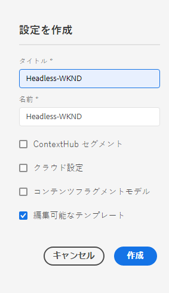
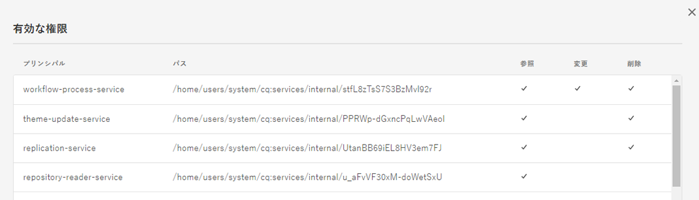
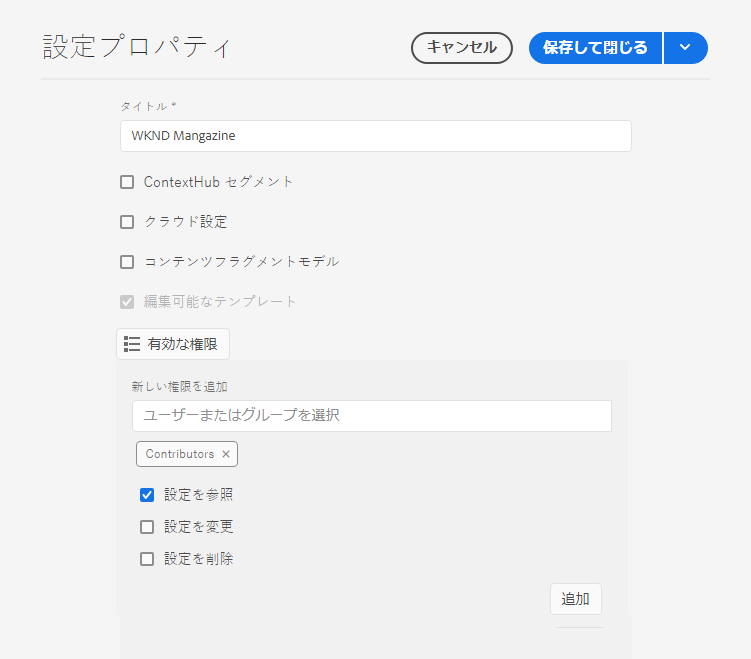

# 設定と設定ブラウザ {#configuration-browser}

AEM設定は、AEMの設定を管理し、ワークスペースとして機能します。

## What is a Configuration? {#what-is-a-configuration}

設定は、2つの異なる視点から考察できます。

* [管理者は](#configurations-administrator) 、設定のグループを定義および管理する際に、AEM内のワークスペースとして設定を使用します。
* [開発者は](#configurations-developer) 、AEMで設定を保持および検索する設定を実装する基本的な設定メカニズムを使用します。

まとめ：管理者の表示上、設定とは、AEMで設定を管理するワークスペースの作成方法を指します。一方、開発者は、AEMがリポジトリ内でこれらの設定を使用および管理する方法を理解する必要があります。

設定は、ユーザーの視点に関係なく、AEMでは2つの主な目的を果たします。

* 設定により、特定のユーザーグループに対して特定の機能が有効になります。
* 設定によって、これらの機能のアクセス権が定義されます。

## 管理者としての設定 {#configurations-administrator}

AEM管理者と作成者は、設定をワークスペースと見なすことができます。 これらのワークスペースは、これらの機能のアクセス権を実装することで、組織の目的のために、設定のグループと関連するコンテンツをまとめて収集するのに使用できます。

設定は、AEM内の多くの異なる機能に対して作成できます。

* [クラウド設定](/help/implementing/developing/introduction/configurations.md)
* [コンテキストハブセグメント](/help/sites-cloud/authoring/personalization/contexthub-segmentation.md)
* [コンテンツフラグメントモデル](/help/assets/content-fragments/content-fragments-models.md)
* [編集可能なテンプレート](/help/sites-cloud/authoring/features/templates.md)

### 例 {#administrator-example}

例えば、管理者が編集可能なテンプレートの2つの設定を作成できます。

* WKND-General
* WKNDマガジン

その後、WKND-General設定を使用して一般的なページテンプレートを作成し、WKND-Magazineの下の雑誌専用のテンプレートを作成できます。

その後、管理者はWKND-GeneralをWKNDサイトのすべてのコンテンツに関連付けることができます。 ただし、WKND-Magazine設定は、雑誌サイトにのみ関連付けられます。

次の操作を行います。

* コンテンツ作成者が雑誌の新しいページを作成するとき、作成者は「一般」テンプレート（WKND — 一般）または「雑誌」テンプレート（WKND — 雑誌）から選択できます。
* コンテンツ作成者が、雑誌以外のサイトの別の部分に対して新しいページを作成した場合、作成者は一般テンプレート(WKND-General)からのみ選択できます。

編集可能なテンプレートだけでなく、クラウド設定、ContextHubセグメント、コンテンツフラグメントモデルに対しても同様の設定が可能です。

### 設定ブラウザーの使用 {#using-configuration-browser}

設定ブラウザを使用すると、管理者はAEMの設定に対するアクセス権を簡単に作成、管理および設定できます。

>[!NOTE]
>
>設定ブラウザーを使用して設定を作成できるのは、ユーザーに `admin` 権限がある場合のみです。 `admin` アクセス権を設定に割り当てたり、設定を変更したりするには、権限も必要です。

#### Creating a Configuration {#creating-a-configuration}

設定ブラウザーを使用してAEMで新しい設定を作成する方法は、非常に簡単です。

1. AEMにCloud Serviceとしてログインし、メインメニューで[ **ツール** ] **-> [** 一般 **] -> [**&#x200B;設定ブラウザ]を選択します。
1. 「**作成**」をタップまたはクリックします。
1. 設定の **タイトル** と **** 名前を指定します。

   

   * タイトル **は説明的なもの** 。
   * 「 **名前** 」は、リポジトリのノード名になります。
      * タイトルに基づいて自動的に生成され、 [AEMの命名規則に従って調整されます。](naming-conventions.md)
      * 必要に応じて調整できます。
1. 許可する設定のタイプを確認します。
   * [クラウド設定](/help/implementing/developing/introduction/configurations.md)
   * [コンテキストハブセグメント](/help/sites-cloud/authoring/personalization/contexthub-segmentation.md)
   * [コンテンツフラグメントモデル](/help/assets/content-fragments/content-fragments-models.md)
   * [編集可能なテンプレート](/help/sites-cloud/authoring/features/templates.md)
1. 「**作成**」をタップまたはクリックします。

>[!TIP]
>
>構成は入れ子にできます。

#### 設定とそのアクセス権の編集 {#access-rights}

設定をワークスペースと考える場合、これらの設定にアクセス権を設定して、それらのワークスペースにアクセスできるユーザーとアクセスできないユーザーを強制できます。

1. AEMにCloud Serviceとしてログインし、メインメニューで[ **ツール** ] **-> [** 一般 **] -> [**&#x200B;設定ブラウザ]を選択します。
1. 変更する設定を選択し、ツールバーの「 **プロパティ** 」をタップまたはクリックします。
1. 設定に追加する追加機能を選択します
   >[!NOTE]
   >
   >設定が作成された後は、フィーチャの選択を解除することはできません。
1. 「 **有効な権限** 」ボタンを使用して、ロールの一覧と、設定に現在付与されている権限を表示します。
   
1. 新しい権限を割り当てるには、「 **追加New Permissions** ( **新しい権限** )」セクションの「Select user or group（ユーザーまたはグループを選択）」フィールドにユーザー名またはグループ名を入力します。
   * 「 **Select user or group** 」フィールドオファーは、既存のユーザーとロールに基づいて自動入力されます。
1. オートコンプリートの結果から適切なユーザーまたは役割を選択します。
   * 複数のユーザーまたはロールを選択できます。
1. 選択したユーザーまたはロールに必要なアクセスオプションを選択し、 ****追加をクリックします。
   
1. 手順を繰り返して、ユーザーまたはロールを選択し、必要に応じて追加のアクセス権を割り当てます。
1. 終了したら、「 **保存して閉じる** 」をタップまたはクリックします。

## 開発者としての設定 {#configurations-developer}

開発者として、Cloud ServiceとしてのAEMの設定との連携、および設定解決の処理方法を知ることが重要です。

### 設定と内容の分離 {#separation-of-config-and-content}

管理者と [ユーザーは、設定を様々な設定やコンテンツを管理する職場と考える場合がありますが](#configurations-administrator) 、設定やコンテンツはリポジトリ内のAEMで別々に保存、管理されることを理解することが重要です。

* `/content` はすべてのコンテンツのホームページです。
* `/conf` は、すべての設定のホームページです。

コンテンツは、プロパティを介して関連する設定を参照し `cq:conf` ます。 AEMは、コンテンツとコンテキスト `cq:conf` プロパティに基づいて検索を実行し、適切な設定を見つけます。

### 例 {#developer-example}

この例では、DAM設定に関心のあるアプリケーションコードがあるとします。

```java
Conf conf = resource.adaptTo(Conf.class);
ValueMap imageServerSettings = conf.getItem("dam/imageserver");
String bgkcolor = imageServerSettings.get("bgkcolor", "FFFFFF");
```

すべての設定参照の開始点は、コンテンツリソースで、通常はどこか下にあり `/content`ます。 これは、ページ、ページ内のコンポーネント、アセット、またはDAMフォルダーの場合があります。 これは、この状況で適用される適切な設定を探している実際のコンテンツです。

この `Conf` オブジェクトを使用して、関心のある特定の設定項目を取得できます。 この場合は、に関連する設定の集まり `dam/imageserver`である、 `imageserver`です。 この `getItem` 呼び出しは、を返し `ValueMap`ます。 次に、 `bgkcolor` 文字列プロパティを読み取り、プロパティ（または設定項目全体）が存在しない場合のデフォルト値「FFFFFF」を指定します。

次に、対応するJCRコンテンツを見てみましょう。

```text
/content/dam/wknd
    + jcr:content
      - cq:conf = "/conf/wknd"
    + image.png [dam:Asset]

/conf/wkns
    + settings
      + dam
        + imageserver [cq:Page]
          + jcr:content
            - bgkcolor = "FF0000"
```

この例では、WKND固有のDAMフォルダーと、対応する設定があると仮定します。 このフォルダーから開始 `/content/dam/wknd`すると、サブツリーに適用する設定を参照する、という名前の文字列プロパティ `cq:conf` があることがわかります。 このプロパティは通常、アセットフォルダーまたはアセットページ `jcr:content` のに設定されます。 これらの `conf` リンクは明示的なので、CRXDE内のコンテンツを見るだけで簡単に追跡できます。

中に飛び込ん `/conf`で参照をたどり、 `/conf/wknd` 節があるのが見えます。 これは設定です。 この参照は、アプリケーションコードに対して完全に透過的であることに注意してください。 このコード例は、専用の参照を持たないので、 `Conf` オブジェクトの背後に隠れています。 どの設定が適用されるかは、JCRコンテンツを介して完全に制御されます。

設定には、実際の項目を含む固定名の `settings` ノードが含まれています。この場合 `dam/imageserver` に必要な項目も含まれています。 このようなアイテムは、「設定ドキュメント」と考えることができ、通常は、実際のコンテンツを `cq:Page``jcr:content` 保持するアイテムを含むを使用して表されます。

最後に、サンプルコードで必要 `bgkcolor` となるプロパティを示します。 戻 `ValueMap` る前のページ `getItem` は、ページの `jcr:content` ノードに基づきます。

### 構成の解決 {#configuration-resolution}

上記の基本的な例は、1つの設定を示しています。 しかし、デフォルトのグローバル設定、ブランドごとに異なる設定、サブプロジェクト用に特定の設定など、多くの場合、異なる設定を使用したいと思われます。

これをサポートするために、AEMでの設定参照には継承とフォールバックのメカニズムが次の優先順に用意されています。

1. `/conf/<siteconfig>/<parentconfig>/<myconfig>`
   * 特定の設定が `cq:conf` `/content`
   * 階層は任意であり、サイト構造と同様にデザインできます。これを知るのはアプリケーションコードのビジネスではありません。
   * 設定権限を持つユーザーが実行時に変更できる
1. `/conf/<siteconfig>/<parentconfig>`
   * 代替設定のために親をトラバース
   * 設定権限を持つユーザーが実行時に変更できる
1. `/conf/<siteconfig>`
   * 代替設定のために親をトラバース
   * 設定権限を持つユーザーが実行時に変更できる
1. `/conf/global`
   * システムのグローバル設定
   * 通常、インストールのグローバルなデフォルト
   * ロールによって設定され `admin` ます
   * 設定権限を持つユーザーが実行時に変更できる
1. `/apps`
   * アプリケーションのデフォルト
   * アプリケーションのデプロイメントに関する修正
   * 実行時の読み取り専用
1. `/libs`
   * AEMの製品デフォルト
   * Adobeによって変更できるのみ、プロジェクトへのアクセスは許可されていません
   * アプリケーションのデプロイメントに関する修正
   * 実行時の読み取り専用

### 設定の使用 {#using-configurations}

AEMの設定は、Sling Context-Aware設定に基づいています。 Slingバンドルには、コンテキストに応じた設定の取得に使用できるサービスAPIが用意されています。 コンテキスト対応設定とは、前の例で [説明したように、コンテンツリソースまたはリソースツリーに関連する設定です。](#developer-example)

コンテキスト対応の設定、例、およびその使用方法の詳細については、Slingのドキュメントを [参照してください。](https://sling.apache.org/documentation/bundles/context-aware-configuration/context-aware-configuration.html)

### ConfMgr Webコンソール {#confmgr-web-console}

デバッグおよびテストの目的では、にConfMgr **Webコンソールがあり**`https://<host>:<port>/system/console/conf`、このコンソールは特定のパス/項目の設定を表示できます。


以下を提供するだけです。

* **コンテンツのパス**
* **Item**
* **User**

「 **解決** 」をクリックして、解決される設定を確認し、それらの設定を解決するサンプルコードを受け取ります。

### コンテキスト対応設定Webコンソール {#context-aware-web-console}

デバッグおよびテストの目的では、に **Context-Aware Configuration**`https://<host>:<port>/system/console/slingcaconfig`Webコンソールがあります。このWebコンソールを使用すると、リポジトリ内のコンテキストに応じた設定に対してクエリーを実行し、そのプロパティを表示できます。


以下を提供するだけです。

* **コンテンツのパス**
* **構成名**

「 **解決** 」をクリックして、選択した設定に関連付けられたコンテキストパスとプロパティを取得します。
