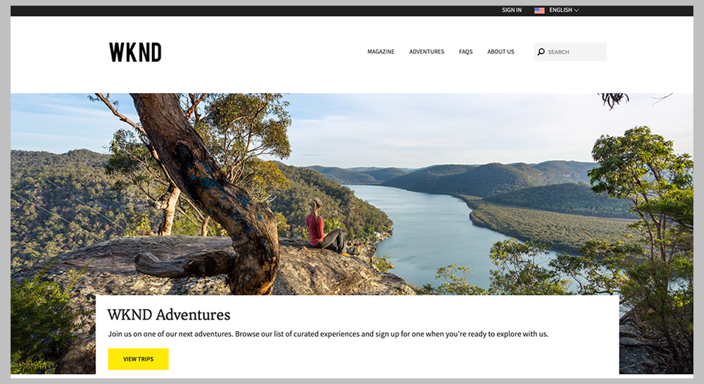

# AEM Sites の開発の手引き - WKND チュートリアル{#getting-started-developing-aem-sites-wknd-tutorial}

## 概要 {#overview}

Adobe Experience Manager as a Cloud Service を使用した開発が初めての場合や、最新のベストプラクティスに関する情報が必要な場合は、まず、このチュートリアルを試してください。

この複数のパートで構成されているチュートリアルでは、AEM を初めて利用する開発者に対して、最新の標準と技術を使用して AEM で Web サイトを実装する方法を教えることを目的としています。このチュートリアルの終了時には、AEM プラットフォームの基礎と一般的なデザインパターンの知識を理解することが期待されます。

## WKND 開発者向けチュートリアル {#wknd-developer-tutorial}

WKND 開発者向けチュートリアルは[こちら](https://docs.adobe.com/content/help/en/experience-manager-learn/getting-started-wknd-tutorial-develop/overview.html)で利用でき、最新のテクノロジーとベストプラクティスを使用して AEM プロジェクトを作成する手順を紹介しています。

## 中心概念 {#core-concepts}

このチュートリアルの実装では、AEM の数多くの強力な機能を利用しています。サイトの実装には以下が使用されます。

* [Maven AEM プロジェクトアーキタイプ](https://docs.adobe.com/content/help/ja-JP/experience-manager-core-components/using/developing/archetype/overview.html)
* [コアコンポーネント](https://docs.adobe.com/content/help/ja-JP/experience-manager-core-components/using/introduction.html)
* [HTL](https://docs.adobe.com/content/help/ja-JP/experience-manager-htl/using/getting-started/getting-started.html)
* [Sling Model](https://sling.apache.org/documentation/bundles/models.html)
* [編集可能なテンプレート](https://docs.adobe.com/content/help/en/experience-manager-learn/sites/page-authoring/template-editor-feature-video-use.html)
* [スタイルシステム](https://docs.adobe.com/content/help/en/experience-manager-learn/sites/page-authoring/style-system-feature-video-use.html)