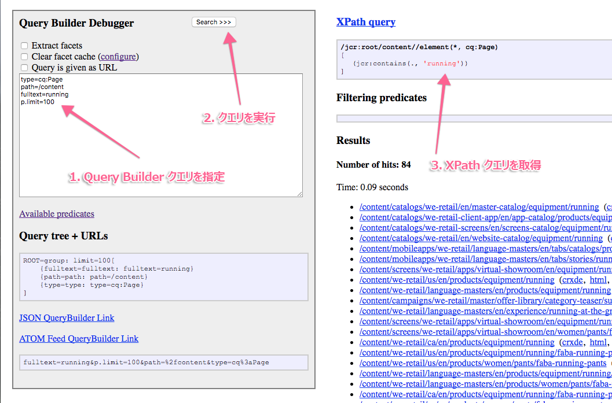

# クエリビルダAPI  {#query-builder-api}

クエリビルダーのオファーを使用すると、AEMのコンテンツリポジトリに簡単にクエリを実行できます。 この機能は、Java APIとREST APIを通じて公開されます。 このドキュメントでは、これらのAPIについて説明します。

サーバー側 Query Builder（[`QueryBuilder`](https://helpx.adobe.com/experience-manager/6-5/sites/developing/using/reference-materials/javadoc/com/day/cq/search/QueryBuilder.html)）はクエリの記述を受け入れ、XPath クエリを作成して実行します。オプションで結果セットのフィルタリング、必要に応じてファセットの抽出もおこないます。

クエリの記述は、単に述語（[`Predicate`](https://helpx.adobe.com/experience-manager/6-5/sites/developing/using/reference-materials/javadoc/com/day/cq/search/Predicate.html)）のセットです。例としては、XPathの`jcr:contains()`関数に対応するフルテキスト述語が含まれます。

各述語タイプに、1 つのエバリュエーターコンポーネント（[`PredicateEvaluator`](https://helpx.adobe.com/experience-manager/6-5/sites/developing/using/reference-materials/javadoc/com/day/cq/search/eval/PredicateEvaluator.html)）があります。これらのコンポーネントは、XPath、フィルタリングおよびファセットの抽出に対してその特定の述語を処理する方法を理解しています。OSGi コンポーネントのランタイムによってプラグインされる、カスタムのエバリュエーターを作成するのは簡単です。

REST API を使用すると、JSON で送信される応答を使用した HTTP によって、まったく同じ機能にアクセスできます。

>[!NOTE]
>
>QueryBuilder API は JCR API を使用して構築されています。OSGiバンドル内からJCR APIを使用してAEM JCRをクエリすることもできます。 詳しくは、[JCR API を使用した Adobe Experience Manager データのクエリ](https://helpx.adobe.com/experience-manager/using/querying-experience-manager-data-using1.html)を参照してください。

## Gem セッション  {#gem-session}

[AEM Gems](https://helpx.adobe.com/jp/experience-manager/kt/eseminars/gems/aem-index.html) は、アドビの専門家が提供する、Adobe Experience Manager を技術的に深く掘り下げた一連のセッションです。

[クエリビルダー](https://helpx.adobe.com/experience-manager/kt/eseminars/gems/aem-search-forms-using-querybuilder.html)専用のセッションを確認し、ツールの概要と使用方法を確認できます。

## サンプルクエリ {#sample-queries}

以下のサンプルは、Java プロパティのスタイル表記法で示されています。これらのサンプルを Java API で使用するには、この後の API サンプルのように Java `HashMap` を使用します。

`QueryBuilder` JSONサーブレットの場合、各例にはAEMインストールへのサンプルリンクが含まれています（デフォルトの場所`http://<host>:<port>`）。 これらのリンクを使用する前に、AEMインスタンスにログインする必要があります。

>[!CAUTION]
>
>デフォルトでは、クエリビルダーのJSONサーブレットには最大10個のヒットが表示されます。
>
>次のパラメーターを追加すると、サーブレットですべてのクエリ結果を表示できます。
>
>`p.limit=-1`

>[!NOTE]
>
>返された JSON データをブラウザーで表示するのに、Firefox 用 JSONView などのプラグインを使用できます。

### すべての結果を返す{#returning-all-results}

以下のクエリは **10 件の結果を返します**（正確には最大 10 件）が、通知されるのは実際に表示可能な&#x200B;**ヒット数**&#x200B;です。

`http://<host>:<port>/bin/querybuilder.json?path=/content&1_property=sling:resourceType&1_property.value=wknd/components/structure/page&1_property.operation=like&orderby=path`

```xml
path=/content
1_property=sling:resourceType
1_property.value=wknd/components/structure/page
1_property.operation=like
orderby=path
```

同じクエリで、パラメーター `p.limit=-1` を使用すると、**すべての結果が返されます**（インスタンスによっては非常に多くなることがあります）。

`http://<host>:<port>/bin/querybuilder.json?path=/content&1_property=sling:resourceType&1_property.value=wknd/components/structure/page&1_property.operation=like&orderby=path&p.limit=-1`

```xml
path=/content
1_property=sling:resourceType
1_property.value=wknd/components/structure/page
1_property.operation=like
p.limit=-1
orderby=path
```

### p.guessTotalを使用して結果を返す{#using-p-guesstotal-to-return-the-results}

`p.guessTotal`パラメーターの目的は、最小実行可能な`p.offset`値と`p.limit`値を組み合わせて表示できる適切な数の結果を返すことです。 このパラメーターを使用するメリットは、結果セットが大きい場合にパフォーマンスが向上することです。これにより、（例：`result.getSize()`の呼び出し）全体の合計を計算するのを避け、結果セット全体を読み取り、OAKエンジンとインデックスまで最適化します。 これは、実行時間とメモリ使用量の両方に、数十万件の結果がある場合に、大きな違いとなる可能性があります。

このパラメーターのデメリットは、ユーザーには正確な合計が表示されないことです。ただし、`p.guessTotal=1000`のような最小値を設定して、常に1000まで読み込めるようにすることができます。したがって、小さな結果セットの合計は正確に得られますが、それ以上の場合は「その他」のみ表示できます。

以下のクエリに `p.guessTotal=true` を追加して、どのように機能するかを見てみましょう。

`http://<host>:<port>/bin/querybuilder.json?path=/content&1_property=sling:resourceType&1_property.value=wknd/components/structure/page&1_property.operation=like&p.guessTotal=true&orderby=path`

```xml
path=/content
1_property=sling:resourceType
1_property.value=wknd/components/structure/page
1_property.operation=like
p.guessTotal=true
orderby=path
```

このクエリは、`p.limit` のデフォルトである `10` 件の結果をオフセット `0` で返します。

```xml
"success": true,
"results": 10,
"total": 10,
"more": true,
"offset": 0,
```

また、数値を使用して、カスタム数の結果を最大数までカウントすることもできます。 上述と同じクエリを使用して、`p.guessTotal` の値を `50` に変更してみます。

`http://<host>:<port>/bin/querybuilder.json?path=/content&1_property=sling:resourceType&1_property.value=wknd/components/structure/page&1_property.operation=like&p.guessTotal=50&orderby=path`

0オフセットを持つ結果10件と同じデフォルトの制限値を返しますが、表示される結果は最大50件までとなります。

```xml
"success": true,
"results": 10,
"total": 50,
"more": true,
"offset": 0,
```

### ページネーションの導入{#implementing-pagination}

デフォルトでは、Query Builder はヒット数も通知します。正確な数を決定するために、アクセス制御を結果ごとに確認するので、結果のサイズによっては長い時間がかかることがあります。合計は、主としてエンドユーザー向け UI のページネーションの実装に使用されます。正確な数の決定には時間がかかることがあるので、guessTotal 機能を使用してページネーションを実装することをお勧めします。

例えば、この UI は以下の手法に適応できます。

* 合計ヒット数([SearchResult.getTotalMatches()](https://helpx.adobe.com/experience-manager/6-5/sites/developing/using/reference-materials/javadoc/com/day/cq/search/result/SearchResult.html#gettotalmatches)または`querybuilder.json`応答の合計)が100以下の正確な数を取得して表示します。
* `guessTotal` を 100 に設定して、Query Builder への呼び出しを作成します。

* 応答は、以下のような結果になる可能性があります。

   * `total=43`,  `more=false`  — ヒットの総数が43であることを示します。UI には先頭ページの一部として 10 件の結果が表示され、続く 3 ページのページネーションが提供されます。この実装を使用して、「**43 件の結果が見つかりました**」のような説明テキストを表示することもできます。
   * `total=100`,  `more=true`  — ヒットの総数が100を超え、正確な数が不明であることを示します。UI には先頭ページの一部として 10 件の結果が表示され、続く 10 ページのページネーションが提供されます。この実装を使用して、「**100 件を超える結果が見つかりました**」のようなテキストを表示することもできます。ユーザーが次のページに移動すると、Query Builder への呼び出しによって `guessTotal` の制限と、`offset` パラメーターおよび `limit` パラメーターの制限が増やされます。

UI が無限スクロールを使用する必要がある場合は、Query Builder によって正確なヒット数が決定されないように、`guessTotal` も使用する必要があります。

### Jarファイルを検索して順序を付ける、最新の{#find-jar-files-and-order-them-newest-first}

`http://<host>:<port>/bin/querybuilder.json?type=nt:file&nodename=*.jar&orderby=@jcr:content/jcr:lastModified&orderby.sort=desc`

```xml
type=nt:file
nodename=*.jar
orderby=@jcr:content/jcr:lastModified
orderby.sort=desc
```

### すべてのページを探して、最終変更日{#find-all-pages-and-order-them-by-last-modified}で並べ替え

`http://<host>:<port>/bin/querybuilder.json?type=cq:Page&orderby=@jcr:content/cq:lastModified`

```xml
type=cq:Page
orderby=@jcr:content/cq:lastModified
```

### すべてのページを検索し、最終変更日順に並べ降順る、{#find-all-pages-and-order-them-by-last-modified-but-descending}

`http://<host>:<port>/bin/querybuilder.json?type=cq:Page&orderby=@jcr:content/cq:lastModified&orderby.sort=desc`

```xml
type=cq:Page
orderby=@jcr:content/cq:lastModified
orderby.sort=desc
```

### フルテキスト検索、スコア順{#fulltext-search-ordered-by-score}

`http://<host>:<port>/bin/querybuilder.json?fulltext=Management&orderby=@jcr:score&orderby.sort=desc`

```xml
fulltext=Management
orderby=@jcr:score
orderby.sort=desc
```

### 特定のタグ{#search-for-pages-tagged-with-a-certain-tag}を持つページの検索

`http://<host>:<port>/bin/querybuilder.json?type=cq:Page&tagid=wknd:activity/cycling&tagid.property=jcr:content/cq:tags`

```xml
type=cq:Page
tagid=wknd:activity/cycling
tagid.property=jcr:content/cq:tags
```

明示的なタグIDがわかっている場合は、例のように`tagid`述語を使用します。

タグタイトルのパス（スペースなし）には、`tag` 述語を使用します。

前の例ではページ（`cq:Page`ノード）を検索しているので、`jcr:content/cq:tags`という`tagid.property`述語には、そのノードからの相対パスを使用する必要があります。 デフォルトでは、`tagid.property`は`cq:tags`になります。

### 複数のパスの検索（グループを使用） {#search-under-multiple-paths-using-groups}

`http://<host>:<port>/bin/querybuilder.json?fulltext=Experience&group.1_path=/content/wknd/us/en/magazine&group.2_path=/content/wknd/us/en/adventures&group.p.or=true`

```xml
fulltext=Experience
group.p.or=true
group.1_path=/content/wknd/us/en/magazine
group.2_path=/content/wknd/us/en/adventures
```

このクエリでは、*グループ*（`group`という名前）を使用します。これは、より標準的な表記の括弧と同様に、クエリ内のサブ式を区切るために動作します。 例えば、前の例は、次のように、よりわかりやすいスタイルで表現することができます。

`"Experience" and ("/content/wknd/us/en/magazine" or "/content/wknd/us/en/adventures")`

例にあるグループの内部では、`path` 述語が複数回使用されています。述語の2つのインスタンスを区別して並べ替えるには（一部の述語に対して順序が必要）、述語の先頭に`N_`を付ける必要があります。`N`は順序付けインデックスです。 前の例では、結果の述部は`1_path`と`2_path`です。

`p.or`の`p`は、`1_path`のようなグループのサブ述語に対して、次の内容（この場合`or`）がグループの&#x200B;*パラメータ*&#x200B;であることを示す特殊な区切り文字です。

`p.or`を指定しない場合、すべての述部がAND結合され、つまり、各結果がすべての述部を満たす必要があります。

>[!NOTE]
>
>異なる述語に対してであっても、単一のクエリ内で同じ数値のプレフィックスを使用することはできません。

### プロパティの検索{#search-for-properties}

`cq:template` プロパティを使用して、特定のテンプレートのすべてのページを検索できます。

`http://<host>:<port>/bin/querybuilder.json?property=cq%3atemplate&property.value=%2fconf%2fwknd%2fsettings%2fwcm%2ftemplates%2fadventure-page-template&type=cq%3aPageContent`

```xml
type=cq:PageContent
property=cq:template
property.value=/conf/wknd/settings/wcm/templates/adventure-page-template
```

これには、ページ自身ではなく、ページの `jcr:content` ノードが返されるという欠点があります。この問題を解決するには、相対パスで検索します。

`http://<host>:<port>/bin/querybuilder.json?property=jcr%3acontent%2fcq%3atemplate&property.value=%2fconf%2fwknd%2fsettings%2fwcm%2ftemplates%2fadventure-page-template&type=cq%3aPage`

```xml
type=cq:Page
property=jcr:content/cq:template
property.value=/conf/wknd/settings/wcm/templates/adventure-page-template
```

### 複数のプロパティの検索{#search-for-multiple-properties}

property 述語を複数回使用する場合、ここでも、数字のプレフィックスを付加する必要があります。

`http://<host>:<port>/bin/querybuilder.json?1_property=jcr%3acontent%2fcq%3atemplate&1_property.value=%2fconf%2fwknd%2fsettings%2fwcm%2ftemplates%2fadventure-page-template&2_property=jcr%3acontent%2fjcr%3atitle&2_property.value=Cycling%20Tuscany&type=cq%3aPage`

```xml
type=cq:Page
1_property=jcr:content/cq:template
1_property.value=/conf/wknd/settings/wcm/templates/adventure-page-template
2_property=jcr:content/jcr:title
2_property.value=Cycling Tuscany
```

### 複数のプロパティ値の検索{#search-for-multiple-property-values}

プロパティの複数の値(`"A" or "B" or "C"`)を検索する場合に大きなグループを避けるには、`property`述語に複数の値を指定します。

`http://<host>:<port>/bin/querybuilder.json?property=jcr%3atitle&property.1_value=Cycling%20Tuscany&property.2_value=Ski%20Touring&property.3_value=Whistler%20Mountain%20Biking`

```xml
property=jcr:title
property.1_value=Cycling Tuscany
property.2_value=Ski Touring
property.3_value=Whistler Mountain Biking
```

複数の値を持つプロパティの場合は、複数の値が一致する(`"A" and "B" and "C"`)ことを必須にすることもできます。

`http://<host>:<port>/bin/querybuilder.json?property=jcr%3atitle&property.and=true&property.1_value=Cycling%20Tuscany&property.2_value=Ski%20Touring&property.3_value=Whistler%20Mountain%20Biking`

```xml
property=jcr:title
property.and=true
property.1_value=Cycling Tuscany
property.2_value=Ski Touring
property.3_value=Whistler Mountain Biking
```

## 返される内容の絞り込み{#refining-what-is-returned}

デフォルトでは、次の JSON サーブレットは検索結果内の各ノードに関するデフォルトのプロパティのセット（path、name、title など）を返します。QueryBuilder返されるプロパティを制御するために、次のいずれかの操作を実行できます。

指定

```xml
p.hits=full
```

この場合、各ノードにすべてのプロパティが含まれます。

`http://<host>:<port>/bin/querybuilder.json?p.hits=full&property=jcr%3atitle&property.value=Cycling%20Tuscany`

```xml
property=jcr:title
property.value=Cycling Tuscany
p.hits=full
```

使用方法

```xml
p.hits=selective
```

をクリックし、取り込むプロパティを指定します

```xml
p.properties
```

スペースで区切る：

`http://<host>:<port>/bin/querybuilder.json?p.hits=selective&p.properties=sling%3aresourceType%20jcr%3aprimaryType&property=jcr%3atitle&property.value=Cycling%20Tuscany`

```xml
property=jcr:title
property.value=Cycling Tuscany
p.hits=selective
p.properties=sling:resourceType jcr:primaryType
```

クエリビルダーの応答に子ノードを含めることもできます。 これを行うには、

```xml
p.nodedepth=n
```

`n`は、クエリが返すレベルの数です。 子ノードを返すには、そのノードをpropertiesセレクターで指定する必要があります

```xml
p.hits=full
```

例：

`http://<host>:<port>/bin/querybuilder.json?p.hits=full&p.nodedepth=5&property=jcr%3atitle&property.value=Cycling%20Tuscany`

```xml
property=jcr:title
property.value=Cycling Tuscany
p.hits=full
p.nodedepth=5
```

## 述語の詳細 {#morepredicates}

述語の詳細については、[Query Builder の述語リファレンスのページ](query-builder-predicates.md)を参照してください。

[Javadocの`PredicateEvaluator`クラス](https://helpx.adobe.com/experience-manager/6-5/sites/developing/using/reference-materials/javadoc/com/day/cq/search/eval/PredicateEvaluator.html)を調べることもできます。 これらのクラスの Javadoc ドキュメントには、使用できるプロパティのリストが含まれています。

クラス名のプレフィックス（例えば、[`SimilarityPredicateEvaluator`](https://helpx.adobe.com/experience-manager/6-5/sites/developing/using/reference-materials/javadoc/com/day/cq/search/eval/SimilarityPredicateEvaluator.html)の`similar`）は、クラスの&#x200B;*principalプロパティ*&#x200B;です。 このプロパティは、クエリ内で使用する述語の名前（小文字で使用）でもあります。

このようなプリンシパルプロパティでは、クエリを短縮し、完全修飾バリアント`similar.similar=/content/en`の代わりに`similar=/content/en`を使用できます。 完全修飾形式は、クラスのプリンシパルプロパティではないすべてのプロパティに対して使用する必要があります。

## Query Builder API の使用例  {#example-query-builder-api-usage}

```java
   String fulltextSearchTerm = "WKND";

    // create query description as hash map (simplest way, same as form post)
    Map<String, String> map = new HashMap<String, String>();

// create query description as hash map (simplest way, same as form post)
    map.put("path", "/content");
    map.put("type", "cq:Page");
    map.put("group.p.or", "true"); // combine this group with OR
    map.put("group.1_fulltext", fulltextSearchTerm);
    map.put("group.1_fulltext.relPath", "jcr:content");
    map.put("group.2_fulltext", fulltextSearchTerm);
    map.put("group.2_fulltext.relPath", "jcr:content/@cq:tags");

    // can be done in map or with Query methods
    map.put("p.offset", "0"); // same as query.setStart(0) below
    map.put("p.limit", "20"); // same as query.setHitsPerPage(20) below

    Query query = builder.createQuery(PredicateGroup.create(map), session);
    query.setStart(0);
    query.setHitsPerPage(20);

    SearchResult result = query.getResult();

    // paging metadata
    int hitsPerPage = result.getHits().size(); // 20 (set above) or lower
    long totalMatches = result.getTotalMatches();
    long offset = result.getStartIndex();
    long numberOfPages = totalMatches / 20;

    //Place the results in XML to return to client
    DocumentBuilderFactory factory = DocumentBuilderFactory.newInstance();
    DocumentBuilder builder = factory.newDocumentBuilder();
    Document doc = builder.newDocument();

    //Start building the XML to pass back to the AEM client
    Element root = doc.createElement( "results" );
    doc.appendChild( root );

    // iterating over the results
    for (Hit hit : result.getHits()) {
       String path = hit.getPath();

      //Create a result element
      Element resultel = doc.createElement( "result" );
      root.appendChild( resultel );

      Element pathel = doc.createElement( "path" );
      pathel.appendChild( doc.createTextNode(path ) );
      resultel.appendChild( pathel );
    }
```

同じクエリが、Query Builder（JSON）サーブレットを使用して HTTP を介して実行されます。

`http://<host>:<port>/bin/querybuilder.json?path=/content&type=cq:Page&group.p.or=true&group.1_fulltext=WKND&group.1_fulltext.relPath=jcr:content&group.2_fulltext=WKND&group.2_fulltext.relPath=jcr:content/@cq:tags&p.offset=0&p.limit=20`

## クエリの格納と読み込み{#storing-and-loading-queries}

クエリはリポジトリに保存して後で使用することができます。`QueryBuilder`は、次の署名を`storeQuery`メソッドに提供します。

```java
void storeQuery(Query query, String path, boolean createFile, Session session) throws RepositoryException, IOException;
```

[`QueryBuilder#storeQuery`](https://helpx.adobe.com/experience-manager/6-5/sites/developing/using/reference-materials/javadoc/com/day/cq/search/QueryBuilder.html#storequerycomdaycqsearchqueryjavalangstringbooleanjavaxjcrsession) メソッドを使用すると、指定した `Query` が、`createFile` 引数の値に応じてファイルまたはプロパティとしてリポジトリに保存されます。次の例は、`Query`をパス`/mypath/getfiles`にファイルとして保存する方法を示しています。

```java
builder.storeQuery(query, "/mypath/getfiles", true, session);
```

以前に保存したクエリはすべて、[`QueryBuilder#loadQuery`](https://helpx.adobe.com/experience-manager/6-5/sites/developing/using/reference-materials/javadoc/com/day/cq/search/QueryBuilder.html#loadqueryjavalangstringjavaxjcrsession) メソッドを使用してリポジトリから読み込むことができます。

```java
Query loadQuery(String path, Session session) throws RepositoryException, IOException
```

例えば、パス`/mypath/getfiles`に保存された`Query`は、次のスニペットで読み込むことができます。

```java
Query loadedQuery = builder.loadQuery("/mypath/getfiles", session);
```

## テストとデバッグ {#testing-and-debugging}

クエリビルダーのクエリの再生とデバッグには、次のURLにあるクエリビルダーデバッガーコンソールを使用できます。

`http://<host>:<port>/libs/cq/search/content/querydebug.html`

または、

`http://<host>:<port>/bin/querybuilder.json?path=/tmp`

`path=/tmp` は一例にすぎません。

### デバッグに関する一般的な推奨事項 {#general-debugging-recommendations}

### ログ{#obtain-explain-able-xpath-via-logging}を使用して説明可能なXPathを取得する

開発サイクルでは、設定されたターゲットインデックスに対して、**すべての**&#x200B;クエリの説明を実行します。

1. QueryBuilder の DEBUG ログを有効にして、基になる説明可能な XPath クエリを取得します。
   * `https://<host>:<port>/system/console/slinglog` に移動します。`com.day.cq.search.impl.builder.QueryImpl`の新しいロガーを&#x200B;**DEBUG**&#x200B;に作成します。
1. 上述のクラスで DEBUG を有効にすると、Query Builder で生成された XPath がログに表示されます。
1. 関連するクエリビルダークエリのログエントリからXPathクエリをコピーします。次に例を示します。
   * `com.day.cq.search.impl.builder.QueryImpl XPath query: /jcr:root/content//element(*, cq:Page)[(jcr:contains(jcr:content, "WKND") or jcr:contains(jcr:content/@cq:tags, "WKND"))]`
1. XPathクエリをXPathとしてExplainクエリに貼り付けて、クエリ計画を取得します。

### クエリビルダーデバッガー{#obtain-explain-able-xpath-via-the-query-builder-debugger}を使用して、説明可能なXPathを取得します。

説明可能なXPathクエリを生成するには、AEMクエリビルダーを使用します。



1. クエリビルダーでクエリビルダークエリを指定する
1. 検索を実行します。
1. 生成された XPath を取得します。
1. XPathクエリをXPathとしてExplainクエリに貼り付けて、クエリ計画を取得します

>[!NOTE]
>
>クエリビルダー以外のクエリ(XPath、JCR-SQL2)は、Explainクエリに直接提供できます。

## ログ出力付きのクエリのデバッグ {#debugging-queries-with-logging}

>[!NOTE]
>
>ロガーの設定は、ドキュメント[Logging](/help/implementing/developing/introduction/logging.md)に記述されています。

前の節[テストとデバッグ：](#testing-and-debugging)で説明したクエリを実行する場合の、クエリビルダー実装のログ出力（INFOレベル）。

```xml
com.day.cq.search.impl.builder.QueryImpl executing query (predicate tree):
null=group: limit=20, offset=0[
    {group=group: or=true[
        {1_fulltext=fulltext: fulltext=WKND, relPath=jcr:content}
        {2_fulltext=fulltext: fulltext=WKND, relPath=jcr:content/@cq:tags}
    ]}
    {path=path: path=/content}
    {type=type: type=cq:Page}
]
com.day.cq.search.impl.builder.QueryImpl XPath query: /jcr:root/content//element(*, cq:Page)[(jcr:contains(jcr:content, "WKND") or jcr:contains(jcr:content/@cq:tags, "WKND"))]
com.day.cq.search.impl.builder.QueryImpl no filtering predicates
com.day.cq.search.impl.builder.QueryImpl query execution took 69 ms
```

フィルターをおこなう述語エバリュエーターや、コンパレーターでカスタム順序を使用する述語エバリュエーターを使用するクエリがある場合は、クエリ内にそのことも記述されます。

```xml
com.day.cq.search.impl.builder.QueryImpl executing query (predicate tree):
null=group: [
    {nodename=nodename: nodename=*.jar}
    {orderby=orderby: orderby=@jcr:content/jcr:lastModified}
    {type=type: type=nt:file}
]
com.day.cq.search.impl.builder.QueryImpl custom order by comparator: jcr:content/jcr:lastModified
com.day.cq.search.impl.builder.QueryImpl XPath query: //element(*, nt:file)
com.day.cq.search.impl.builder.QueryImpl filtering predicates: {nodename=nodename: nodename=*.jar}
com.day.cq.search.impl.builder.QueryImpl query execution took 272 ms
```

## Javadoc リンク  {#javadoc-links}

| **Javadoc** | **説明** |
|---|---|
| [com.day.cq.search](https://helpx.adobe.com/experience-manager/6-5/sites/developing/using/reference-materials/javadoc/com/day/cq/search/package-summary.html) | 基本クエリビルダーとクエリAPI |
| [com.day.cq.search.result](https://helpx.adobe.com/experience-manager/6-5/sites/developing/using/reference-materials/javadoc/com/day/cq/search/result/package-summary.html) | Result API |
| [com.day.cq.search.facets](https://helpx.adobe.com/experience-manager/6-5/sites/developing/using/reference-materials/javadoc/com/day/cq/search/facets/package-summary.html) | ファセット |
| [com.day.cq.search.facets.buckets](https://helpx.adobe.com/experience-manager/6-5/sites/developing/using/reference-materials/javadoc/com/day/cq/search/facets/buckets/package-summary.html) | バケット（ファセット内に含まれる） |
| [com.day.cq.search.eval](https://helpx.adobe.com/experience-manager/6-5/sites/developing/using/reference-materials/javadoc/com/day/cq/search/eval/package-summary.html) | 述語エバリュエーター |
| [com.day.cq.search.facets.extractors](https://helpx.adobe.com/experience-manager/6-5/sites/developing/using/reference-materials/javadoc/com/day/cq/search/facets/extractors/package-summary.html) | ファセット抽出（エバリュエーター用） |
| [com.day.cq.search.writer](https://helpx.adobe.com/experience-manager/6-5/sites/developing/using/reference-materials/javadoc/com/day/cq/search/writer/package-summary.html) | クエリビルダーサーブレット用のJSON Result Hit Writer (`/bin/querybuilder.json`) |
