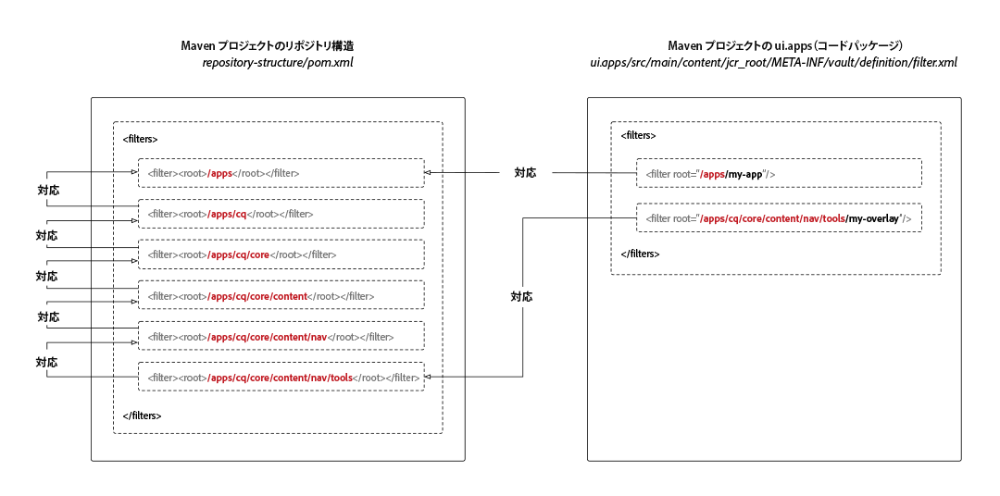

# AEM プロジェクトリポジトリの構造パッケージ

Adobe Experience Manager as a Cloud Service の Maven プロジェクトには、リポジトリ構造サブパッケージ定義が必要です。この定義の目的は、プロジェクトのコードサブパッケージがデプロイされる JCR リポジトリルートを定義することです。これにより、Adobe Experience Manager as a Cloud Service でのパッケージのインストールが、JCR リソースの依存関係に基づいて自動的に順序付けられます。依存関係が見つからないと、サブ構造が親構造より先にインストールされた結果、予期せず削除されて、デプロイメントが機能しなくなる場合があります。

コードパッケージで&#x200B;**対応していない**&#x200B;場所にコードパッケージがデプロイされた場合、これらの依存関係を確立するには、あらゆる上位リソース（JCR ルートに近い JCR リソース）をリポジトリ構造パッケージで列挙する必要があります。



リポジトリ構造パッケージでは、`/apps` の想定される一般的な状態を定義します。この状態は、標準的なルートになっても「潜在的な競合のおそれがない」領域を決定するためにパッケージバリデーターで使用されるものです。

リポジトリ構造パッケージに含める最も典型的なパスは次のとおりです。

+ `/apps`（システム提供のノード）
+ `/apps/cq/...`、`/apps/dam/...`、`/apps/wcm/...`、`/apps/sling/...`（`/libs` の一般的なオーバーレイを提供）
+ `/apps/settings`（コンテキスト対応の共有の設定ルートパス）

このサブパッケージはコンテンツを&#x200B;**含んでおらず**、フィルタールートを定義する `pom.xml` だけで構成されていることに注意してください。

## リポジトリ構造パッケージの作成

Maven プロジェクトのリポジトリ構造パッケージを作成するには、以下の `pom.xml` を使用して空の Maven サブプロジェクトを新しく作成し、親 Maven プロジェクトに準拠するようにプロジェクトメタデータを更新します。

`<filters>` を更新して、コードパッケージのデプロイ先となるすべての JCR リポジトリパスルートを含めます。

この新しい Maven サブプロジェクトを、必ず親プロジェクトの `<modules>` リストに追加してください。

```xml
<?xml version="1.0" encoding="UTF-8"?>
<project xmlns="http://maven.apache.org/POM/4.0.0" xmlns:xsi="http://www.w3.org/2001/XMLSchema-instance" xsi:schemaLocation="http://maven.apache.org/POM/4.0.0 http://maven.apache.org/maven-v4_0_0.xsd">
    <modelVersion>4.0.0</modelVersion>

    <!-- ====================================================================== -->
    <!-- P A R E N T  P R O J E C T  D E S C R I P T I O N                      -->
    <!-- ====================================================================== -->
    <parent>
        <groupId>com.my-company</groupId>
        <artifactId>my-app</artifactId>
        <version>x.x.x</version>
        <relativePath>../pom.xml</relativePath>
    </parent>

    <!-- ====================================================================== -->
    <!-- P R O J E C T  D E S C R I P T I O N                                   -->
    <!-- ====================================================================== -->
    <artifactId>ui.apps.structure</artifactId>
    <packaging>content-package</packaging>
    <name>UI Apps Structure - Repository Structure Package for /apps</name>

    <description>
        Empty package that defines the structure of the Adobe Experience Manager repository the code packages in this project deploy into.
        Any roots in the code packages of this project should have their parent enumerated in the filters list below.
    </description>

    <build>
        <plugins>
            <plugin>
                <groupId>org.apache.jackrabbit</groupId>
                <artifactId>filevault-package-maven-plugin</artifactId>
                <extensions>true</extensions>
                <properties>
                    <!-- Set Cloud Manager Target to none, else this package will be deployed and remove all defined filter roots -->
                    <cloudManagerTarget>none</cloudManagerTarget>
                </properties>
                <configuration>
                    <properties>
                        <!-- Set Cloud Manager Target to none, else this package will be deployed and remove all defined filter roots -->
                        <cloudManagerTarget>none</cloudManagerTarget>
                    </properties>
                    <filters>

                        <!-- /apps root -->
                        <filter><root>/apps</root></filter>

                        <!--
                        Examples of complex roots


                        Overlays of /libs typically require defining the overlayed structure, at each level here.

                        For example, adding a new section to the main AEM Tools navigation, necessitates the following rules:

                        <filter><root>/apps/cq</root></filter>
                        <filter><root>/apps/cq/core</root></filter>
                        <filter><root>/apps/cq/core/content</root></filter>
                        <filter><root>/apps/cq/core/content/nav/</root></filter>
                        <filter><root>/apps/cq/core/content/nav/tools</root></filter>


                        Any /apps level Context-aware configurations need to enumerated here. 
                        
                        For example, providing email templates under `/apps/settings/notification-templates/com.day.cq.replication` necessitates the following rules:

                        <filter><root>/apps/settings</root></filter>
                        <filter><root>/apps/settings/notification-templates</root></filter>
                        <filter><root>/apps/settings/notification-templates/com.day.cq.replication</root></filter>
                        -->

                    </filters>
                </configuration>
            </plugin>
        </plugins>
    </build>
</project>
```

## リポジトリ構造パッケージの参照

リポジトリ構造パッケージを使用するには、すべてのコードパッケージ（`/apps` にデプロイされるサブパッケージ）でリポジトリ構造パッケージを参照します。また、FileVault コンテンツパッケージ Maven プラグインの `<repositoryStructurePackage>` 設定で Maven プロジェクトを参照します。

`ui.apps/pom.xml` と、その他のあらゆるコードパッケージの `pom.xml` で、プロジェクトのリポジトリ構造パッケージ（#repository-structure-package）設定への参照を FileVault パッケージ Maven プラグインに追加します。

```xml
...
<build>
  <plugins>
    <plugin>
      <groupId>org.apache.jackrabbit</groupId>
      <artifactId>filevault-package-maven-plugin</artifactId>
      <extensions>true</extensions>
      <configuration>
        ...
        <repositoryStructurePackages>
          <repositoryStructurePackage>
              <groupId>${project.groupId}</groupId>
              <artifactId>ui.apps.structure</artifactId>
              <version>${project.version}</version>
          </repositoryStructurePackage>
        </repositoryStructurePackages>
      </configuration>
    </plugin>
    ...
</build>
<dependencies>
    <!-- Add the dependency for the repository structure package so it resolves -->
    <dependency>
        <groupId>${project.groupId}</groupId>
        <artifactId>ui.apps.structure</artifactId>
        <version>${project.version}</version>
        <type>zip</type>
    </dependency>
    ...
</dependencies>
```

## 複数コードパッケージの使用例

JCR リポジトリの同じ領域にインストールされる複数のコードパッケージのデプロイメントをサポートしている使用例もありますが、これは一般的ではありません。また、一般的な使用例よりも複雑です。

次に例を示します。

+ コードパッケージ A が `/apps/a` にデプロイされる
+ コードパッケージ B が `/apps/a/b` にデプロイされる

コードパッケージ B からのパッケージレベルの依存関係がコードパッケージ A 上で確立されていない場合は、まずコードパッケージ B が `/apps/a` にデプロイされ、続いてコードパッケージ A が `/apps/a` にデプロイされます。この場合、先にインストールされた `/apps/a/b` が削除されます。

この場合の解決策は、次のとおりです。

+ コードパッケージ A は、プロジェクトのリポジトリ構造パッケージ（`/apps` のフィルターが必要）上で `<repositoryStructurePackage>` を定義する必要があります。
+ コードパッケージ B はコードパッケージ A 上で `<repositoryStructurePackage>` を定義する必要があります。コードパッケージ A で共有される領域にコードパッケージ B がデプロイされるからです。

## エラーとデバッグ

リポジトリ構造パッケージが正しくセットアップされていない場合は、Maven のビルド時に次のようなエラーが報告されます。

```
1 error(s) detected during dependency analysis.
Filter root's ancestor '/apps/some/path' is not covered by any of the specified dependencies.
```

これは、フィルターリストに `/apps/some/path` が含まれている `<repositoryStructurePackage>` がコードパッケージにないことが原因で、エラーが発生していることを示しています。

## その他のリソース

+ [FileVault コンテンツパッケージ Maven プラグイン](http://jackrabbit.apache.org/filevault-package-maven-plugin/)
