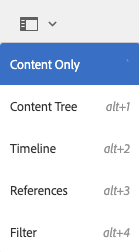

# AEM UI の構造{#structure-of-the-aem-ui}

AEM UI には、基盤となる原則があり、いくつかの主要な要素で構成されています。

## コンソール {#consoles}

### 基本レイアウトとサイズ変更 {#basic-layout-and-resizing}

UI はモバイルデバイスとデスクトップデバイスの両方に対応します。AEM では、2 つのスタイルを作成するのではなく、すべての画面とデバイスで機能する 1 つのスタイルを使用します。

すべてのモジュールで同じ基本レイアウトを使用すると、AEM では次のような表示になります。

レイアウトはレスポンシブデザインスタイルに従っており、使用するデバイスやウィンドウのサイズに収まるように自動で調整されます。

例えば、解像度が 1024 px 未満（モバイルデバイスなど）になると、それに応じて表示が調整されます。

### Header Bar {#header-bar}

ヘッダーバーにはグローバル要素が表示されます。

* ロゴおよび現在使用している特定の製品またはソリューション（AEM の場合は、グローバルナビゲーションへのリンクにもなります）
* 検索
* ヘルプリソースにアクセスするためのアイコン
* その他のソリューションにアクセスするためのアイコン
* ユーザー対応が必要なアラートまたはインボックス項目のインジケーター（またはそれらへのアクセス）
* ユーザーのプロファイル管理へのリンクになっているユーザーアイコン

### ツールバー {#toolbar}

ツールバーは、現在の場所に応じて変わり、下のページのビューやアセットの制御に関連したツールが表示されます。ツールバーは製品固有ですが、要素はある程度共通しています。

どの場所でも、ツールバーには現在実行可能なアクションが表示されます。

表示される内容は、現在リソースが選択されているかどうかによっても異なります。

### 左レール {#left-rail}

左レールは、必要に応じて表示／非表示を切り替えることができます。

* **コンテンツのみ**
* **コンテンツツリー**
* **タイムライン**
* **参照**
* **フィルター**

デフォルトでは&#x200B;**コンテンツのみ**&#x200B;が表示されます（レールは非表示です）。

## ページオーサリング {#page-authoring}

ページのオーサリング時、構造化された領域は次のようになります。

### コンテンツフレーム {#content-frame}

ページコンテンツはコンテンツフレームにレンダリングされます。コンテンツフレームはエディターにはまったく依存していません。これは、CSS や JavaScript による競合を回避するためです。

コンテンツフレームは、ウィンドウの右側セクションの、ツールバーの下に表示されます。

### エディターフレーム {#editor-frame}

エディターフレームによって編集機能が有効になります。

エディターフレームは、すべてのページオーサリング要素のためのコンテナ（抽象）です。コンテンツフレームの上にあり、以下が含まれます。

* 上部のツールバー
* サイドパネル
* すべてのオーバーレイ
* その他のページオーサリング要素（コンポーネントツールバーなど）

### サイドパネル {#side-panel}

これには、3 つのデフォルトのタブが含まれています。「**アセット**」タブと「**コンポーネント**」タブを使用すると、そのような要素を選択し、パネルからドラッグしてページにドロップできます。「**コンテンツツリー**」タブを使用すると、ページ上のコンテンツの階層を調査できます。

サイドパネルはデフォルトでは非表示です。選択すると、左側に表示されるか、横にスライドしてウィンドウ全体を覆います（モバイルデバイスのように、ウィンドウサイズが幅 1,024 px 未満の場合）。

### サイドパネル - アセット {#side-panel-assets}

「アセット」タブでは、一連のアセットから選択できます。特定の用語でフィルタリングしたり、グループを選択することもできます。

### サイドパネル - アセットグループ {#side-panel-asset-groups}

「アセット」タブにはドロップダウンがあり、特定のアセットグループを選択できます。

### サイドパネル - コンポーネント {#side-panel-components}

「コンポーネント」タブでは、一連のコンポーネントから選択できます。特定の用語でフィルタリングしたり、グループを選択することもできます。

### サイドパネル - コンテンツツリー {#side-panel-content-tree}

「コンテンツツリー」タブでは、ページ上のコンテンツの階層を表示できます。タブ内のエントリをクリックすると、エディター内のページ上のアイテムに移動し、そのアイテムを選択できます。

### オーバーレイ {#overlays}

コンテンツフレームをオーバーレイし、コンポーネントおよびそのコンテンツとの（完全に透過的な）インタラクション方法を実現するために、[レイヤー](#layer)によって使用されます。

オーバーレイは、エディターフレーム内に（他のすべてのページオーサリング要素と共に）ありますが、実際はコンテンツフレームの適切なコンポーネントにオーバーレイします。

### レイヤー {#layer}

レイヤーは、独立した機能バンドルであり、アクティベートすると次のことが可能です。

* ページを別のビューで表示
* ページの操作やインタラクションが可能

レイヤーを使用すると、個々のコンポーネントに特定のアクションが提供されるのではなく、ページ全体に高度な機能が提供されます。

AEM には、編集、プレビュー、注釈など、ページオーサリング用のレイヤーがいくつか実装済みですレイヤー。

>[!NOTE]
>
>レイヤーは強力な概念であり、ページコンテンツのユーザーのビューや、ページコンテンツとのインタラクションに影響します。独自のレイヤーを開発するときは、終了時にレイヤーがクリーンアップされることを確認する必要があります。

### レイヤースイッチャー  {#layer-switcher}

レイヤースイッチャーを使用すると、使用するレイヤーを選択できます。閉じると、現在使用中のレイヤーが示されます。

レイヤースイッチャーは、ツールバー（ウィンドウ上部、エディターフレーム内）からドロップダウンとして使用できます。

### コンポーネントツールバー {#component-toolbar}

コンポーネントの各インスタンスは、（1 回クリックするか、ゆっくりしたダブルクリックで）ツールバーを表示します。ツールバーには、ページ上のコンポーネントインスタンスで使用できる特定のアクション（コピー、貼り付け、エディターを開くなど）が含まれます。

表示可能なスペースによって、コンポーネントツールバーは、適切なコンポーネントの右上または右下の隅に配置されます。

## その他の情報 {#further-information}

<!--For more details about the concepts around the touch-enabled UI, continue to the article [Concepts of the AEM Touch-Enabled UI](/help/sites-developing/touch-ui-concepts.md).-->

技術情報について詳しくは、ページエディター用の [JS ドキュメントセット](https://helpx.adobe.com/experience-manager/6-5/sites/developing/using/reference-materials/jsdoc/ui-touch/editor-core/index.html)を参照してください。
