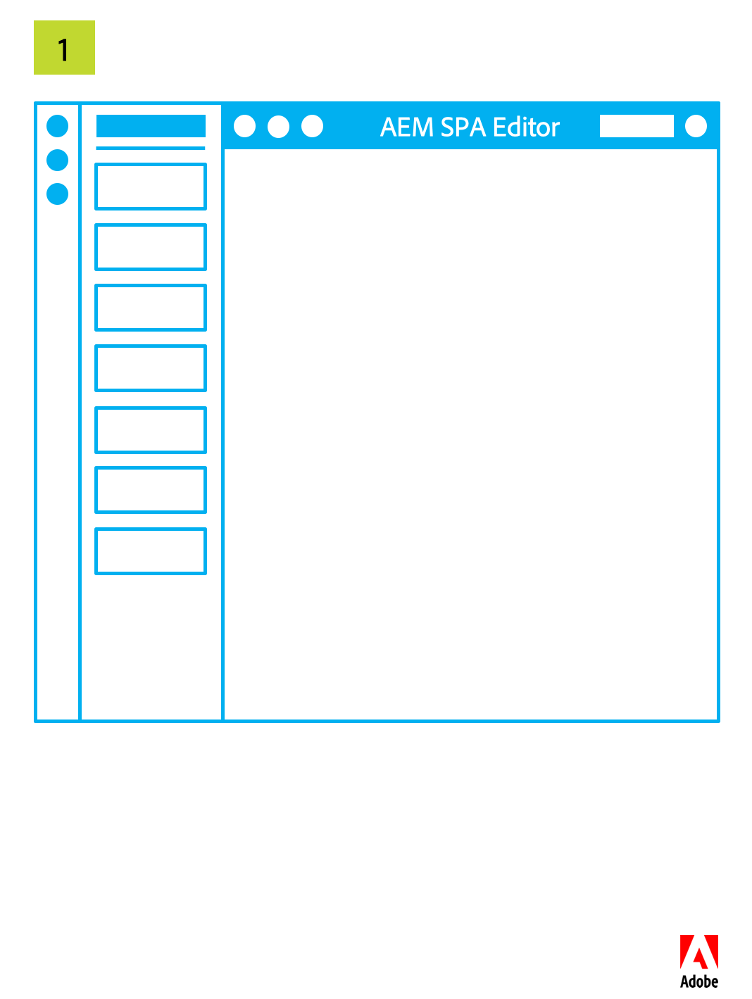

# SPA エディターの概要 {#spa-editor-overview}

単一ページアプリケーション（SPA）により、Web サイトのユーザーに魅力的なエクスペリエンスを提供することができます。開発者は SPA フレームワークを使用してサイトを構築したいと考え、作成者はそうして構築されたサイトのコンテンツを AEM 内でシームレスに編集したいと考えています。

SPA エディターには、AEM 内で SPA をサポートするための包括的なソリューションが用意されています。このページでは、AEM での SPA サポートの構成と、SPA エディターの仕組み、SPA フレームワークと AEM を同期させる方法について説明します。

## 概要 {#introduction}

React や Angular などの一般的な SPA フレームワークを使用して構築したサイトは、Dynamic JSON を使用してコンテンツを読み込みます。サイトには、AEM ページエディターが編集コントロールを配置するために必要な HTML 構造がありません。

AEM 内で SPA の編集を有効にするには、SPA の JSON 出力と AEM リポジトリのコンテンツモデルとの間でマッピングをおこない、変更をコンテンツに保存できるようにする必要があります。

AEM の SPA サポートにより、シン JS レイヤーが導入されました。このレイヤーは、ページエディターに読み込まれると、SPA の JS コードとやり取りします。これにより、イベントを送信したり、編集コントロールの場所をアクティブにしてコンテキスト内で編集したりできます。この機能は、コンテンツサービス API エンドポイントの概念に基づいて構築されています。SPA のコンテンツは、コンテンツサービスを使用して読み込む必要があるからです。

AEM の SPA について詳しくは、次のドキュメントを参照してください。

* SPA の技術要件に関する [SPA ブループリント](blueprint.md)
* React を使用したシンプルな SPA のクイックツアーについては、[React を使用した AEM での SPA の利用](getting-started-react.md)を参照してください。
* Angular を使用したシンプルな SPA のクイックツアーについては、[Angular を使用した AEM での SPA の利用](getting-started-angular.md)を参照してください。

## デザイン {#design}

SPA のページコンポーネントは、JSP ファイルまたは HTL ファイルを介して子コンポーネントの HTML 要素を提供しません。この処理は SPA フレームワークに委任されます。子コンポーネントまたはモデルの表現は、JCR から JSON データ構造として取得されます。次に、その構造に従って、SPA コンポーネントがページに追加されます。この動作により、ページコンポーネントのボディの初期構成が、SPA 以外のコンポーネントの場合とは違う構成になります。

### ページモデルの管理 {#page-model-management}

ページモデルの解決と管理は、指定の `PageModel` ライブラリに委任されます。SPA エディターで初期化とオーサリングをおこなうには、SPA でこのページモデルライブラリを使用する必要があります。このページモデルライブラリは、`aem-react-editable-components` npm によって AEM のページコンポーネントに間接的に提供されます。ページモデルは、AEM と SPA 間のインタープリターであるので、常に存在している必要があります。ページを作成したら、ページエディターとの通信を可能にするために、`cq.authoring.pagemodel.messaging` ライブラリを追加する必要があります。

SPA ページのコンポーネントがページのコアコンポーネントから継承される場合、`cq.authoring.pagemodel.messaging` クライアントライブラリのカテゴリを使用可能にするオプションが 2 つあります。

* テンプレートが編集可能な場合、テンプレートをページポリシーに追加する。
* `customfooterlibs.html` を使用して、カテゴリを追加する。

書き出されたモデル内のリソースごとに、SPA はレンダリングをおこなう実際のコンポーネントをマッピングします。JSON 形式で表現されたモデルは、コンテナ内のコンポーネントマッピングを使用してレンダリングされます。

>[!CAUTION]
>
>`cq.authoring.pagemodel.messaging` カテゴリの追加は、SPA エディターのコンテキストに限定する必要があります。

### 通信データタイプ {#communication-data-type}

`cq.authoring.pagemodel.messaging` カテゴリがページに追加されると、ページエディターにメッセージが送信され、JSON 通信データタイプが確立されます。通信データタイプが JSON に設定されると、GET リクエストにより、コンポーネントの Sling Model エンドポイントとの通信がおこなわれます。ページエディターで更新が実行されると、更新されたコンポーネントの JSON 表現がページモデルのライブラリに送信されます。次に、ページモデルのライブラリから、SPA に更新が通知されます。

## ワークフロー {#workflow}

SPA と AEM 間のインタラクションのフローは、SPA エディターが両者の仲介役になっていると考えると理解することができます。

* ページエディターと SPA 間の通信は、HTML ではなく JSON を使用しておこなわれます。
* ページエディターは、iframe とメッセージング API を使用して、SPA にページモデルの最新バージョンを提供します。
* ページモデルマネージャーは、編集の準備ができたことをエディターに通知し、ページモデルを JSON 構造として渡します。
* エディターは、作成しているページの DOM 構造を変更したり、アクセスしたりすることなく、最新のページモデルを提供します。

### SPA エディターの基本的なワークフロー {#basic-spa-editor-workflow}

SPA エディターの主な要素に留意すると、AEM 内での SPA 編集ワークフローの概要は、作成者の観点では次のようになります。

1. SPA エディターが読み込まれます。
1. SPA が別個のフレームに読み込まれます。
1. SPA が JSON コンテンツを要求し、コンポーネントをクライアント側でレンダリングします。
1. SPA エディターが、レンダリングされたコンポーネントを検出し、オーバーレイを生成します。
1. 作成者がオーバーレイをクリックし、コンポーネントの編集ツールバーを表示します。
1. SPA エディターが、サーバーへの POST リクエストを使用して編集内容を保存します。
1. SPA エディターが、更新された JSON を要求します。これは DOM イベントで SPA に送信されます。
1. SPA が、関係するコンポーネントを再レンダリングし、DOM を更新します。

>[!NOTE]
>
>次の点に注意してください。
>
>* SPA は常にその表示を担当している
>* SPA エディターは SPA 自体から切り離されている
>* 実稼働環境（パブリッシュ）では SPA エディターは読み込まれない

### クライアントサーバー型のページ編集ワークフロー {#client-server-page-editing-workflow}

下図は、SPA を編集する際のクライアントとサーバーのインタラクションの概要をより詳しく説明したものです。

1. SPA がそれ自体を初期化し、Sling Model Exporter にあるページモデルをリクエストします。
1. Sling Model Exporter がリポジトリに、ページを構成するリソースをリクエストします。
1. リポジトリがリソースを返します。
1. Sling Model Exporter がページのモデルを返します。
1. SPA がページモデルに基づいてコンポーネントをインスタンス化します。
1. **6a** コンテンツがエディターに、オーサリングの準備ができたことを通知します。

   **6b** ページエディターがコンポーネントのオーサリング設定をリクエストします。

   **6c** ページエディターがコンポーネントの設定を受け取ります。
1. 作成者がコンポーネントを編集すると、ページエディターがデフォルトの POST サーブレットに変更リクエストをポストします。
1. リソースがリポジトリで更新されます。
1. 更新されたリソースが POST サーブレットに提供されます。
1. デフォルトの POST サーブレットがページエディターに、リソースが更新されたことを通知します。
1. ページエディターが新しいページモデルをリクエストします。
1. （リポジトリにある）ページを構成するリソースが、リクエストされます。
1. ページを構成するリソースが、リポジトリから Sling Model Exporter に提供されます。
1. 更新されたページモデルがエディターに返されます。
1. ページエディターが SPA のページモデル参照を更新します。
1. SPA が新しいページモデル参照に基づいてコンポーネントを更新します。
1. ページエディターのコンポーネント設定が更新されます。

   **17a** SPA がページエディターに、コンテンツの準備ができたことを通知します。

   **17b** ページエディターが SPA にコンポーネント設定を提供します。

   **17c** SPA が、更新されたコンポーネント設定を提供します。

### オーサリングワークフロー {#authoring-workflow}

下図は、オーサリングエクスペリエンスに重点を置いた、より詳細な概要です。

1. SPA がページモデルを取得します。
1. **2A** ページモデルがエディターに、オーサリングに必要なデータを提供します。

   **2b** 通知を受けると、コンポーネントオーケストレーターがページのコンテンツ構造を更新します。
1. コンポーネントオーケストレーターが、AEM リソースタイプと SPA コンポーネントの間のマッピングについて問い合わせます。
1. コンポーネントオーケストレーターが、ページモデルとコンポーネントマッピングに基づいて、SPA コンポーネントを動的にインスタンス化します。
1. ページエディターがページモデルを更新します。
1. **6a** ページモデルがページエディターに、更新されたオーサリングデータを提供します。

   **6b** ページモデルがコンポーネントオーケストレーターに変更を発行します。
1. コンポーネントオーケストレーターがコンポーネントマッピングを取得します。
1. コンポーネントオーケストレーターがページのコンテンツを更新します。
1. SPA がページコンテンツの更新を完了すると、ページエディターがオーサリング環境を読み込みます。

## 要件と制限事項 {#requirements-limitations}

作成者がページエディターを使用して SPA のコンテンツを編集できるようにするには、AEM SPA Editor SDK とやり取りする SPA アプリケーションを実装する必要があります。正常に動作させるために必要な最低限の知識については、[React を使用した AEM での SPA の利用](getting-started-react.md)を参照してください。

### サポートされているフレームワーク {#supported-frameworks}

SPA Editor SDK では、最低限、次のバージョンをサポートしています。

* React 16.x 以上
* Angular 6.x 以上

これらのフレームワークの旧バージョンは、AEM SPA Editor SDK で動作する可能性はありますが、サポートされていません。

### その他のフレームワーク {#additional-frameworks}

AEM SPA Editor SDK で動作する他の SPA フレームワークを追加で実装することができます。AEM SPA エディターで動作するモジュール、コンポーネント、サービスで構成されるフレームワーク固有のレイヤーを作成するためにフレームワークが満たすべき要件については、[SPA ブループリント](blueprint.md)ドキュメントを参照してください。

### 複数のセレクターの使用 {#multiple-selectors}

追加のカスタムセレクターを定義し、AEM SPA SDK 用に開発された SPA の一部として使用することができます。ただし、これをサポートするには、`model` セレクターを最初のセレクターにし、JSON エクスポーターの要件に応じて拡張子を `.json` にする必要があります。

### テキストエディターの要件 {#text-editor-requirements}

SPA で作成したテキストコンポーネントのインプレースエディタを使用する場合は、追加の設定が必要です。

1. テキスト HTML を含んだコンテナラッパー要素に（任意の）属性を設定します。WKND SPA プロジェクトの場合は、`
` 要素がこれに該当し、使用されているセレクターは `data-rte-editelement` です。
1. 対応する AEM テキストコンポーネントの `cq:InplaceEditingConfig` で、そのセレクター（例：`data-rte-editelement` など）を指す設定 `editElementQuery` を指定します。これにより、HTML テキストを折り返す HTML 要素をエディターが把握できます。

リッチテキストエディターの `editElementQuery` プロパティと設定について詳しくは、[リッチテキストエディターの設定](/help/implementing/developing/extending/rich-text-editor.md)を参照してください。

### 制限事項 {#limitations}

AEM SPA Editor SDK はアドビで完全にサポートされており、新機能として機能強化と拡張が続けられています。次の AEM 機能は、SPA エディターではまだサポートされていません。

* ターゲットモード
* ContextHub
* インライン画像編集
* 設定の編集（例：リスナー）
* スタイルシステム
* 取り消し／やり直し
* ページの差分とタイムワープ
* リンクチェッカー、CDN 書き直しサービス、URL 短縮など、サーバー側で HTML の書き換えを実行する機能
* 開発者モード
* AEM ローンチ
