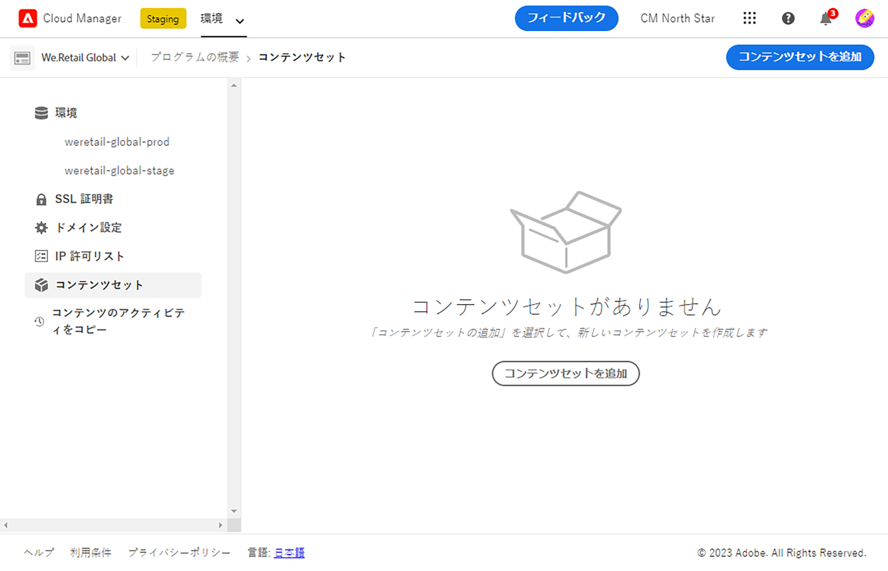
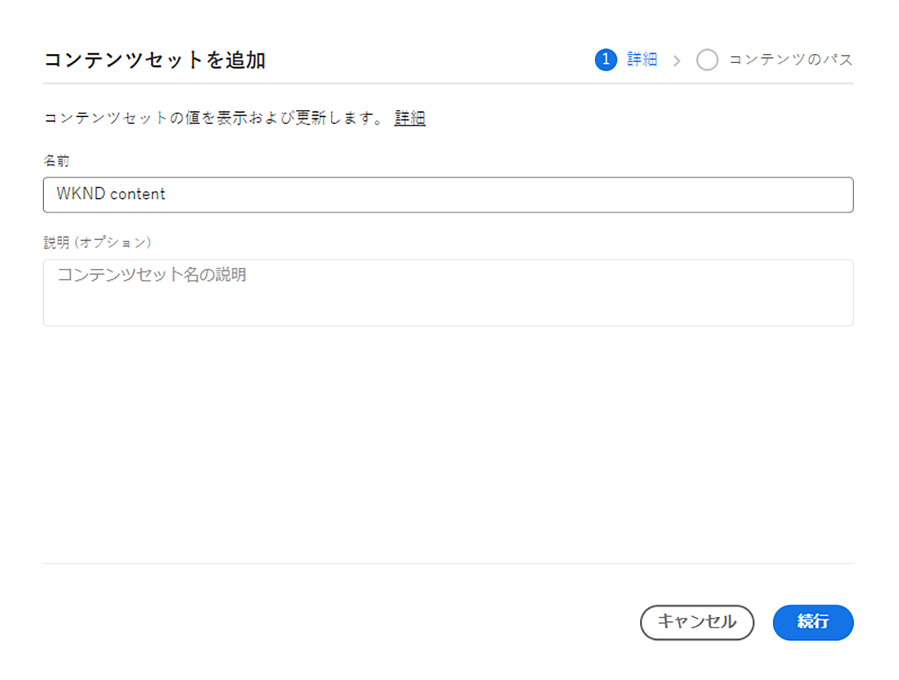
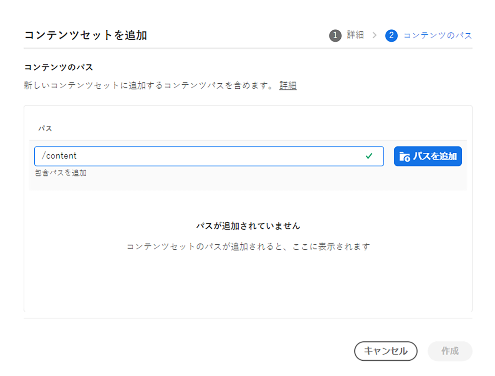
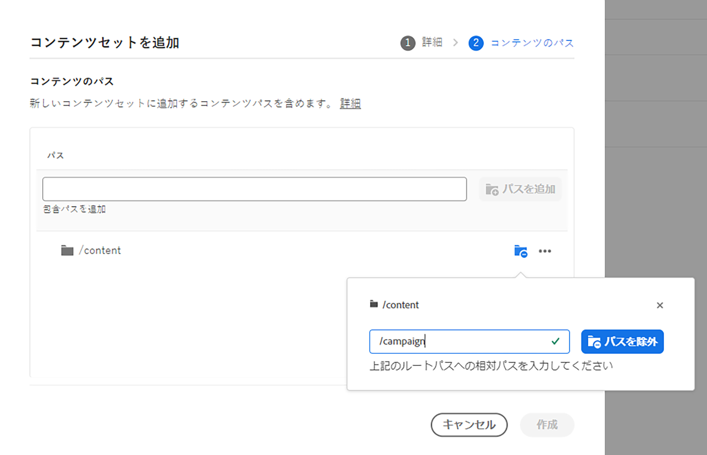
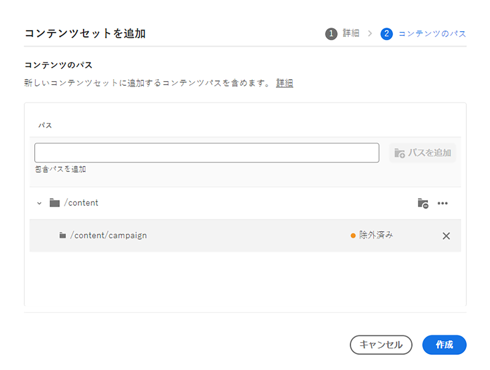
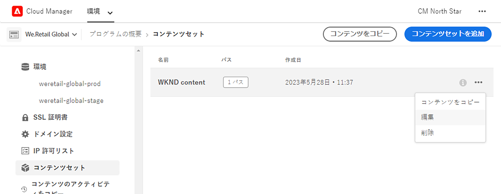
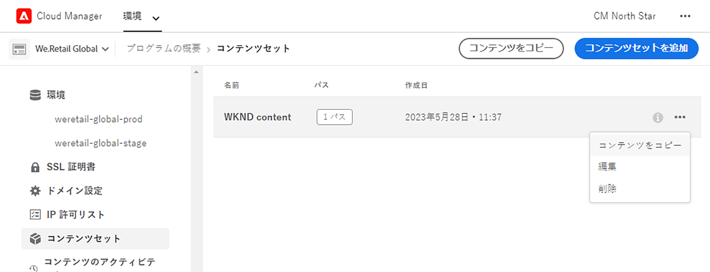
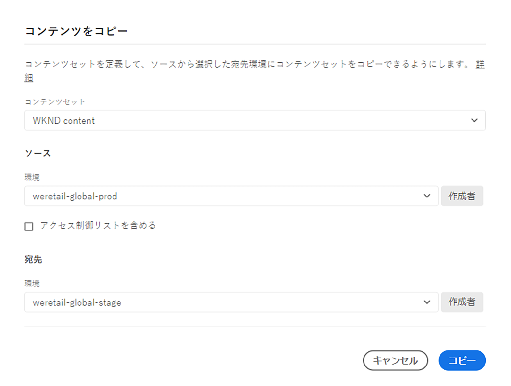
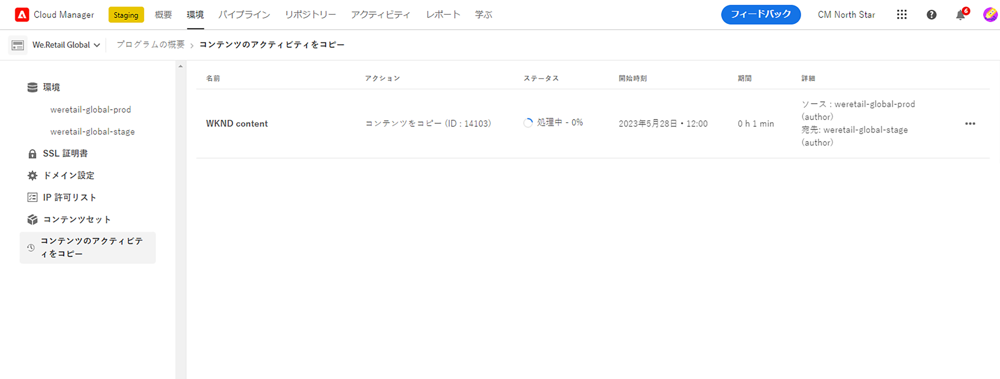
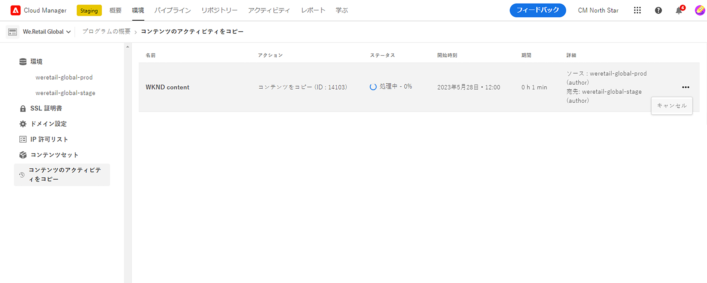

# コンテンツコピーツール {#content-copy}

コンテンツコピーツールを使用すると、可変コンテンツをオンデマンドで AEM as a Cloud Service の実稼動環境から下位環境にテスト目的でコピーできます。

## はじめに {#introduction}

現在の実際のデータは、テスト、検証、ユーザー受け入れの目的で役立ちます。コンテンツコピーツールを使用すると、AEM as a Cloud Service の実稼動環境からステージング環境、開発環境、または[迅速な開発環境（RDE）](/help/implementing/developing/introduction/rapid-development-environments.md)にコンテンツをコピーして、テストを行うことができます。

コピーするコンテンツは、コンテンツセットによって定義されます。コンテンツセットは、同じ Cloud Manager プログラム内のソースオーサーサービス環境からターゲットオーサーサービス環境にコピーされる可変コンテンツを含む、JCR パスのリストで構成されます。コンテンツセットでは、次のパスを使用できます。

```text
/content
/conf/**/settings/wcm
/conf/**/settings/dam/cfm/models
/conf/**/settings/graphql/persistentQueries
/etc/clientlibs/fd/themes
```

コンテンツをコピーする場合、ソース環境が真のソースです。

* 宛先環境でコンテンツが変更されている場合、パスが同じであれば、ソースのコンテンツで上書きされます。
* パスが異なる場合、ソースのコンテンツは宛先のコンテンツと結合されます。

## 権限 {#permissions}

コンテンツのコピーツールを使用するには、ソース環境とターゲット環境の両方で特定の権限が必要です。

| コンテンツのコピー機能 | AEM 管理者グループ | デプロイメントマネージャーの役割 |
|---|---|---|
| [コンテンツセット](#create-content-set)の作成および変更 | 不要 | 必須 |
| [コンテンツのコピープロセス](#copy-content)の開始またはキャンセル | 必須 | 必須 |

権限と設定方法について詳しくは、[AEMas a Cloud Service のチームおよび製品プロファイル](/help/onboarding/aem-cs-team-product-profiles.md)を参照してください。

## コンテンツセットの作成 {#create-content-set}

コンテンツをコピーする前に、コンテンツセットを定義する必要があります。定義すると、コンテンツセットを再使用してコンテンツをコピーできます。コンテンツセットを作成するには、次の手順に従います。

1. [my.cloudmanager.adobe.com](https://my.cloudmanager.adobe.com/) で Cloud Manager にログインし、適切な組織とプログラムを選択します。

1. サイドナビゲーションパネルを使用して、**概要**&#x200B;ページから「**コンテンツセット**」タブに移動します。

1. 画面の右上で、「**コンテンツセットを追加**」をクリックします。

   

1. ウィザードの「**詳細**」タブで、コンテンツセットの名前と説明を入力し、「**続行**」を選択します。

   

1. ウィザードの「**コンテンツのパス**」タブで、コンテンツセットに含める可変コンテンツのパスを指定します。

   1. パスを「**インクルードパスを追加**」フィールドに入力します。
   1. 「**パスを追加**」をクリックして、コンテンツセットにパスを追加します。
   1. 必要に応じて、「**パスを追加**」を再度クリックします。
      * 最大 50 個のパスを使用できます。

   

1. コンテンツセットを調整または制限する必要がある場合、サブパスを除外できます。

   1. 含まれるパスのリストで、制限する必要があるパスの横にある「**除外サブパスを追加**」をクリックします。
   1. 選択したパスの下に、除外するサブパスを入力します。
   1. 「**除外パス**」を選択します。
   1. 必要に応じて、「**除外サブパスを追加**」を選択して、除外するパスを追加します。
      * 非管理対象パスは、管理対象パスに対する相対パスである必要があります。
      * 非管理対象パスの数に制限はありません。

   

1. 必要に応じて、指定したパスを変更できます。

   1. 除外されたサブパスの横にある「X」をクリックすると、サブパスを削除できます。
   1. パスの横にある省略記号ボタンをクリックすると、「**編集**」および「**削除**」オプションを表示できます。

   

1. コンテンツセットを作成するには、「**作成**」を選択します。

コンテンツセットを使用して環境間でコンテンツをコピーできるようになりました。

## コンテンツセットの編集 {#edit-content-set}

コンテンツの手順を作成する場合と同様の手順に従います。「**コンテンツセットを追加**」をクリックする代わりに、コンソールから既存のセットを選択し、省略記号メニューから「**編集**」を選択します。



コンテンツセットを編集する際、設定されたパスを展開すると、除外されたサブパスを表示できます。

## コンテンツのコピー {#copy-content}

コンテンツセットを作成した後、それを使用してコンテンツをコピーできます。次の手順に従って、コンテンツをコピーできます。

>[!NOTE]
> [コンテンツ転送](/help/journey-migration/content-transfer-tool/using-content-transfer-tool/overview-content-transfer-tool.md)操作がその環境で実行されている間は、その環境でコンテンツコピーを使用しないでください。

1. [my.cloudmanager.adobe.com](https://my.cloudmanager.adobe.com/) で Cloud Manager にログインし、適切な組織とプログラムを選択します。

1. **概要**&#x200B;ページから&#x200B;**環境**&#x200B;画面に移動します。

1. **環境**&#x200B;画面から&#x200B;**コンテンツセット**&#x200B;ページに移動します。

1. コンソールからコンテンツセットを選択し、省略記号メニューから「**コンテンツをコピー**」を選択します。

   

   >[!NOTE]
   >
   >次の場合、環境を選択できない可能性があります。
   >
   >* ユーザーに適切な権限がない。
   >* 環境でパイプラインが実行されているか、コンテンツのコピー操作が処理中。
   >* 環境が休止状態または起動中です。

1. **コンテンツをコピー**&#x200B;ダイアログで、コンテンツのコピーアクションのソースと宛先を指定します。

   

   * コンテンツは、上位の環境から下位の環境にコピーするか、次のような階層を持つ開発／RDE 環境間でのみ（最上位から最下位へ）コピーできます。
      * 実稼動
      * ステージング
      * 開発／RDE
   * デフォルトでは、プログラム間コンテンツのコピーは無効になっています。 ただし、顧客のリクエストに応じて有効にすることができ、これにより追加の **宛先プログラム** 入力フィールドが使用可能になります。

1. 必要に応じて、コピープロセスに&#x200B;**アクセス制御リストを含める**&#x200B;ことも選択できます。

1. 「**コピー**」を選択します。

コピープロセスが開始します。コピープロセスのステータスは、選択したコンテンツセットのコンソールに反映されます。

## コンテンツのコピーアクティビティ {#copy-activity}

コピープロセスのステータスは、**コンテンツをコピーアクティビティ**&#x200B;ページで監視できます。

1. [my.cloudmanager.adobe.com](https://my.cloudmanager.adobe.com/) で Cloud Manager にログインし、適切な組織とプログラムを選択します。

1. **概要**&#x200B;ページの&#x200B;**環境**&#x200B;画面に移動します。

1. **環境**&#x200B;画面から&#x200B;**コンテンツをコピーアクティビティ**&#x200B;ページに移動します。



### コンテンツのコピーステータス {#statuses}

コンテンツのコピーを開始すると、プロセスに次のいずれかのステータスが設定されます。

| ステータス | 説明 |
|---|---|
| 処理中 | コンテンツのコピー操作が進行中です |
| 失敗 | コンテンツのコピー操作に失敗しました |
| 完了 | コンテンツのコピー操作が正常に完了しました |
| キャンセル済み | コンテンツのコピー操作開始後にキャンセルされました |

### コピープロセスのキャンセル {#canceling}

コンテンツのコピー操作を開始後に中止する必要がある場合は、オプションでキャンセルできます。

これを行うには、**コンテンツのアクティビティをコピー**&#x200B;ページで、以前に開始したコピープロセスの省略記号メニューから&#x200B;**キャンセル**&#x200B;アクションを選択します。



>[!NOTE]
>
>コンテンツのコピー操作をキャンセルすると、宛先環境にコンテンツが部分的にコピーされる場合があります。この状況により、宛先環境が使用できない状態になる可能性があります。
>
>キャンセルが原因で環境が使用できない状態になった場合は、アドビカスタマーケアにお問い合わせください。

### ログへのアクセス {#accessing-logs}

完了したコンテンツコピープロセスについては、ソース環境と宛先環境の両方でログを確認できます。

これを行うには、**コンテンツアクティビティをコピー**&#x200B;ページで、ログをレビューしたいコピープロセスの省略記号メニューから&#x200B;**ログ**&#x200B;アクションを選択し、環境を選択します。


ログがローカルマシンにダウンロードされます。ダウンロードが開始されない場合は、ポップアップブロッカーの設定を確認してください。

## 制限事項 {#limitations}

コンテンツのコピーツールには次の制限があります。

* コンテンツを下位環境から上位環境にコピーすることはできません。
* コンテンツは、オーサーサービスとの間でのみコピーできます。
* 同じ環境でコンテンツのコピー操作を同時に実行することはできません。
* コンテンツセットごとに最大 50 個のパスを指定できます。除外されるパスに制限はありません。
* コンテンツのコピーツールは、ソース上の移動されたコンテンツや削除されたコンテンツを追跡できないので、クローンまたはミラーリングツールとして使用しないでください。
* コンテンツのコピーツールにはバージョン管理機能がなく、前回のコンテンツのコピー操作以降にコンテンツセット内のソース環境で変更されたコンテンツや作成されたコンテンツを自動的に検出できません。
   * 前回のコンテンツのコピー操作以降のコンテンツの変更のみで宛先環境を更新する場合は、コンテンツセットを作成する必要があります。それから、前回のコンテンツコピー操作以降に変更が加えられたソースインスタンス上のパスを指定します。
* バージョン情報は、コンテンツコピーに含まれていません。
* [コンテンツフラグメントモデル](/help/sites-cloud/administering/content-fragments/content-fragment-models.md#data-types)では、汎用一意識別子（UUID）に基づいて参照フィールドを指定できます。このような UUID はリポジトリに固有なので、コンテンツフラグメントをコピーする際、コンテンツのコピーツールは、ターゲット環境でこれらの UUID を再計算します。
