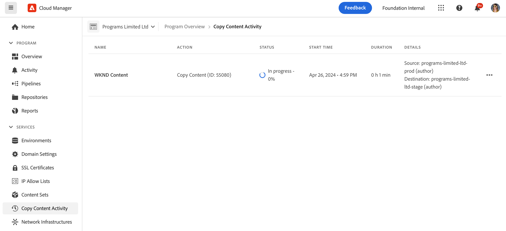

# コンテンツコピーツール {#content-copy}

コンテンツコピーツールを使用すると、可変コンテンツをAEMのas a Cloud Serviceの実稼動環境から低レベルの環境にオンデマンドでコピーして、テスト目的でコピーできます。

## はじめに {#introduction}

現在の実際のデータは、テスト、検証、ユーザー受け入れの目的で役立ちます。コンテンツコピーツールを使用すると、実稼動AEM環境からステージング、開発またはにコンテンツをコピーできます [急速開発環境 (RDE)](/help/implementing/developing/introduction/rapid-development-environments.md) 環境を使用して設定できます。

コピーするコンテンツは、コンテンツセットによって定義されます。コンテンツセットは、同じ Cloud Manager プログラム内のソースオーサリングサービス環境からターゲットオーサリングサービス環境にコピーされる可変コンテンツを含む JCR パスのリストで構成されます。 コンテンツセットでは、次のパスを使用できます。

```text
/content
/conf/**/settings/wcm
/conf/**/settings/dam/cfm/models
/conf/**/settings/graphql/persistentQueries
/etc/clientlibs/fd/themes
```

コンテンツをコピーする場合、ソース環境が真のソースです。

* 宛先環境でコンテンツが変更されている場合、パスが同じであれば、ソースのコンテンツで上書きされます。
* パスが異なる場合、ソースのコンテンツは宛先のコンテンツと結合されます。

## 権限 {#permissions}

コンテンツのコピーツールを使用するには、ソース環境とターゲット環境の両方で特定の権限が必要です。

| コンテンツのコピー機能 | AEM Administrator Group | デプロイメントマネージャーの役割 |
|---|---|---|
| [コンテンツセット](#create-content-set)の作成および変更 | 必須 | 不要 |
| [コンテンツのコピープロセス](#copy-content)の開始またはキャンセル | 必須 | 必須 |

## コンテンツセットの作成 {#create-content-set}

コンテンツをコピーする前に、コンテンツセットを定義する必要があります。 定義すると、コンテンツセットを再使用してコンテンツをコピーできます。コンテンツセットを作成するには、次の手順に従います。

1. [my.cloudmanager.adobe.com](https://my.cloudmanager.adobe.com/) で Cloud Manager にログインし、適切な組織とプログラムを選択します。

1. **概要**&#x200B;ページの&#x200B;**環境**&#x200B;画面に移動します。

1. **環境**&#x200B;画面から&#x200B;**コンテンツセット**&#x200B;ページに移動します。

1.  画面の右上にある「**コンテンツセットを追加**」ボタンをタップまたはクリックします。

   

1. ウィザードの「**詳細**」タブで、コンテンツセットの名前と説明を入力し、「**続行**」をタップまたはクリックします。

   

1. ウィザードの「**コンテンツのパス**」タブで、コンテンツセットに含める可変コンテンツのパスを指定します。

   1. パスを「**インクルードパスを追加**」フィールドに入力します。
   1. 「**パスを追加**」ボタンをタップまたはクリックして、コンテンツセットにパスを追加します。
   1. 必要に応じて、「**パスを追加**」ボタンを再度タップまたはクリックします。
      * 最大 50 個のパスを指定できます。

   

1. コンテンツセットを調整または制限する必要がある場合、サブパスを除外できます。

   1. 含まれるパスのリストで、制限する必要があるパスの横にある「**除外サブパスを追加**」アイコンをタップまたはクリックします。
   1. 選択したパスの下に、除外するサブパスを入力します。
   1. 「**除外パス**」をタップまたはクリックします。
   1. 必要に応じて、「**除外サブパスを追加**」をタップまたはクリックして、除外するパスを追加します。
      * 除外されたパスは、含まれるパスを基準とした相対パスである必要があります。
      * 除外されるパスの数に制限はありません。

   

1. 必要に応じて、指定したパスを変更できます。

   1. 除外されたサブパスの横にある「X」をタップまたはクリックすると、サブパスを削除できます。
   1. パスの横にある「...」ボタンをタップまたはクリックして、「**編集**」および「**削除**」オプションを表示します。

   

1. コンテンツセットを作成するには、「**作成**」をタップまたはクリックします。

コンテンツセットを使用して環境間でコンテンツをコピーできるようになりました。

## コンテンツセットの編集 {#edit-content-set}

コンテンツの手順を作成する場合と同様の手順に従います。「**コンテンツセットを追加**」をタップまたはクリックする代わりに、コンソールから既存のセットを選択し、「...」メニューから「**編集**」を選択します。


コンテンツセットの編集時に、除外されたサブパスを表示するには、設定されたパスを展開する必要が生じる場合があります。

## コンテンツのコピー {#copy-content}

コンテンツセットを作成したら、それを使用してコンテンツをコピーできます。次の手順に従って、コンテンツをコピーします。

>[!NOTE]
> コンテンツのコピーは、 [コンテンツ転送](/help/journey-migration/content-transfer-tool/using-content-transfer-tool/overview-content-transfer-tool.md) 操作がその環境で実行されています。

1. [my.cloudmanager.adobe.com](https://my.cloudmanager.adobe.com/) で Cloud Manager にログインし、適切な組織とプログラムを選択します。

1. **概要**&#x200B;ページの&#x200B;**環境**&#x200B;画面に移動します。

1. **環境**&#x200B;画面から&#x200B;**コンテンツセット**&#x200B;ページに移動します。

1. コンソールからコンテンツセットを選択し、省略記号メニューから「**コンテンツをコピー**」を選択します。

   

   >[!NOTE]
   >
   >次の場合、環境を選択できない可能性があります。
   >
   >* ユーザーに適切な権限がない。
   >* 環境でパイプラインが実行されているか、コンテンツのコピー操作が処理中。
   >* 環境が休止状態または起動中です。


1. **コンテンツをコピー**&#x200B;ダイアログで、コンテンツのコピーアクションのソースと宛先を指定します。

   

   * コンテンツは、上位の環境から下位の環境に、または環境の階層が次のような（上位から下位へ）開発/RDE 環境の間にのみコピーできます。
      * 実稼動
      * ステージング
      * 開発/RDE

1. 必要に応じて、 **アクセス制御リストを含める** コピープロセス内で使用します。

1. 「**コピー**」をタップまたはクリックします。

コピープロセスが開始します。コピープロセスのステータスは、選択したコンテンツセットのコンソールに反映されます。

## コンテンツのコピーアクティビティ {#copy-activity}

コピープロセスのステータスは、**コンテンツをコピーアクティビティ**&#x200B;ページで監視できます。

1. [my.cloudmanager.adobe.com](https://my.cloudmanager.adobe.com/) で Cloud Manager にログインし、適切な組織とプログラムを選択します。

1. **概要**&#x200B;ページの&#x200B;**環境**&#x200B;画面に移動します。

1. **環境**&#x200B;画面から&#x200B;**コンテンツをコピーアクティビティ**&#x200B;ページに移動します。



### コンテンツのコピーステータス {#statuses}

コンテンツのコピーを開始すると、プロセスに次のいずれかのステータスが設定されます。

| ステータス | 説明 |
|---|---|
| 処理中 | コンテンツのコピー操作が進行中です |
| 失敗 | コンテンツのコピー操作に失敗しました |
| 完了 | コンテンツのコピー操作が正常に完了しました |
| キャンセル | コンテンツのコピー操作を開始後にキャンセルする |

### コピープロセスのキャンセル {#canceling}

コンテンツのコピー操作を開始後に中止する必要がある場合は、キャンセルするオプションがあります。

これをおこなうには、 **コンテンツアクティビティをコピー** ページで、 **キャンセル** 以前に開始したコピープロセスの省略記号メニューからのアクション。


>[!NOTE]
>
>コンテンツのコピー操作をキャンセルすると、コンテンツが宛先環境に部分的にコピーされる場合があります。 これにより、宛先環境が使用できない状態になる場合があります。
>
>キャンセルにより環境がそのような状態にある場合は、Adobeカスタマーケアにお問い合わせください。

## 制限事項 {#limitations}

コンテンツのコピーツールには次の制限があります。

* コンテンツを低い環境から高い環境にコピーすることはできません。
* コンテンツは、オーサリングサービスからおよびにのみコピーできます。
* プログラム間でのコンテンツのコピーはできません。
* 同じ環境でコンテンツのコピー操作を同時に実行することはできません。
* コンテンツセットごとに最大 50 個のパスを指定できます。除外されるパスに制限はありません。
* コンテンツコピーツールは、ソース上の移動または削除されたコンテンツを追跡できないので、クローンまたはミラーリングツールとして使用しないでください。
* コンテンツコピーツールにはバージョン管理機能がなく、前回のコンテンツコピー操作以降に設定されたコンテンツのソース環境で、変更されたコンテンツや新しく作成されたコンテンツを自動的に検出できません。
   * 最後のコンテンツコピー操作以降のコンテンツの変更のみを反映して宛先環境を更新する場合は、コンテンツセットを作成し、前回のコンテンツコピー操作以降に変更が加えられたソースインスタンス上のパスを指定する必要があります。
* バージョン情報は、コンテンツコピーに含まれていません。
