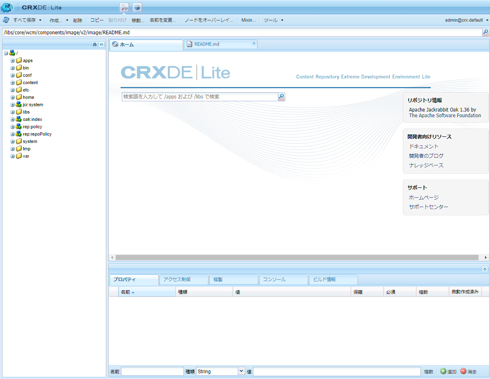

# CRXDE Lite の使用 {#using-crxde-lite}

CRXDE LiteはAEM quickstartの一部で、ブラウザー内のローカル開発環境でリポジトリにアクセスして変更できます。 CRXDE Liteを使用して、ファイル、フォルダー、ノードおよびプロパティを編集できます。 リポジトリ全体には、この使いやすいインターフェースからアクセスできます。

>[!NOTE]
>
>CRXDE Liteは、ローカル開発環境でのみ使用できます。 AEMでは、Cloud Serviceとして使用できません。

## CRXDE Lite の使用 {#getting-started-with-crxde-lite}

CRXDE Liteを使い始めるには：

1. ローカルAEM開発クイックスタートを開始します。
1. ブラウザーでURLを開き `https://<host>:<port>/crx/de`ます。
1. **ユーザー名**&#x200B;と&#x200B;**パスワード**&#x200B;を入力します。
1. 「**OK**」をクリックします。

ブラウザーでは、CRXDE Lite のユーザーインターフェイスは次のように表示されます。 

これで、CRXDE Lite を使用してアプリケーションを開発できます。

>[!TIP]
>
>AEMメニューからCRXDE Liteにアクセスすることもできます。 メインメニューから **ツール** / **一般** / **CRXDE Liteを選択します**。

## ユーザーインターフェイスの概要 {#overview-of-the-user-interface}

CRXDE Liteのユーザーインターフェイスには多くの部分があり、多くの機能があります。

### 上部のスイッチャーバー {#top-switcher-bar}

上部の切り替えバーを使用すると、CRXDE Lite、パッケージマネージャー、パッケージ共有をすばやく切り替えることができます。

### Node Path Widget {#node-path-widget}

ノードパスウィジェットは、現在選択されているノードへのパスを表示します。

また、手動でパスを入力するか、別の場所から貼り付けてEnterキーを押すと、ノードにジャンプできます。

また、特定の名前を持つノードの検索がサポートされます。検索するノードの名前を入力し、待機します（または右側の検索アイコンを選択します）。 特定のノードをエクスプローラペインにロードすると、リストが表示され、パスを選択してEnterキーを押すと、そのノードに移動できます。 この機能は、ブラウザーで現在 CRXDE クライアントアプリケーションに読み込まれているノードでしか使用できません。If you want to search the whole repository, use **Tools** -&amp;gt: **Query**.

### Explorer Pane {#explorer-pane}

「 **エクスプローラ」ペインに** 、リポジトリ内のすべてのノードのツリーが表示されます。

ノードをクリックして、そのプロパティを「**プロパティ**」タブに表示します。ノードをクリックしたら、ツールバーでアクションを選択できます。ノード名を変更するには、ノードをもう一度クリックします。

ツリーナビゲーションフィルター（双眼鏡アイコン）を使用すると、リポジトリ内のノードをフィルタリングできます。このノードには、名前に入力テキストが含まれます。 このフィルターは、ローカルに読み込まれたノードにのみ適用されます。

### Edit Pane {#edit-pane}

[ **編集]ペインでは** 、リポジトリ内で現在選択されているファイルの内容を表示できます。 開かれた各ファイルは、ペインに独自のタブとして表示されます。

「 **ホーム** 」タブでは、コンテンツやドキュメントを検索したり、開発者向けドキュメントやAdobeサポートにアクセスしたりできます。

エク **スプローラペインで重複キーを押しながらファイルをクリックすると** 、その内容が **編集ペインに表示されます**。 次にファイルを変更して保存できます。

Once a file is edited in the **Edit Pane**, the following tools are available on the toolbar:

* **ツリーで表示** — リポジトリツリーにファイルを表示します。
* **検索/置換** — 検索または置換を実行します。

Double-click on the status line of the **Edit Pane** opens the **Go to line** dialog so you can enter a specific line number.

### 「プロパティ」タブ {#properties-tab}

「 **プロパティ」タブ** ：選択したノードのプロパティが表示されます。 新しいプロパティを追加したり、既存のプロパティを削除したりできます。

### Access Control Tab {#access-control-tab}

「 **アクセス制御」タブ** ：現在のパス、リポジトリ、プリンシパルに基づく権限が表示されます。

権限は、次のカテゴリに分類されます。

* **適用可能なアクセス制御ポリシー** — 現在の選択範囲に適用できるポリシー
* **ローカルアクセス制御ポリシー** — 現在の選択範囲にローカルに適用された現在のポリシー
* **有効なアクセス制御ポリシー** — 現在の選択に適用される現在のポリシー。ローカルに設定するか、親ノードから継承することができます。

>[!NOTE]
アクセス制御情報を表示するには、CRXDE LiteにログインしたユーザーにACLエントリを読み取る権限が必要です。

### Replication Tab {#replication-tab}

[ **複製]タブ** ：現在のノードの複製ステータスを表示します。 現在のノードをレプリケーションできます。または削除をレプリケーションできます。

###  Console Tab {#console-tab}

「 **コンソール」タブに** 、ログ・メッセージが表示されます。 ログレベルの設定、コンソールのクリア、選択したスクロール位置での固定およびメッセージの表示の有効化／無効化をおこなうことができます。

### Build Info Tab {#build-info-tab}

「 **ビルド情報」タブには** 、バンドルのビルド時に情報が表示されます。

### 更新ボタン {#refresh-button}

[ **更新]ボタン** ：現在の選択を更新します。 他のユーザーによる変更が、リポジトリの自分のビューで更新されます。自分がおこなった変更には影響を及ぼしません。

### 「すべて保存」ボタン {#save-all-button}

「 **Save All」ボタン** は、行った変更をすべて保存します。 保存を選択するまでは、変更は一時的なもので、コンソールを終了すると失われます。

* **Revert** — 選択したノードで最後の保存操作以降に行った変更をすべて破棄し、選択したノードのリポジトリの現在の状態を再読み込みします。
* **Revert All** — 前回の保存操作以降にリポジトリ全体に対して行った変更をすべて破棄し、リポジトリの現在の状態を再ロードします。

### 「作成」ボタン{#create-button}

「 **作成ボタン** 」は、選択したノードの下に次の項目を作成するドロップダウンメニューです。

* ノード — 任意のノードタイプを持つノード
* File - an `nt:file` node and its nt:resource subnode
* フォルダ — `nt:folder` ノード

### Delete Button {#delete-button}

「 **削除」ボタン** (Delete)を押すと、選択したノードが削除されます。

### Copy Button {#copy-button}

「 **Copy」ボタン** ：選択したノードをコピーします。

## Paste Button {#paste-button}

「 **貼り付け」ボタン** (Paste)をクリックすると、コピーしたノードが選択したノードの下に貼り付けられます。

### Move Button {#move-button}

The **Move Button** moves the selected node to the node that is set through the dialog.

### 名前を変更 {#rename-button}

「 **Rename Button** 」は、選択したノードの名前を変更します。

### Mixins {#mixins-button}

「 **ミックスイン」ボタン** (Mixins Button)を使用すると、ノードタイプにミックスインタイプを追加できます。 ミックスインの種類は、高度な機能の追加に主に使用されます。

### ツール {#tools-button}

[ **ツール]ボタン** は、次のツールを使用できるドロップダウンメニューです。

* **サーバ設定** - Felixコンソールにアクセスするには( `https://<host>:<port>/system/console/configMgr`からも利用可能)
* **クエリ** — リポジトリのクエリ
* **権限** -表示への移行と権限の追加
* **アクセス制御のテスト** — 特定のパスやプリンシパルに対する権限をテストする
* **ノードタイプの書き出し** — システム内のノードタイプをCND表記として書き出す
* **ノードタイプの読み込み** - CND表記を使用してノードタイプを読み込みます。

### Login Widget {#login-widget}

ログ **インウィジェット** ：現在ログインしているユーザーが表示されます。

クリックしてログインするか、別のユーザーとして再ログインします。 は、ユーザーがリポジトリのデフォルト（およびのみ）のワークスペースにあることを `@crx.default` 表します。

「 **環境設定** 」オプションを使用して、UI言語を設定したり、保存、検索、メモの作成などの様々な操作のホットキーを表示およびカスタマイズしたりできます。

## フォルダーの作成 {#creating-a-folder}

CRXDE Lite でフォルダーを作成するには：

1. ブラウザーで CRXDE Lite を開きます。
1. In the Navigation pane, right-click the folder under which you want to create the new folder, select **Create ...**, then **Create Folder ...**.

1. フォルダーの&#x200B;**名前**&#x200B;を入力して、「**OK**」をクリックします。

1. 「**すべて保存**」をクリックして、サーバーに変更を保存します。

## ノードの作成 {#creating-a-node}

CRXDE Lite でノードを作成するには：

1. ブラウザーで CRXDE Lite を開きます。
1. [**Explorerペインで、新しいノードを作成するノードを**&#x200B;右クリックし、「](#explorer-pane) 作成 **」を選択してから「ノードを**&#x200B;作成 ****」を選択します。
1. Enter the **Name** and select the **Type**.
1. 「**OK**」をクリックします。
1. Click the [**Save All Button**](#save-all-button) to save the changes on the server.

これで、プロパティを変更するか、または新しいノードを作成すれば、ニーズに合ったノードを作成できます。

>[!NOTE]
Most of the edit operations, including **Create Node**, keeps all the changes in memory, and only stores them in the repository upon saving (using the [**Save All Button**](#save-all-button)). ただし、移動などの一部の操作は自動的に保持されます。
親ノードのノードタイプで新たに作成したノードが許可されているか否かの検証も、変更を保存する際にリポジトリで行う。 If you receive an error message while saving a node, please check if the content structure is valid (e.g. you cannot create an `nt:unstructured` node as a child of `nt:folder` node).

## プロパティの作成 {#creating-a-property}

CRXDE Lite でプロパティを作成するには：

1. ブラウザーで CRXDE Lite を開きます。
1. [**Explorerペインで、新しいプロパティを追加するノードを**](#explorer-pane) 選択します。
1. In the [**Properties Tab**](#properties-tab) in the bottom pane, enter the **Name**, the **Type**, and the **Value**.
1. 「**追加**」をクリックします。
1. Click the [**Save All Button**](#save-all-button) to save the changes on the server.

## ファイルの作成 {#creating-a-file}

CRXDE Liteを使用して新しいファイルを作成するには：

1. ブラウザーで CRXDE Lite を開きます。
1. In the [**Exploerer Pane**,](#explorer-pane) right-click the component where you want to create the file, select **Create**, then **Create File**.
1. Enter the file **Name** including its extension.
1. 「**OK**」をクリックします。
1. The new file opens as a tab in the [**Edit Pane**.](#edit-pane)
1. ファイルを編集します。
1. Click the [**Save All Button**](#save-all-button) to save the changes.

## ノードタイプの書き出しと読み込み {#exporting-and-importing-node-types}

With CRXDE Lite you can import and/or export node type definitions in [Compact Namespace and Node Type Definition (CND) notation](https://jackrabbit.apache.org/jcr/node-type-notation.html).

CRXDE Liteでノードタイプ定義を書き出すには：

1. ブラウザーで CRXDE Lite を開きます。
1. 必要なノードを選択します。
1. 「**ツール**」、「**ノードタイプを書き出し**」の順に選択します。
1. ブラウザーの新しいタブに、定義がCND表記で表示されます。
1. 必要に応じて情報を保存します。

ノードタイプ定義を読み込むには：

1. ブラウザーで CRXDE Lite を開きます。
1. Select **Tools** then **Import Node Type**.
1. [ [**編集]ペインに[**](#edit-pane) 読み込みノードタイプ ****]というラベルが付いた新しいタブが開きます。
1. 「 **読み込みノードタイプ** 」タブのテキストボックスに、定義のCND表記を入力します。
1. 既存の定義を更新する場合は、「**更新を許可**」を選択します。
1. 「**読み込み**」をクリックします。

## ログ {#logging}

With CRXDE Lite you can display the file `error.log` that is located on the file system at `<aem-install-dir>/crx-quickstart/logs` and filter it with the appropriate log level. 以下の手順を実行します。

1. ブラウザーで CRXDE Lite を開きます。
1. ウィンドウ下部の[ [**コンソール]タブの右側にあるドロップダウンメニューで**](#console-tab) 、[ **サーバログ**]を選択します。
1. 「**停止**」アイコンをクリックして、メッセージを表示します。

以下の操作を実行できます。

* Adjust the log parameters in the Felix Console by clicking the **Logging Configurations** icon.
* Clear the messages by clicking the **Clear Console** icon.
* Pin the message at the current selection by clicking the **Pin Console** icon.
* 「**停止**」アイコンをクリックしてメッセージの表示を有効または無効にします。
