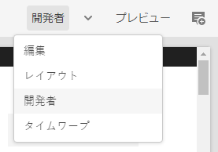
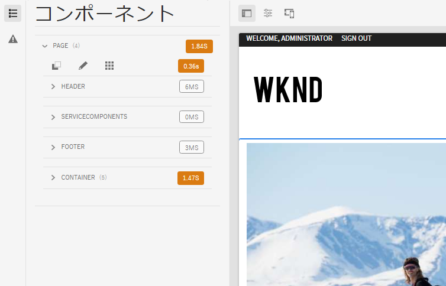
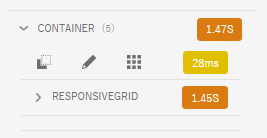
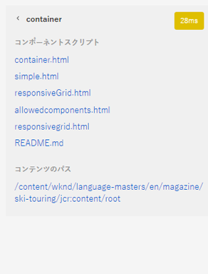

# 開発者モード {#developer-mode}

AEM でページを編集する場合、複数の[モード](/help/sites-cloud/authoring/sites-console/introduction.md#page-modes)は、開発者モードを含めて使用できます。開発者モードで開くサイドパネルのタブには、現在のページに関する開発者向けの技術情報が表示されます。

次の 2 つのタブがあります。

* **[コンポーネント](#components)**：構造およびパフォーマンスに関する情報を表示します。
* **[エラー](#errors)**：発生している問題が表示されます。

これらのタブで、開発者は以下を実行できます。

* **検出**：ページがどのように構成されているかを特定します。
* **デバッグ**：発生したエラーとその場所およびタイミングを特定して、問題の修正に役立てます。

>[!NOTE]
>
>開発者モード:
>
>* モバイルデバイスまたはデスクトップ上の小さなウィンドウでは、（スペースの制限により）使用できません。 ウィンドウの幅が 1024 px 未満の場合は使用できません。
>* `administrators` グループに所属しているユーザーのみ使用できます。

## 開発者モードを開く {#opening-developer-mode}

開発者モードは、ページエディターのサイドパネルとして実装されます。パネルを開くには、ページエディターのツールバーにあるモードセレクターから「**開発者**」を選択します。

パネルは、次の 2 つのタブで構成されています。

* **[コンポーネント](#components)** - コンポーネントツリーが表示されます。これは、作成者向けの[コンテンツツリー](/help/sites-cloud/authoring/page-editor/editor-side-panel.md#content-tree)に似ています。
* **[エラー](#errors)** - 問題が発生すると、各コンポーネントの詳細が表示されます。

### コンポーネントタブ {#components}

コンポーネントツリーが表示されます。次の機能があります。

* ページ上にレンダリングされるコンポーネントとテンプレートのチェーンの概要を示します。このツリーを展開して、階層内のコンテキストを表示できます。
* コンポーネントのレンダリングに必要なサーバーサイドの計算時間を示します。
* ツリーを展開し、ツリー内の特定のコンポーネントを選択できます。コンポーネントを選択すると、次のようなコンポーネント詳細にアクセスできます。
   * リポジトリーパス
   * スクリプトへのリンク（CRXDE Lite でアクセス）
   * コンポーネントの詳細（[コンポーネントコンソール](/help/sites-cloud/authoring/components-console.md)に表示）
* ツリーで選択されたコンポーネントは、エディターでは青い境界線で示されます。

このコンポーネントタブは以下に役立ちます。

* コンポーネントごとのレンダリング時間を判断し、比較します。
* 階層を確認し、理解します。
* 時間がかかっているコンポーネントを把握することで、ページの読み込み時間について理解し、向上させます。

各コンポーネントエントリには次のオプションがあります。

* **詳細を表示**：以下の項目を表示するリストへのリンクです。
   * コンポーネントのレンダリングに使用されるすべてのコンポーネントスクリプト。
   * この特定のコンポーネントのリポジトリーコンテンツパス。

     

* **スクリプトを編集**：CRXDE Lite にコンポーネントスクリプトを開くためのリンクです。

* **コンポーネント詳細を表示**：[コンポーネントコンソール](/help/sites-cloud/authoring/components-console.md)内のコンポーネントの詳細を開きます。

山形アイコンをタップまたはクリックしてコンポーネントエントリを展開すると、次の項目も表示されます。

    * 選択したコンポーネント内の階層。
    * 選択したコンポーネント単独でのレンダリング時間、そのコンポーネント内にネストされている個々のコンポーネントのレンダリング時間、および両者の合計。

### 「エラー」タブ {#errors}

「**エラー**」タブは常に（上図のように）何も表示されないのが理想ですが、問題が発生すると、コンポーネントごとに以下の詳細が表示されます。

* 警告とエラーの詳細および CRXDE Lite 内の適切なコードへの直接リンク（コンポーネントによってエラーログにエントリが作成された場合）
* 警告（コンポーネントによって管理セッションが開かれた場合）

例えば、未定義のメソッドが呼び出された場合は、発生したエラーが「**エラー**」タブに表示され、「**コンポーネント**」タブのツリーにあるコンポーネントエントリにも、エラー発生時のインジケーターが表示されます。
