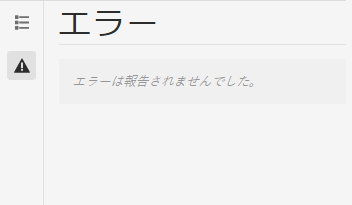

# 開発者モード {#developer-mode}

AEM でのページの編集には、いくつかの[モード](/help/sites-cloud/authoring/fundamentals/environment-tools.md#page-modes)を使用できます。開発者モードもその 1 つです。開発者モードでは、複数のタブを持つサイドパネルが開き、現在のページに関する技術情報を開発者に提供します。

次の 2 つのタブがあります。

* **** 構造およびパフォーマンス情報を表示するためのコンポーネント。
* **** エラーが発生し、問題が発生している場合は表示されません。

これらのタブで、開発者は以下を実行できます。

* **** ページの構成方法を確認します。
* **デバッグ：** 何がどこでいつどのように起きているか、その結果、問題の解決に役立ちます。

>[!NOTE]
>
>開発者モード:
>
>* モバイルデバイスまたはデスクトップ上の小さいウィンドウでは、スペースの制約があるので使用できません。
>  * ウィンドウの幅が 1024 px 未満の場合は使用できません。
>* `administrators` グループのメンバーであるユーザーのみが使用できます。

## 開発者モードを開く {#opening-developer-mode}

開発者モードは、ページエディターのサイドパネルとして実装されています。パネルを開くには、ページエディターのツールバーにあるモードセレクターから「**開発者**」を選択します。

パネルは、次の 2 つのタブで構成されています。

* **[コンポーネント](#components)**  — 作成者向けのコンテンツツリーと同様に、コンポーネントツリ [ーが表](/help/sites-cloud/authoring/fundamentals/environment-tools.md#content-tree) 示されます
* **[エラー](#errors)** - 問題が発生すると、各コンポーネントの詳細が表示されます。

### 「コンポーネント」タブ {#components}

コンポーネントツリーが表示されます。次の機能があります。

* ページにレンダリングされるコンポーネントとテンプレートの連鎖の概要を示します。 このツリーを展開して、階層内のコンテキストを表示できます。
* コンポーネントのレンダリングに必要な、サーバー側の計算時間を示します。
* ツリーを展開して、ツリー内の特定のコンポーネントを選択できます。コンポーネントを選択すると、次のようなコンポーネント詳細にアクセスできます。
   * リポジトリパス
   * スクリプトへのリンク（CRXDE Lite でアクセス）
   * [ コンポーネントコンソール ](/help/sites-cloud/authoring/features/components-console.md) に示すコンポーネントの詳細
* ツリーで選択したコンポーネントは、エディターで青い境界線で示されます。

この「コンポーネント」タブでは、次の操作が可能です。

* コンポーネントごとのレンダリング時間を判断し、比較します。
* 階層を確認し、理解します。
* 時間がかかっているコンポーネントを把握することで、ページの読み込み時間について理解し、向上させます。

各コンポーネントエントリには、次のオプションがあります。

* **表示の詳細：** 以下を表示するリストへのリンク。
   * コンポーネントのレンダリングに使用するすべてのコンポーネントスクリプト。
   * この特定のコンポーネントのリポジトリコンテンツのパス。

      

* **スクリプトを編集：** CRXDE Liteでコンポーネントスクリプトを開くリンク。

* **コンポーネントの詳細を表示：** コンポーネントコンソール内のコンポーネントの詳 [細を開きます。](/help/sites-cloud/authoring/features/components-console.md)

山形記号をタップまたはクリックしてコンポーネントエントリを展開すると、次の項目も表示されます。

    *選択したコンポーネント内の階層。
    *選択したコンポーネントを単独でレンダリングする時間、その中にネストされた個々のコンポーネント、および合計。

### 「エラー」タブ {#errors}

上記のように、「**エラー**」タブは常に空になりますが、問題が発生した場合は、各コンポーネントについて次の詳細が表示される可能性があります。

* 警告とエラーの詳細および CRXDE Lite 内の適切なコードへの直接リンク（コンポーネントによってエラーログにエントリが作成された場合）
* 警告（コンポーネントによって管理セッションが開かれた場合）

例えば、未定義のメソッドを呼び出すと、結果のエラーが「**エラー**」タブに表示され、「**コンポーネント**」タブのツリーにあるコンポーネントエントリにも、エラーが発生したときにインジケーターが表示されます。
