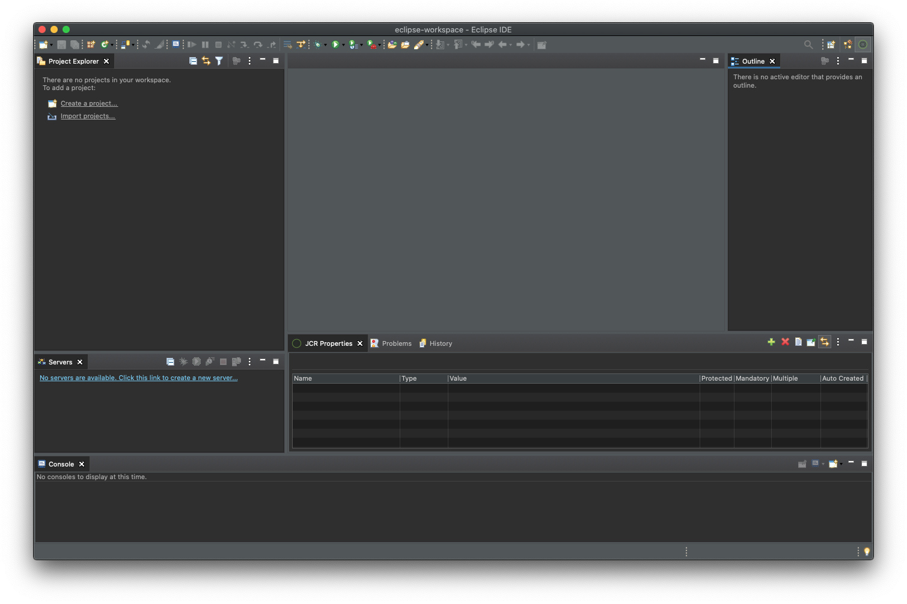

# AEM Developer Tools for Eclipse{#aem-developer-tools-for-eclipse}


## 概要 {#overview}

_Experience Manager Developer Tools for Eclipse_ は、Apache License 2 に従ってリリースされた [Apache Sling 向け Eclipse プラグイン](https://sling.apache.org/documentation/development/ide-tooling.html)をベースとした Eclipse プラグインです。

このツールは、AEM 開発を容易にする次のような機能を提供します。

* Eclipse Server Connector による AEM インスタンスとのシームレスな統合
* コンテンツと OSGi バンドルの同期
* コードのホットスワップ機能を備えたデバッグサポート
* 固有のプロジェクト作成ウィザードからの AEM プロジェクトの簡単なブートストラップ
* JCR プロパティを容易に編集できる

## 要件 {#requirements}

AEM Developer Tools を使用する前に、次の作業が必要です。

* [Eclipse IDE for Enterprise Java™ Developers](https://www.eclipse.org/downloads/packages/) をダウンロードしてインストールします。
* [Eclipse に関する FAQ](https://wiki.eclipse.org/FAQ_How_do_I_increase_the_heap_size_available_to_Eclipse) の説明に従って、`eclipse.ini` 設定ファイルを編集し、ヒープメモリが 1 GB 以上になるように Eclipse を設定します。

>[!NOTE]
>
>macOS では、**Eclipse.app** を右クリックし、「**パッケージの内容を表示**」を選択して、`eclipse.ini`**を探します。**

## Eclipse 用 AEM 開発者ツールのインストール方法 {#how-to-install-the-aem-developer-tools-for-eclipse}

前述の[要件](#requirements)を満たしたら、次の手順でプラグインをインストールできます。

1. [AEM 開発者ツールの web サイト](https://eclipse.adobe.com/com.adobe.granite.ide.p2update-1.3.0.zip)を開きます。<!-- RB: OLD URL was (https://eclipse.adobe.com/aem/dev-tools/) This URL is generating a 404 error in the experience-manager-cloud-service.en LinkCheckExl report . The website appears to be dead; no redirects at all. Clicking "Installation Link" does not do anything. Only the link "Download archive" works. The "Online Documentation" link just takes you to the AEM Docs home page. Not sure if this topic is still needed?? -->

1. **インストール用リンク**&#x200B;をコピーします。

   または、インストール用リンクを使用する代わりにアーカイブをダウンロードできます。この方法ではオフラインインストールが可能ですが、自動アップデート通知は受けられません。

1. Eclipse で、**ヘルプ**&#x200B;メニューを開きます。
1. 「**Install New Software**」をクリックします。
1. 「**Add...**」をクリックします。
1. 「**Name**」フィールドに「`AEM Developer Tools`」と入力します。
1. 「**Location**」フィールドにインストール用 URL をコピーします。
1. 「**Add**」をクリックします。
1. 「**AEM**」プラグインと「**Sling**」プラグインの両方をオンにします。
1. 「**Next**」をクリックします。
1. **Install Details** ウィンドウで、「**Next**」を再度クリックします。
1. 使用許諾契約書に同意し、「**Finish**」をクリックします。
1. 「**RestartNow**」をクリックして、Eclipse を再起動します。

## AEM パースペクティブ {#the-aem-perspective}

Eclipse では、パースペクティブによって、ウィンドウ内で使用可能なアクションやビューが決まり、Eclipse のリソースとのタスク指向のやり取りが可能になります。パースペクティブについて詳しくは、[Eclipse のドキュメント](https://help.eclipse.org/latest/index.jsp)を参照してください。

_Experience Manager Development Tools for Eclipse_ には、AEM プロジェクトおよびインスタンスを完全にコントロールできる AEM パースペクティブが用意されています。AEM パースペクティブを開くには、次の操作を行います。

1. Eclipse メニューバーから、**ウィンドウ**／**パースペクティブ**／**パースペクティブを開く**／**その他**&#x200B;を選択します。
1. ダイアログで「**AEM**」を選択し、「**Open**」をクリックします。



## サンプルのマルチモジュールプロジェクト {#sample-multi-module-project}

_Experience Manager Developer Tools for Eclipse_ には、Eclipse でのプロジェクト設定を素早く習得できる、サンプルのマルチモジュールプロジェクトが付属しています。また、AEM のいくつかの機能のベストプラクティスガイドとしても役立ちます。プロジェクトのアーキタイプについて詳しくは、[こちら](https://github.com/adobe/aem-project-archetype)を参照してください。

サンプルプロジェクトを作成する手順は次のとおりです。

1. **File**／**New**／**Project**&#x200B;メニューで、「**AEM**」セクションを参照して、「**AEM Sample Multi-Module Project**」を選択します。

   

1. 「**Next**」をクリックします。

   >[!NOTE]
   >
   >m2eclipse がアーキタイプカタログをスキャンする必要があるので、この手順にはしばらく時間がかかることがあります。

1. メニューから「`com.adobe.granite.archetypes : sample-project-archetype : <highest-number>`」を選択し、「**Next**」をクリックします。

   

1. サンプルプロジェクトの次のフィールドを指定します。

   * **Name**
   * **Group Id**
   * **Artifact Id**
   * **appId** - この値を設定するには、「**Advanced**」オプションを展開する必要があります。
   * **appTitle** - この値を設定するには、「**Advanced**」オプションを展開する必要があります。
   * **Package** - この値を設定するには、「**Advanced**」オプションを展開する必要があります。

   

1. 「**Next**」をクリックします。

1. 次に、Eclipse の接続先となる AEM サーバーを設定します。

   デバッガー機能を使用するには、AEM をデバッグモードで起動する必要があります。コマンドラインに以下を追加するなどして、デバッグモードで起動できます。

   ```text
       -nofork -agentlib:jdwp=transport=dt_socket,server=y,suspend=n,address=10123
   ```

   

1. 「**終了**」をクリックします。プロジェクト構造が作成されます。

   >[!NOTE]
   >
   >新規インストールの場合（より具体的には、Maven の依存関係をダウンロードしたことがない場合）は、プロジェクトを作成するとエラーが表示されることがあります。その場合は、[無効なプロジェクト定義の解決](#resolving-invalid-project-definition)で説明されている手順に従ってください。

## 既存プロジェクトの読み込み方法 {#how-to-import-existing-projects}

**新規プロジェクトt**&#x200B;機能を使用して、適切な構造を次の手順で作成できます。

1. [サンプルのマルチモジュールプロジェクト](#sample-multi-module-project)を作成する手順に従うと、次のプロジェクトが自動的に作成されます。これらを使用して、関心事を合理的に分離できます。

   * `PROJECT.ui.apps`：`/apps` および `/etc` のコンテンツ用
   * `PROJECT.ui.content`：`/content` の作成済みコンテンツ用
   * `PROJECT.core`：Java™ バンドル用（Java コードの追加が必要になると、これに対する関心が高くなります）
   * `PROJECT.it.launcher` および `PROJECT.it.tests`：統合テスト用

1. `PROJECT.ui.apps` プロジェクトの内容をパッケージの `apps` フォルダーと `etc` フォルダーに置き換えます。

   1. Project Explorer パネルで、`PROJECT.ui.apps`／`src`／`main`／`content`／`jcr_root`／`apps` を展開します。
   1. `apps` フォルダーを右クリックし、**表示**／**System Explorer** を選択します。
   1. 表示される `apps` フォルダーと `etc` フォルダーを削除し、その場所にコンテンツパッケージの `apps` フォルダーと `etc` フォルダーを配置します。
   1. Eclipse で `PROJECT.ui.apps` プロジェクトを右クリックし、「**更新**」を選択します。

1. 続いて、`PROJECT.ui.content` に対して同じことを行い、そのコンテンツフォルダーを自分のパッケージの 1 つに置き換えます。

   1. プロジェクトエクスプローラーパネルで、`PROJECT.ui.content`／`src`／`main`／`content`／`jcr_root`／`content` を展開します。
   1. 深い階層のコンテンツフォルダーを右クリックし、**表示**／**System Explorer** を選択します。
   1. 表示されるコンテンツフォルダーを削除し、その場所にコンテンツパッケージのコンテンツフォルダーを配置します。
   1. Eclipse で `PROJECT.ui.content` プロジェクトを右クリックし、「**更新**」を選択します。

1. 次に、コンテンツパッケージの内容に対応するように、これら 2 つのプロジェクトの `filter.xml` ファイルを更新する必要があります。それには、コンテンツパッケージの `META-INF/vault/filter.xml` ファイルを別のテキスト／コードエディターで開きます。

   * `filter.xml` ファイルの例を次に示します。

   ```xml
   <?xml version="1.0" encoding="UTF-8"?>
   <workspaceFilter version="1.0">
       <filter root="/apps/foo"/>
       <filter root="/apps/foundation/components/bar"/>
       <filter root="/etc/designs/foo"/>
       <filter root="/content/foo"/>
       <filter root="/content/dam/foo"/>
       <filter root="/content/usergenerated/content/foo"/>
   </workspaceFilter>
   ```

1. 2 つのプロジェクトに分割されたパッケージ内容については、これらのフィルタールールを 2 つに分割し、それに応じて 2 つのプロジェクトの `filter.xml` ファイルを更新する必要もあります。

   1. Eclipse で `PROJECT.ui.apps/src/main/content/META-INF/filter.xml` を開きます。
   1. `<workspaceFilter>` 要素の内容を、`/apps` または `/etc` で始まる、パッケージのルールに置き換えます
      * 次に例を示します。

        ```xml
        <?xml version="1.0" encoding="UTF-8"?>
        <workspaceFilter version="1.0">
           <filter root="/apps/foo"/>
           <filter root="/apps/foundation/components/bar"/>
           <filter root="/etc/designs/foo"/>
        </workspaceFilter>
        ```

   1. 次に、`PROJECT.ui.content/src/main/content/META-INF/filter.xml` を開きます。
   1. ルールを、`/content` で始まる、パッケージのルールに置き換えます。
      * 次に例を示します。

        ```xml
        <?xml version="1.0" encoding="UTF-8"?>
        <workspaceFilter version="1.0">
           <filter root="/content/foo"/>
           <filter root="/content/dam/foo"/>
           <filter root="/content/usergenerated/content/foo"/>
        </workspaceFilter>
        ```

1. すべての変更を保存してください。これで、新しいコンテンツが AEM インスタンスに同期するようになりました。

1. Servers パネルで、接続が開始されていることを確認します。開始していない場合は開始します。
1. 「**削除と公開**」アイコンをクリックします。

完了すると、インスタンスでパッケージが動作しており、保存時には変更が自動的にインスタンスに同期します。

プロジェクトからパッケージを再ビルドする場合は、`PROJECT.ui.apps` または `PROJECT.ui.content` を右クリックし、**次として実行**／**Maven インストール**&#x200B;を選択します。

これで、パッケージ（例えば、`PROJECT.ui.apps-0.0.1-SNAPSHOT.zip`）を含んだターゲットフォルダーが作成されました。

## トラブルシューティング {#troubleshooting}

### 無効なプロジェクト定義の解決 {#resolving-invalid-project-definition}

無効な依存関係およびプロジェクト定義を解決するには、次の手順を実行します。

1. 作成したプロジェクトをすべて選択します。
1. 右クリックします。
1. コンテキストメニューで、**Maven**／**プロジェクトを更新**&#x200B;を選択します。
1. 「**Force Updates of Snapshot/Releases**」をオンにします。
1. 「**OK**」をクリックします。

必要な依存関係が自動的にダウンロードされます。これには少し時間がかかる場合があります。

## 詳細情報 {#more-information}

Apache Sling IDE tooling for Eclipse の公式 web サイトでは、次の有益な情報を参照できます。

* [**Apache Sling IDE tooling for Eclipse** ユーザーガイド](https://sling.apache.org/documentation/development/ide-tooling.html)。このドキュメントでは、全体のコンセプト、AEM Development Tools がサポートするサーバー統合およびデプロイメント機能について説明します。
* [トラブルシューティング情報](https://sling.apache.org/documentation/development/ide-tooling.html#troubleshooting)
* [既知の問題リスト](https://sling.apache.org/documentation/development/ide-tooling.html#known-issues)

次の公式の [Eclipse](https://www.eclipse.org/) ドキュメントは、環境の設定に役立ちます。

* [Eclipse 使用の手引き](https://eclipseide.org/getting-started/)
* [Eclipse Luna ヘルプシステム](https://help.eclipse.org/latest/index.jsp)
* [Maven 統合（m2eclipse）](https://www.eclipse.org/m2e/)
