# パッケージマネージャー {#working-with-packages}

パッケージを使用すると、リポジトリコンテンツのインポートとエクスポートが可能になります。パッケージを使用すると、新しいコンテンツのインストール、インスタンス間でのコンテンツの転送、リポジトリコンテンツのバックアップを行うことができます。

パッケージマネージャーを使用すると、開発目的で、AEM インスタンスとローカルファイルシステムの間でパッケージを転送できます。

## パッケージとは {#what-are-packages}

パッケージは、リポジトリコンテンツをファイルシステムのシリアル化形式で保持する zip ファイルであり（vault のシリアル化と呼ばれます）、使いやすく編集しやすい形式でファイルやフォルダーを表現します。 パッケージに含まれるコンテンツは、フィルターを使用して定義します。

パッケージには、フィルター定義やインポート設定情報などの Vault メタ情報も含まれています。説明、視覚的な画像、アイコンなど、パッケージの抽出には使用されないその他のコンテンツプロパティをパッケージに含めることができます。これらの追加のコンテンツプロパティは、コンテンツパッケージのコンシューマー向けのもので、情報提供だけを目的としています。

>[!NOTE]
>
>パッケージは、そのパッケージを作成した時点におけるコンテンツの現在のバージョンを表しています。AEM がリポジトリに保持している以前のバージョンのコンテンツは含まれません。

## AEM as a Cloud Service のパッケージ {#aemaacs-packages}

AEM as a Cloud Service のアプリケーション用に作成されたコンテンツパッケージでは、不変コンテンツと可変コンテンツを明確に分離する必要があります。そのため、パッケージマネージャーは、コンテンツを含むパッケージの管理にのみ使用できます。すべてのコードは、Cloud Manager を使用してデプロイする必要があります。

>[!NOTE]
>
>パッケージには、コンテンツのみを含めることができます。すべての機能（`/apps` で保存されたコンテンツなど）は、 [Cloud Manager の CI/CD パイプラインを使用してデプロイ](/help/implementing/cloud-manager/deploy-code.md) する必要があります。

>[!IMPORTANT]
>
>パッケージのインストールに 10 分以上かかる場合は、パッケージマネージャー UI で **未定義** のエラーメッセージが返される場合があります。
>
>これは、インストールのエラーによるものではなく、すべての要求に対して Cloud Service が持つタイムアウトのためです。
>
>このようなエラーが表示された場合は、インストールを再試行しないでください。インストールはバックグラウンドで正しく進行しています。インストールを再開すると、複数の同時読み込みプロセスによって競合が発生する可能性があります。

AEMaaCS 用のパッケージを管理する方法について詳しくは、デプロイユーザーガイドの [AEM as a Cloud Service へのデプロイ](/help/implementing/deploying/overview.md) のドキュメントを参照してください。

## パッケージマネージャー {#package-manager}

パッケージマネージャーでは、AEM インストール上のパッケージを管理します。[必要な権限の割り当て](#permissions-needed-for-using-the-package-manager) を行ってから、パッケージマネージャーを使用してパッケージの設定、ビルド、ダウンロード、インストールなど様々なアクションを実行できます。

### 必要な権限 {#required-permissions}

パッケージを作成、変更、アップロード、インストールするには、次のノードに対する適切な権限が必要です。

* `/etc/packages` での削除を除く完全な権限
* パッケージコンテンツを含むノード

>[!CAUTION]
>
>パッケージに対する権限を付与すると、機密情報の開示やデータの損失が発生する可能性があります。
>
>これらのリスクを限定するには、専用のサブツリーに対してのみ特定のグループ権限を付与することを強くお勧めします。

### パッケージマネージャーへのアクセス {#accessing}

パッケージマネージャーには次の 3 つの方法でアクセスできます。

1. AEM のメインメニュー／**ツール**／**デプロイメント**／**パッケージ** から
1. 上部のスイッチャーバーの使用して [CRXDE Lite](crxde.md) から
1. `http://<host>:<port>/crx/packmgr/` にアクセスして直接

### パッケージマネージャー UI {#ui}

パッケージマネージャーは、次の 4 つの主な機能領域に分かれています。

* **左側のナビゲーションパネル** - このパネルでは、パッケージのリストをフィルタリングおよび並べ替えることができます。
* **パッケージリスト** - これは、左側のナビゲーションパネルでの選択に従ってフィルタリングおよび並べ替えられた、インスタンス上のパッケージのリストです。
* **アクティビティログ** - このパネルは最初は最小化されていますが、パッケージのビルド時やインストール時など、パッケージマネージャーのアクティビティの詳細を表示するために展開できます。「アクティビティログ」タブには、次の操作を行うための追加のボタンがあります。
   * **ログを消去**
   * **表示／非表示**
* **ツールバー** - ツールバーには、左側のナビゲーションパネルとパッケージリスト用の更新ボタン、およびパッケージを検索、作成、アップロードするためのボタンが含まれています。

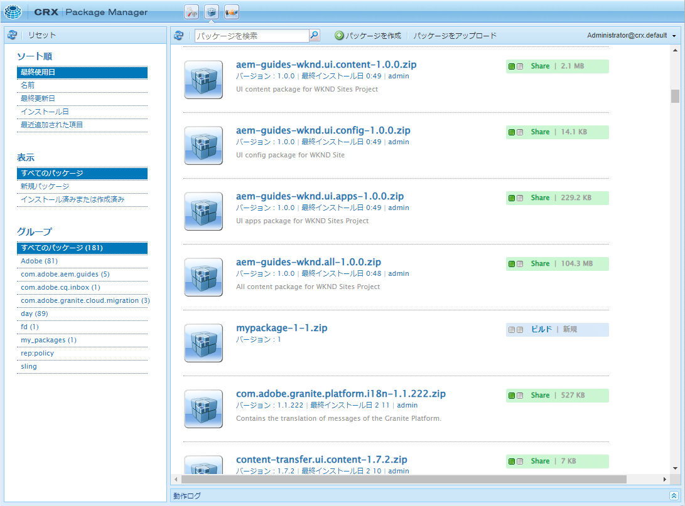

左側のナビゲーションパネルでオプションをクリックすると、パッケージリストが直ちにフィルタリングされます。

パッケージ名をクリックすると、パッケージリストのエントリが展開され、パッケージの詳細が表示されます。

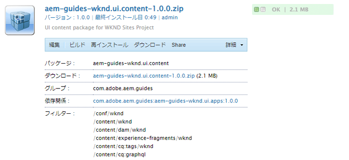

パッケージの詳細を展開する際に使用できるツールバーボタンを使用して、パッケージで実行できるアクションは多数あります。

* [編集](#edit-package)
* [ビルド](#building-a-package)
* [再インストール](#reinstalling-packages)
* [ダウンロード](#downloading-packages-to-your-file-system)

「**その他**」ボタンの下にあるその他のアクションを利用できます。

* [削除](#deleting-packages)
* [カバレッジ](#package-coverage)
* [コンテンツ](#viewing-package-contents-and-testing-installation)
* [再折り返し](#rewrapping-a-package)
* [その他のバージョン](#other-versions)
* [アンインストール](#uninstalling-packages)
* [インストールをテスト](#viewing-package-contents-and-testing-installation)
* [Validate（検証）](#validating-packages)
* [レプリケーション](#replicating-packages)

### パッケージステータス {#package-status}

パッケージリスト内の各エントリには、パッケージのステータスを一目で把握できるステータスインジケーターが表示されます。ステータスの上にマウスポインターを置くと、ステータスの詳細を示すツールチップが表示されます。

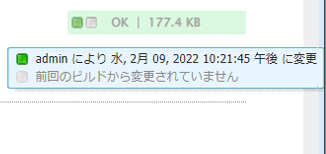

パッケージが変更された、または作成されなかった場合、ステータスは、パッケージを再作成またはインストールするためのクイックアクションを実行するためのリンクとして表示されます。

## パッケージ設定 {#package-settings}

パッケージとは、基本的に、一連のフィルターとそれらのフィルターに基づいたリポジトリデータです。 パッケージマネージャーの UI を使用し、パッケージをクリックして「**編集**」ボタンをクリックすると、次の設定を含むパッケージの詳細が表示されます。

* [一般設定](#general-settings)
* [パッケージフィルター](#package-filters)
* [パッケージの依存関係](#package-dependencies)
* [詳細設定](#advanced-settings)
* [パッケージスクリーンショット](#package-screenshots)

### 一般設定 {#general-settings}

様々なパッケージ設定を編集して、パッケージの説明、依存関係、プロバイダー情報などの情報を定義できます。

**パッケージ設定** ダイアログは、パッケージを [作成](#creating-a-new-package) または [編集](#viewing-and-editing-package-information) するときに「**編集**」ボタンから使用できます。変更が完了したら、「**保存**」をクリックします。

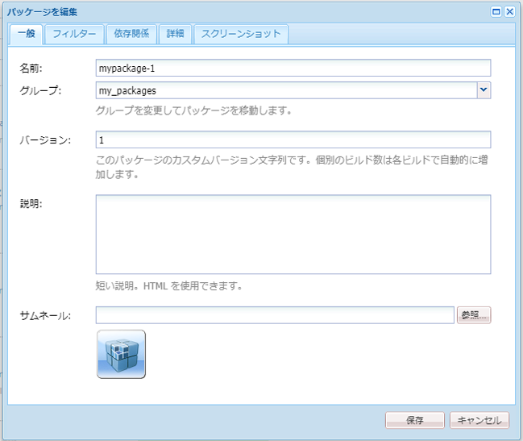

| フィールド | 説明 |
|---|---|
| 名前 | パッケージの名前 |
| グループ | パッケージを整理するために、新しいグループの名前を入力するか、既存のグループを選択できます |
| バージョン | バージョンに使用するテキスト |
| 説明 | 書式設定用の HTML マークアップを許可するパッケージの簡単な説明 |
| サムネール | パッケージリストと共に表示されるアイコン |

### パッケージフィルター {#package-filters}

フィルターは、パッケージに含めるリポジトリノードを識別します。**フィルター定義**&#x200B;によって、以下の情報が指定されます。

* 含めるコンテンツの **ルートパス**
* ルートパスの下で特定のノードを含める、または除外する **ルール**。

ルールを追加するには、「**+**」ボタンを使用します。ルールを削除するには、「**-**」ボタンを使用します。

ルールは順序に従って適用されるため、必要に応じて **上向き** および **下向き** の矢印ボタンを使用してルールを配置します。

フィルターにはルールを含めないことも、いくつか含めることもできます。ルールを何も定義しない場合、パッケージにはルートパスの下のすべてのコンテンツが含まれます。

1 つのパッケージに対して 1 つまたは複数のフィルター定義を指定できます。複数のルートパスのコンテンツを含めるには、複数のフィルターを使用します。

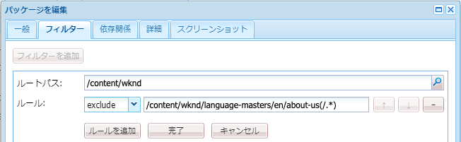

フィルターを作成する場合、パスを定義するか、正規表現を使用することにより、含めたり除外したりするすべてのノードを指定できます。

| ルールタイプ | 説明 |
|---|---|
| include | ディレクトリを含めると、そのディレクトリと、そのディレクトリ内のすべてのファイルとフォルダー（つまりサブツリー全体）が含まれますが、指定したルートパスの下にある他のファイルやフォルダーは含まれ **ません**。 |
| exclude | ディレクトリを除外すると、そのディレクトリと、そのディレクトリ内のすべてのファイルとフォルダー（つまりサブツリー全体）が除外されます。 |

パッケージフィルターが定義されるのは、ほとんどの場合、最初に [パッケージを作成するときです。](#creating-a-new-package) ただし、後で編集することもできますが、その後でパッケージを再作成して、新しいフィルター定義に基づいてその内容を更新する必要があります。

>[!TIP]
>
>1 つのパッケージに複数のフィルター定義を含めることができるので、別々の場所のノードを組み合わせて 1 つのパッケージにすることも簡単です。

### 依存関係 {#dependencies}

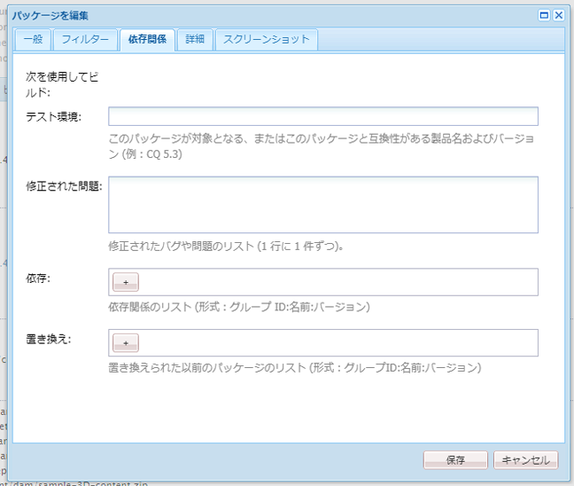

| フィールド | 説明 | 例/詳細 |
|---|---|---|
| テスト環境 | このパッケージが対象とする、または互換性のある、製品名およびバージョン。 | `AEMaaCS` |
| 修正された問題 | このパッケージで修正されたバグの詳細をリストするテキストフィールド。1 行に 1 つのバグが表示されます。 | - |
| 依存 | 現在のパッケージがインストール時に期待どおりに実行されるように、必要なその他のパッケージをリストします | `groupId:name:version` |
| 置き換え | このパッケージで置き換えられる、非推奨（廃止予定）のパッケージのリスト | `groupId:name:version` |

### 詳細設定 {#advanced-settings}

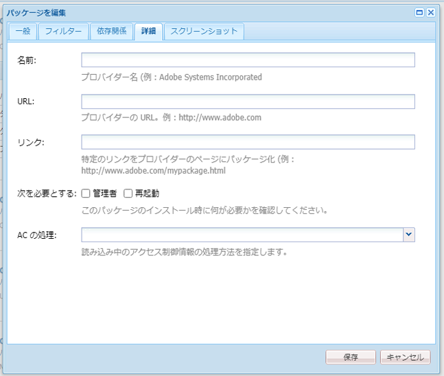

| フィールド | 説明 | 例/詳細 |
|---|---|---|
| 名前 | パッケージのプロバイダーの名前 | `WKND Media Group` |
| URL | プロバイダーの URL | `https://wknd.site` |
| リンク | プロバイダーページへの、パッケージ専用のリンク | `https://wknd.site/package/` |
| 次を必要とする | パッケージのインストール時に制限があるかどうかを定義します | **管理者** - パッケージは管理者権限でのみインストールする必要があります&#x200B;<br>**再起動** - AEM はパッケージのインストール後に再起動する必要があります |
| AC の処理 | パッケージ読み込み時の、パッケージで定義されているアクセス制御情報の処理方法を指定します。 | **無視** - リポジトリ内の ACL を保持&#x200B;<br>**上書き** - リポジトリ内の ACL を上書き&#x200B;<br>**結合** - 両方の ACL をマージ&#x200B;<br>**MergePreserve** - コンテンツに存在しないプリンシパルのアクセス制御エントリを追加して、コンテンツ内のアクセス制御をパッケージで提供されるアクセス制御とマージ&#x200B;<br>**クリア** - ACL をクリア |

### パッケージスクリーンショット {#package-screenshots}

パッケージに複数のスクリーンショットを添付して、コンテンツがどのように表示されるかを視覚的に示すことができます。

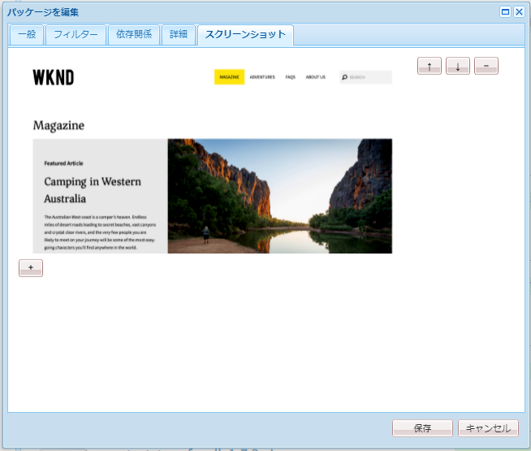

## パッケージアクション {#package-actions}

1 つのパッケージで実行できるアクションは多数あります。

### パッケージの作成 {#creating-a-new-package}

1. [パッケージマネージャーにアクセスします。](#accessing)

1. 「**パッケージを作成**」をクリックします。

   >[!TIP]
   >
   >インスタンスに多数のパッケージがある場合は、フォルダー構造が存在する可能性があります。そのような場合は、新しいパッケージを作成する前に必要なターゲットフォルダーに移動する方が簡単です。

1. **新規パッケージ** ダイアログで、次のフィールドを入力します。

   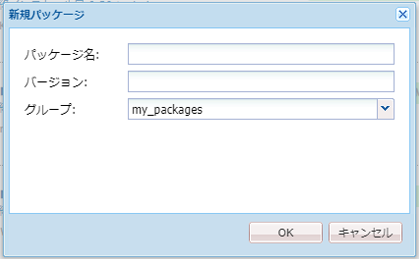

   * **パッケージ名** - パッケージのコンテンツを（自分と他の人が）簡単に識別できるように、わかりやすい名前を選択します。

   * **バージョン** - これは、バージョンを示すためのテキストフィールドです。 これがパッケージ名に追加され、zip ファイルの名前が形成されます。

   * **グループ** - ターゲットグループ（またはフォルダー）の名前です。グループは、パッケージの整理に役立ちます。 グループのフォルダーがまだ存在しない場合は作成されます。グループ名を空白のままにすると、メインのパッケージリストにパッケージが作成されます。

1. 「**OK**」をクリックしてパッケージを作成します。

1. AEM では、新しいパッケージがパッケージのリストの最上部に表示されます。

   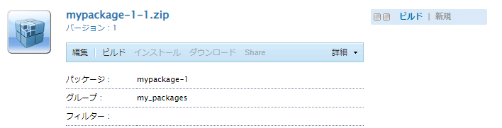

1. 「**編集**」をクリックすると、[パッケージのコンテンツを定義できます。](#package-contents) 設定の編集が完了したら、「**保存**」をクリックします。

1. これで、パッケージを [ビルド](#building-a-package) できます。

パッケージを作成した後すぐにビルドする必要はありません。未ビルドパッケージにはコンテンツが含まれず、フィルターデータとパッケージの他のメタデータのみで構成されます。

### パッケージのビルド {#building-a-package}

多くの場合、パッケージは [パッケージの作成](#creating-a-new-package) と同時に作成されますが、後で戻ってパッケージを作成または再作成することができます。これは、リポジトリ内のコンテンツが変更された場合や、パッケージフィルターが変更された場合に役立ちます。

1. [パッケージマネージャーにアクセスします。](#accessing)

1. パッケージリストでパッケージ名をクリックして、パッケージの詳細を開きます。

1. 「**ビルド**」をクリックします。パッケージをビルドすると既存のパッケージの内容が上書きされるので、実行するかどうかを確認するダイアログが表示されます。

1. 「**OK**」をクリックします。AEM によってパッケージがビルドされ、パッケージに追加されたすべてのコンテンツがアクティビティリストに表示されます。ビルドが完了すると、パッケージが作成されたことを示すダイアログが表示されます。そのダイアログを閉じると、パッケージリストの内容が更新されます。

### パッケージの編集 {#edit-package}

パッケージを AEM にアップロードした後は、その設定を変更できます。

1. [パッケージマネージャーにアクセスします。](#accessing)

1. パッケージリストでパッケージ名をクリックして、パッケージの詳細を開きます。

1. 必要に応じて、「**編集**」をクリックして **[パッケージ設定](#package-settings)** を更新します。

1. 「**保存**」をクリックして、保存します。

変更した内容を反映するには、 [パッケージを再作成](#building-a-package) する必要がある場合があります。

### パッケージを再度含める {#rewrapping-a-package}

パッケージは、ビルド後に再度含めることができます。再度含めると、パッケージのコンテンツは変更されずに、サムネールや説明などを含まないパッケージの情報が変更されます。

1. [パッケージマネージャーにアクセスします。](#accessing)

1. パッケージリストでパッケージ名をクリックして、パッケージの詳細を開きます。

1. 必要に応じて、「**編集**」をクリックして **[パッケージ設定](#package-settings)** を更新します。

1. 「**保存**」をクリックして、保存します。

1. **その他**／**再度含める** をクリックすると、確認のダイアログが表示されます。

### 他のパッケージバージョンの表示 {#other-versions}

パッケージのすべてのバージョンは別のパッケージとしてリストに表示されるので、パッケージマネージャーは選択したパッケージの他のバージョンを検索できます。

1. [パッケージマネージャーにアクセスします。](#accessing)

1. パッケージリストでパッケージ名をクリックして、パッケージの詳細を開きます。

1. **その他**／**その他のバージョン** をクリックすると、ダイアログが開き、同じパッケージの他のバージョンとステータス情報が表示されます。

### パッケージコンテンツの表示とインストールのテスト {#viewing-package-contents-and-testing-installation}

パッケージがビルドされたら、コンテンツを表示できます。

1. [パッケージマネージャーにアクセスします。](#accessing)

1. パッケージリストでパッケージ名をクリックして、パッケージの詳細を開きます。

1. コンテンツを表示するには、**その他**／**コンテンツ** をクリックします。パッケージマネージャーには、パッケージのコンテンツ全体がアクティビティログにリストされます。

   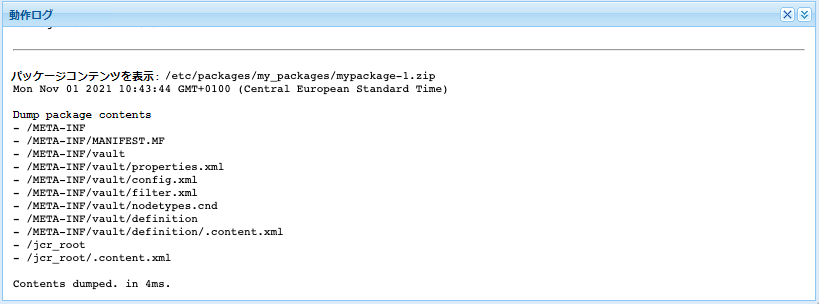

1. インストールのドライランを実行するには、 **その他**／**インストールをテスト** をクリックします。パッケージマネージャーは、インストールが実行されたかのように結果をアクティビティログにレポートします。

   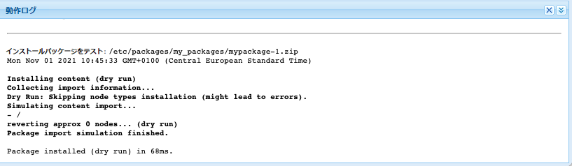

### ファイルシステムへのパッケージのダウンロード {#downloading-packages-to-your-file-system}

1. [パッケージマネージャーにアクセスします。](#accessing)

1. パッケージリストでパッケージ名をクリックして、パッケージの詳細を開きます。

1. パッケージの詳細領域内にある「**ダウンロード**」ボタンまたはリンクが付いたパッケージのファイル名をクリックします。

1. AEM がお使いのコンピューターにパッケージをダウンロードします。

### ファイルシステムからのパッケージのアップロード {#uploading-packages-from-your-file-system}

1. [パッケージマネージャーにアクセスします。](#accessing)

1. パッケージのアップロード先となるグループフォルダーを選択します。

1. 「**パッケージをアップロード**」ボタンをクリックします。

1. アップロードしたパッケージに関する必要な情報を入力します。

   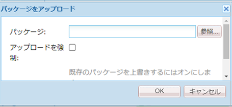

   * **パッケージ** - 「**参照…**」ボタンを使用して、必要なパッケージをローカルファイルシステムから選択します。
   * **アップロードを強制** - この名前のパッケージが既に存在する場合は、このオプションを選択すると、アップロードが強制され、既存のパッケージが上書きされます。

1. 「**OK**」をクリックすると、選択したパッケージがアップロードされ、それに応じてパッケージリストが更新されます。

パッケージのコンテンツは現在 AEM に存在しますが、コンテンツを使用できるようにするには、必ず [パッケージをインストール](#installing-packages) してください。

### パッケージの検証 {#validating-packages}

パッケージは既存のコンテンツを変更する可能性があるので、多くの場合、インストール前にこれらの変更を検証すると便利です。

#### 検証オプション {#validation-options}

パッケージマネージャーは次の検証を実行できます。

* [OSGi パッケージの読み込み](#osgi-package-imports)
* [オーバーレイ](#overlays)
* [ACL](#acls)

##### OSGi パッケージの読み込みを検証 {#osgi-package-imports}

>[!NOTE]
>
>AEMaaCS でのコードのデプロイにパッケージを使用できないので、 **OSGi パッケージの読み込み** 検証は不要です。

**チェック内容**

この検証では、パッケージ内のすべての JAR ファイル（OSGi バンドル）を調べ、それらの `manifest.xml`（OSGi バンドルが依存しているバージョン付きの依存関係が含まれているファイル）を抽出し、AEM インスタンスが正しいバージョンで依存関係を書き出すかを確認します。

**レポート方法**

AEM インスタンスで解決できないバージョン付きの依存関係は、パッケージマネージャーのアクティビティログに記載されます。

**エラーの状態**

未解決の依存関係がある場合、それらの依存関係を持つパッケージ内の OSGi バンドルは開始しません。開始しない OSGi バンドルに依存しているものはすべて正しく機能しなくなるため、これによりアプリケーションのデプロイメントが破損します。

**エラーの解決**

依存関係が未解決の OSGi バンドルによるエラーを解決するには、未解決の読み込みがあるバンドルの依存関係バージョンを調整する必要があります。

##### オーバーレイを検証 {#overlays}

>[!NOTE]
>
>AEMaaCS でのコードのデプロイにパッケージを使用できないので、 **オーバーレイ** 検証は不要です。

**チェック内容**

この検証では、インストールするパッケージに、宛先の AEM インスタンスにすでにオーバーレイされているファイルが含まれているかどうかを確認します。

例えば、既存のオーバーレイ `/apps/sling/servlet/errorhandler/404.jsp` があり、既存のファイル `/libs/sling/servlet/errorhandler/404.jsp` を変更するような `/libs/sling/servlet/errorhandler/404.jsp` がパッケージに含まれている場合です。

**レポート方法**

そのようなオーバーレイは、パッケージマネージャーのアクティビティログに記載されます。

**エラーの状態**

パッケージがすでにオーバーレイされているファイルをデプロイしようとしています。したがって、パッケージ内の変更はオーバーレイによって上書きされ（つまり「非表示」となり）、有効になりません。

**エラーの解決**

この問題を解決するために、`/apps` のオーバーレイファイルのメンテナンス者は、`/libs` のオーバーレイしたファイルへの変更を確認する必要があります。必要に応じて変更をオーバーレイ（`/apps`）に組み込み、オーバーレイしたファイルを再デプロイします。

>[!NOTE]
>
>検証メカニズムには、オーバーレイされたコンテンツがオーバーレイファイルに正しく組み込まれているかどうかを照合する方法がありません。そのため、この検証では、必要な変更が加えられた後も競合についてレポートし続けます。

##### ACL を検証 {#acls}

**チェック内容**

この検証では、どの権限が追加されるか、それらがどのように処理されるか（マージ／置換）、および現在の権限が影響を受けるかどうかを確認します。

**レポート方法**

権限については、パッケージマネージャーのアクティビティログに記載されます。

**エラーの状態**

明示的なエラーはありません。この検証は、パッケージをインストールすることで新しい ACL 権限が追加されるか、または影響があるかどうかを示すだけです。

**エラーの解決**

検証によって提供された情報を使用して、影響を受けたノードを CRXDE で確認したり、必要に応じて ACL をパッケージ内で調整したりできます。

>[!CAUTION]
>
>ベストプラクティスとして、予期しない動作を引き起こす可能性があるため、パッケージは AEM 提供の ACL に影響を与えないようにすることをお勧めします。

#### 検証の実行 {#performing-validation}

パッケージの検証は 2 とおりの方法で行うことができます。

* [パッケージマネージャーの UI から](#via-package-manager)
* [cURL などの HTTP POST リクエストを介して](#via-post-request)

検証は、パッケージをアップロードした後、インストールする前に必ず行う必要があります。

##### パッケージマネージャーによるパッケージ検証 {#via-package-manager}

1. [パッケージマネージャーにアクセスします。](#accessing)

1. パッケージリストでパッケージ名をクリックして、パッケージの詳細を開きます。

1. パッケージを検証するには、 **その他**／**検証** をクリックします。

1. 表示されるモーダルダイアログボックスで、チェックボックスを使用して検証の種類を選択し、「**検証**」をクリックして検証を開始します。

1. 選択した検証が実行され、結果がパッケージマネージャーのアクティビティログに表示されます。

##### HTTP POST リクエストを介したパッケージ検証 {#via-post-request}

POST リクエストの形式は以下のとおりです。

```
https://<host>:<port>/crx/packmgr/service.jsp?cmd=validate&type=osgiPackageImports,overlays,acls
```

`type` パラメーターは、カンマで区切った順不同リストで、次のもので構成されます。

* `osgiPackageImports`
* `overlays`
* `acls`

明示的に渡されない場合、`type` のデフォルト値は `osgiPackageImports` に設定されます。

cURL を使用している場合は、次のようなステートメントを実行してください。

```shell
curl -v -X POST --user admin:admin -F file=@/Users/SomeGuy/Desktop/core.wcm.components.all-1.1.0.zip 'http://localhost:4502/crx/packmgr/service.jsp?cmd=validate&type=osgiPackageImports,overlays,acls'
```

POST リクエストを介して検証する場合、応答は JSON オブジェクトとして返されます。

### パッケージカバレッジの表示 {#package-coverage}

パッケージは、フィルターによって定義されます。パッケージマネージャーで既存のリポジトリコンテンツにパッケージのフィルターを適用して、パッケージのフィルター定義でカバーされるリポジトリのコンテンツを表示できます。

1. [パッケージマネージャーにアクセスします。](#accessing)

1. パッケージリストでパッケージ名をクリックして、パッケージの詳細を開きます。

1. **その他**／**カバレッジ** をクリックします。

1. カバレッジの詳細は、アクティビティログにリストされます。

### パッケージのインストール {#installing-packages}

パッケージをアップロードしても、パッケージのコンテンツがリポジトリに追加されるだけで、アクセスできません。パッケージのコンテンツを使用するには、アップロードしたパッケージをインストールする必要があります。

>[!CAUTION]
>
>パッケージをインストールすると、既存のコンテンツが上書きまたは削除される可能性があります。必要なコンテンツが削除または上書きされないと確認できる場合にのみ、パッケージをアップロードしてください。

パッケージをインストールする前に、上書きされるコンテンツを含むスナップショットパッケージがパッケージマネージャーによって自動的に作成されます。 このスナップショットは、パッケージをアンインストールした場合に再インストールされます。

1. [パッケージマネージャーにアクセスします。](#accessing)

1. パッケージリストでパッケージ名をクリックして、インストールするパッケージのパッケージ詳細を開きます。

1. 項目の詳細の「**インストール**」ボタンをクリックするか、パッケージステータスの「**インストール**」リンクをクリックします。

1. 確認を求めるダイアログが表示され、追加のオプションを指定できます。

   * **抽出のみ** - パッケージの抽出のみを行い、スナップショットは作成されずアンインストールはできません
   * **しきい値を保存** - 自動保存がトリガーされるまでの一時的なノード数です（同時修正の例外が発生した場合に増加します）
   * **サブパッケージを抽出** - サブパッケージの自動抽出を有効にします
   * **アクセス制御の処理** - パッケージのインストール時に、パッケージで定義されたアクセス制御情報を処理する方法を指定します（オプションは[詳細パッケージ設定](#advanced-settings)と同じです）
   * **依存関係の処理** - インストール中の依存関係の処理方法を指定します

1. 「**インストール**」をクリックします。

1. インストールの進行状況の詳細は、アクティビティログに記録されます。

インストールが正常に完了すると、パッケージリストが更新され、パッケージのステータスに **インストール済み** という文字が表示されます。

### パッケージの再インストール {#reinstalling-packages}

パッケージの再インストールでは、すでにインストールされているパッケージに対して、 [最初にパッケージをインストールした](#installing-packages) 時の処理と同じ手順を実行します。

### ファイルシステムベースのアップロードおよびインストール {#file-system-based-upload-and-installation}

パッケージをインストールする際に、完全にパッケージマネージャーなしで済ませることができます。AEM は、ホストマシンのローカルファイルシステム上の特定の場所に配置されたパッケージを検出し、それらを自動的にアップロードしてインストールできます。

1. AEM インストールフォルダーに、 jar ファイルや `license.properties` ファイルと並んで `crx-quicksart` フォルダーがあります。 パス `<aem-home>/crx-quickstart/install` で生成された `crx-quickstart` の下に `install` という名前のフォルダーを作成します。

1. このフォルダーに、パッケージを追加します。 追加したパッケージは、インスタンスに自動的にアップロードおよびインストールされます。

1. アップロードとインストールが完了すると、パッケージマネージャー UI を使用してパッケージをインストールしたかのように、パッケージマネージャーにパッケージが表示されます。

インスタンスを実行している場合、`install` フォルダーへのパッケージにインスタンスを追加すると、直ちにアップロードとインストールが始まります。

インスタンスを実行していない場合、`install` フォルダーに配置されたパッケージは、起動時にアルファベット順にインストールされます。

### パッケージのアンインストール {#uninstalling-packages}

パッケージをアンインストールすると、リポジトリの内容は、インストール前にパッケージマネージャーが自動的に作成したスナップショットに戻ります。

1. [パッケージマネージャーにアクセスします。](#accessing)

1. パッケージリストでパッケージ名をクリックして、アンインストールするパッケージの詳細を開きます。

1. **その他**／**アンインストール** をクリックして、リポジトリからこのパッケージのコンテンツを削除します。

1. 確認を求めるダイアログが表示され、行われているすべての変更が一覧表示されます。

1. パッケージが削除され、スナップショットが適用されます。 プロセスの進行状況は、アクティビティログに表示されます。

### パッケージの削除 {#deleting-packages}

パッケージを削除すると、パッケージマネージャーからその詳細のみが削除されます。このパッケージが既にインストールされている場合、インストール済みのコンテンツは削除されません。

1. [パッケージマネージャーにアクセスします。](#accessing)

1. パッケージリストからパッケージ名をクリックして、削除するパッケージのパッケージ詳細を開きます。

1. パッケージを削除してよいかどうか確認するダイアログが表示されます。「**OK**」をクリックして削除を確認します。

1. パッケージ情報が削除され、詳細がアクティビティログに報告されます。

### パッケージのレプリケーション {#replicating-packages}

パッケージのコンテンツをレプリケートして、パブリッシュインスタンスにインストールします。

1. [パッケージマネージャーにアクセスします。](#accessing)

1. パッケージリストからパッケージ名をクリックして、レプリケートするパッケージのパッケージ詳細を開きます。

1. **その他**／**レプリケート** をクリックします。

1. パッケージがレプリケートされ、詳細がアクティビティログにレポートされます。

## ソフトウェア配布 {#software-distribution}

AEM パッケージを使用すると、コンテンツを作成して AEMaaCS 環境全体で共有できます。

[ソフトウェア配布](https://downloads.experiencecloud.adobe.com) は、ローカル開発の AEM SDK で使用するための AEM パッケージを提供します。ソフトウェア配布で提供される AEM パッケージは、アドビサポートが明示的に承認しない限り、AEMaaCS クラウド環境にインストールできません。

詳しくは、 [ソフトウェア配布ドキュメント](https://experienceleague.adobe.com/docs/experience-cloud/software-distribution/home.html?lang=ja) を参照してください。
