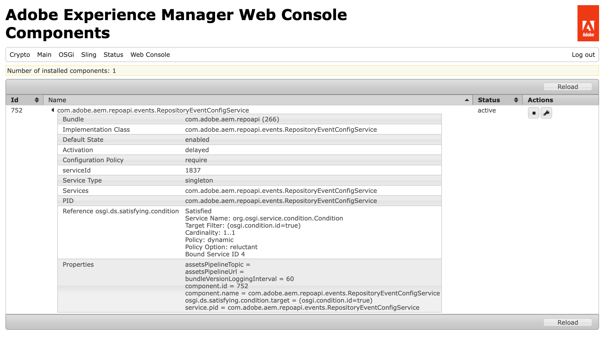

# Web コンソール {#web-console}

Adobe Experience Manager（AEM） Web コンソールを使用して、ローカル開発用のOSGi設定とバンドルを管理する方法を説明します。

## 概要 {#overview}

AEM as a Cloud Serviceは[設定とコードを実行時に不変として扱います。](/help/release-notes/aem-cloud-changes.md#apps-libs-immutable) つまり、すべての設定は、実稼動環境でコーディングする場合と同じようにデプロイする必要があります。 実稼動インスタンスの場合、品質ゲートが渡され、現在の環境の安定性と明瞭性が確保されます。

ただし、ローカル開発をテストするには、多くの場合、アドホック [OSGi設定](/help/implementing/deploying/configuring-osgi.md)の更新とバンドルの変更が必要です。 [AEM as a Cloud Service SDKの一部として、](/help/implementing/developing/introduction/aem-as-a-cloud-service-sdk.md)Web コンソールでは、そのようなリアルタイム更新が有効になります。

AEM as a Cloud Serviceがローカルで実行されている場合は、`http://<host>:<port>/system/console`からコンソールにアクセスできます。

Web コンソールには、次のようなOSGi バンドルを管理するための画面とオプションが用意されています。

* [Configuration](#configuration): OSGi バンドルを設定するため、これはAEM システム パラメーターを設定するための基盤となるメカニズムです
* [ バンドル ](#bundles): バンドルのインストール用
* [ コンポーネント ](#components): AEMに必要なコンポーネントのステータスを制御する場合
* [OSGi設定の生成](#generating-osgi-configurations): OSGi設定をJSONとして自動的に生成する場合

実行された変更は、実行中のSDKにすぐに適用されます。 再起動は不要です。

Web コンソールでは、デフォルト設定に関する説明はすべてSlingのデフォルトに関連しています。 AEMには独自のデフォルトが設定されているため、デフォルト設定はコンソールで文書化されているものと異なる場合があります。

Adobe Experience Manager（AEM）のWeb コンソールは、[Apache Felix Web Management Consoleに基づいています。](https://felix.apache.org/documentation/subprojects/apache-felix-web-console.html) Apache Felix は、OSGi R4 サービスプラットフォームを実装するためのコミュニティによる取り組みです。このプラットフォームには、OSGi フレームワークと標準サービスが含まれています。

>[!NOTE]
>
>Web コンソールは、ローカル開発目的でAEM as a Cloud Service SDKでのみ使用できます。 本番環境では利用できません。

>[!TIP]
>
>実稼動環境のOSGi設定、バンドル、コンポーネントのステータスを確認するには、[Developer Consoleを使用します。](/help/implementing/developing/introduction/aem-developer-console.md)

## 設定 {#configuration}

**Configuration**&#x200B;画面は、OSGi バンドルの設定に使用されるため、AEM システムパラメーターの設定の基盤となるメカニズムです。 「**設定**」タブにアクセスするには、次のいずれかを使用します。

* ドロップダウンメニュー：**OSGi ->設定**
* URL：`http://<host>:<port>/system/console/configMgr`

設定のリストは以下のように表示されます。

この画面のリストから使用可能な設定には、次の2種類があります。

* **設定**&#x200B;を使用すると、既存の設定を更新できます。 これらは永続的ID （PID）を持ち、次のいずれかを行うことができます。
   * AEMに標準および積分 – これらは必須です。削除すると、値はデフォルト設定に戻ります。
   * ファクトリ設定から作成されたインスタンス – これらのインスタンスはユーザーによって作成され、削除によってインスタンスが削除されます。
* **ファクトリ設定**&#x200B;を使用すると、必要な機能オブジェクトのインスタンスを作成できます。 これは永続IDに割り当てられ、設定リストにリストされます。

リストからエントリを選択すると、その設定に関連するパラメーターが表示されます。

必要に応じて、パラメーターを更新し、次の処理をすることができます。

* **保存**&#x200B;して、変更を保存します。
   * ファクトリ設定の場合、永続的なIDを持つインスタンスが作成されます。
   * 新規インスタンスが「設定」の下に表示されます。
* **リセット**&#x200B;して、画面に表示されているパラメーターを最後に保存されたパラメーターにリセットします。
* 現在の設定を削除するには、**削除**&#x200B;してください。
   * 標準の場合は、パラメーターがデフォルト設定に戻ります。
   * ファクトリ設定から作成された場合、特定のインスタンスは削除されます。
* **現在の設定をバンドルからバインド解除するには、**&#x200B;をバインド解除します。
* 現在の変更をキャンセルするには、**キャンセル**&#x200B;してください。

>[!TIP]
>
>OSGi設定について詳しくは、[Adobe Experience Manager as a Cloud Service用OSGiの設定](/help/implementing/deploying/configuring-osgi.md)を参照してください。

## バンドル {#bundles}

**バンドル**&#x200B;画面は、AEMに必要なOSGi バンドルのインストールに使用されます。 画面には、次のいずれかの方法でアクセスします。

* ドロップダウンメニュー：**OSGi -> バンドル**
* URL：`http://<host>:<port>/system/console/bundles`

バンドルのリストは次のように表示されます。

この画面を使用すると、次のことが可能になります。

* **新しいバンドルをインストールするか、既存のバンドルを更新するには、**&#x200B;をインストールまたは更新します。
   * バンドルを格納するファイルを&#x200B;**参照**&#x200B;して特定し、すぐに&#x200B;**開始**&#x200B;するかどうか、および&#x200B;**開始レベル**&#x200B;を指定できます。
* **再読み込み**&#x200B;して、表示されたリストを更新します。
* **パッケージを更新**&#x200B;して、すべてのパッケージの参照を確認し、必要に応じて更新します。
   * 例えば、更新後に、以前の参照が原因で古いバージョンと新しいバージョンの両方が引き続き実行される場合があります。 このオプションでは、すべての参照を確認して新しいバージョンに移動し、古いバージョンを停止できるようにします。
* 指定された開始レベルに従ってバンドルを開始するには、**開始**&#x200B;してください。
* バンドルを停止するには、**停止**&#x200B;してください。
* **アンインストール**&#x200B;して、バンドルをシステムからアンインストールします。

リストは、バンドルのステータスを指定します。 「詳細を表示」を含む特定のバンドルの名前をクリックします。

>[!TIP]
>
>**更新**&#x200B;の後、Adobeでは、**パッケージの更新**&#x200B;をクリックすることをお勧めします。

## コンポーネント {#components}

**コンポーネント**&#x200B;画面では、コンポーネントを有効または無効にできます。 次のいずれかの方法でアクセスできます。

* ドロップダウンメニュー：**メイン -> コンポーネント**
* URL：`http://<host>:<port>/system/console/components`

コンポーネントのリストが表示されます。 各行にアイコンを使用して、特定のコンポーネントの設定の詳細を有効、無効、または（適切な場合は）開くことができます。

特定のコンポーネントの名前をクリックして、そのステータスに関する詳細情報を表示します。 ここでは、コンポーネントを有効または無効にしたり、再読み込みしたりすることもできます。

>[!NOTE]
>
>コンポーネントの有効化または無効化は、SDKが再起動するまで適用されます。
>
>開始状態はコンポーネントの記述子内で定義されます。この記述子は開発時に生成され、バンドルの作成時にバンドルに格納されます。

## OSGi設定の生成 {#generating-osgi-configs}

Web コンソールを使用して、OSGi コンポーネントを設定し、OSGi設定をJSONとして書き出すことができます。 これは、AEM プロジェクトでOSGi設定を定義する際に、OSGi プロパティと値フォーマットが不明なAEM提供のOSGi コンポーネントを設定する場合に便利です。

詳しくは、[Adobe Experience Manager as a Cloud Service用OSGiの設定](/help/implementing/deploying/configuring-osgi.md#generating-osgi-configurations-using-the-web-console)を参照してください。
