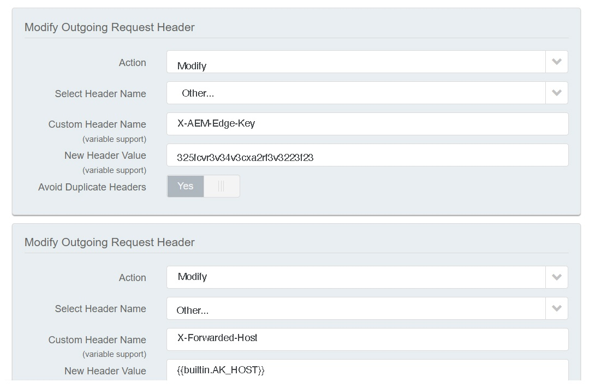

# AEM as a Cloud Service での CDN {#cdn}

>[!CONTEXTUALHELP]
>id="aemcloud_golive_cdn"
>title="AEM as a Cloud Service での CDN"
>abstract="AEM as Cloud Service の出荷時には、ビルトインの CDN が搭載されています。その主な目的は、ブラウザーの近くの CDN エッジノードからキャッシュ可能なコンテンツを配信することで、待ち時間を減らすことです。AEM アプリケーションの最適なパフォーマンスを得るために、完全に管理および設定されています。"

AEM as a Cloud Service には統合 CDN が付属しており、ユーザーのブラウザーに近いエッジノードからキャッシュ可能なコンテンツを配信することで、待ち時間を減らすように設計されています。この完全に管理された CDN は、AEM アプリケーションのパフォーマンスに合わせて最適化されています。

AEM の管理による CDN は、ほとんどの顧客のパフォーマンスとセキュリティのニーズを満たします。パブリッシュ層では、顧客は独自の CDN を通じてトラフィックをルーティングすることを選択できますが、これは顧客が管理する必要があります。このオプションは、特に顧客が CDN プロバイダーとの既存のレガシー統合を持ち、交換するのが困難な場合に、ケースバイケースで使用できます。

Edge Delivery Services 層への公開を検討している顧客は、アドビの管理による CDN を活用できます。詳しくは、[アドビが管理する CDN](#aem-managed-cdn) を参照してください。<!-- CQDOC-21758, 5b -->


<!-- ERROR: NEITHER URL IS FOUND (HTTP ERROR 404) Also, see the following videos [Cloud 5 AEM CDN Part 1](https://experienceleague.adobe.com/docs/experience-manager-learn/cloud-service/cloud-5/cloud5-aem-cdn-part1.html) and [Cloud 5 AEM CDN Part 2](https://experienceleague.adobe.com/docs/experience-manager-learn/cloud-service/cloud-5/cloud5-aem-cdn-part2.html) for additional information about CDN in AEM as a Cloud Service. -->

## アドビが管理する CDN {#aem-managed-cdn}

<!-- CQDOC-21758, 5a -->

Cloud Manager のセルフサービス UI を通じて AEM のビルトインの CDN を使用してコンテンツ配信の準備をするには、アドビの管理による CDN 機能を活用できます。この機能を使用すると、DV（ドメイン検証）証明書や EV／OV（拡張／組織検証）証明書などの SSL 証明書の設定とインストールを含む、セルフサービス CDN 管理を処理できます。これらの方法について詳しくは、次を参照してください。

* [Cloud Manager の Edge Delivery Services](/help/implementing/cloud-manager/edge-delivery/introduction-to-edge-delivery-services.md)
* [カスタムドメイン名の概要](/help/implementing/cloud-manager/custom-domain-names/introduction.md)
* [SSL 証明書の概要](/help/implementing/cloud-manager/managing-ssl-certifications/introduction-to-ssl-certificates.md)
* [CDN の設定](/help/implementing/cloud-manager/domain-mappings/add-domain-mapping.md)

**トラフィックの制限**

デフォルトでは、AEM の管理による CDN 設定の場合、実稼動環境と実稼動以外（開発およびステージング）の環境の両方で、すべてのパブリックトラフィックがパブリッシュサービスに到達できます。Cloud Manager ユーザーインターフェイスを使用して、特定の環境のパブリッシュサービスへのトラフィックを制限できます（IP アドレスの範囲でステージングを制限するなど）。

詳しくは、[IP 許可リストの管理](/help/implementing/cloud-manager/ip-allow-lists/introduction.md)を参照してください。

>[!CAUTION]
>
>AEM の管理による CDN では、許可された IP からのリクエストのみを提供します。独自の CDN に AEM の管理による CDN を参照させる場合は、CDN の IP が IP 許可リストに含まれていることを確認してください。

### CDN でのトラフィックの設定 {#cdn-configuring-cloud}

CDN でのトラフィックは、次のような様々な方法で設定できます。

* [トラフィックフィルタールール](/help/security/traffic-filter-rules-including-waf.md)（オプションでライセンス可能な高度な WAF ルールを含む）による悪意のあるトラフィックのブロック
* [リクエストと応答](/help/implementing/dispatcher/cdn-configuring-traffic.md#request-transformations)の特性の変更
* 301/302 [クライアントサイドのリダイレクト](/help/implementing/dispatcher/cdn-configuring-traffic.md#client-side-redirectors)の適用
* AEM 以外のバックエンドへのリクエストをリバースプロキシするための[接触チャネルセレクター](/help/implementing/dispatcher/cdn-configuring-traffic.md#client-side-redirectors)の宣言

これらの機能を設定するには、Git の YAML ファイルを使用します。また、これらをデプロイするには、Cloud Manager [設定パイプライン](/help/implementing/dispatcher/cdn-configuring-traffic.md)を使用します。

### CDN エラーページの設定 {#cdn-error-pages}

CDN エラーページを設定すると、デフォルトのブランド化されていないページを置き換えることができます。このカスタムページは、AEM が使用できないというまれなイベントの場合に表示されます。詳しくは、[CDN エラーページの設定](/help/implementing/dispatcher/cdn-error-pages.md)を参照してください。

### CDN でのキャッシュされたコンテンツのパージ {#purge-cdn}

HTTP キャッシュ制御ヘッダーを使用した TTL の設定は、コンテンツ配信のパフォーマンスとコンテンツの鮮度のバランスを取る効果的なアプローチです。ただし、更新されたコンテンツを直ちに提供することが重要なシナリオでは、CDN キャッシュを直接パージすると有益な場合があります。

詳しくは、[パージ API トークンの設定](/help/implementing/dispatcher/cdn-credentials-authentication.md#purge-API-token)と[キャッシュされた CDN コンテンツのパージ](/help/implementing/dispatcher/cdn-cache-purge.md)を参照してください。

### CDN での基本認証 {#basic-auth}

ビジネス関係者がコンテンツのレビューを行うなどの簡単な認証ユースケースの場合は、ユーザー名とパスワードを必要とする基本認証ダイアログを表示して、コンテンツを保護します。[詳細情報](/help/implementing/dispatcher/cdn-credentials-authentication.md)。

## 顧客管理 CDN での AEM の管理による CDN への参照 {#point-to-point-CDN}

>[!CONTEXTUALHELP]
>id="aemcloud_golive_byocdn"
>title="顧客 CDN（またはプロキシ）での AEM の管理による CDN への参照"
>abstract="AEM as a Cloud Service では、顧客が既存の CDN を使用するためのオプションを提供しています。顧客は、オプションで、独自の CDN から公開層を参照することもできますが、その場合は自社で管理する必要があります。このシナリオは、放棄が困難な CDN ベンダーとのレガシー統合を保有する顧客など（ただし、これに限定されない）、特定の前提条件を満たしていることに基づき、ケースバイケースで使用できます。"

顧客が既存の CDN（またはロードバランサーや WAF などの任意の種類のリバースプロキシ）を使用する必要がある場合は、以下の条件を満たしていれば、この CDN を管理し、AEM が管理する CDN を参照できます。

* 顧客が、交換するのに手間がかかる既存の CDN を保有している必要がある。
* 顧客が、この CDN を管理する必要がある。
* 顧客が、CDN を AEM as a Cloud Service と連携するように設定できる必要がある。詳しくは、以下に示す設定手順を参照してください。
* 顧客が、関連する問題が発生する事態に備えて、すぐに対応できるエンジニアリング CDN エキスパートを必要とする。
* 顧客が、実稼動環境に移行する前に負荷テストを実行し、合格する必要がある。

設定手順：

1. お使いの CDN が Adobe CDN のイングレスを元のドメインとして指すようにします。例：`publish-p<PROGRAM_ID>-e<ENV-ID>.adobeaemcloud.com`
1. SNI をAdobe CDN の入力に設定する。
1. ホストヘッダーを接触チャネルドメインに設定します（例：`Host:publish-p<PROGRAM_ID>-e<ENV-ID>.adobeaemcloud.com`）。
1. AEM がホストヘッダーを決定できるように、`X-Forwarded-Host` ヘッダーにドメイン名を設定します（例：`X-Forwarded-Host:example.com`）。
1. `X-AEM-Edge-Key` を設定します。この値は、[この記事](/help/implementing/dispatcher/cdn-credentials-authentication.md#CDN-HTTP-value)の説明に従って、Cloud Manager 設定パイプラインを使用して設定する必要があります。

   * これは、Adobe CDN でリクエストのソースを検証し、`X-Forwarded-*` ヘッダーを AEM アプリケーションに渡すために必要です。例えば、`X-Forwarded-For` を使用してクライアント IP を決定します。したがって、`X-Forwarded-*` ヘッダーが正しいことを確認するのは、信頼できる呼び出し元（顧客管理 CDN）の責任となります（以下のメモを参照）。
   * 必要に応じて、`X-AEM-Edge-Key` が存在しない場合に Adobe CDN の入口へのアクセスをブロックできます。Adobe CDN の入力に直接アクセスする必要がある場合（ブロックする場合）は、アドビにお知らせください。

主要な CDN ベンダーの設定例については、[CDN ベンダー設定のサンプル](#sample-configurations)の節を参照してください。

ライブトラフィックを受け入れる前に、アドビカスタマーサポートに問い合わせて、エンドツーエンドのトラフィックルーティングが正しく機能していることを検証してください。

`X-AEM-Edge-Key` を設定後、リクエストが正しくルーティングされているかどうかを、次のようにテストできます。

Linux® の場合：

```
curl https://publish-p<PROGRAM_ID>-e<ENV-ID>.adobeaemcloud.com -H "X-Forwarded-Host: example.com" -H "X-AEM-Edge-Key: <PROVIDED_EDGE_KEY>"
```

Windows の場合：

```
curl https://publish-p<PROGRAM_ID>-e<ENV-ID>.adobeaemcloud.com --header "X-Forwarded-Host: example.com" --header "X-AEM-Edge-Key: <PROVIDED_EDGE_KEY>"
```

>[!NOTE]
>
>なお、独自の CDN を使用する場合、Cloud Manager にドメインと証明書をインストールする必要はありません。Adobe CDN でのルーティングは、リクエスト `Host` ヘッダーで送信されるデフォルトのドメイン `publish-p<PROGRAM_ID>-e<ENV-ID>.adobeaemcloud.com` を使用して行われます。リクエスト `Host` ヘッダーをカスタムドメイン名で上書きすると、リクエストが Adobe CDN 経由で誤ってルーティングされたり、421 エラーが発生したりする可能性があります。

>[!NOTE]
>
>独自の CDN を管理している場合は、AEM CDN 経由で送信されるヘッダーの整合性を確保する必要があります。例えば、すべての `X-Forwarded-*` ヘッダーを消去し、既知の値と制御値に設定することをお勧めします。例えば、`X-Forwarded-For` にはクライアントの IP アドレスを含め、`X-Forwarded-Host` にはサイトのホストを含める必要があります。

>[!NOTE]
>
>サンドボックスプログラム環境では、顧客が提供する CDN はサポートされません。

顧客 CDN と AEM CDN の間の追加ホップは、キャッシュミスがあった場合にのみ必要になります。この記事で説明しているキャッシュ最適化戦略を使用すると、顧客 CDN を追加した場合でも、無視できるほどわずかな待ち時間しか発生しません。

この顧客 CDN 設定は、パブリッシュ層とプレビュー層でサポートされていますが、オーサー層の前ではサポートされていません。

### 設定のデバッグ

BYOCDN 設定をデバッグするには、`edge=true` の値を持つ `x-aem-debug` ヘッダーを使用します。例：

Linux® の場合：

```
curl https://publish-p<PROGRAM_ID>-e<ENV-ID>.adobeaemcloud.com -v -H "X-Forwarded-Host: example.com" -H "X-AEM-Edge-Key: <PROVIDED_EDGE_KEY>" -H "x-aem-debug: edge=true"
```

Windows の場合：

```
curl https://publish-p<PROGRAM_ID>-e<ENV-ID>.adobeaemcloud.com -v --header "X-Forwarded-Host: example.com" --header "X-AEM-Edge-Key: <PROVIDED_EDGE_KEY>" --header "x-aem-debug: edge=true"
```

このプロセスにより、リクエストで使用される特定のプロパティが `x-aem-debug` 応答ヘッダーに反映されます。例：

```
x-aem-debug: byocdn=true,edge=true,edge-auth=edge-auth,edge-key=edgeKey1,X-AEM-Edge-Key=set,host=publish-p87058-e257304-cmstg.adobeaemcloud.com,x-forwarded-host=wknd.site,adobe_unlocked_byocdn=true
```

このプロセスにより、ホスト値、エッジ認証設定、x-forwarded-host ヘッダー値などの詳細を検証できます。また、エッジキーが設定されているかどうか、一致が存在する場合に使用されるキーも識別します。

>[!NOTE]
>
>迅速な開発環境（RDE）を使用して、設定をデプロイおよびテストできます。
>
>* [&#x200B; 迅速な開発環境 &#x200B;](/help/implementing/developing/introduction/rapid-development-environments.md)
>* [&#x200B; 迅速な開発環境の使用方法 &#x200B;](https://experienceleague.adobe.com/en/docs/experience-manager-learn/cloud-service/developing/rde/how-to-use#deploy-configuration-yaml-files)

### CDN ベンダー設定のサンプル {#sample-configurations}

いくつかの主要な CDN ベンダーの設定例を以下に示します。

#### **Akamai** {#byocdn-akamai}




#### **Amazon CloudFront** {#byocdn-cloudfront}


#### **Cloudflare** {#byocdn-cloudflare}


### 一般的なエラー {#common-errors}

提供されるサンプル設定は、必要な基本設定を示しています。ただし、顧客設定には、AEM as a Cloud Service がトラフィックに対応するのに必要なヘッダーを削除、編集、再配置する、その他の影響を及ぼすルールが含まれている場合があります。AEM as a Cloud Service を指すように顧客管理 CDN を設定する際に発生する、一般的なエラーを以下に示します。

**パブリッシュサービスエンドポイントへのリダイレクト**

リクエストが 403 forbidden 応答を受け取った場合、リクエストに必要なヘッダーの一部が欠落していることを意味します。よくある原因は、CDN が apex と `www` ドメインの両方のトラフィックを管理しているものの、`www` ドメインに適したヘッダーを追加していないことです。この問題は、AEM as a Cloud Service CDN ログを確認し、必要なリクエストヘッダーを確認することで、トリアージすることができます。

**エラー 421 誤ったリダイレクト**

`Requested host does not match any Subject Alternative Names (SANs) on TLS certificate` というメッセージを含む 421 エラーは、HTTP `Host` が証明書にリストされているどのホストとも一致しないことを示します。この問題は通常、`Host` または SNI の設定のいずれかが間違っていることを示します。`Host` と SNI の設定の両方が publish-p&lt;PROGRAM_ID>-e.adobeaemcloud.com ホストを指していることを確認します。

**リダイレクトループが多すぎます**

ページで「リダイレクトが多すぎます」ループが発生すると、ページを強制的にページ自体に戻すリダイレクトに一致する一部のリクエストヘッダーが CDN に追加されます。例：

* CDN ルールは、apex ドメインまたは www ドメインのいずれかに一致するように作成され、apex ドメインの X-Forwarded-Host ヘッダーのみが追加されます。
* apex ドメインのリクエストはこの CDN ルールに一致し、apex ドメインを X-Forwarded-Host ヘッダーとして追加します。
* リダイレクトが apex ドメイン（例：^example.com）のホストヘッダーと明示的に一致する接触チャネルにリクエストが送信されます。
* 書き換えルールがトリガーされ、apex ドメインのリクエストが www サブドメインを含む https に書き換えられます。
* その後、このリダイレクトは顧客のエッジに送信され、CDN ルールが再度トリガーされ、www サブドメインではなく apex ドメインの X-Forwarded-Host ヘッダーが再度追加されます。その後、リクエストが失敗するまでプロセスが再度開始されます。

この問題を解決するには、SSL リダイレクト戦略、CDN ルール、リダイレクトおよび書き換えルールの組み合わせを評価します。

## 位置情報ヘッダー {#geo-headers}

AEM が管理する CDN は、次の情報を含む各リクエストにヘッダーを追加します。

* 国コード：`x-aem-client-country`
* 大陸コード：`x-aem-client-continent`

>[!NOTE]
>
>顧客管理 CDN がある場合、これらのヘッダーは、実際のクライアントではなく、顧客の CDN プロキシサーバーの場所を反映します。顧客管理 CDN を使用する場合、顧客は独自の CDN を通じて位置情報ヘッダーを管理する必要があります。

国コードの値は、[ISO 3166-1](https://ja.wikipedia.org/wiki/ISO_3166-1) で説明されている Alpha-2 コードです。

大陸コードの値は次のとおりです。

* AF - アフリカ
* AN - 南極大陸
* AS - アジア
* EU - ヨーロッパ
* NA - 北米
* OC - オセアニア
* SA - 中南米

この情報は、リクエストの送信元の国に基づいて別の URL にリダイレクトする場合に役立ちます。地理情報に依存するキャッシュ応答には、Vary ヘッダーを使用します。例えば、特定の国のランディングページにリダイレクトする場合は、常に `Vary: x-aem-client-country` を含める必要があります。必要に応じて、`Cache-Control: private` を使用してキャッシュを防ぐことができます。「[キャッシュ](/help/implementing/dispatcher/caching.md#html-text)」も参照してください。
