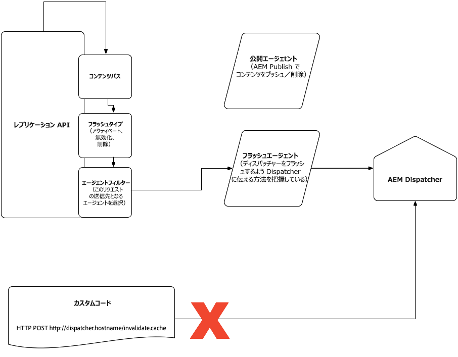

# AEM as a Cloud Service のコンテンツ配信 {#content-delivery}

このページは、AEM as a Cloud Service のパブリッシュサービスコンテンツ配信の詳細です。パブリッシュサービスコンテンツ配信には、次のものが含まれます。

* CDN（通常はアドビが管理）
* AEM Dispatcher
* AEM パブリッシュ

データフローは次のとおりです。

1. URL がブラウザーに追加される
1. そのドメインへの DNS にマッピングされた CDN に対してリクエストがおこなわれる
1. コンテンツが CDN 上で完全にキャッシュされている場合、CDN はコンテンツをブラウザーに提供する
1. コンテンツが完全にキャッシュされていない場合、CDN は Dispatcher を呼び出す（リバースプロキシ）
1. コンテンツが Dispatcher 上で完全にキャッシュされている場合、Dispatcher はそのコンテンツを CDN に提供する
1. コンテンツが完全にキャッシュされていない場合、Dispatcher は AEM パブリッシュを呼び出す（リバースプロキシ）
1. コンテンツはブラウザーによってレンダリングされ、ヘッダーに応じてキャッシュされる場合もあります

コンテンツタイプ HTML/text は、Dispatcher レイヤーで 300 秒（5 分）後に期限切れになるように設定されます。この期限は、Dispatcher キャッシュと CDN の両方が考慮するしきい値です。パブリッシュサービスの再デプロイメント中に、Dispatcher のキャッシュがクリアされ、その後、新しいパブリッシュノードがトラフィックを受け入れる前にウォームアップされます。

以下の節では、CDN の設定やキャッシュを含む、コンテンツ配信に関する詳細を説明します。

オーサーサービスからパブリッシュサービスへのレプリケーションに関する情報は、[こちら](/help/operations/replication.md)を参照してください。

## CDN {#cdn}

AEM as Cloud Service は、組み込みの CDN で出荷されます。その主な目的は、ブラウザーの近くの CDN エッジノードからキャッシュ可能なコンテンツを配信することで、待ち時間を減らすことです。AEM アプリケーションの最適なパフォーマンスを得るために、完全に管理および設定されています。

AEM は全部で 2 つのオプションを提供します。

1. AEM 管理による CDN - AEM で標準提供される CDN。これは緊密に統合されたオプションで、AEM との CDN 統合をサポートするために、顧客が大量に投資する必要はありません。
1. 顧客管理による CDN で AEM 管理による CDN を指す - 独自の CDN で AEM の標準 CDN を指します。顧客は引き続き独自の CDN を管理する必要がありますが、AEM との統合への投資は適度になります。

最初のオプションは、顧客のパフォーマンスとセキュリティ要件のほとんどを満たす必要があります。さらに、お客様の作業を最小限に抑える必要があります。

2 つ目のオプションは、ケースバイケースで許可されます。その判断は、放棄が困難な CDN ベンダーとのレガシーな統合を保有する顧客をはじめとする、特定の前提条件（ただし、これに限定されない）を満たすことに基づいておこなわれます。

以下に、2 つのオプションを比較するための決定マトリックスを示します。詳しくは、以降の節を参照してください。

| 詳細 | AEM 管理による CDN | 顧客管理による CDN で AEM CDN を指す |
|---|---|---|
| **顧客の取り組み** | なし、完全に統合。CNAME で AEM 管理による CDN を指す必要があるのみ。 | 適度な顧客投資。顧客は独自の CDN を管理する必要がある。 |
| **前提条件** | なし | 既存の CDN を置き換えるのに負担がかかる。運用を開始する前に、負荷テストの成功を示す必要がある。 |
| **CDN の専門知識** | なし | CDN の詳細な知識を持ち、顧客の CDN を設定できるパートタイムエンジニアリングリソースが 1 人以上必要。 |
| **セキュリティ** | アドビが管理。 | アドビが管理（またオプションで、顧客による独自 CDN の管理）。 |
| **パフォーマンス** | アドビが最適化。 | 一部の AEM CDN 機能のメリットが得られるが、追加のホップが原因でパフォーマンスが低下する可能性がある。**注意**：顧客 CDN からアドビの標準搭載 CDN へのホップが効率的になる可能性がある。 |
| **キャッシュ** | Dispatcher で適用されるキャッシュヘッダーをサポート。 | Dispatcher で適用されるキャッシュヘッダーをサポート。 |
| **画像およびビデオ圧縮機能** | Adobe Dynamic Media と連携可能。 | Adobe Dynamic Media または顧客が管理する CDN 画像／ビデオソリューションと連携可能。 |

### AEM 管理による CDN {#aem-managed-cdn}

アドビの標準搭載 CDN を使用してコンテンツ配信を準備する方法は簡単です。以下に説明します。

1. この情報を含む安全なフォームへのリンクを共有することで、署名済みの SSL 証明書と秘密鍵をアドビに提供します。このタスクについてカスタマーサポートと調整してください。
   **注意：** AEM as a Cloud Service は、ドメイン検証（DV）証明書をサポートしていません。
1. カスタマーサポートに次の情報を伝える必要があります。
   * どのカスタムドメインを特定の環境に関連付けるか（プログラム ID と環境 ID で定義）。
   * トラフィックを特定の環境に制限するために IP ホワイトリストが必要な場合。
1. カスタマーサポートは、CNAME DNS レコードのタイミングを調整し、FQDN で `cdn.adobeaemcloud.com` を指します。
1. SSL 証明書の有効期限が切れると、新しい SSL 証明書を再送信できるように通知されます。

**トラフィックの制限**

デフォルトでは、アドビが管理する CDN のセットアップの場合、すべてのパブリックトラフィックは、実稼動版と非実稼動版（開発およびステージング）環境の両方で、パブリックサービスに到達できます。特定の環境のパブリッシュサービスへのトラフィックを制限する場合（IP アドレスの範囲でステージングを制限する場合など）、カスタマーサポートと協力してこれらの制限を設定する必要があります。

### 顧客 CDN で AEM 管理 CDN を指す {#point-to-point-CDN}

既存の CDN を使用したいが、顧客が管理する CDN の要件を満たしていない場合にサポートされます。この場合、顧客は独自の CDN を管理しますが、アドビの管理 CDN を指します。

次の点に注意してください。

1. 既存の CDN があること。
1. それを管理すること。
1. CDN を AEM as a Cloud Service と連携するように設定できる必要があります。設定手順を以下に示します。
1. 関連する問題が発生する事態に備えて、エンジニアリング CDN エキスパートを待機させておく必要があります。
1. 実稼動環境に移行する前に、負荷テストを実行し、成功させる必要があります。

設定手順：

1. `X-Forwarded-Host` ヘッダーをドメイン名で設定します。
1. ホストヘッダーを接触チャネルドメインに設定します（アドビの CDN の侵入）。この値はアドビから取得されます。
1. SNI ヘッダーを接触チャネルに送信します。ホストヘッダーと同様に、sni ヘッダーはドメイン接触チャネルです。
1. トラフィックを AEM サーバーに正しくルーティングするために必要な `X-Edge-Key` を設定します。この値はアドビから取得されます。

ライブトラフィックを受け入れる前に、アドビカスタマーサポートに問い合わせて、エンドツーエンドのトラフィックルーティングが正しく機能していることを検証する必要があります。

## キャッシュ {#caching}

CDN でのキャッシュは、Dispatcher ルールを使用して設定できます。Dispatcher の設定で `enableTTL` が有効な場合、Dispatcher は、結果として生成されるキャッシュの有効期限のヘッダーも順守します。これは、再公開されるコンテンツの外部でも特定のコンテンツが更新されることを意味します。

### HTML/Text {#html-text}

* デフォルトでは、Apache レイヤーによって生成されるキャッシュ制御ヘッダーに基づいて、ブラウザーによって 5 分間キャッシュされます。CDN はこの値も順守します。
* AEM as a Cloud Service の SDK Dispatcher ツールを使用して、`global.vars` の `EXPIRATION_TIME` 変数を定義することにより、すべての HTML/Text コンテンツに対して上書きできます。
* 次の apache mod_headers ディレクティブを使用して、より詳細なレベルで上書きできます。

```
<LocationMatch "\.(html)$">
        Header set Cache-Control "max-age=200"
</LocationMatch>
```

`src/conf.dispatcher.d/cache` の下のファイルに次のルール（デフォルト設定）があることを確認する必要があります。

```
/0000
{ /glob "*" /type "allow" }
```

* [dispatcher-ttl AEM ACS Commons プロジェクト](https://adobe-consulting-services.github.io/acs-aem-commons/features/dispatcher-ttl/)を含む他のメソッドでは、値は上書きされません。

### クライアントサイドライブラリ（js、css） {#client-side-libraries}

* AEM のクライアントサイドライブラリフレームワークを使用すると、変更が新しいファイルとして一意のパスで表示されるので、JavaScript と CSS コードは、ブラウザーで無期限にキャッシュできるように生成されます。つまり、クライアントライブラリを参照する HTML は必要に応じて作成されるので、顧客は公開時に新しいコンテンツを体験できます。「immutable」値を考慮しない古いブラウザーでは、cache-control は「immutable」または 30 日に設定されます。
* 詳しくは、[クライアントサイドライブラリとバージョンの整合性](#content-consistency)を参照してください。

### BLOB ストレージに格納されるほど大きい画像とコンテンツ {#images}

* デフォルトではキャッシュされません。
* 次の Apache `mod_headers` ディレクティブを使用して、より詳細なレベルに設定できます。

```
<LocationMatch "^.*.jpeg$">
    Header set Cache-Control "max-age=222"
</LocationMatch>
```

src/conf.dispatcher.d/cache の下のファイルに、次のルール（デフォルト設定）があることを確認する必要があります。

```
/0000
{ /glob "*" /type "allow" }
```

キャッシュせずに非公開にするアセットが、LocationMatch ディレクティブフィルターの一部ではないことを確認します。

* [dispatcher-ttl AEM ACS Commons プロジェクト](https://adobe-consulting-services.github.io/acs-aem-commons/features/dispatcher-ttl/)を含む他のメソッドでは、値は上書きされません。

### ノードストア内の他のコンテンツファイルタイプ {#other-content}

* デフォルトのキャッシュなし
* HTML／Text ファイルタイプに使用する `EXPIRATION_TIME` 変数はデフォルトに設定できません
* キャッシュの有効期限は、HTML/Text の節で説明したのと同じ LocationMatch 方法で、適切な正規表現を指定することで設定できます

## Dispatcher {#disp}

トラフィックは、Dispatcher を含むモジュールをサポートする Apache Web サーバーを経由します。Dispatcher は、主に、パフォーマンスを向上させるために、パブリッシュノードでの処理を制限するキャッシュとして使用されます。

CDN のキャッシュの節で説明したように、ルールを Dispatcher の設定に適用して、デフォルトのキャッシュ有効期限の設定を変更できます。

この節の残りの部分では、Dispatcher キャッシュの無効化に関する検討事項について説明します。ほとんどの顧客は、Dispatcher のキャッシュを無効にする必要はありません。代わりに、再発行されるコンテンツに応じて Dispatcher がキャッシュを更新し、CDN がキャッシュの有効期限のヘッダーを考慮します。

### アクティベーション／非アクティベーション中の Dispatcher キャッシュの無効化 {#cache-activation-deactivation}

以前のバージョンの AEM と同様に、ページの公開または非公開では、Dispatcher のキャッシュからコンテンツがクリアされます。キャッシュに問題があると疑われる場合は、該当するページを再度公開する必要があります。

パブリッシュインスタンスは、オーサーから新しいバージョンのページまたはアセットを受け取ると、フラッシュエージェントを使用して Dispatcher 上の適切なパスを無効にします。更新されたパスは、親と共に、Dispatcher キャッシュから削除されます（削除されるレベルは [statfilelevel](https://docs.adobe.com/content/help/ja-JP/experience-manager-dispatcher/using/configuring/dispatcher-configuration.html#invalidating-files-by-folder-level) で設定できます）。

### 明示的な Dispatcher キャッシュの無効化 {#explicit-invalidation}

一般に、Dispatcher 内のコンテンツを手動で無効にする必要はありませんが、以下に説明するように、必要に応じて無効にすることができます。

AEM as a Cloud Service 以前は、Dispatcher キャッシュを無効にする方法が 2 通りありました。

1. パブリッシュ Dispatcher のフラッシュエージェントを指定して、レプリケーションエージェントを呼び出す
2. `invalidate.cache` API を直接呼び出す（例：`POST /dispatcher/invalidate.cache`）

Dispatcher の `invalidate.cache` API アプローチは、特定の Dispatcher ノードのみを指すので、今後サポートされなくなります。AEM as a Cloud Service は、個々のノードレベルではなくサービスレベルで動作するので、[AEM からのキャッシュページの無効化](https://docs.adobe.com/content/help/ja-JP/experience-manager-dispatcher/using/configuring/page-invalidate.translate.html)ページで説明されている無効化手順は、AEM as a Cloud Service では無効になります。代わりに、レプリケーションフラッシュエージェントを使用する必要があります。タグの割り当ては、レプリケーション API を使用しておこなえます。レプリケーション API ドキュメントは[ここ](https://helpx.adobe.com/jp/experience-manager/6-5/sites/developing/using/reference-materials/javadoc/com/day/cq/replication/Replicator.html)からご利用ください。また、キャッシュをフラッシュする例については、[API 使用例](https://helpx.adobe.com/jp/experience-manager/using/aem64_replication_api.html)および、特に、使用可能なあらゆるエージェントに対して ACTIVATE タイプのレプリケーションアクションを発行する `CustomStep` の例を参照してください。フラッシュエージェントエンドポイントは設定できませんが、フラッシュエージェントを実行するパブリッシュサービスと一致する Dispatcher を指すように事前設定されています。フラッシュエージェントは、通常、OSGi のエージェントまたはイベントによってトリガーされます。

次に図で示します。



Dispatcher キャッシュがクリアされない問題が発生した場合は、[カスタマーサポート](https://helpx.adobe.com/support.ec.html)にお問い合わせください。必要に応じて Dispatcher キャッシュをフラッシュします。

アドビが管理する CDN は TTL に従うので、フラッシュする必要はありません。問題の疑いがある場合は、[カスタマーサポート](https://helpx.adobe.com/support.ec.html)にお問い合わせください。必要に応じてアドビが管理する CDN キャッシュをフラッシュします。

## クライアントサイドライブラリとバージョンの整合性 {#content-consistency}

ページは、HTML、JavaScript、CSS、画像で構成されます。JS ライブラリ間の依存関係を考慮して、クライアントサイドライブラリ（clientlibs）フレームワークを活用し、JavaScript および CSS リソースを HTML ページに読み込むことをお勧めします。

clientlibs フレームワークは、自動バージョン管理を提供します。つまり、開発者はソース管理で JS ライブラリに対する変更をチェックインでき、最新バージョンは、顧客がリリースをプッシュしたときに利用可能になります。この機能がないと、開発者は新しいバージョンのライブラリを参照して HTML を手動で変更する必要があります。同じライブラリを共有する HTML テンプレートが多い場合は特に負担がかかります。

新しいバージョンのライブラリが実稼動環境にリリースされると、参照する HTML ページは、更新されたライブラリバージョンへの新しいリンクで更新されます。特定の HTML ページのブラウザーキャッシュの有効期限が切れると、（AEM から）更新されたページが新しいバージョンのライブラリを参照することが保証されるので、古いライブラリがブラウザーキャッシュから読み込まれる心配はありません。更新された HTML ページには、最新のライブラリバージョンがすべて含まれます。

このメカニズムはシリアル化されたハッシュで、クライアントライブラリリンクに追加され、ブラウザーが CSS／JS をキャッシュするための一意のバージョン付き URL を確保します。シリアル化されたハッシュは、クライアントライブラリの内容が変更された場合にのみ更新されます。つまり、新しいデプロイメントでも、関係ない更新（クライアントライブラリの基になる CSS／JS の変更はなし）が発生した場合、参照は同じままになるので、ブラウザーのキャッシュの中断が少なくなります。

### クライアントサイドライブラリの Longcache バージョンの有効化 - AEM as a Cloud Service の SDK クイックスタート {#enabling-longcache}

HTML ページにインクルードされるデフォルトの clientlib は、次の例のようになります。

```
<link rel="stylesheet" href="/etc.clientlibs/wkndapp/clientlibs/clientlib-base.css" type="text/css">
```

厳密な clientlib のバージョン管理が有効な場合、クライアントライブラリに長期ハッシュキーがセレクターとして追加されます。その結果、clientlib の参照は次のようになります。

```
<link rel="stylesheet" href="/etc.clientlibs/wkndapp/clientlibs/clientlib-base.lc-7c8c5d228445ff48ab49a8e3c865c562-lc.css" type="text/css">
```

厳密な clientlib のバージョン管理は、すべての AEM as a Cloud Service 環境で、デフォルトで有効になっています。

ローカル SDK クイックスタートで厳密な clientlib のバージョン管理を有効にするには、次の操作を実行します。

1. OSGi Configuration manager `<host>/system/console/configMgr` へ移動する。
1. Adobe Granite HTML Library Manager の OSGi Config を探します。
   * 「厳密なバージョン管理」チェックボックスをオンにして有効にします。
   * 「長期クライアントサイドキャッシュキー」というラベルの付いたフィールドに、値「/.*;hash」を入力します。
1. 変更内容を保存します。AEM as a Cloud Service は、開発、ステージ、実稼動環境でこの設定を自動的に有効にするので、この設定をソース管理に保存する必要はありません。
1. クライアントライブラリのコンテンツが変更されるたびに、新しいハッシュキーが生成され、HTML 参照が更新されます。
