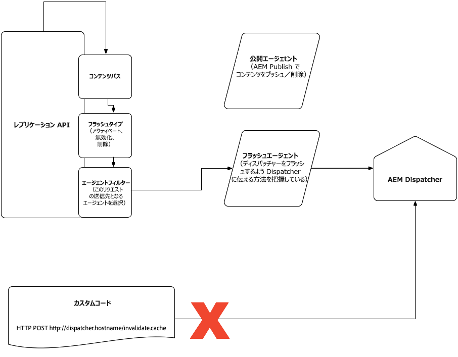

# AEMのクラウドサービスとしてのコンテンツ配信 {#content-delivery}

現在のページの詳細は、AEMのサービスコンテンツ配信をクラウドサービスとして公開します。 Publishサービスのコンテンツ配信には、次のものが含まれます。

* CDN（通常はアドビが管理）
* AEMディスパッチャー
* AEM公開

データフローは次のとおりです。

1. URLがブラウザーに追加されます。
1. そのドメインへの DNS にマッピングされた CDN に対してリクエストがおこなわれる
1. コンテンツが CDN 上で完全にキャッシュされている場合、CDN はコンテンツをブラウザーに提供する
1. コンテンツが完全にキャッシュされていない場合、CDN は Dispatcher を呼び出す（リバースプロキシ）
1. コンテンツが Dispatcher 上で完全にキャッシュされている場合、Dispatcher はそのコンテンツを CDN に提供する
1. コンテンツが完全にキャッシュされていない場合、Dispatcher は AEM パブリッシュを呼び出す（リバースプロキシ）
1. コンテンツはブラウザーによってレンダリングされ、ヘッダーに応じてキャッシュされる場合もあります

コンテンツタイプHTML/textは、ディスパッチャーレイヤーで300秒（5分）後に期限切れになるように設定されます。この期限は、ディスパッチャーキャッシュとCDNの両方が考慮するしきい値です。 発行サービスの再デプロイメント中に、ディスパッチャーのキャッシュがクリアされ、その後、新しい発行ノードがトラフィックを受け入れる前にウォームアップされます。

以下の節では、CDNの設定やキャッシュを含む、コンテンツの配信に関する詳細を説明します。

作成者サービスから発行サービスへの複製に関する情報は、こちらを参照して [ください](/help/operations/replication.md)。

## CDN {#cdn}

AEM asクラウドサービスは、組み込みのCDNで出荷されます。 これは、ブラウザーの近くの端にあるCDNノードからキャッシュ可能なコンテンツを配信することで、遅延を減らすことを主な目的としています。 AEMアプリケーションの最適なパフォーマンスを得るために、完全に管理および設定されています。

合計では、AEMのオファーは次の2つです。

1. AEM管理CDN - AEMの標準搭載CDN。 これは緊密に統合されたオプションで、AEMとのCDN統合をサポートするために、顧客が大量に投資する必要はありません。
1. 顧客管理CDNはAEM管理CDNを指します。顧客は、そのまま使用できるAEMのCDNを自分のCDNで指し示します。 お客様は引き続き独自のCDNを管理する必要がありますが、AEMとの統合への投資は中度です。

最初のオプションは、お客様のパフォーマンスとセキュリティ要件のほとんどを満たす必要があります。 さらに、お客様の作業を最小限に抑えます。

2つ目のオプションは、ケースバイケースで許可されます。 この決定は、放棄が困難なCDNベンダーとのレガシーな統合を持つお客様を含む、特定の前提条件（ただし、これに限定されない）を満たすことに基づいて行われます。

以下に、2つのオプションを比較するための決定マトリックスを示します。 詳しくは、以降の節を参照してください。

| 詳細 | AEM管理CDN | 顧客管理CDNはAEM CDNを指します |
|---|---|---|
| **顧客の努力** | なし、完全に統合されています。 AEMが管理するCDNをCNAMEで指定する必要があるのみです。 | 顧客の投資を中度に抑えます。 お客様は、独自のCDNを管理する必要があります。 |
| **前提条件** | なし | 既存のCDNを置き換える必要がある。 本番運用を開始する前に、ロードテストの成功を示す必要があります。 |
| **CDNの専門知識** | なし | お客様のCDNを設定できるCDNの詳細な知識を持つ、少なくとも1回のパートタイムエンジニアリングリソースが必要です。 |
| **セキュリティ** | アドビが管理. | アドビが管理（およびオプションで、お客様のCDNで管理）。 |
| **パフォーマンス** | アドビが最適化。 | 一部のAEM CDN機能のメリットが得られますが、追加のホップが原因でパフォーマンスが低下する可能性があります。 **注意**:顧客のCDNからFastly CDNへのホップは、効率的な場合が多い)。 |
| **キャッシュ** | ディスパッチャーで適用されるキャッシュヘッダーをサポートします。 | ディスパッチャーで適用されるキャッシュヘッダーをサポートします。 |
| **画像およびビデオ圧縮機能** | Adobe Dynamic Mediaと連携できます。 | Adobe Dynamic Mediaまたはお客様が管理するCDN画像/ビデオソリューションと連携できます。 |

### AEM管理CDN {#aem-managed-cdn}

アドビの標準搭載CDNを使用してコンテンツ配信を準備する方法は簡単です。以下に説明します。

1. この情報を含む安全なフォームへのリンクを共有することで、署名済みのSSL証明書と秘密鍵をアドビに提供します。 このタスクでは
   **注意：** クラウドサービスとしてのAemは、ドメイン検証(DV)証明書をサポートしていません。
1. カスタマーサポートに次の情報を伝える必要があります。
   * どのカスタムドメインを特定の環境に関連付けるか(プログラムIDと環境IDで定義)。
   * トラフィックを特定の環境に制限するためにIPホワイトリストが必要な場合。
1. カスタマーサポートは、CNAME DNSレコードのタイミングを調整し、FQDNを示します `adobe-aem.map.fastly.net`。
1. SSL証明書の有効期限が切れると、新しいSSL証明書を再送信できるように通知されます。

**トラフィックの制限**

アドビが管理するCDNの設定では、デフォルトで、すべてのパブリックトラフィックが、実稼働版と非実稼働版（開発版とステージ版）の両方の環境用に、公開サービスに到達できます。 特定の環境の公開サービスへのトラフィックを制限する場合（IPアドレスの範囲でステージングを制限する場合など）、カスタマーサポートと協力してこれらの制限を設定する必要があります。

### 顧客CDNはAEM管理CDNを指し示します {#point-to-point-CDN}

既存のCDNを使用したいが、顧客が管理するCDNの要件を満たしていない場合にサポートされます。 この場合は、独自のCDNを管理し、アドビの管理対象CDNを参照します。

次の点に注意してください。

1. 既存のCDNが必要です。
1. あなたはそれを管理しなければならない。
1. CDNをクラウドサービスとしてAemと連携するように設定する必要があります。設定手順を以下に示します。
1. 関連する問題が発生した場合は、電話中のエンジニアリングCDNエキスパートが必要です。
1. 実稼働環境に移行する前に、ロードテストを実行し、成功させる必要があります。

設定手順：

1. ヘッダーをド `X-Forwarded-Host` メイン名で設定します。
1. ホストヘッダーを、接触チャネルドメイン（アドビのCDNの入力）に設定します。 この値はAdobeから取得されます。
1. SNIヘッダーを接触チャネルに送信 ホストヘッダーと同様に、sniヘッダーはドメイン接触チャネルです。
1. トラフィック `X-Edge-Key`をAEMサーバーに正しくルーティングするために必要なを設定します。 この値はAdobeから取得されます。

ライブトラフィックを受け入れる前に、アドビカスタマーサポートに問い合わせて、エンドツーエンドのトラフィックルーティングが正しく機能していることを検証する必要があります。

## キャッシング {#caching}

CDNでのキャッシュは、ディスパッチャールールを使用して設定できます。 ディスパッチャーの設定でが有効な場合、ディスパッチャーは、結果として生成されるキャッシュの有効期限のヘッダーも順守します。これは、再発行されるコンテンツの外部でも特定のコンテンツが更新されることを意味します。 `enableTTL`

### HTML/Text {#html-text}

* デフォルトでは、Apacheレイヤーによって生成されるキャッシュ制御ヘッダーに基づいて、ブラウザーによって5分間キャッシュされます。 CDNはこの値も順守します。
* は、AEMをクラウドサービスSDKディスパッチャーツールとして使用して変数を定 `EXPIRATION_TIME` 義することによ `global.vars` り、すべてのHTML/テキストコンテンツに対して上書きできます。

の下のファイルに次の規則が適用されてい `src/conf.dispatcher.d/cache` ることを確認する必要があります。

```
/0000
{ /glob "*" /type "allow" }
```

* は、次のapache mod_headersディレクティブを使用して、より詳細なレベルで上書きできます。

```
<LocationMatch "\.(html)$">
        Header set Cache-Control "max-age=200"
</LocationMatch>
```

の下のファイルに次の規則(デフ `src/conf.dispatcher.d/cache` ォルト設定)があることを確認する必要があります。

```
/0000
{ /glob "*" /type "allow" }
```

* dispatcher-ttl AEM ACS Commonsプロジェクトを含む [他のメソッドは、値を正常に上書きしない](https://adobe-consulting-services.github.io/acs-aem-commons/features/dispatcher-ttl/)ことに注意してください。

### クライアント側ライブラリ(js、css) {#client-side-libraries}

* aemのクライアント側ライブラリフレームワークを使用すると、変更が新しいファイルとして一意のパスで表示されるので、JavaScriptとCSSコードは、ブラウザーで無期限にキャッシュできるように生成されます。  つまり、クライアントライブラリを参照するHTMLが必要に応じて作成され、ユーザーが公開時に新しいコンテンツを体験できるようになります。 「immutable」値を考慮しない古いブラウザーでは、cache-controlは「immutable」または30日に設定されます。
* 詳しくは、クライア [ント側のライブラリとバージョンの整合性](#content-consistency) （英語のみ）を参照してください。

### BLOBストレージに格納される十分な大きさの画像とコンテンツ {#images}

* デフォルトではキャッシュされません
* は、次のApacheディレクティブを使用して、より詳細なレベルに設定で `mod_headers` きます。

```
<LocationMatch "^.*.jpeg$">
    Header set Cache-Control "max-age=222"
</LocationMatch>
```

src/conf.dispatcher.d/cacheの下のファイルに、次のルール（デフォルト設定）が含まれていることを確認する必要があります。

```
/0000
{ /glob "*" /type "allow" }
```

キャッシュされるのではなく非公開にするアセットが、LocationMatchディレクティブフィルターの一部でないことを確認します。

* dispatcher-ttl AEM ACS Commonsプロジェクトを含む [他のメソッドは、値を正常に上書きしない](https://adobe-consulting-services.github.io/acs-aem-commons/features/dispatcher-ttl/)ことに注意してください。

### ノードストア内の他のコンテンツファイルタイプ {#other-content}

* デフォルトのキャッシュなし
* defaultは、HTML/テキストファイルタイプに使 `EXPIRATION_TIME` 用する変数では設定できません
* キャッシュの有効期限は、html/textの節で説明したのと同じLocationMatch方法で、適切な正規表現を指定することで設定できます

## Dispatcher {#disp}

トラフィックは、ディスパッチャーを含むモジュールをサポートするApache Webサーバーを経由します。 ディスパッチャーは、主に、パフォーマンスを向上させるために、パブリッシュノードでの処理を制限するキャッシュとして使用されます。

「CDNのキャッシュ」の節で説明したように、ルールをディスパッチャーの設定に適用して、デフォルトのキャッシュ有効期限の設定を変更できます。

この節の残りの部分では、ディスパッチャーキャッシュの無効化に関する考慮事項について説明します。 ほとんどのお客様は、ディスパッチャーのキャッシュを無効にする必要はありません。代わりに、再発行されるコンテンツに応じてディスパッチャーがキャッシュを更新し、CDNがキャッシュの有効期限のヘッダーを考慮します。

### アクティベーション／非アクティベーション中の Dispatcher キャッシュの無効化 {#cache-activation-deactivation}

以前のバージョンのAEMと同様に、ページの公開または非公開では、ディスパッチャーのキャッシュからコンテンツがクリアされます。 キャッシュの問題の疑いがある場合は、該当するページを再公開する必要があります。

発行インスタンスは、作成者から新しいバージョンのページまたはアセットを受け取ると、フラッシュエージェントを使用してディスパッチャー上の適切なパスを無効にします。 The updated path is removed from the dispatcher cache, together with its parents, up to a level (you can configure this with the [statfileslevel](https://docs.adobe.com/content/help/en/experience-manager-dispatcher/using/configuring/dispatcher-configuration.html#invalidating-files-by-folder-level).

### 明示的な Dispatcher キャッシュの無効化 {#explicit-invalidation}

一般に、ディスパッチャー内のコンテンツを手動で無効にする必要はありませんが、以下に説明するように、必要に応じて無効にすることができます。

AEMをクラウドサービスとして使用する前は、ディスパッチャーキャッシュを無効にする方法が2つありました。

1. 発行ディスパッチャーフラッシュエージェントを指定して、複製エージェントを呼び出します
2. APIを直接呼 `invalidate.cache` び出す(例 `POST /dispatcher/invalidate.cache`:)

The dispatcher&#39;s `invalidate.cache` API approach will no longer be supported since it addresses only a specific dispatcher node. クラウドサービスとしてのAEMは、個々のノードレベルではなくサービスレベルで動作するので、AEMからのキャッシュページの無効化ページの無効化手順は、AEMのクラウドサービスとしての [](https://docs.adobe.com/content/help/en/experience-manager-dispatcher/using/configuring/page-invalidate.html) AEMに対しては無効になります。
代わりに、レプリケーションフラッシュエージェントを使用する必要があります。 これは、レプリケーションAPIを使用して行うことができます。 The Replication API documentation is available [here](https://helpx.adobe.com/experience-manager/6-5/sites/developing/using/reference-materials/javadoc/com/day/cq/replication/Replicator.html) and for an example of flushing the cache, see the [API example page](https://helpx.adobe.com/experience-manager/using/aem64_replication_api.html) specifically the `CustomStep` example issuing a replication action of type ACTIVATE to all available agents. フラッシュエージェントエンドポイントは設定できませんが、フラッシュエージェントを実行する発行サービスと一致する、ディスパッチャーを指すように事前設定されています。 フラッシュエージェントは、通常、OSGiのエージェントまたはイベントによってトリガーされます。

次の図に、この点を示します。



ディスパッチャーキャッシュがクリアされないという問題が発生した場合は、必要に応じてディスパッチャーキャッ [シュをフラッシュできる](https://helpx.adobe.com/support.ec.html) 、カスタマーサポートにお問い合わせください。

アドビが管理するCDNはTTLに従うので、フラッシュする必要はありません。 問題の疑いがある場合は、必要に応じ [てアドビが管理するCDNキャッシュをフラッシュできるカスタマーサポート](https://helpx.adobe.com/support.ec.html) (CDN)にお問い合わせください。

## クライアント側ライブラリとバージョンの整合性 {#content-consistency}

ページは、HTML、JavaScript、CSS、画像で構成されます。 JSライブラリ間の依存関係を考慮し、JavaScriptおよびCSSリソースをHTMLページに読み込むために、クライアント側ライブラリ(clientlibs)フレームワークを利用することをお勧めします。

clientlibsフレームワークは、自動バージョン管理を提供します。つまり、開発者はソース管理でJSライブラリに対する変更をチェックインでき、最新バージョンは、お客様がリリースをプッシュしたときに利用可能になります。 この機能がないと、開発者は新しいバージョンのライブラリを参照して HTML を手動で変更する必要があります。同じライブラリを共有する HTML テンプレートが多い場合は特に負担がかかります。

新しいバージョンのライブラリが実稼動環境にリリースされると、参照する HTML ページは、更新されたライブラリバージョンへの新しいリンクで更新されます。特定の HTML ページのブラウザーキャッシュの有効期限が切れると、（AEM から）更新されたページが新しいバージョンのライブラリを参照することが保証されるので、古いライブラリがブラウザーキャッシュから読み込まれる心配はありません。更新された HTML ページには、最新のライブラリバージョンがすべて含まれます。

このメカニズムはシリアル化されたハッシュで、クライアントライブラリリンクに追加され、ブラウザーがCSS/JSをキャッシュするための一意のバージョン付きURLを確保します。 シリアル化されたハッシュは、クライアントライブラリの内容が変更された場合にのみ更新されます。 つまり、新しいデプロイメントでも、関連しない更新（クライアントライブラリの基になるcss/jsの変更なし）が発生した場合、参照は同じままになり、ブラウザーのキャッシュの中断が少なくなります。

### クライアント側ライブラリのLongcacheバージョンの有効化 — AEMをクラウドサービスSDKクイックスタートとして有効化 {#enabling-longcache}

HTMLページのデフォルトのclientlibインクルードは、次の例のようになります。

```
<link rel="stylesheet" href="/etc.clientlibs/wkndapp/clientlibs/clientlib-base.css" type="text/css">
```

厳密なclientlibのバージョン管理が有効な場合、クライアントライブラリに長期ハッシュキーがセレクターとして追加されます。 その結果、clientlibの参照は次のようになります。

```
<link rel="stylesheet" href="/etc.clientlibs/wkndapp/clientlibs/clientlib-base.lc-7c8c5d228445ff48ab49a8e3c865c562-lc.css" type="text/css">
```

厳密なclientlibのバージョン管理は、すべてのAEMでクラウドサービスのバージョンとしてデフォルトで有効になっています。環境

ローカルSDKクイックスタートで厳密なclientlibのバージョン管理を有効にするには、次の操作を実行します。

1. Navigate to the OSGi Configuration manager `<host>/system/console/configMgr`
1. Adobe Granite HTML Library ManagerのOSGi Configを探します。
   * 「厳密なバージョン管理」を有効にする場合は、チェックボックスをオンにします
   * 「Long term client side cache key」というラベルの付いたフィールドに、/の値を入力します。*；ハッシュ
1. 変更内容を保存します。クラウドサービスとしてのAEMは、開発、ステージ、実稼働環境でこの設定を自動的に有効にするので、この設定をソース管理に保存する必要はありません。
1. クライアントライブラリのコンテンツが変更されるたびに、新しいハッシュキーが生成され、HTML参照が更新されます。
