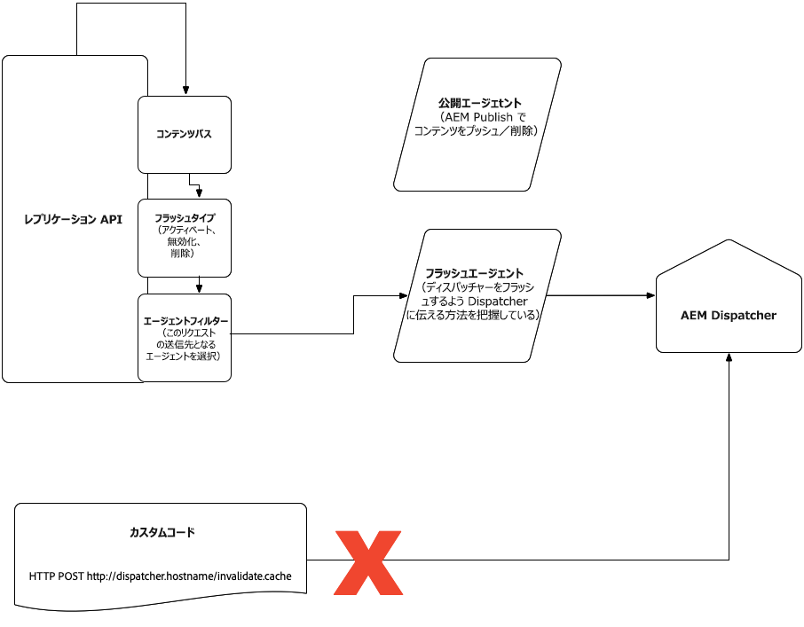

# クラウドのディスパッチャー {#Dispatcher-in-the-cloud}

## Apacheとディスパッチャーの設定とテスト {#apache-and-dispatcher-configuration-and-testing}

この節では、AEMをクラウドサービスのApacheおよびディスパッチャーの設定として構築する方法と、Cloud環境にデプロイする前にローカルで検証および実行する方法について説明します。 また、Cloud環境でのデバッグについても説明します。 ディスパッチャーについて詳しくは、 [AEMディスパッチャーのドキュメントを参照してくださ](https://docs.adobe.com/content/help/en/experience-manager-dispatcher/using/dispatcher.html)い。

>[!NOTE]
>Windowsユーザーは、DockerをサポートするWindows 10 Professionalまたは他のディストリビューションを使用する必要があります。 これは、ローカルコンピューターでディスパッチャーを実行およびデバッグする場合に必要な前提条件です。 以下の節では、MacまたはLinuxバージョンのSDKを使用するコマンドについて説明しますが、Windows SDKも同様の方法で使用できます。

## ディスパッチャーツール {#dispatcher-sdk}

ディスパッチャーツールは、クラウドサービスSDKとしてのAEM全体の一部で、以下を提供します。

* ディスパッチャー用のMavenプロジェクトに含める設定ファイルを含むバニラファイル構造。
* お客様がディスパッチャー設定をローカルで検証するためのツール。
* ディスパッチャーをローカルに表示するDockerイメージ。

## ツールのダウンロードと抽出 {#extracting-the-sdk}

ディスパッチャーツールは、ソフトウェア配布ポータルのzipファイルからダ [ウンロードできます](https://downloads.experiencecloud.adobe.com/content/software-distribution/en/aemcloud.html) 。 SDKリストへのアクセスは、クラウドサービス環境としてAEM Managed ServicesまたはAEMを使用するものに制限されます。 新しいディスパッチャーツールバージョンで利用可能な新しい設定は、そのバージョンのAEMをクラウド内以降で実行するCloud環境にデプロイするために使用できます。

**macOSおよびLinuxの場合**、シェルスクリプトをマシン上のフォルダにダウンロードし、実行可能にして実行します。 これは、保存先のディレクトリ（はディスパッチャーツールのバージョン）の下にあるディスパッ `version` チャーツールファイルを自己抽出します。

```bash
$ chmod +x DispatcherSDKv<version>.sh
$ ./DispatcherSDKv<version>.sh
Verifying archive integrity...  100%   All good.
Uncompressing DispatcherSDKv<version>  100% 
```

**Windowsの場合は**、zipアーカイブをダウンロードして展開します。

## ファイル構造 {#file-structure}

プロジェクトのディスパッチャーサブフォルダーの構造を以下に示し、Mavenプロジェクトディスパッチャーフォルダーにコピーする必要があります。

```bash
./
├── conf.d
│   ├── available_vhosts
│   │   └── default.vhost
│   ├── dispatcher_vhost.conf
│   ├── enabled_vhosts
│   │   ├── README
│   │   └── default.vhost -> ../available_vhosts/default.vhost
│   └── rewrites
│   │   ├── default_rewrite.rules
│   │   └── rewrite.rules
│   └── variables
|       ├── custom.vars
│       └── global.vars
└── conf.dispatcher.d
    ├── available_farms
    │   └── default.farm
    ├── cache
    │   ├── default_invalidate.any
    │   ├── default_rules.any
    │   └── rules.any
    ├── clientheaders
    │   ├── clientheaders.any
    │   └── default_clientheaders.any
    ├── dispatcher.any
    ├── enabled_farms
    │   ├── README
    │   └── default.farm -> ../available_farms/default.farm
    ├── filters
    │   ├── default_filters.any
    │   └── filters.any
    ├── renders
    │   └── default_renders.any
    └── virtualhosts
        ├── default_virtualhosts.any
        └── virtualhosts.any
```

次に、変更可能な注目すべきファイルを示します。

**カスタマイズ可能なファイル**

以下のファイルはカスタマイズ可能で、デプロイ時にCloudインスタンスに転送されます。

* `conf.d/available_vhosts/<CUSTOMER_CHOICE>.vhost`

これらのファイルは1つ以上持つことができます。 ホスト名に一致 `<VirtualHost>` するエントリが含まれ、Apacheが異なるルールで各ドメイントラフィックを処理できるようになります。 ファイルはディレクトリ内に作成さ `available_vhosts` れ、ディレクトリ内のシンボリックリンクを使用して有効に `enabled_vhosts` なります。 ファイルか `.vhost` ら、書き換えや変数などの他のファイルが含まれます。

* `conf.d/rewrites/rewrite.rules`

このファイルは、ファイル内から取り込 `.vhost` まれます。 には一連の書き換えルールがありま `mod_rewrite`す。

>[!NOTE]
>
>現時点では、サイト固有のファイルではなく、単一の書き換えファイルを使用する必要があります。 そのファイルサイズは1 MB未満にする必要があります。

* `conf.d/variables/custom.vars`

このファイルは、ファイル内から取り込 `.vhost` まれます。 Apache変数用の定義をこの場所に配置できます。

* `conf.d/variables/global.vars`

このファイルはファイル内から取り込ま `dispatcher_vhost.conf` れます。 このファイルでは、ディスパッチャーと書き換えログレベルを変更できます。

* `conf.dispatcher.d/available_farms/<CUSTOMER_CHOICE>.farm`

これらのファイルのうち1つ以上を持つことができ、それらにはホスト名と一致するファームが含まれ、ディスパッチャーモジュールで各ファームを異なるルールで処理できます。 ファイルはディレクトリ内に作成さ `available_farms` れ、ディレクトリ内のシンボリックリンクを使用して有効に `enabled_farms` なります。 ファイルか `.farm` ら、フィルター、キャッシュルールなどの他のファイルが含まれます。

* `conf.dispatcher.d/cache/rules.any`

このファイルは、ファイル内から取り込 `.farm` まれます。 キャッシュの環境設定を指定します。

* `conf.dispatcher.d/clientheaders/clientheaders.any`

このファイルは、ファイル内から取り込 `.farm` まれます。 バックエンドに転送する必要があるリクエストヘッダーを指定します。

* `conf.dispatcher.d/filters/filters.any`

このファイルは、ファイル内から取り込 `.farm` まれます。 このルールには、バックエンドに到達するのではなく、除外するトラフィックを変更する一連のルールが含まれています。

* `conf.dispatcher.d/virtualhosts/virtualhosts.any`

このファイルは、ファイル内から取り込 `.farm` まれます。 グローバル一致で一致するホスト名またはURIパスのリストが含まれます。 これにより、リクエストの処理に使用するバックエンドが決まります。

上記のファイルは、以下に示す不変構成ファイルを参照します。 不変ファイルに対する変更は、Cloud環境のディスパッチャーは処理しません。

**不変構成ファイル**

これらのファイルは基本フレームワークの一部であり、標準とベストプラクティスを実施します。 ファイルをローカルで変更または削除しても、Cloudインスタンスに転送されないので、デプロイメントに影響を与えないので、これらのファイルは不変と見なされます。

上記のファイルは、以下に示す不変ファイルを参照し、その後に追加のステートメントまたはオーバーライドを参照することをお勧めします。 ディスパッチャー設定をクラウド環境にデプロイすると、ローカル開発で使用されたバージョンに関係なく、不変ファイルの最新バージョンが使用されます。

* `conf.d/available_vhosts/default.vhost`

仮想ホストのサンプルが含まれます。 独自の仮想ホストに対して、このファイルのコピーを作成し、カスタマイズして、に移動し、カスタマイズし `conf.d/enabled_vhosts` たコピーへのシンボリックリンクを作成します。

* `conf.d/dispatcher_vhost.conf`

基本フレームワークの一部。仮想ホストとグローバル変数の組み込み方法を示します。

* `conf.d/rewrites/default_rewrite.rules`

標準プロジェクトに適したデフォルトの書き換えルール。 カスタマイズが必要な場合は、を変更しま `rewrite.rules`す。 必要に応じて、カスタマイズに最初にデフォルトのルールを含めることができます。

* `conf.dispatcher.d/available_farms/default.farm`

サンプルのディスパッチャーファームが含まれます。 独自のファームの場合は、このファイルのコピーを作成し、カスタマイズして、に移動し、カスタマイズし `conf.d/enabled_farms` たコピーへのシンボリックリンクを作成します。

* `conf.dispatcher.d/cache/default_invalidate.any`

基本フレームワークの一部は、起動時に生成されます。 このファイル **は** 、定義したすべてのファームのセクションに含める必要があ `cache/allowedClients` ります。

* `conf.dispatcher.d/cache/default_rules.any`

標準プロジェクトに適したデフォルトのキャッシュルール。 カスタマイズが必要な場合は、を変更しま `conf.dispatcher.d/cache/rules.any`す。 必要に応じて、カスタマイズに最初にデフォルトのルールを含めることができます。

* `conf.dispatcher.d/clientheaders/default_clientheaders.any`

標準のプロジェクトに適した、バックエンドに転送するデフォルトのリクエストヘッダーです。 カスタマイズが必要な場合は、を変更しま `clientheaders.any`す。 カスタマイズでは、必要に応じて、最初にデフォルトのリクエストヘッダーを含めることができます。

* `conf.dispatcher.d/dispatcher.any`

ベースフレームワークの一部。ディスパッチャーファームの組み込み方法を示すために使用されます。

* `conf.dispatcher.d/filters/default_filters.any`

標準プロジェクトに適したデフォルトのフィルタ。 カスタマイズが必要な場合は、を変更しま `filters.any`す。 必要に応じて、カスタマイズに最初にデフォルトのフィルターを含めることができます。

* `conf.dispatcher.d/renders/default_renders.any`

基本フレームワークの一部で、このファイルは起動時に生成されます。 このファイル **は** 、定義したすべてのファームのセクションに含める必要があ `renders` ります。

* `conf.dispatcher.d/virtualhosts/default_virtualhosts.any`

標準プロジェクトに適したデフォルトのホストグロビング。 カスタマイズが必要な場合は、を変更しま `virtualhosts.any`す。 カスタマイズでは、すべての受信要求に一致するので、デフォルトのホストグロビングを含めな **いでく** ださい。

>[!NOTE]
>クラウドサービスMavenアーキタイプとしてのAEMは、同じディスパッチャー設定ファイル構造を生成します。

以下の節では、内部リリースのデプロイ時にCloud Managerで関連付けられた品質ゲートを渡せるように、設定をローカルで検証する方法について説明します。

## ディスパッチャー設定のローカル検証 {#local-validation-of-dispatcher-configuration}

検証ツールは、Mac OS、LinuxまたはWindowsバイナリとしてSDKで使用でき、リリースの構築とデプロイの際にCloud Managerが実行するのと同じ検証を実行できます。 `bin/validator`

呼び出し元： `validator full [-d folder] [-w whitelist] zip-file | src folder`

ツールはApacheとディスパッチャーの設定を検証します。 パターンを持つすべてのファイルをスキャンし、ホワ `conf.d/enabled_vhosts/*.vhost` イトリストに登録されたディレクティブのみが使用されているかどうかを確認します。 Apache設定ファイルで許可されているディレクティブは、バリデーターのwhitelistコマンドを実行すると表示できます。

```
$ validator whitelist
Cloud manager validator 2.0.4
 
Whitelisted directives:
  <Directory>
  ...
  
```

次の表に、サポートされるApacheモジュールを示します。

| モジュール名 | リファレンスページ |
|---|---|
| `core` | [https://httpd.apache.org/docs/2.4/mod/core.html](https://httpd.apache.org/docs/2.4/mod/core.html) |
| `mod_access_compat` | [https://httpd.apache.org/docs/2.4/mod/mod_access_compat.html](https://httpd.apache.org/docs/2.4/mod/mod_access_compat.html) |
| `mod_alias` | [https://httpd.apache.org/docs/2.4/mod/mod_alias.html](https://httpd.apache.org/docs/2.4/mod/mod_alias.html) |
| `mod_allowmethods` | [https://httpd.apache.org/docs/2.4/mod/mod_allowmethods.html](https://httpd.apache.org/docs/2.4/mod/mod_allowmethods.html) |
| `mod_auth_basic` | [https://httpd.apache.org/docs/2.4/mod/mod_auth_basic.html](https://httpd.apache.org/docs/2.4/mod/mod_auth_basic.html) |
| `mod_authn_core` | [https://httpd.apache.org/docs/2.4/mod/mod_authn_core.html](https://httpd.apache.org/docs/2.4/mod/mod_authn_core.html) |
| `mod_authn_file` | [https://httpd.apache.org/docs/2.4/mod/core.html](https://httpd.apache.org/docs/2.4/mod/mod_authn_file.html) |
| `mod_authz_core` | [https://httpd.apache.org/docs/2.4/mod/core.html](https://httpd.apache.org/docs/2.4/mod/mod_authz_core.html) |
| `mod_authz_groupfile` | [https://httpd.apache.org/docs/2.4/mod/mod_authz_groupfile.html](https://httpd.apache.org/docs/2.4/mod/mod_authz_groupfile.html) |
| `mod_deflate` | [https://httpd.apache.org/docs/2.4/mod/mod_deflate.html](https://httpd.apache.org/docs/2.4/mod/mod_deflate.html) |
| `mod_dir` | [https://httpd.apache.org/docs/2.4/mod/mod_dir.html](https://httpd.apache.org/docs/2.4/mod/mod_dir.html) |
| `mod_env` | [https://httpd.apache.org/docs/2.4/mod/mod_env.html](https://httpd.apache.org/docs/2.4/mod/mod_env.html) |
| `mod_filter` | [https://httpd.apache.org/docs/2.4/mod/mod_filter.html](https://httpd.apache.org/docs/2.4/mod/mod_filter.html) |
| `mod_headers` | [https://httpd.apache.org/docs/2.4/mod/mod_headers.html](https://httpd.apache.org/docs/2.4/mod/mod_headers.html) |
| `mod_mime` | [https://httpd.apache.org/docs/2.4/mod/mod_mime.html](https://httpd.apache.org/docs/2.4/mod/mod_mime.html) |
| `mod_remoteip` | [https://httpd.apache.org/docs/2.4/mod/mod_remoteip.html](https://httpd.apache.org/docs/2.4/mod/mod_remoteip.html) |
| `mod_reqtimeout` | [https://httpd.apache.org/docs/2.4/mod/mod_reqtimeout.html](https://httpd.apache.org/docs/2.4/mod/mod_reqtimeout.html) |
| `mod_rewrite` | [https://httpd.apache.org/docs/2.4/mod/mod_rewrite.html](https://httpd.apache.org/docs/2.4/mod/mod_rewrite.html) |
| `mod_security` | [https://modsecurity.org/](https://modsecurity.org/) |
| `mod_setenvif` | [https://httpd.apache.org/docs/2.4/mod/mod_setenvif.html](https://httpd.apache.org/docs/2.4/mod/mod_setenvif.html) |
| `mod_substitute` | [https://httpd.apache.org/docs/2.4/mod/mod_substitute.html](https://httpd.apache.org/docs/2.4/mod/mod_substitute.html) |
| `mod_userdir` | [https://httpd.apache.org/docs/2.4/mod/mod_userdir.html](https://httpd.apache.org/docs/2.4/mod/mod_userdir.html) |

お客様は任意のモジュールを追加することはできませんが、今後、追加のモジュールが製品に組み込まれると考えられる可能性があります。 お客様は、ディスパッチャーツールドキュメントで説明されているように、SDKで「バリデーターホワイトリスト」を実行することで、特定のディスパッチャーバージョンで使用できるディレクティブのリストを見つけることができます。

ホワイトリストには、顧客設定で許可されるApacheディレクティブのリストが含まれています。 ディレクティブがホワイトリストに登録されていない場合、ツールはエラーをログに記録し、ゼロ以外の終了コードを返します。 コマンドラインにホワイトリストが指定されていない場合（この方法を使用する必要があります）、ツールは、Cloud環境にデプロイする前にCloud Managerが検証に使用するデフォルトのホワイトリストを使用します。

また、パターンを持つすべてのファイルをさらにスキャンし、次 `conf.dispatcher.d/enabled_farms/*.farm` の内容を確認します。

* Allows Viaを使用するフィルタールールは存在し `/glob` ません( [詳しくは、CVE-2016-0957](https://nvd.nist.gov/vuln/detail/CVE-2016-0957) を参照)。
* 管理機能は公開されません。 例えば、などのパスへのアクセス権を設定しま `/crx/de or /system/console`す。

Mavenアーティファクトまたはサブディレクトリに対して実行 `dispatcher/src` すると、検証エラーが報告されます。

```
$ validator full dispatcher/src
Cloud manager validator 1.0.4
2019/06/19 15:41:37 Apache configuration uses non-whitelisted directives:
 conf.d/enabled_vhosts/aem_publish.vhost:46: LogLevel
2019/06/19 15:41:37 Dispatcher configuration validation failed:
 conf.dispatcher.d/enabled_farms/999_ams_publish_farm.any: filter allows access to CRXDE
```

検証ツールは、ホワイトリストに登録されていないApacheディレクティブの使用禁止を報告するだけです。 Apache設定の構文上の問題や意味上の問題は報告されません。この情報は、実行中の環境のApacheモジュールでのみ利用できます。

検証エラーが報告されない場合は、設定を展開する準備が整っています。

ツールによって出力される一般的な検証エラーをデバッグする場合のトラブルシューティング手法を次に示します。

**アーカイブ内のサブフォ`conf.dispatcher.d`ルダーが見つかりません**

アーカイブには、フォルダーとが含まれ `conf.d` ている必要があ `conf.dispatcher.d`ります。 アーカイブではプレフィッ **クス**&#x200B;を使用しな `etc/httpd` いでください。

**～に畑が見つからない`conf.dispatcher.d/enabled_farms`**

有効なファームは、前述のサブフォルダーに置く必要があります。

**ファイルインクルード(...)には、次の名前を付ける必要があります。...**

ファーム構成には、特定のファイルを含める必要が **ある** 2つのセクションがあります。 `/renders` とを `/allowedClients` 入力 `/cache` します。 選択肢は、次のようになる必要があります。

```
/renders {
    $include "../renders/default_renders.any"
}
```

および:

```
/allowedClients {
    $include "../cache/default_invalidate.any"
}
```

**ファイルが不明な場所に含まれています：...**

ファーム構成には、独自のファイルを含めることができる4つのセクションがあります。 `/clientheaders`、 `filters`の `/rules` 節と `/cache``/virtualhosts`内。 含めるファイルの名前は、次のように指定する必要があります。

| セクション | ファイル名を含める |
|------------------|--------------------------------------|
| `/clientheaders` | `../clientheaders/clientheaders.any` |
| `/filters` | `../filters/filters.any` |
| `/rules` | `../cache/rules.any` |
| `/virtualhosts` | `../virtualhosts/virtualhosts.any` |

また、名前の前に単語 **が付いた** 、デフォルトバージョンのファイルを含める `default_`こともできます。例えば、 `../filters/default_filters.any`.

**includeステートメントを(...)、任意の既知の場所の外に配置します。...**

上記の6つのセクション以外では、この文を使用することはで `$include` きません。例えば、次のようなエラーが発生します。

```
/invalidate {
    $include "../cache/invalidate.any"
}
```

**許可されているクライアント/レンダリングは次の場所からは含まれません。...**

このエラーは、セクションに「およびに含める」を指定しな `/renders` い場合 `/allowedClients` に発生し `/cache` ます。 **インクルード**(...)ファイルには以下の名前を付ける必要があります。...」の節を参照してください。

**フィルターは、要求を許可するグローバルパターンを使用してはなりません**

スタイルルールを持つ要求を許可す `/glob` ることは安全ではありません。このルールは、要求行全体に一致します。例えば、

```
/0100 {
    /type "allow" /glob "GET *.css *"
}
```

この文は、ファイルの要求を許可するためのもので `css` すが、任意のリソースに対する要求の後にク **エリ** 文字列を指定することもできま `?a=.css`す。 したがって、このようなフィルターの使用は禁止されています（CVE-2016-0957も参照）。

**インクルードファイル(...)が既知のファイルと一致しません**

Apache仮想ホスト設定には、次の2種類のファイルがあります。これらのファイルは、「以下を含む」として指定できます。書き換えと変数。
含めるファイルの名前は、次のように指定する必要があります。

| タイプ | ファイル名を含める |
|-----------|---------------------------------|
| 書き換え | `conf.d/rewrites/rewrite.rules` |
| 変数 | `conf.d/variables/custom.vars` |

または、名前がを持つ書き換え **ルールの** 、デフォルトバージョンを含めることもできま `conf.d/rewrites/default_rewrite.rules`す。
変数ファイルにはデフォルトバージョンはありません。

**非推奨の構成レイアウトが検出されました。互換モードを有効にしています**

このメッセージは、設定に廃止されたバージョン1レイアウトが含まれ、完全なApache設定とプリフィックス付きのファイルが含まれていることを `ams_` 示します。 これはバックワード互換性のために引き続きサポートされていますが、新しいレイアウトに切り替える必要があります。

## Apacheとディスパッチャーの設定をローカルでテストする {#testing-apache-and-dispatcher-configuration-locally}

また、Apacheとディスパッチャーの設定をローカルにテストすることもできます。 前述のように、Dockerをローカルにインストールし、設定が検証に合格する必要があります。

バリデーターは、「`-d`」パラメーターを使用して、ディスパッチャーが必要とするすべての設定ファイルを含むフォルダーを出力します。

その後、スクリプト `docker_run.sh` は設定でコンテナを開始して、そのフォルダーを参照できます。

```
$ validator full -d out src/dispatcher
2019/06/19 16:02:55 No issues found
$ docker_run.sh out docker.for.mac.localhost:4503 8080
Running script /docker_entrypoint.d/10-create-docroots.sh
Running script /docker_entrypoint.d/20-wait-for-backend.sh
Waiting until aemhost is available
aemhost resolves to xx.xx.xx.xx
Running script /docker_entrypoint.d/30-allowed-clients.sh
Starting httpd server
...
```

これにより、ローカルMac OSマシン上で実行されているAEMインスタンスをポート4503で指すバックエンドを持つコンテナ内のディスパッチャーが起動します。

## Apacheおよびディスパッチャー設定のデバッグ {#debugging-apache-and-dispatcher-configuration}

次の方法を使用して、ディスパッチャーモジュールのログ出力を増やし、評価の結果をローカル環境とクラウド環境の `RewriteRule` 両方で確認することができます。

これらのモジュールのログレベルは、変数とによって定義さ `DISP_LOG_LEVEL` れま `REWRITE_LOG_LEVEL`す。 ファイル内に設定できます `conf.d/variables/global.vars`。 関連部分は以下の通り。

```
# Log level for the dispatcher
#
# Possible values are: Error, Warn, Info, Debug and Trace1
# Default value: Warn
#
# Define DISP_LOG_LEVEL Warn
 
# Log level for mod_rewrite
#
# Possible values are: Error, Warn, Info, Debug and Trace1 - Trace8
# Default value: Warn
#
# To debug your RewriteRules, it is recommended to raise your log
# level to Trace2.
#
# More information can be found at:
# https://httpd.apache.org/docs/current/mod/mod_rewrite.html#logging
#
# Define REWRITE_LOG_LEVEL Warn
```

ディスパッチャーをローカルで実行すると、ログも端末出力に直接出力されます。 ほとんどの場合、これらのログはDEBUGになります。これは、Dockerの実行時にDebugレベルをパラメーターとして渡すことで実現できます。 次に例を示します。

`DISP_LOG_LEVEL=Debug ./bin/docker_run.sh out docker.for.mac.localhost:4503 8080`

クラウド環境のログは、Cloud Managerで利用可能なログサービスを通じて公開されます。

## 環境ごとに異なるディスパッチャー設定 {#different-dispatcher-configurations-per-environment}

現時点では、同じディスパッチャー設定がクラウドサービス環境としてすべてのAEMに適用されます。 ランタイムには、現在の実行モ `ENVIRONMENT_TYPE` ード（dev、stageまたはprod）と定義を含む環境変数が含まれます。 定義は、またはのいず `ENVIRONMENT_DEV`れか `ENVIRONMENT_STAGE` です `ENVIRONMENT_PROD`。 Apache設定では、変数を式で直接使用できます。 または、定義を使用してロジックを作成できます。

```
# Simple usage of the environment variable
ServerName ${ENVIRONMENT_TYPE}.company.com
 
# When more logic is required
<IfDefine ENVIRONMENT_STAGE>
  # These statements are for stage
  Define VIRTUALHOST stage.example.com
</IfDefine>
<IfDefine ENVIRONMENT_PROD>
  # These statements are for production
  Define VIRTUALHOST prod.example.com
</IfDefine>
```

ディスパッチャー設定では、同じ環境変数を使用できます。 さらにロジックが必要な場合は、上の例に示すように変数を定義し、ディスパッチャー設定セクションで使用します。

```
/virtualhosts {
  { "${VIRTUALHOST}" }
}
```

設定をローカルでテストする場合、変数をスクリプトに直接渡すことで、様々な環境タイプをシミ `DISP_RUN_MODE` ュレート `docker_run.sh` できます。

```
$ DISP_RUN_MODE=stage docker_run.sh out docker.for.mac.localhost:4503 8080
```

DISP_RUN_MODEの値を渡さない場合のデフォルトの実行モードは&quot;dev&quot;です。
使用可能なオプションと変数の完全なリストについては、スクリプトを引数なしで実 `docker_run.sh` 行してください。

## Dockerコンテナで使用中のディスパッチャー設定の表示 {#viewing-dispatcher-configuration-in-use-by-docker-container}

環境固有の設定では、実際のディスパッチャー設定がどのようになるかを判断するのが困難な場合があります。 ドッカーコンテナを使用して起動した後は、次のよ `docker_run.sh` うにダンプすることができます。

* 使用中のドッカーコンテナIDを特定します。

```
$ docker ps
CONTAINER ID       IMAGE
d75fbd23b29        adobe/aem-ethos/dispatcher-publish:...
```

* そのコンテナIDで次のコマンドラインを実行します。

```
$ docker exec d75fbd23b29 httpd-test
# Dispatcher configuration: (/etc/httpd/conf.dispatcher.d/dispatcher.any)
/farms {
  /publishfarm {
    /clientheaders {
...
```

## AMSディスパッチャーとクラウドサービスとしてのAEMの主な違い {#main-differences-between-ams-dispatcher-configuration-and-aem-as-a-cloud-service}

上記のリファレンスページで説明したように、AEMのクラウドサービスとしてのApacheおよびディスパッチャーの設定は、AMSの設定と非常に似ています。 主な違いは次のとおりです。

* AEMのクラウドサービスでは、一部のApacheディレクティブ(例えば、または `Listen` )が使用されな `LogLevel`い
* クラウドサービスとしてのAEMでは、インクルードファイルに配置できるディスパッチャー設定の一部のみが重要です。 例えば、異なるホスト間で再利用するフィルタールールは、という名前のファイルに入れる必要がありま `filters/filters.any`す。 詳しくは、リファレンスページを参照してください。
* AEMのクラウドサービスには、セキュリティの問題を防ぐためにを使用して記述されたフィルタールールを無効にするた `/glob` めの追加の検証があります。 (使用で `deny *``allow *` きない)代わりに使用されるので、顧客はディスパッチャーをローカルで実行し、試用とエラーを実行して、ディスパッチャーフィルターがブロックしているパスをログから正確に調べ、それらを追加できます。

## AMSからクラウドサービスとしてのAEMへのディスパッチャー設定の移行に関するガイドライン

ディスパッチャーの設定構造は、Managed ServicesとクラウドサービスとしてのAEMとの間に違いがあります。 以下に、AMSディスパッチャー設定バージョン2からクラウドサービスとしてのAEMへの移行方法を順を追って示します。

## AMSをクラウドサービスディスパッチャー設定としてAEMに変換する方法

次の節では、AMS設定を変換する手順を順を追って説明します。 これは、 [Cloud Managerディスパッチャーの設定で説明した構造と同じ構造のアーカイブがあることを前提としています](https://docs.adobe.com/content/help/en/experience-manager-cloud-manager/using/getting-started/dispatcher-configurations.html)

### アーカイブを抽出し、最終的なプレフィックスを削除する

アーカイブをフォルダーに展開し、すぐ下のサブフォルダーが、、、およびで始まってい `conf`るこ `conf.d`とを確認`conf.dispatcher.d` しま `conf.modules.d`す。 そうでない場合は、階層の上に移動します。

### 未使用のサブフォルダーとファイルを削除する

サブフォルダ `conf` ーとサブフ `conf.modules.d`ォルダー、および一致するファイルを削除しま `conf.d/*.conf`す。

### 非公開の仮想ホストをすべて排除

名前に、、、、またはが含まれ `conf.d/enabled_vhosts` る仮想ホス `author`トフ `unhealthy`ァイルを `health``lc``flush` 削除します。 リンクされていない内のす `conf.d/available_vhosts` べての仮想ホストファイルも削除できます。

### ポート80を参照しない仮想ホストセクションを削除またはコメントします。

仮想ホストファイルに、ポート80以外のポートを排他的に参照するセクションが残っている場合(例：

```
<VirtualHost *:443>
...
</VirtualHost>
```

削除するか、コメントを付けます。 これらのセクション内の文は処理されませんが、処理を続けておけば、結果を得ずに編集してしまう可能性があるので、混乱を招きます。

### 書き換えの確認

Enter directory `conf.d/rewrites`.

という名前のファイルを削除し `base_rewrite.rules` 、それら `xforwarded_forcessl_rewrite.rules` を参照する仮想ホ `Include` ストファイル内の文を削除することを忘れないでください。

1つの `conf.d/rewrites` ファイルが含まれる場合は、そのファイルの名前をに変更し、仮想ホストフ `rewrite.rules` ァイル内のそのファイルを参照する文を `Include` 必ず適合させるようにしてください。

ただし、フォルダーに複数の仮想ホスト固有のファイルが含まれている場合は、そのファイルの内容を、仮想ホス `Include` トファイル内のファイルを参照する文にコピーする必要があります。

### 変数の確認

Enter directory `conf.d/variables`.

という名前のファイルを削除し `ams_default.vars` 、それらを参照する仮想ホ `Include` ストファイル内の文を忘れずに削除してください。

1つの `conf.d/variables` ファイルが含まれる場合は、そのファイルの名前をに変更し、仮想ホストフ `custom.vars` ァイル内のそのファイルを参照する文を `Include` 必ず適合させるようにしてください。

ただし、フォルダーに複数の仮想ホスト固有のファイルが含まれている場合は、そのファイルの内容を、仮想ホス `Include` トファイル内のファイルを参照する文にコピーする必要があります。

### ホワイトリストの削除

フォルダーを削除し、そ `conf.d/whitelists` のサブフォ `Include` ルダー内のファイルを参照する仮想ホストファイル内のステートメントを削除します。

### 使用できなくなった変数を置き換えます

すべての仮想ホストファイル内：

名前を変 `PUBLISH_DOCROOT` 更し `DOCROOT``DISP_ID``PUBLISH_FORCE_SSL` て、 `PUBLISH_WHITELIST_ENABLED`

### バリデーターを実行して状態を確認します

次のサブコマンドを使用して、ディレクトリ内のディスパッチャーバリデーターを実 `httpd` 行します。

```
$ validator httpd .
```

見つからないインクルードファイルに関するエラーが表示される場合は、それらのファイルの名前を正しく変更したかどうかを確認してください。

ホワイトリストに登録されていないApacheディレクティブが表示された場合は、削除します。

### 非公開ファームをすべて削除する

名前、、、またはが含ま `conf.dispatcher.d/enabled_farms` れるファ `author`ームフ `unhealthy`ァイルを `health`削除し`lc``flush` ます。 リンクされていないファ `conf.dispatcher.d/available_farms` ームファイルは、すべて削除することもできます。

### ファームファイルの名前の変更

内のすべてのファ `conf.d/enabled_farms` ームの名前は、パターンに合わせて変更 `*.farm`する必要があります。例えば、という名前のafarmファイル `customerX_farm.any` の名前を変更しま `customerX.farm`す。

### キャッシュの確認

Enter directory `conf.dispatcher.d/cache`.

プリフィックスが付いたファイルを削除しま `ams_`す。

が空にな `conf.dispatcher.d/cache` った場合は、標準のディスパッチャー設 `conf.dispatcher.d/cache/rules.any`定からこのフォルダーにファイルをコピーします。 標準のディスパッチャー設定は、このSDKのフォルダーに `src` あります。 ファームファイル内のルールファイルを参照する`$include` 文も、必ず適 `ams_*_cache.any` 応させてください。

その代わりに、 `conf.dispatcher.d/cache` サフィックス付きの単一のファイルが含まれている場合は、ファームファイル内のそのファイルを参照する文をに名前を変更し、必ず `_cache.any``rules.any``$include` 適応させてください。また、必ず変更を加えてください。

ただし、そのパターンを持つ複数のファーム固有のファイルがフォルダーに含まれている場合は、そのファームファイル内のファームを参照するコ `$include` ンテンツをステートメントにコピーする必要があります。

サフィックスを持つファイルを削除しま `_invalidate_allowed.any`す。

Cloudディスパッチャー設 `conf.dispatcher.d/cache/default_invalidate_any` 定のdefaultAEMからその場所にファイルをコピーします。

各ファームファイルで、セクション内のコンテンツを削除し、 `cache/allowedClients` 次に置き換えます。

```
$include "../cache/default_invalidate.any"
```

### クライアントヘッダーの確認

Enter directory `conf.dispatcher.d/clientheaders`.

プリフィックスが付いたファイルを削除しま `ams_`す。

サフィ `conf.dispatcher.d/clientheaders` ックス付きのファイルが1つ含まれてい `_clientheaders.any`る場合は、ファームファイル内のそのファイルを参照するステートメントをに名前を変更し、必 `clientheaders.any``$include` ずファームファイル内のそのファイルを参照するステートメントを適用するようにします。

ただし、そのパターンを持つ複数のファーム固有のファイルがフォルダーに含まれている場合は、そのファームファイル内のファームを参照するコ `$include` ンテンツをステートメントにコピーする必要があります。

デフォルトのAEMからク `conf.dispatcher/clientheaders/default_clientheaders.any` ラウドサービスディスパッチャー設定としてファイルをその場所にコピーします。

各ファームファイルで、次のようなclientheader includeステートメントを置き換えます。

```
$include "/etc/httpd/conf.dispatcher.d/clientheaders/ams_publish_clientheaders.any"
$include "/etc/httpd/conf.dispatcher.d/clientheaders/ams_common_clientheaders.any"
```

を次の文と共に使用します。

```
$include "../clientheaders/default_clientheaders.any"
```

### チェックフィルタ

Enter directory `conf.dispatcher.d/filters`.

プリフィックスが付いたファイルを削除しま `ams_`す。

1つの `conf.dispatcher.d/filters` ファイルが含まれている場合は、そのファイルの名前を変更し`filters.any` 、ファームファイル内のそのファイルを参照する文 `$include` を必ず適合させてください。

ただし、そのパターンを持つ複数のファーム固有のファイルがフォルダーに含まれている場合は、そのファームファイル内のファームを参照するコ `$include` ンテンツをステートメントにコピーする必要があります。

デフォルトのAEMからク `conf.dispatcher/filters/default_filters.any` ラウドサービスディスパッチャー設定としてファイルをその場所にコピーします。

各ファームファイルで、次のようなフィルターインクルードステートメントを置き換えます。

```
$include "/etc/httpd/conf.dispatcher.d/filters/ams_publish_filters.any"
```

を次の文と共に使用します。

```
$include "../filters/default_filters.any"
```

### レンダリングの確認

Enter directory `conf.dispatcher.d/renders`.

そのフォルダー内のすべてのファイルを削除します。

デフォルトのAEMからク `conf.dispatcher.d/renders/default_renders.any` ラウドサービスディスパッチャー設定としてファイルをその場所にコピーします。

各ファームファイルで、セクション内のコンテンツを削除し、 `renders` 次に置き換えます。

```
$include "../renders/default_renders.any"
```

### 仮想ホストの確認

ディレクトリの名前をに `conf.dispatcher.d/vhosts` 変更し、 `conf.dispatcher.d/virtualhosts` それを入力します。

プリフィックスが付いたファイルを削除しま `ams_`す。

1つの `conf.dispatcher.d/virtualhosts` ファイルが含まれている場合は、そのファイルの名前を変更し`virtualhosts.any` 、ファームファイル内のそのファイルを参照する文 `$include` を必ず適合させてください。

ただし、そのパターンを持つ複数のファーム固有のファイルがフォルダーに含まれている場合は、そのファームファイル内のファームを参照するコ `$include` ンテンツをステートメントにコピーする必要があります。

デフォルトのAEMからク `conf.dispatcher/virtualhosts/default_virtualhosts.any` ラウドサービスディスパッチャー設定としてファイルをその場所にコピーします。

各ファームファイルで、次のようなフィルターインクルードステートメントを置き換えます。

```
$include "/etc/httpd/conf.dispatcher.d/vhosts/ams_publish_vhosts.any"
```

を次の文と共に使用します。

```
$include "../virtualhosts/default_virtualhosts.any"
```

### バリデーターを実行して状態を確認します

次のサブコマンドを使用して、ディレクトリ内でクラウドサービスディスパッチャーバリデーターとしてAEMを実 `dispatcher` 行します。

```
$ validator dispatcher .
```

見つからないインクルードファイルに関するエラーが表示される場合は、それらのファイルの名前を正しく変更したかどうかを確認してください。

未定義の変数に関するエラーが表示される場合は、 `PUBLISH_DOCROOT`の名前をに変更しま `DOCROOT`す。

その他のエラーについては、validatorツールのドキュメントの「トラブルシューティング」の節を参照してください。

### ローカルでの導入で設定をテストする（Dockerのインストールが必要）

AEMのスクリプトをク `docker_run.sh` ラウドサービスディスパッチャーツールとして使用すると、設定にデプロイのみを示す他のエラーが含まれていないことをテストできます。

### 手順1:バリデーターを使用した導入情報の生成

```
validator full -d out .
```

これにより、完全な設定が検証され、 `out`

### 手順2:そのデプロイメント情報を使用して、ドッカーイメージでディスパッチャーを起動します

AEMパブリッシュサーバーをmacOSコンピューター上で実行し、ポート4503でリッスンしている場合は、次のように、そのサーバーの前でディスパッチャーを実行できます。

```
$ docker_run.sh out docker.for.mac.localhost:4503 8080
```

これにより、コンテナが起動し、ローカルポート8080でApacheが公開されます。

### 新しいディスパッチャー設定の使用

これで、バリデーターが問題を報告しなくなり、ドッカーコンテナが正常に起動した場合は、設定をgitリポジトリのサブディレクトリに移 `dispatcher/src` 動する準備が整いました。

**AMSディスパッチャー設定バージョン1を使用しているお客様は、上記の手順に従うために、バージョン1からバージョン2への移行を支援するために、カスタマーサポートにお問い合わせください。**

## ディスパッチャーとCDN {#dispatcher-cdn}

発行サービスのコンテンツ配信には、次のものが含まれます。

* CDN（通常はアドビが管理）
* AEMディスパッチャー
* AEM発行

データフローは次のとおりです。

1. URLがブラウザーに追加されます
1. DNSにマッピングされたCDNに対する要求がそのドメインに対して行われました
1. コンテンツがCDN上で完全にキャッシュされている場合、CDNはコンテンツをブラウザーに提供します
1. コンテンツが完全にキャッシュされていない場合、CDNはディスパッチャーに（リバースプロキシ）を呼び出します
1. コンテンツがディスパッチャー上で完全にキャッシュされている場合、ディスパッチャーはそのコンテンツをCDNに提供します
1. コンテンツが完全にキャッシュされていない場合、ディスパッチャーはAEM発行に対して呼び出し（リバースプロキシ）を行います
1. コンテンツはブラウザーによってレンダリングされ、ヘッダーに応じてキャッシュされる場合もあります

ほとんどのコンテンツは、ディスパッチャーキャッシュとCDNの両方が考慮するしきい値である5分後に有効期限切れに設定されます。 発行サービスの再デプロイメント中に、ディスパッチャーキャッシュがクリアされ、新しい発行ノードがトラフィックを受け入れる前に、その後ウォームアップされます。

以下の節では、CDN設定やディスパッチャーキャッシュなど、コンテンツ配信に関する詳細を説明します。

作成者サービスから発行サービスへの複製に関する情報は、こちらを参照して [ください](/help/operations/replication.md)。

>[!NOTE]
>トラフィックは、ディスパッチャーを含むモジュールをサポートするApache webサーバーを経由します。 ディスパッチャーは、主にキャッシュとして使用され、パフォーマンスを向上させるために、パブリッシュノードでの処理を制限します。

### CDN {#cdn}

AEMには次の3つのオプションがあります。

1. アドビが管理するCDN - AEMのCDN。 完全に統合されているので、このオプションが推奨されます。
1. お客様管理CDN — お客様は独自のCDNを提供し、その管理を完全に担当します。
1. アドビが管理するCDNを指定 — お客様がCDNをAEMの標準搭載CDNに指定します。

>[!CAUTION]
>最初のオプションを強くお勧めします。 2番目のオプションを選択した場合、アドビは設定ミスの結果に対して責任を負うことはできません。

2番目と3番目のオプションは、ケースバイケースで許可されます。 これには、取り消しが困難なCDNベンダーとのレガシー統合を持つお客様など、特定の前提条件を満たすことが含まれます。

#### アドビ管理CDN {#adobe-managed-cdn}

アドビの標準搭載CDNを使用してコンテンツ配信を準備する方法は簡単です。以下に説明します。

1. この情報を含む安全なフォームへのリンクを共有することで、署名済みSSL証明書と秘密キーをアドビに提供します。 この作業に関しては、カスタマーサポートにご相談ください。
注意：クラウドサービスとしてのAemは、ドメイン検証済み(DV)証明書をサポートしていません。
1. 次に、CNAME DNSレコードのタイミングを調整し、FQDNを指定します `adobe-aem.map.fastly.net`。
1. SSL証明書の有効期限が切れると、新しいSSL証明書を再送信できるように通知されます。

アドビ管理CDN設定の場合、デフォルトでは、実稼働環境と非実稼働環境（開発およびステージ環境）の両方に対して、すべてのパブリックトラフィックが公開サービスに到達できます。 特定の環境の発行サービスへのトラフィックを制限する場合（例えば、一連のIPアドレスでステージングを制限する場合）、これらの制限を設定するには、カスタマーサポートに相談する必要があります。

#### お客様管理CDN {#customer-managed-cdn}

以下の場合は、独自のCDNを管理できます。

1. 既存のCDNがある。
1. サポートされているCDNである必要があります。 現在、Akamaiがサポートされています。 現在サポートされていないCDNを管理する場合は、カスタマーサポートにお問い合わせください。
1. 君がやる
1. CDNがクラウドサービスとしてAemで動作するように設定できる必要があります。以下の設定手順を参照してください。
1. 関連する問題が発生した場合に通話するエンジニアリングCDNエキスパートがいます。
1. 設定手順の説明に従って、CDNノードのホワイトリストをCloud Managerに提供する必要があります。
1. 実稼働環境に移行する前に、ロードテストを実行し、成功させる必要があります。

設定手順：

1. CDNベンダーのホワイトリストをアドビに提供します。これには、環境作成/更新APIとホワイトリストのCIDRのリストを呼び出します。
1. ヘッダーをド `X-Forwarded-Host` メイン名で設定します。
1. ホストヘッダーをオリジンドメインで設定します。これは、クラウドサービスの入力としてのAemです。 この値はアドビが提供する必要があります。
1. SNIヘッダーを元の場所に送信します。 sniヘッダーは元のドメインである必要があります。
1. トラフィック `X-Edge-Key` をAEMサーバーに正しくルーティングするために必要なを設定します。 この値はアドビが提供する必要があります。

ライブトラフィックを受け入れる前に、アドビカスタマーサポートに問い合わせて、エンドツーエンドのトラフィックルーティングが正しく機能していることを検証する必要があります。

#### アドビが管理するCDNを参照 {#point-to-point-CDN}

既存のCDNを使用するが、顧客管理CDNの要件を満たさない場合にサポートされます。 この場合は、独自のCDNを管理し、アドビの管理対象CDNを参照します。

お客様は、実稼働環境に移行する前に、ロードテストを実行し、成功させる必要があります。

設定手順：

1. ヘッダーをド `X-Forwarded-Host` メイン名で設定します。
1. ホストヘッダーを、アドビのCDNの入力であるオリジンドメインに設定します。 この値はアドビが提供する必要があります。
1. SNIヘッダーを元の場所に送信します。 ホストヘッダーと同様に、sniヘッダーは元のドメインである必要があります。
1. トラフィック `X-Edge-Key`をAEMサーバーに正しくルーティングするために必要なを設定します。 この値はアドビが提供する必要があります。

#### CDNキャッシュの無効化 {#CDN-cache-invalidation}

キャッシュの無効化は、次のルールに従います。

* 一般に、HTMLコンテンツは、ディスパッチャーが発行するキャッシュ制御ヘッダーに基づいて、5分間CDNにキャッシュされます。
* クライアントライブラリ（JavaScriptおよびCSS）は、不変値の値を考慮しない古いブラウザーでは、cache-controlをimmutableまたは30日に設定して、無期限にキャッシュされます。 クライアントライブラリは一意のパスで提供され、クライアントライブラリが変更されると変更されます。 つまり、クライアントライブラリを参照するHTMLが必要に応じて作成され、公開時に新しいコンテンツを体験できます。
* 初期設定では、画像はキャッシュされません。

ライブトラフィックを受け入れる前に、顧客はアドビカスタマーサポートに問い合わせて、エンドツーエンドのトラフィックルーティングが正しく機能していることを検証する必要があります。

## 明示的なディスパッチャーキャッシュの無効化 {#explicit-invalidation}

前述のように、トラフィックはApache webサーバーを経由し、ディスパッチャーを含むモジュールをサポートします。 ディスパッチャーは、主にキャッシュとして使用され、パフォーマンスを向上させるために、パブリッシュノードでの処理を制限します。

一般に、ディスパッチャー内のコンテンツを手動で無効にする必要はありませんが、以下に説明するように、必要に応じて無効にすることができます。

AEMをクラウドサービスとして使用する前は、ディスパッチャーキャッシュを無効にする方法が2つありました。

1. 発行ディスパッチャーフラッシュエージェントを指定して、複製エージェントを呼び出します
2. APIを直接呼 `invalidate.cache` び出す(例： POST /dispatcher/invalidate.cache)

このアプ `invalidate.cache` ローチは、特定のディスパッチャーノードのみを指すので、サポートされなくなります。
クラウドサービスとしてのAEMは、個々のノードレベルではなくサービスレベルで動作するので、 [Dispatcherヘルプドキュメントの無効化手順は](https://docs.adobe.com/content/help/en/experience-manager-dispatcher/using/dispatcher.html) 、正確ではなくなりました。
代わりに、レプリケーション・フラッシュ・エージェントを使用する必要があります。これは、レプリケーションAPIを使用して実行できます。 Replication APIのドキュメントは [](https://helpx.adobe.com/experience-manager/6-5/sites/developing/using/reference-materials/javadoc/com/day/cq/replication/Replicator.html) 、ここで入手できます。キャッシュのフラッシュの例については、 [APIの例のページを参照してください。使用可能なすべてのエージェントに対して、タイプ](https://helpx.adobe.com/experience-manager/using/aem64_replication_api.html)`CustomStep` ACTIVATEのレプリケーション・アクションを発行する例を参照してください。 フラッシュエージェントエンドポイントは設定できませんが、フラッシュエージェントを実行する発行サービスと一致する、ディスパッチャーを指すように事前設定されています。 通常、フラッシュエージェントはOSGiイベントまたはワークフローによってトリガーされます。

次の図に、これを示します。



ディスパッチャーキャッシュがクリアされない問題が発生した場合は、必要に応じてディスパッチャーキャッシュをフラッシュできるカスタマーサポートにお問い合わせください。

アドビが管理するCDNはTTLに従うので、フラッシュする必要はありません。 問題の疑いがある場合は、必要に応じてアドビが管理するCDNキャッシュをフラッシュできるカスタマーサポートにお問い合わせください。

### 有効化/非アクティブ化中のディスパッチャーキャッシュの無効化 {#cache-activation-deactivation}

以前のバージョンのAEMと同様に、ページの公開または非公開は、ディスパッチャーキャッシュからコンテンツをクリアします。 キャッシュの問題の疑いがある場合は、該当するページを再公開する必要があります。

発行インスタンスは、作成者から新しいバージョンのページまたはアセットを受け取ると、フラッシュエージェントを使用してディスパッチャー上の適切なパスを無効にします。 更新されたパスは、親と共に1つのレベルまでディスパッチャーキャッシュから削除されます( [statfileslevelを使用して設定できます](https://docs.adobe.com/content/help/en/experience-manager-dispatcher/using/configuring/dispatcher-configuration.html#invalidating-files-by-folder-level))。

### コンテンツの鮮度とバージョンの一貫性 {#content-consistency}

* ページは、HTML、JavaScript、CSSおよび画像で構成されます。
* JSライブラリ間の依存関係を考慮して、clientlibsフレームワークを活用し、JavaScriptおよびCSSリソースをHTMLページに読み込むことをお勧めします。
* 自動バージョン管理が提供され、開発者はソース管理でJSライブラリに対する変更をチェックインでき、リリースがプッシュされると最新バージョンが利用できるようになります。 これがないと、開発者は新しいバージョンのライブラリを参照してHTMLを手動で変更する必要があります。同じライブラリを共有するHTMLテンプレートが多い場合は特に負担になります。
* 新しいバージョンのライブラリが実稼働環境にリリースされると、参照するHTMLページは、更新されたライブラリバージョンへの新しいリンクで更新されます。 特定のHTMLページのブラウザーキャッシュの有効期限が切れると、（AEMから）更新されたページが新しいバージョンのライブラリを参照することが保証されるので、古いライブラリがブラウザーキャッシュから読み込まれる心配はありません。 つまり、更新されたHTMLページには、最新のライブラリバージョンがすべて含まれます。
