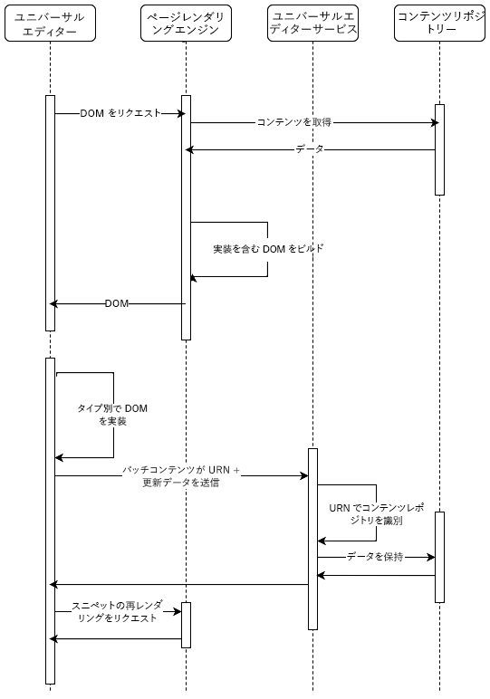

# ユニバーサルエディターのアーキテクチャ {#architecture}

ユニバーサルエディターのアーキテクチャと、そのサービスとレイヤー間でのデータのフローについて説明します。

## アーキテクチャ構築ブロック {#building-blocks}

ユニバーサルエディターは、優れたエクスペリエンスを提供し、コンテンツベロシティを向上し、最新のデベロッパーエクスペリエンスを提供するために、コンテンツ作成者があらゆる実装、あらゆるコンテンツ、あらゆる側面を編集するための 4 つの基本的な要素で構成されます。

1. [エディター](#editors)
1. [リモートアプリ](#remote-app)
1. [API レイヤー](#api-layer)
1. [永続レイヤー](#persistence-layer)

このドキュメントでは、これらの各構成要素の概要と、それらがデータを交換する仕組みについて説明します。

>[!TIP]
>
>ユニバーサルエディターとそのアーキテクチャの実際の動作を確認するには、「[AEM のユニバーサルエディターの概要](getting-started.md)」で、ユニバーサルエディターのアクセス権を取得する方法と、最初の AEM アプリを使用するための実装を開始する方法を参照してください。

### エディター {#editors}

* **ユニバーサルエディター** - ユニバーサルエディターは実装された DOM を使用して、コンテンツのインプレース編集を可能にします。必要なメタデータに関する詳細については、[属性とタイプ](attributes-types.md)を参照してください。AEM の実装の例については、[AEM のユニバーサルエディターの概要](getting-started.md)を参照してください。
* **プロパティパネル** - コンポーネントの一部のプロパティ（カルーセルの回転時間や、アコーディオンタブを常に開いたり閉じたりするプロパティ）は、コンテキスト内で編集できません。このようなコンポーネント情報を編集できるように、エディターのサイドパネルにフォームベースのエディターが用意されています。

### リモートアプリ {#remote-app}

ユニバーサルエディターのコンテキスト内でアプリを編集可能にするには、DOM を実装する必要があります。リモートアプリは、DOM 内の特定の属性をレンダリングする必要があります。必要なメタデータに関する詳細については、[属性とタイプ](attributes-types.md)を参照してください。AEM の実装の例については、[AEM のユニバーサルエディターの概要](getting-started.md)を参照してください。

ユニバーサルエディターは最小限の SDK を目標としているので、実装はリモートアプリ実装によって行われます。

### API レイヤー {#api-layer}

* **コンテンツデータ** - ユニバーサルエディターの場合、コンテンツデータのソースシステムも、コンテンツデータの使用方法も重要ではありません。重要なのは、コンテキスト内で編集可能なデータを使用し、必要な属性を定義して提供することです。
* **データを保持中** - 編集可能な各データには、URN 識別子があります。この URN は、永続性を適切なシステムとリソースにルーティングするために使用されます。

### 永続レイヤー {#persistence-layer}

* **コンテンツフラグメントモデル** - コンテンツフラグメントプロパティ編集用のパネルをサポートするには、コンテンツフラグメントエディター、フォームベースのエディター、コンポーネントごとのモデル、コンテンツフラグメントが必要です。
* **コンテンツ** - AEM や Magento などの任意の場所に保存できます。

## ユニバーサルエディターサービスとバックエンドシステムディスパッチ {#service}

ユニバーサルエディターは、すべてのコンテンツの変更を、ユニバーサルエディターサービスと呼ばれる一元化されたサービスにディスパッチします。Adobe I/O Runtime 上で動作するこのサービスは、指定された URN に基づいて、拡張レジストリで使用可能なプラグインを読み込みます。プラグインはバックエンドに通信し、統合応答を返す役割を持ちます。

## パイプラインのレンダリング {#rendering-pipelines}

### サーバーサイドレンダリング {#server-side}

### 静的サイト生成 {#static-generation}

### クライアントサイドレンダリング {#client-side}

