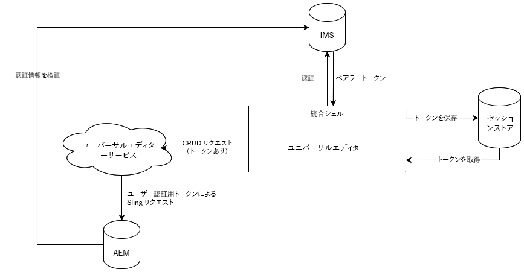

# ユニバーサルエディターの認証 {#authentication}

ユニバーサルエディターの認証方法を説明します。

## オプション {#options}

ユニバーサルエディターは、アドビの Identity Management システム（IMS）認証を使用します。IMS 認証は、統合シェルを介して提供されます。

すべてのアプリケーション／リモートページは、必要なバックエンドシステムへの認証に責任を負います。ユニバーサルエディターサービスは、スタンドアロンサービスなので、CRUD 操作を実行するには、バックエンドシステムへの認証が必要です。

## 標準フロー {#standard-flow}

これは、IMS を使用した AEM as a Cloud Service および AMS でユニバーサルエディターを使用する場合のソリューションです。

ユニバーサルエディターを使用するには、IMS に対して認証を行う統合シェルにユーザーがログインする必要があります。指定された IMS トークンは、ユーザーセッションストアに保存されます。

ユーザーが CRUD 操作を実行するたびに、HTTP ヘッダーに IMS ベアラートークンを含む呼び出しがユニバーサルエディターサービスに送信されます。次に、ユニバーサルエディターサービスは、ベアラートークンを使用して AEM バックエンドシステムに対するリクエストを認証し、ユーザー名で操作を実行します。

この図と記事では、ユニバーサルエディター自体の内部認証について説明します。

{{ue-headless-auth}}
