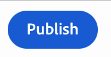
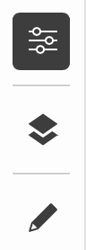

# ユニバーサルエディターを使用したコンテンツのオーサリング {#authoring}

コンテンツ作成者がユニバーサルエディターを使用してコンテンツを作成する際に、簡単で直感的な方法を説明します。

## はじめに {#introduction}

ユニバーサルエディターを使用すると、あらゆる実装内のコンテンツのあらゆる側面を編集できるので、優れたエクスペリエンスを提供し、コンテンツ速度を向上し、最新の開発者エクスペリエンスを提供できます。

これをおこなうために、ユニバーサルエディターを使用すると、コンテンツ作成者は直感的な UI を使用できます。この UI では、最小限のトレーニングで、単にコンテンツをジャンプして編集を開始できます。 このドキュメントでは、ユニバーサルエディターのオーサリングエクスペリエンスについて説明します。

>[!TIP]
>
>ユニバーサルエディターの詳細については、[ユニバーサルエディターの概要](introduction.md)ドキュメントを参照してください。

>[!NOTE]
>
>ユニバーサルエディターはまだ開発中です。 現在は、一部のコンテンツタイプを編集できません。

## アプリの準備 {#prepare-app}

ユニバーサルエディターを使用してアプリのコンテンツを作成するには、エディターをサポートするために、開発者がアプリを実装する必要があります。

>[!TIP]
>
>詳しくは、 [AEMのユニバーサルエディターの概要](getting-started.md) ユニバーサルエディターと連携するAEMアプリの設定方法の例を参照してください。

## ログイン {#sign-in}

ユニバーサルエディターと連携するようにアプリのインストルメントが行われたら、ユニバーサルエディターにログインする必要があります。ログインして[ユニバーサルエディターにアクセスする](getting-started.md#request-access)には、Adobe ID が必要です。

サインインしたら、編集するページの URL を [ロケーションバー](#location-bar) 次のようなコンテンツの編集を開始できます。 [テキストコンテンツ](#text-mode) または [メディアコンテンツ。](#media-mode)

## UI について {#ui}

UI は 5 つの主な領域に分かれています。

* [Experience Cloud ヘッダー](#experience-cloud-header)
* [ユニバーサルエディターのヘッダー](#universal-editor-header)
* [モードレール](#mode-rail)
* [エディター](#editor)
* [コンポーネントレール](#component-rail)

### Experience Cloud ヘッダー {#experience-cloud-header}

Experience Cloud ヘッダーは、常に画面の上部に表示されます。Experience Cloud 内の位置を示し、他の Experience Cloud アプリへの移動に役立つアンカーです。

#### Experience Manager {#experience-manager}

ヘッダーの左側にある Adobe Experience Cloud リンクを選択して Experience Manager ソリューションのルートに移動し、[Cloud Manager](/help/onboarding/cloud-manager-introduction.md)、[Cloud Acceleration Manager](/help/journey-migration/cloud-acceleration-manager/introduction/overview-cam.md) および[ソフトウェア配布](https://experienceleague.adobe.com/docs/experience-cloud/software-distribution/home.html?lang=ja)といったツールにアクセスします。

#### 組織 {#organization}

現在ログインしている組織が表示されます。Adobe ID が複数の組織に関連付けられている場合、別の組織に切り替えるには、タップまたはクリックします。

#### ソリューション {#solutions}

ソリューション切り替えボタンをタップまたはクリックすると、他の Experience Cloud ソリューションに素早くジャンプすることができます。

#### ヘルプ {#help}

ヘルプアイコンを使用すると、学習リソースやサポートリソースに素早くアクセスできます。

#### 通知 {#notifications}

このアイコンには、現在割り当てられている不完全な数のバッジが付きます [通知。](/help/implementing/cloud-manager/notifications.md)

#### ユーザープロパティ {#user-properties}

ユーザー設定にアクセスするには、ユーザーを表すアイコンをタップまたはクリックします。ユーザー画像が設定されていない場合、アイコンがランダムに割り当てられます。

### ユニバーサルエディターのヘッダー {#universal-editor-header}

ユニバーサルエディターのヘッダーは、常に画面の上部、[Experience Cloud ヘッダーのすぐ下に表示されます。](#experience-cloud-header) 別のページにすばやくアクセスして編集したり、現在のページを公開したりできます。

#### ハンバーガーメニュー {#hamburger-menu}

ハンバーガーメニューはまだ実装されていません。

#### ロケーションバー {#location-bar}

ロケーションバーに、編集中のページのアドレスが表示されます。別のページを編集するには、タップまたはクリックしてアドレスを入力します。

>[!TIP]
>
>ホットキー `L` を使用して、アドレスバーを開きます。

>[!NOTE]
>
>ユニバーサルエディターで編集するページは、ユニバーサルエディターをサポートするために[インストルメントを行う必要があります](getting-started.md)。

#### エミュレーターの設定 {#emulator}

エミュレーションアイコンをタップまたはクリックして、ユニバーサルエディターによるページのレンダリング方法を定義します。

エミュレーションアイコンをタップまたはクリックすると、オプションが表示されます。

デフォルトでは、エディターはデスクトップレイアウトで開き、高さと幅はブラウザーで自動的に定義されます。

また、ユニバーサルエディター内でモバイルデバイスをエミュレートすることもできます。

* 方向を定義
* 幅と高さを定義
* 向きを変更

#### アプリのプレビューを開く {#open-app-preview}

「アプリのプレビューを開く」アイコンをタップまたはクリックすると、現在編集中のページが独自のブラウザータブで開き、エディターを使用せずにコンテンツをプレビューできます。

>[!TIP]
>
>ホットキーを使用 `O` (「O」) をクリックして、アプリのプレビューを開きます。

#### パブリッシュ {#publish}

「公開」ボタンをタップまたはクリックして、読者が使用できるように、コンテンツに対する変更をライブに公開できます。

>[!TIP]
>
>ユニバーサルエディターを使用した公開について詳しくは、[ユニバーサルビジュアルエディターを使用したコンテンツの公開](publishing.md)ドキュメントを参照しでください。

### モードレール {#rail}

モードレールは、常にエディターの左側に表示されます。 エディターを別の編集モードに簡単に切り替えることができます。

#### プレビューモード {#preview-mode}

プレビューモードでは、ページは、公開されたサービスで表示されるとおりに、エディターでレンダリングされます。これにより、コンテンツ作成者は、リンクをクリックするなどしてコンテンツ内を移動できます。

>[!TIP]
>
>ホットキー `P` を使用してプレビューモードに切り替えます。

#### テキストモード {#text-mode}

テキストモードでは、コンテンツ作成者は、クリックしてテキストコンテンツを選択できます。

* 以下が可能です。 [プレーンテキストを編集](#editing-content) 適切に
* また、 [リッチテキストを編集](#editing-rich-text) その場で、コンポーネントパネルに追加の書式設定オプションが表示されます。

>[!TIP]
>
>ホットキーを使用 `T` をクリックして、テキストモードに切り替えます。

#### メディアモード {#media-mode}

メディアモードでは、コンテンツ作成者は、クリックしてメディアコンテンツを選択できます。

コンテンツの詳細がコンポーネントレールに表示され、作成者も [メディアコンテンツを編集します。](#editing-media)

>[!TIP]
>
>ホットキーを使用 `M` メディアモードに切り替えます。

#### コンポーネントモード {#component-mode}

コンポーネントモードでは、コンテンツ作成者はクリックして [コンテンツフラグメント。](/help/assets/content-fragments/content-fragments.md)

コンテンツフラグメントを選択すると、その詳細がコンポーネントレールに表示され、ここで使用できます [コンテンツフラグメントを編集します。](#edit-content-fragment)

>[!TIP]
>
>ホットキーを使用 `C` をクリックして、コンポーネントモードに切り替えます。

#### 編集 {#edit}

When in [コンポーネントモード](#component-mode) (「 [コンテンツフラグメント](/help/assets/content-fragments/content-fragments.md) モードパネルに「編集」オプションが表示されます。

「編集」ボタンをタップまたはクリックすると、 [コンテンツフラグメントエディター](/help/assets/content-fragments/content-fragments-managing.md#opening-the-fragment-editor) 新しいタブで、コンテンツフラグメントエディターのフル機能にアクセスできます。

また、 [コンポーネントレール](#edit-content-fragment) ワークフローのニーズに応じて。

>[!TIP]
>
>ホットキーを使用 `E` 選択したコンポーネントを編集します。

### エディター {#editor}

エディターは、ウィンドウのほとんどを占め、で指定されたページがそこにあります。 [ロケーションバー](#location-bar) がレンダリングされます。

* エディターが次のような編集モードの場合 [テキストモード](#text-mode) または [メディアモード](#media-mode) コンテンツは編集可能になりますが、リンクをたどることはできません。
* エディターが [プレビューモード](#preview-mode) コンテンツに移動し、リンクをたどることはできますが、コンテンツを編集することはできません。

### コンポーネントレール {#component-rail}

コンポーネントレールは、エディターの左側に常に表示されます。 モードに応じて、コンテンツ内で選択されたコンポーネントの詳細またはページコンテンツの階層を表示できます。

#### プロパティモード {#properties-mode}

プロパティモードでは、パネルには、エディターで現在選択されているコンポーネントのプロパティが表示されます。 これは、ページが読み込まれたときのコンポーネントパネルのデフォルトモードです。

選択するコンポーネントのタイプに応じて、プロパティレールに詳細を表示して変更できます。

表示や編集が可能な詳細が含まれていないコンポーネントもあります。

>[!TIP]
>
>ホットキーを使用 `D` をクリックして、プロパティモードに切り替えます。

#### コンテンツツリーモード {#Content-tree-mode}

コンテンツツリーモードでは、レールにページコンテンツの階層が表示されます。

コンテンツツリー内の項目を選択すると、そのコンテンツまでスクロールして選択します。

>[!TIP]
>
>ホットキーを使用 `F` コンテンツツリーモードに切り替えます。

## コンテンツの編集 {#editing-content}

コンテンツの編集はシンプルで直感的です。編集モード ([テキストモード](#text-mode), [メディアモード](#media-mode)、および [コンポーネントモード](#component-mode)) をクリックすると、エディターでコンテンツにマウスを合わせると、編集可能コンテンツが青いボックスでハイライト表示されます。

編集モードでは、コンテンツをタップまたはクリックすると、そのコンテンツが編集用に選択されます。リンクをたどってコンテンツを移動する場合は、[プレビューモード](#preview-mode)に切り替えます。

に応じて [mode](#mode-rail) 現在の場所と選択したコンテンツは、異なるインプレース編集オプションがある場合や、 [コンポーネントレール。](#component-rail)

### プレーンテキストの編集 {#edit-plain-text}

次の場所にいる場合： [テキストモード](#text-mode) プレーンテキストコンポーネントを選択し、その場でテキストを編集できます。

コンテンツを更新するには、と入力します。 Enter キーまたは Return キーを押すか、テキストボックスの外側をタップまたはクリックして、変更を保存します。

### リッチテキストの編集 {#edit-rich-text}

次の場所にいる場合： [テキストモード](#text-mode) リッチテキストコンポーネントを選択し、その場でテキストを編集できます。

コンテンツを更新するには、と入力します。 Enter キーまたは Return キーを押すか、テキストボックスの外側をタップまたはクリックして、変更を保存します。

また、テキストの書式設定オプションと詳細は、コンポーネントパネルで使用できます。

書式の変更は、コンテンツに自動的に保存されます。

### メディアの編集 {#edit-media}

次の場所にいる場合： [メディアモード](#media-mode) 画像を選択すると、その詳細がコンポーネントパネルに表示されます。

をタップまたはクリックします。 **置換** ボタンをクリックして、コンポーネントレールで選択した画像のプレビューの下に表示され、画像をアセットライブラリ内の別の画像に置き換えます。

1. この [アセットセレクター](/help/assets/asset-selector.md#using-asset-selector) ウィンドウが開き、アセットを選択できます。
1. 新しいアセットを選択するには、をタップまたはクリックします。
1. タップまたはクリック **選択** をクリックして、アセットが置き換えられたコンポーネントレールに戻ります。

変更はコンテンツに自動的に保存されます。

>[!TIP]
>
>ホットキーを使用 `R` をクリックして、選択した画像を置き換えるアセットセレクターを開きます。

### コンテンツフラグメントの編集 {#edit-content-fragment}

次の場所にいる場合： [コンポーネントモード](#component-mode) をクリックし、 [コンテンツフラグメント](/help/assets/content-fragments/content-fragments.md) 詳細は、コンポーネントパネルで編集できます。

選択したコンテンツフラグメントのコンテンツモデルで定義されたフィールドがコンポーネントレールに表示され編集可能になります。

変更はコンテンツに自動的に保存されます。

コンテンツフラグメントを [コンテンツフラグメントエディター](/help/assets/content-fragments/content-fragments-managing.md#opening-the-fragment-editor) 代わりに、 [編集ボタン](#edit) 」をクリックします。

## コンテンツのプレビュー {#previewing-content}

コンテンツの編集が完了したら、他のページのコンテンツでコンテンツがどのように表示されるかを確認するためにコンテンツ内を移動したい場合がよくあります。[プレビューモード](#preview-mode)でリンクをクリックして、読者と同じようにコンテンツ内を移動できます。コンテンツは、公開されるときと同じように、エディターでレンダリングされます。

プレビューモードでは、コンテンツをタップまたはクリックすると、コンテンツの読者に対するように反応します。編集するコンテンツを選択する場合は、次のような編集モードに切り替えます。 [テキストモード](#text-mode) または [メディアモード。](#media-mode)

## その他のリソース {#additional-resources}

ユニバーサルエディターの詳細については、次のドキュメントを参照してください。

* [ユニバーサルエディターの概要](introduction.md)  — ユニバーサルエディターを使用して、あらゆる実装内のコンテンツのあらゆる側面を編集でき、優れたエクスペリエンスを提供し、コンテンツ速度を向上し、最新の開発者エクスペリエンスを提供する方法を説明します。
* [ユニバーサルエディターを使用したコンテンツの公開](publishing.md) - ユニバーサルビジュアルエディターでのコンテンツの公開方法と、アプリでの公開済みコンテンツの処理方法を説明します。
* [AEM のユニバーサルエディターの概要](getting-started.md) - ユニバーサルエディターへのアクセス権を取得する方法と、これを使用するために最初の AEM アプリのインストルメントを開始する方法について説明します。
* [ユニバーサルエディターのアーキテクチャ](architecture.md) - ユニバーサルエディターのアーキテクチャと、そのサービスとレイヤー間でのデータのフローについて説明します。
* [属性とタイプ](attributes-types.md) - ユニバーサルエディターで必要なデータ属性とデータ型について説明します。
* [ユニバーサルエディターの認証](authentication.md) - ユニバーサルエディターの認証方法について説明します。
