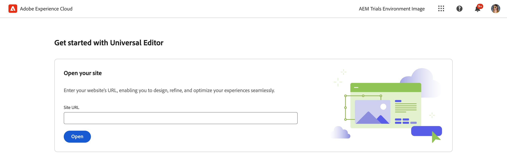

# ユニバーサルエディターを使用したコンテンツのオーサリング {#authoring}

コンテンツ作成者がユニバーサルエディターを使用してコンテンツを作成する際に、簡単で直感的な方法を説明します。

{{universal-editor-status}}

## はじめに {#introduction}

ユニバーサルエディターを使用すると、あらゆる実装、あらゆるコンテンツ、あらゆる側面を編集できるため、優れたエクスペリエンスを提供し、コンテンツベロシティを向上させ、最新のデベロッパーエクスペリエンスを提供できます。

これを行うために、ユニバーサルエディターはコンテンツ作成者に、最小限のトレーニングで簡単にコンテンツの編集を開始できる直感的な UI を提供します。このドキュメントでは、ユニバーサルエディターのオーサリングエクスペリエンスについて説明します。

>[!TIP]
>
>ユニバーサルエディターについて詳しくは、[ユニバーサルエディターの概要](introduction.md)ドキュメントを参照してください。

## アプリを準備する {#prepare-app}

ユニバーサルエディターを使用してアプリのコンテンツを作成するには、エディターをサポートするために、デベロッパーがアプリを実装する必要があります。

>[!TIP]
>
>ユニバーサルエディターと連携する AEM アプリの設定方法の例は、[AEM でのユニバーサルエディターの概要](getting-started.md)ドキュメントを参照してください。

## ログイン {#sign-in}

アプリがユニバーサルエディターと連携するように実装されたら、ユニバーサルエディターにログインします。ログインして[ユニバーサルエディターにアクセスする](getting-started.md#request-access)には、Adobe ID が必要です。

ログインしたら、編集するページの URL を[ロケーションバーに入力します。](#location-bar)次のようなコンテンツの編集を開始できます。[テキストコンテンツ](#text-mode)または[メディアコンテンツ。](#media-mode)

## UI について {#ui}

UI は、これらの主な領域に分かれています。

* [Experience Cloud ヘッダー](#experience-cloud-header)
* [ユニバーサルエディターのツールバー](#universal-editor-toolbar)
* [エディター](#editor)
* [プロパティパネル](#properties-rail)

### Experience Cloud ヘッダー {#experience-cloud-header}

Experience Cloud ヘッダーは、常に画面の上部に表示されます。Experience Cloud 内の位置を示し、他の Experience Cloud アプリへの移動に役立つアンカーです。

#### Experience Manager {#experience-manager}

ヘッダーの左側にある Adobe Experience Cloud リンクを選択して Experience Manager ソリューションのルートに移動し、[Cloud Manager](/help/onboarding/cloud-manager-introduction.md)、[Cloud Acceleration Manager](/help/journey-migration/cloud-acceleration-manager/introduction/overview-cam.md) および[ソフトウェア配布](https://experienceleague.adobe.com/docs/experience-cloud/software-distribution/home.html?lang=ja)といったツールにアクセスします。

#### 組織 {#organization}

現在ログインしている組織が表示されます。Adobe ID が複数の組織に関連付けられている場合、別の組織に切り替えるには、選択します。

#### ソリューション {#solutions}

ソリューション切り替えボタンをタップまたはクリックすると、他の Experience Cloud ソリューションに素早くジャンプすることができます。

#### ヘルプ {#help}

ヘルプアイコンを使用すると、学習リソースやサポートリソースに素早くアクセスできます。

#### 通知 {#notifications}

このアイコンには、現在割り当てられている未完了の[通知](/help/implementing/cloud-manager/notifications.md)の数を示すバッジが付きます。

#### ユーザープロパティ {#user-properties}

ユーザー設定にアクセスするには、ユーザーを表すアイコンを選択します。ユーザー画像が設定されていない場合、アイコンがランダムに割り当てられます。

### ユニバーサルエディターツールバー {#universal-editor-toolbar}

ユニバーサルエディターツールバーは、常に画面のすぐ下に表示されます。 [Experience Cloudヘッダー。](#experience-cloud-header)このツールを使用すると、別のページに素早くアクセスして編集したり、現在のページを公開したりできます。

#### 「ホーム」ボタン {#home-button}

「ホーム」ボタンをクリックすると、ユニバーサルエディターの開始ページに戻ります。

開始ページで、ユニバーサルエディターで編集するサイトの URL を入力できます。

>[!NOTE]
>
>ユニバーサルエディターで編集するページは、[ユニバーサルエディターをサポートするためにインストルメントを行う](getting-started.md)必要があります。

#### ロケーションバー {#location-bar}

ロケーションバーに、編集中のページのアドレスが表示されます。別のページを編集するには、選択してアドレスを入力します。

>[!TIP]
>
>ホットキー `L` を使用して、アドレスバーを開きます。

>[!NOTE]
>
>ユニバーサルエディターで編集するページは、[ユニバーサルエディターをサポートするためにインストルメントを行う](getting-started.md)必要があります。

#### 認証ヘッダーの設定 {#authentication-settings}

必要に応じて、認証ヘッダー設定アイコンを選択します。 [ローカル開発用のカスタム認証ヘッダーを設定します。](/help/implementing/universal-editor/developer-overview.md#auth-header)

#### エミュレーターの設定 {#emulator}

エミュレーションアイコンを選択して、ユニバーサルエディターによるページのレンダリング方法を定義します。

エミュレーションアイコンをタップまたはクリックすると、オプションが表示されます。

デフォルトでは、エディターはデスクトップレイアウトで開き、高さと幅はブラウザーで自動的に定義されます。

また、ユニバーサルエディター内でモバイルデバイスをエミュレートすることもできます。

* 向きを定義する
* 幅と高さを定義する
* 向きを変更する

#### プレビューモード {#preview-mode}

プレビューモードでは、ページは、公開されたサービスで表示されるとおりに、エディターでレンダリングされます。これにより、コンテンツ作成者は、リンクをクリックするなどしてコンテンツ内を移動できます。

>[!TIP]
>
>ホットキーを使用 `P` プレビューモードに切り替えるには、をクリックします。

#### アプリのプレビューを開く {#open-app-preview}

「アプリのプレビューを開く」アイコンを選択すると、現在編集中のページをエディターなしで独自のブラウザーで開いて、内容をプレビューできます。

>[!TIP]
>
>ホットキー `O` （文字 O）を使用して、アプリのプレビューを開きます。

#### 公開 {#publish}

「公開」ボタンを選択すると、コンテンツへの変更がライブで公開され、読者が使用できるようにになります。

>[!TIP]
>
>ユニバーサルエディターを使用した公開について詳しくは、[ユニバーサルエディターを使用したコンテンツの公開](publishing.md)のドキュメントを参照してください。

### エディター {#editor}

エディターはウィンドウのほとんどを占め、そこに[ロケーションバー](#location-bar)で指定したページがレンダリングされます。

エディターが[プレビューモード](#preview-mode)の場合、コンテンツに移動し、リンクをたどることはできますが、コンテンツを編集することはできません。

### プロパティパネル {#properties-rail}

プロパティパネルは、エディターの右側に常に表示されます。モードに応じて、コンテンツ内で選択されたコンポーネントの詳細またはページコンテンツの階層を表示できます。

#### プロパティモード {#properties-mode}

プロパティモードでは、パネルには、エディターで現在選択されているコンポーネントのプロパティが表示されます。これは、ページが読み込まれたときのプロパティパネルのデフォルトのモードです。

選択するコンポーネントのタイプに応じて、プロパティパネルに詳細を表示して変更できます。

表示や編集が可能な詳細が含まれていないコンポーネントもあります。

>[!TIP]
>
>ホットキー `D` を使用してプロパティモードに切り替えます。

#### コンテンツツリーモード {#content-tree-mode}

コンテンツツリーモードでは、パネルにページコンテンツの階層が表示されます。

コンテンツツリー内の項目を選択する場合、エディターはそのコンテンツまでスクロールして選択します。

>[!TIP]
>
>ホットキー `F` を使用してコンテンツツリーモードに切り替えます。

##### 編集 {#edit}

編集時に、選択したコンポーネントのオプションがプロパティレールに表示され、選択したコンポーネントを編集できます。 選択したコンポーネントがコンテンツフラグメントの場合は、「編集」ボタンを選択することもできます。

「編集」ボタンをタップまたはクリックすると、新しいタブで[コンテンツフラグメントエディター](/help/assets/content-fragments/content-fragments-managing.md#opening-the-fragment-editor)が開きます。これにより、コンテンツフラグメントエディターを最大限に活用して、関連するコンテンツフラグメントを編集できます。

ワークフローのニーズに応じて、コンテンツフラグメントをユニバーサルエディターで編集することも、コンテンツフラグメントエディターで直接編集することもできます。

>[!TIP]
>
>ホットキー `E` を使用して選択したコンポーネントを編集します。

##### 追加 {#add}

コンテンツツリーまたはエディターでコンテナコンポーネントを選択した場合は、プロパティパネルに「追加」オプションが表示されます。

「追加」ボタンをタップまたはクリックすると、使用できるコンポーネントのドロップダウンメニューが開き、選択したコンテナに [ を追加します。](#adding-components)

>[!TIP]
>
>ホットキー `A` を使用して、選択したコンテナコンポーネントにコンポーネントを追加します。

##### 削除 {#delete}

コンテンツツリーまたはエディターでコンテナコンポーネント内のコンポーネントを選択すると、プロパティパネルに削除オプションが表示されます。

「削除」ボタンをタップまたはクリックすると [ はコンポーネントを削除します。](#deleting-components)

>[!TIP]
>
>ホットキー `Shift+Backspace` を使用して、選択したコンポーネントをコンテナから削除します。

## コンテンツの編集 {#editing-content}

コンテンツの編集はシンプルで直感的です。エディターでコンテンツにマウスを移動すると、編集可能なコンテンツが青いボックスでハイライト表示されます。

>[!TIP]
>
>デフォルトでは、コンテンツをタップまたはクリックすると、編集用に選択されます。 リンクをたどってコンテンツを移動する場合は、[プレビューモード](#preview-mode)に切り替えます。

選択したコンテンツに応じて、異なるインプレース編集オプションが設定されている場合や、[プロパティパネル](#properties-rail)にコンテンツの追加情報やオプションが表示される場合があります。

### プレーンテキストの編集 {#edit-plain-text}

コンポーネントをダブルクリックまたはダブルタップして、その場でテキストを編集できます。

Enter キーまたは Return キーを押すか、テキストボックスの外側を選択して、変更を保存します。

テキストコンポーネントを選択すると、その詳細がプロパティパネルに表示されます。パネル内のテキストを編集することもできます。

また、テキストの詳細はプロパティパネルで確認できます。フォーカスがプロパティパネルの編集されたフィールドを離れると、変更は自動的に保存されます。

### リッチテキストの編集 {#edit-rich-text}

コンポーネントをダブルクリックまたはダブルタップして、その場でテキストを編集できます。

Enter キーまたは Return キーを押すか、テキストボックスの外側を選択して、変更を保存します。

また、プロパティパネルでは、テキストの書式設定オプションと詳細を確認できます。フォーカスがプロパティパネルの編集されたフィールドを離れると、変更は自動的に保存されます。

### メディアの編集 {#edit-media}

詳細は、プロパティパネルで確認できます。

1. プロパティパネルで、選択した画像のプレビューをタップまたはクリックします。
1. [アセットセレクター](/help/assets/asset-selector.md#using-asset-selector)ウィンドウが開き、アセットを選択できます。
1. 選択して、新しいアセットを選択します。
1. 「**選択**」を選択して、アセットが置き換えられたプロパティパネルに戻ります。

変更はコンテンツに自動的に保存されます。

### コンテンツフラグメントの編集 {#edit-content-fragment}

次を選択した場合、 [コンテンツフラグメント](/help/sites-cloud/administering/content-fragments/overview.md) 詳細は、プロパティパネルで編集できます。

選択したコンテンツフラグメントのコンテンツモデルで定義されたフィールドが、プロパティパネルに表示され編集可能になります。

コンテンツフラグメントに関連するフィールドを選択した場合、コンポーネントパネルにコンテンツフラグメントが読み込まれ、フィールドが自動的にスクロールされます。

フォーカスがプロパティパネルの編集されたフィールドを離れると、変更は自動的に保存されます。

代わりにコンテンツフラグメントを[コンテンツフラグメントエディター](/help/sites-cloud/administering/content-fragments/authoring.md)で編集する場合、モードパネルの「[編集ボタン](#edit)」をクリックします。

ワークフローのニーズに応じて、コンテンツフラグメントをユニバーサルエディターで編集することも、コンテンツフラグメントエディターで直接編集することもできます。

### コンテナへのコンポーネントの追加 {#adding-components}

1. コンテンツツリーまたはエディターでコンテナコンポーネントを選択します。
1. 次に、プロパティパネルで追加アイコンを選択します。

   

コンポーネントがコンテナに挿入され、エディターで編集できます。

>[!TIP]
>
>ホットキー `A` を使用して、選択したコンテナにコンポーネントを追加します。

### コンテナからのコンポーネントの削除 {#deleting-components}

1. コンテンツツリーまたはエディターでコンテナコンポーネントを選択します。
1. コンテナの山形アイコンを選択して、コンテンツツリーでコンテンツを展開します。
1. 次に、コンテンツツリーで、コンテナ内のコンポーネントを選択します。
1. プロパティパネルで削除アイコンを選択します。

   

選択したコンポーネントが削除されました。

>[!TIP]
>
>ホットキー `Shift+Backspace` を使用して、選択したコンポーネントをコンテナから削除します。

### コンテナ内のコンポーネントの並べ替え {#reordering-components}

1. コンテンツツリーまたはエディターでコンテナコンポーネントを選択します。
1. [コンテンツツリーモード](#content-tree-mode)でない場合はそれに切り替えます。
1. コンテナの山形アイコンを選択して、コンテンツツリーでコンテンツを展開します。
1. コンテナ内のコンポーネントの横にあるハンドルアイコンをドラッグすると、それらを並べ替えることができます。コンポーネントをドラッグして、コンテナ内で並べ替えます。

   

1. ドラッグしたコンポーネントがコンポーネントツリー内で灰色に変わり、挿入ポイントは青い線で表されます。コンポーネントをリリースして、新しい場所に配置します。

コンポーネントは、コンテンツツリーおよびエディターの両方で並べ替えられます

## コンテンツのプレビュー {#previewing-content}

コンテンツの編集が完了したら、他のページのコンテンツでコンテンツがどのように表示されるかを確認するためにコンテンツ内を移動したい場合がよくあります。[プレビューモード](#preview-mode)でリンクをクリックして、読者と同じようにコンテンツ内を移動できます。コンテンツは、公開されるときと同じように、エディターでレンダリングされます。

プレビューモードでは、コンテンツをタップまたはクリックすると、コンテンツの読者に反応します。 編集するコンテンツを選択する場合は、次の操作を切り替えます。 [プレビューモード。](#preview-mode)

## その他のリソース {#additional-resources}

ユニバーサルエディターの詳細については、次のドキュメントを参照してください。

* [ユニバーサルエディターの概要](introduction.md) - ユニバーサルエディターを使用して、優れたエクスペリエンスを提供し、コンテンツベロシティを向上させ、最新のデベロッパーエクスペリエンスを提供するために、あらゆる実装、あらゆるコンテンツ、あらゆる側面の編集を可能にする方法を説明します。
* [ユニバーサルエディターを使用したコンテンツの公開](publishing.md) - ユニバーサルエディターでのコンテンツの公開方法と、アプリでの公開済みコンテンツの処理方法を説明します。
* [AEM のユニバーサルエディターの概要](getting-started.md) - ユニバーサルエディターへのアクセス権を取得する方法と、これを使用するために最初の AEM アプリのインストルメントを開始する方法について説明します。
* [ユニバーサルエディターのアーキテクチャ](architecture.md) - ユニバーサルエディターのアーキテクチャと、そのサービスとレイヤー間でのデータのフローについて説明します。
* [属性とタイプ](attributes-types.md) - ユニバーサルエディターで必要なデータ属性とデータ型について説明します。
* [ユニバーサルエディターの認証](authentication.md) - ユニバーサルエディターの認証方法について説明します。
