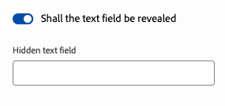

# ユニバーサルエディターのカスタマイズ {#customizing}

コンテンツ作成者のニーズに合わせてユニバーサルエディターをカスタマイズする様々なオプションについて説明します。

>[!TIP]
>
>ユニバーサルエディターには多くの[拡張ポイント](/help/implementing/universal-editor/extending.md)も用意されており、プロジェクトのニーズに合わせて機能を拡張できます。

## Meta設定タグの使用 {#meta-tags}

特定のオーサリングワークフローでは、ユニバーサルエディターの一部の機能を使用する必要があり、他の機能を使用する必要がない場合があります。 このような多様なケースをサポートするために、メタタグを使用して、エディターの特定の機能やボタンを設定または無効にすることができます。

### 機能の無効化 {#disable-features}

ページの`<head>` セクションでこのタグを使用して、1つ以上の機能を無効にします。

```html
<meta name="urn:adobe:aue:config:disable" content="..." />
```

複数の機能を無効にする場合は、値のコンマ区切りリストを指定します。

`content`でサポートされている値、つまりメタタグで無効にできる機能を次に示します。

| コンテンツの値 | 説明 |
|---|---|
| `publish` | [公開](/help/sites-cloud/authoring/universal-editor/publishing.md)のすべての機能（つまり、[公開ボタン &#x200B;](/help/sites-cloud/authoring/universal-editor/navigation.md#publish)と[非公開ボタン &#x200B;](/help/sites-cloud/authoring/universal-editor/navigation.md#ellipsis)）を無効にする |
| `publish-live` | ライブ [公開](/help/sites-cloud/authoring/universal-editor/publishing.md)を無効にする |
| `publish-preview` | プレビューの公開を無効にします（[&#x200B; プレビューサービス &#x200B;](/help/sites-cloud/authoring/sites-console/previewing-content.md)が利用可能な場合） |
| `unpublish` | [非公開ボタンを無効にする](/help/sites-cloud/authoring/universal-editor/publishing.md#unpublishing-content) |
| `copy` | [&#x200B; コピーと貼り付けボタン &#x200B;](/help/sites-cloud/authoring/universal-editor/authoring.md#copy-paste)を無効にします |
| `duplicate` | [重複ボタン &#x200B;](/help/sites-cloud/authoring/universal-editor/navigation.md#duplicate)を無効にします |
| `header-open-page` | [&#x200B; ページを開くボタン &#x200B;](/help/sites-cloud/authoring/universal-editor/navigation.md#open-page)を無効にします |
| `aem-dev-login` | [開発者ログインボタンを無効にします](/help/sites-cloud/authoring/universal-editor/navigation.md#local-developer-login) |

### エディターモードの定義 {#defining-mode}

特定のモードでユニバーサルエディターを強制的に開くことができます。 ページの`<head>` セクションでこのタグを使用して、エディターモードを強制します。

```html
<meta name="urn:adobe:aue:config:mode" content="..." />
```

`content`でサポートされている値、つまりメタタグで無効にできる機能を次に示します。

| コンテンツの値 | 説明 |
|---|---|
| `preview` | エディターが[&#x200B; プレビューモードで開きます。](/help/sites-cloud/authoring/universal-editor/navigation.md#preview-mode) **プレビュー** アイコンは非表示になっており、ユーザーは編集モードに戻すことができません。 |
| `readonly` | エディターが読み取り専用モードで開きます。 [**プロパティ** ボタンとパネル &#x200B;](/help/sites-cloud/authoring/universal-editor/navigation.md#properties-rail)は非表示になっています。 詳細はコンテンツツリーで確認できますが、変更は行えません。 |

メタタグを使用してモードを定義する場合、そのモードをユーザーが上書きすることはできません。

### カスタムプレビュー URL {#custom-preview-urls}

カスタムプレビュー URL は、`urn:adobe:aue:config:preview` メタ設定を使用して指定できます。この URL は、[エディターの右上のツールバー](/help/sites-cloud/authoring/universal-editor/navigation.md#universal-editor-toolbar)にある「**ページを開く**」ボタンをクリックすると開きます。

これを行うには、次の例のように、実装されたアプリのメタタグに目的のプレビュー URL を含めます。

```html
<meta name="urn:adobe:aue:config:preview" content="https://wknd.site"/>
```

### エンドポイントの変更 {#custom-endpoint}

アドビがホストするユニバーサルエディターサービスではなく、独自にホストするバージョンを使用する場合は、メタタグでこれを設定できます。 詳しくは、[AEM のユニバーサルエディターの概要](/help/implementing/universal-editor/getting-started.md##configuration-settings)ドキュメントを参照してください。

## コンポーネントのフィルタリング {#filtering-components}

コンポーネントフィルターを使用して、ユニバーサルエディターでコンテナごとに使用できるコンポーネントを制限できます。 詳しくは、[コンポーネントのフィルタリング](/help/implementing/universal-editor/filtering.md)のドキュメントを参照してください。

## プロパティパネルでのコンポーネントを条件付きで表示および非表示にする {#conditionally-hide}

1 つまたは複数のコンポーネントを一般的に作成者が利用できる場合がありますが、意味をなさない状況が発生する場合もあります。 このような場合、`condition` 属性を[コンポーネントモデルのフィールド](/help/implementing/universal-editor/field-types.md#fields)に追加することによって、プロパティパネルでコンポーネントを非表示にすることができます。

条件は、[JsonLogic スキーマ](https://jsonlogic.com/)を使用して定義できます。 条件が true の場合、フィールドが表示されます。 条件が false の場合、フィールドは非表示になります。

>[!BEGINTABS]

>[!TAB サンプルモデル]

```json
 {
    "id": "conditionally-revealed-component",
    "fields": [
      {
        "component": "boolean",
        "label": "Shall the text field be revealed?",
        "name": "reveal",
        "valueType": "boolean"
      },
      {
        "component": "text-input",
        "label": "Hidden text field",
        "name": "hidden-text",
        "valueType": "string",
        "condition": { "===": [{"var" : "reveal"}, true] }
      }
    ]
 }
```

>[!TAB 条件 False]


>[!TAB 条件 True]



>[!ENDTABS]
