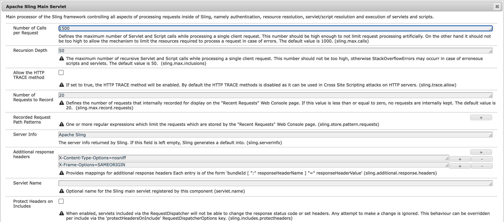
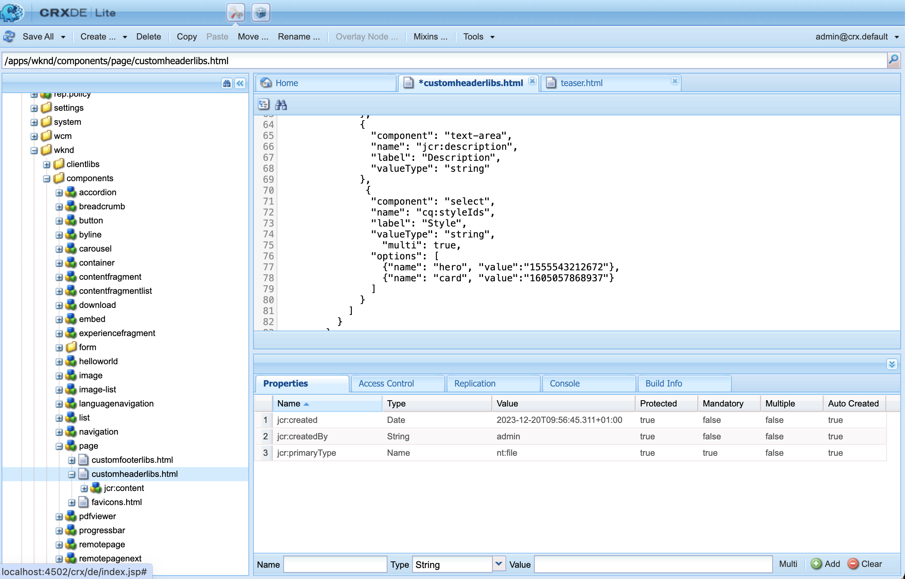

# AEM 開発者向けのユニバーサルエディターの概要 {#developer-overview}

ユニバーサルエディターの動作およびプロジェクトでのユニバーサルエディターの使用方法について興味がある AEM 開発者向けに、このドキュメントでは、WKND プロジェクトをユニバーサルエディターと連携させる方法を説明することで、エンドツーエンドの導入について説明します。

## 目的 {#purpose}

このドキュメントは、ユニバーサルエディターの機能およびアプリケーションを使用するための実装方法の両方について、開発者向けに説明します。

この説明には、ほとんどの AEM 開発者が精通している標準的な例、コアコンポーネントと WKND サイトを参照し、そして、ユニバーサルエディターを使用して編集可能ないくつかのサンプルコンポーネントを実装します。

>[!TIP]
>
>このドキュメントでは、ユニバーサルエディターの仕組みを追加の手順を説明し、開発者がエディターに対する理解を深めることを目的としています。したがって、アプリを実装するための最も直接的なルートではありませんが、ユニバーサルエディターとその仕組みを最もわかりやすく説明します。
>
>できるだけすぐに使い始めるには場合は、[AEM のユニバーサルエディターの概要](/help/implementing/universal-editor/getting-started.md)ドキュメントを参照してください。

## 前提条件 {#prerequisites}

この概要に従うには、次が必要になります。

* [AEM as a Cloud Service のローカル開発インスタンス](https://experienceleague.adobe.com/docs/experience-cloud/software-distribution/home.html?lang=ja)
   * ローカル開発インスタンスは、[`localhost` 上で開発目的で HTTPS を使用して設定](https://experienceleague.adobe.com/docs/experience-manager-learn/foundation/security/use-the-ssl-wizard.html?lang=ja)する必要があります。
   * [WKND デモサイトをインストールする必要があります](https://github.com/adobe/aem-guides-wknd)。
* [ユニバーサルエディターへのアクセス](/help/implementing/universal-editor/getting-started.md#onboarding)。
* 開発目的で実行している[ローカルユニバーサルエディターサービス](/help/implementing/universal-editor/local-dev.md)。
   * [ローカルサービスの自己署名証明書を受け入れるように](/help/implementing/universal-editor/local-dev.md#editing)ブラウザーが設定されていることを確認します。

このドキュメントは、web 開発に一般的に精通しているだけでなく、AEM 開発に関する基本的な知識を前提としています。AEM の開発経験がない場合は、[続行する前に WKND チュートリアル](/help/implementing/developing/introduction/develop-wknd-tutorial.md)を確認することを検討してください。

## AEM の起動およびユニバーサルエディターへのログイン {#sign-in}

まだ実行していない場合は、[前提条件で詳しく説明](#prerequisites)されるように、WKND をインストールし、HTTPS を有効にしてローカルの AEM 開発インスタンスを実行する必要があります。この概要は、インスタンスが `https://localhost:8443` で実行されていることを前提としています。

1. AEM エディターで WKND 英語メインページを開きます。

   ```text
   https://localhost:8443/editor.html/content/wknd/language-masters/en.html
   ```

1. エディターの&#x200B;**ページ情報**&#x200B;メニューで、「**公開済みとして表示**」を選択します。新しいタブで同じページが開き、AEM エディターが無効になります。

   ```text
   https://localhost:8443/content/wknd/language-masters/en.html?wcmmode=disabled
   ```

1. このリンクをコピーします。

1. 次に、ユニバーサルエディターにログインします。

   ```text
   https://experience.adobe.com/#/aem/editor
   ```

1. 以前に、WKND コンテンツをコピーしたリンクをユニバーサルエディターの「**サイトの URL**」フィールドに貼り付け、「**開く**」をクリックします。

   

## ユニバーサルエディターによるコンテンツの読み込みの試行 {#sameorigin}

ユニバーサルエディターは、フレーム内で編集するコンテンツを読み込みます。AEM の X-Frame オプションのデフォルト設定により、この問題が回避されます。これは、WKND のローカルコピーを読み込もうとすると、ブラウザーでエラーとして表示され、コンソール出力で詳しく説明されます。


X-Frame オプションの `sameorigin` は、フレーム内での AEM ページのレンダリングを防ぎます。このヘッダーを削除して、ユニバーサルエディターでページを読み込めるようにする必要があります。

1. Configuration Manager を開きます。

   ```text
   https://localhost:8443/system/console/configMgr
   ```

1. OSGi 設定 `org.apache.sling.engine.impl.SlingMainServlet` の編集

   

1. **追加の応答ヘッダー**&#x200B;プロパティの `X-Frame-Options=SAMEORIGIN` プロパティを削除します。

1. 変更内容を保存します。

次に、ユニバーサルエディターを再読み込みすると、AEM ページが読み込まれます。

>[!TIP]
>
>* この OSGi 設定について詳しくは、[AEM のユニバーサルエディターの概要](/help/implementing/universal-editor/getting-started.md#sameorigin)のドキュメントを参照してください。
>* AEM の OSGi について詳しくは、[Adobe Experience Manager as a Cloud Service の OSGi の設定](/help/implementing/deploying/configuring-osgi.md)に関するドキュメントを参照してください。

## 同じサイトの Cookie の処理 {#samesite-cookies}

ユニバーサルエディターがページを読み込むと、そのページは AEM のログインページに読み込まれ、変更を加えるための認証が行われていることを確認します。

ただし、正常にログインできません。ブラウザーコンソールを表示すると、ブラウザがフレーム上の入力をブロックしていることがわかります。


ログイントークン cookie は、サードパーティドメインとして AEM に送信されます。したがって、AEM では SameSite cookie を許可する必要があります。

1. Configuration Manager を開きます。

   ```text
   https://localhost:8443/system/console/configMgr
   ```

1. OSGi 設定を編集します`com.day.crx.security.token.impl.impl.TokenAuthenticationHandler`

   

1. **login-token cookie の SameSite 属性**&#x200B;プロパティを `Partitioned` に変更します。

1. 変更内容を保存します。

ユニバーサルエディターを再読み込みすると、AEM に正常にログインでき、ターゲットページが読み込まれます。

>[!TIP]
>
>* OSGi 設定について詳しくは、[AEM のユニバーサルエディターの概要](/help/implementing/universal-editor/getting-started.md#samesite-cookies)ドキュメントを参照してください。
>* AEM の OSGi について詳しくは、[Adobe Experience Manager as a Cloud Service の OSGi の設定](/help/implementing/deploying/configuring-osgi.md)ドキュメントを参照してください。

## ユニバーサルエディターをリモートフレームに接続 {#ue-connect-remote-frame}

ユニバーサルエディターにページが読み込まれ、AEM にサインインすると、ユニバーサルエディターはリモートフレームへの接続を試みます。これは、リモートフレームに読み込む必要がある JavaScript ライブラリを介して行われます。JavaScript ライブラリが存在しない場合、ページは最終的にコンソールでタイムアウトエラーを生成します。


必要な JavaScript ライブラリを WKND アプリのページコンポーネントに追加する必要があります。

1. CRXDE Lite を開きます。

   ```text
   https://localhost:8443/crx/de
   ```

1. `/apps/wknd/components/page` の下で、ファイル `customheaderlibs.html` を編集します。

   

1. ファイルの最後に JavaScript ライブラリを追加します。

   ```html
   <script src="https://universal-editor-service.adobe.io/cors.js" async></script>
   ```

1. 「**すべて保存**」をクリックして、次にユニバーサルエディターを再読み込みします。

これで、ページが適切な JavaScript ライブラリで読み込まれて、ユニバーサルエディターがページに接続できるようになり、タイムアウトエラーがコンソールに表示されなくなりました。

>[!TIP]
>
>* ライブラリは、ヘッダーまたはフッターに読み込むことができます。

>[!NOTE]
>
>`<script src="https://universal-editor-service.experiencecloud.live/corslib/LATEST"></script>` または npmjs.com 経由での、以前推奨されていた JavaScript ライブラリを組み込む方法は、パッケージが非推奨（廃止予定）になったので、推奨されなくなりました。
>
>アプリがまだ非推奨（廃止予定）のパッケージを使用している場合、ユニバーサルエディターの UI には、古いパッケージが検出されたことを示す警告が表示されます。

## 変更を保持する接続の定義 {#connection}

WKND ページがユニバーサルエディターに正常に読み込まれ、JavaScript ライブラリが読み込まれて、エディターがアプリに接続されるようになりました。

ただし、ユニバーサルエディターではページを操作できないはずです。実際に、ユニバーサルエディターでページを編集することはできません。ユニバーサルエディターでコンテンツを編集するには、コンテンツの書き込み先を認識できるように接続を定義する必要があります。ローカル開発の場合は、`https://localhost:8443` のローカル AEM 開発インスタンスに書き戻す必要があります。

1. CRXDE Lite を開きます。

   ```text
   https://localhost:8443/crx/de
   ```

1. `/apps/wknd/components/page` の下で、ファイル `customheaderlibs.html` を編集します。

   

1. ローカル AEM インスタンスへの接続に必要なメタデータをファイルの最後に追加します。

   ```html
   <meta name="urn:adobe:aue:system:aem" content="aem:https://localhost:8443">
   ```

   * ライブラリの最新バージョンを常にお勧めします。以前のバージョンが必要な場合は、[AEM のユニバーサルエディターの概要](/help/implementing/universal-editor/getting-started.md#alternative)ドキュメントを参照してください。

1. ローカルユニバーサルエディターサービスへの接続に必要なメタデータをファイルの最後に追加します。

   ```html
   <meta name="urn:adobe:aue:config:service" content="https://localhost:8000">
   ```

1. 「**すべて保存**」をクリックして、次にユニバーサルエディターを再読み込みします。

ユニバーサルエディターは、ローカル AEM 開発インスタンスからコンテンツを正常に読み込むだけでなく、ローカルユニバーサルエディターサービスを使用して行った変更を保持する場所を認識することもできるようになりました。これは、アプリをユニバーサルエディターで編集できるようにするための最初の手順です。

>[!TIP]
>
>* 接続メタデータについて詳しくは、[AEM のユニバーサルエディターの概要](/help/implementing/universal-editor/getting-started.md#connection)ドキュメントを参照してください。
>* ユニバーサルエディターの構造について詳しくは、[ユニバーサルエディターのアーキテクチャ](/help/implementing/universal-editor/architecture.md#service)ドキュメントを参照してください。
>* ユニバーサルエディターのセルフホスティングングバージョンに接続する方法について詳しくは、[ユニバーサルエディターを使用したローカル AEM 開発](/help/implementing/universal-editor/local-dev.md)ドキュメントを参照してください。

## コンポーネントの実装 {#instrumenting-components}

しかし、ユニバーサルエディターで実行できる操作はまだほとんどありません。ユニバーサルエディターで WKND ページの上部にあるティーザーをクリックしようとしても、実際にそのティーザー（またはページ上のその他の要素）を選択することはできません。

ユニバーサルエディターで編集できるようにするには、コンポーネントも実装する必要があります。これを行うには、ティーザーコンポーネントを編集する必要があります。そのためには、コアコンポーネントが不変の `/libs` の配下に存在しているので、コアコンポーネントをオーバーレイする必要があります。

1. CRXDE Lite を開きます。

   ```text
   https://localhost:8443/crx/de
   ```

1. ノード `/libs/core/wcm/components` を選択し、ツールバーで「**ノードをオーバーレイ**」をクリックします。

1. 「**オーバーレイの場所**」として `/apps/` を選択し、「**OK**」をクリックします。

   

1. `/libs/core/wcm/components` の下の `teaser` ノードを選択し、ツールバーの「**コピー**」をクリックします。

1. `/apps/core/wcm/components` でオーバーレイされたノードを選択し、ツールバーの「**貼り付け**」をクリックします。

1. `/apps/core/wcm/components/teaser/v2/teaser/teaser.html` ファイルをダブルクリックして編集します。

   

1. 最初の `div` の終わり付近、おおよそ 26 行目に、コンポーネントの実装の詳細を追加します。

   ```text
   data-aue-resource="urn:aem:${resource.path}"
   data-aue-type="component"
   data-aue-label="Teaser"
   ```

1. ツールバーの「**すべて保存**」をクリックして、ユニバーサルエディターを再読み込みします。

1. ユニバーサルエディターで、ページ上部のティーザーコンポーネントをクリックし、選択できることを確認します。

1. ユニバーサルエディターのプロパティパネルで&#x200B;**コンテンツツリー**&#x200B;アイコンをクリックすると、エディターがページのあらゆるティーザーを認識しており、エディターの実装が完了したことがわかります。選択したティーザーがハイライト表示されています。

   

>[!TIP]
>
>ノードのオーバーレイについて詳しくは、[Adobe Experience Manager as a Cloud Service での Sling Resource Merger の使用](/help/implementing/developing/introduction/sling-resource-merger.md)ドキュメントを参照してください。

## ティーザーのインストルメントサブコンポーネント {#subcomponents}

これで、ティーザーを選択できるようになりましたが、まだ編集はできません。これは、ティーザーが画像やタイトルのコンポーネントなど、様々なコンポーネントの複合体であるためです。このようなサブコンポーネントを編集するには、対象のサブコンポーネントを実装する必要があります。

1. CRXDE Lite を開きます。

   ```text
   https://localhost:8443/crx/de
   ```

1. ノード `/apps/core/wcm/components/teaser/v2/teaser/` を選択し、`title.html` ファイルをダブルクリックします。

   

1. `h2` タグの最後（17 行目付近）に、次のプロパティを挿入します。

   ```text
   data-aue-prop="jcr:title"
   data-aue-type="text"
   data-aue-label="Title"
   ```

1. ツールバーの「**すべて保存**」をクリックして、ユニバーサルエディターを再読み込みします。

1. ページ上部の同じティーザーコンポーネントのタイトルをクリックし、選択できることを確認します。コンテンツツリーには、選択したティーザーコンポーネントの一部としてタイトルも表示されます。

   

これで、ティーザーコンポーネントのタイトルを編集できます。

## 内容の確認？ {#what-does-it-mean}

ティーザーのタイトルを編集できるようになったところで、行った操作と達成方法について確認してみましょう。

ティーザーコンポーネントを実装することで、ティーザーコンポーネントをユニバーサルエディターで識別できるようになりました。

* `data-aue-resource` は編集中の AEM 内のリソースを識別します。
* `data-aue-type` は、項目が（コンテナとは異なり）ページコンポーネントとして扱われることを定義します。
* `data-aue-label` は、選択したティーザーのわかりやすいラベルを UI に表示します。

また、ティーザーコンポーネント内にタイトルコンポーネントも実装しました。

* `data-aue-prop` は、書き込まれる JCR 属性です。
* `data-aue-type` は、属性の編集方法です。この場合、タイトルなので、テキストエディター（リッチテキストエディターとは異なる）を使用します。

## 認証ヘッダーの定義 {#auth-header}

これで、ティーザーのタイトルをインラインで編集でき、変更がブラウザーに保持されます。


ただし、ブラウザーを再読み込みすると、前のタイトルが再読み込みされます。これは、ユニバーサルエディターが AEM インスタンスへの接続方法を理解していても、まだ AEM インスタンスに対して認証を行い、JCR に変更を書き戻すことができないためです。

ブラウザー開発者ツールの「ネットワーク」タブを表示し、`update` を検索すると、タイトルを編集しようとしたときに 401 エラーが発生することがわかります。


ユニバーサルエディターを使用して実稼動用 AEM コンテンツを編集する場合、ユニバーサルエディターは、JCR への書き戻しを容易にするために、エディターにログオンする際に使用したのと同じ IMS トークンを使用して AEM への認証を行います。

ローカルで開発している場合、IMS トークンはアドビが所有するドメインにのみ渡されるため、AEM ID プロバイダーを使用できません。認証ヘッダーを明示的に設定して、認証する方法を手動で指定する必要があります。

1. ユニバーサルエディターインターフェイスで、ツールバーの&#x200B;**認証ヘッダー**&#x200B;アイコンをクリックします。

1. ローカル AEM インスタンスへの認証に必要な認証ヘッダーをコピーし、「**保存**」をクリックします。

   

1. ユニバーサルエディターを再読み込みして、ティーザーのタイトルを編集します。

ブラウザーコンソールにエラーが表示されなくなり、変更内容はローカルの AEM 開発インスタンスに保持されます。

ブラウザーの開発者ツールでトラフィックを調査し、`update` イベントを探すと、更新の詳細を確認できます。


```json
{
  "connections": [
    {
      "name": "aem",
      "protocol": "aem",
      "uri": "https://localhost:8443"
    }
  ],
  "target": {
    "resource": "urn:aem:/content/wknd/language-masters/en/jcr:content/root/container/carousel/item_1571954853062",
    "type": "text",
    "prop": "jcr:title"
  },
  "value": "Tiny Toon Adventures"
}
```

* `connections` は、ローカルの AEM インスタンスへの接続です。
* `target` は、JCR で更新される正確なノードおよびプロパティです。
* `value` は自分が行った更新です。

変更が JCR に保持されていることがわかります。


>[!TIP]
>
>テストや開発の目的で必要な認証ヘッダーを生成するオンラインツールが多数あります。
>
>基本的な認証ヘッダーの例 `Basic YWRtaW46YWRtaW4=` は、`admin:admin` のユーザーとパスワードの組み合わせに対するもので、ローカル AEM 開発では一般的です。

## プロパティパネル用のアプリの実装 {#properties-rail}

これで、ユニバーサルエディターを使用して編集できるように実装されたアプリが完成しました。

編集は、現在、ティーザーのタイトルのインライン編集に限られています。ただし、インプレース編集では不十分な場合があります。ティーザーのタイトルなどのテキストは、キーボード入力を使用して編集できます。ただし、より複雑な項目は、ブラウザーでのレンダリング方法とは別に、構造化データを表示して編集できる必要があります。プロパティパネルはこの機能を備えています。

プロパティパネルを使用して編集するようにアプリを更新するには、アプリのページコンポーネントのヘッダーファイルに戻ります。この場所では、ローカルの AEM 開発インスタンスおよびローカルのユニバーサルエディターサービスへの接続が既に確立されています。ここで、アプリ内で編集可能なコンポーネントとそのデータモデルを定義する必要があります。

1. CRXDE Lite を開きます。

   ```text
   https://localhost:8443/crx/de
   ```

1. `/apps/wknd/components/page` の下で、ファイル `customheaderlibs.html` を編集します。

   

1. ファイルの最後に、コンポーネントを定義するために必要なスクリプトを追加します。

   ```html
   <script type="application/vnd.adobe.aue.component+json">
   {
     "groups": [
       {
         "title": "General Components",
         "id": "general",
         "components": [
           {
             "title": "Teaser",
             "id": "teaser",
             "plugins": {
               "aem": {
                 "page": {
                   "resourceType": "wknd/components/teaser"
                 }
               }
             }
           },
           {
             "title": "Title",
             "id": "title",
             "plugins": {
               "aem": {
                 "page": {
                   "resourceType": "wknd/components/title"
                 }
               }
             }
           }
         ]
       }
     ]
   }
   </script>
   ```

1. その下で、モデルを定義するために必要なスクリプトをファイルの最後に追加します。

   ```html
   <script type="application/vnd.adobe.aue.model+json">
   [
     {
       "id": "teaser",
       "fields": [
         {
           "component": "text-input",
           "name": "jcr:title",
           "label": "Title",
           "valueType": "string"
         },
         {
           "component": "text-area",
           "name": "jcr:description",
           "label": "Description",
           "valueType": "string"
         }
       ]
     },
     {
       "id": "title",
       "fields": [
         {
           "component": "select",
           "name": "type",
           "value": "h1",
           "label": "Type",
           "valueType": "string",
           "options": [
             { "name": "h1", "value": "h1" },
             { "name": "h2", "value": "h2" },
             { "name": "h3", "value": "h3" },
             { "name": "h4", "value": "h4" },
             { "name": "h5", "value": "h5" },
             { "name": "h6", "value": "h6" }
           ]
         }
       ]
     }
   ]
   </script>
   ```

1. ツールバーで「**すべて保存**」をクリックします。

## 内容の確認？ {#what-does-it-mean-2}

プロパティパネルを使用して編集するには、コンポーネントを `groups` に割り当てる必要があるため、各定義は、コンポーネントを含むグループのリストとして開始します。

* `title` はグループの名前です。
* `id` はグループの一意の識別子です。この場合、例えば、ページレイアウトの高度なコンポーネントなどとは異なり、ページコンテンツを構成する一般的なコンポーネントです。

各グループには `components` の配列があります。

* `title` はコンポーネントの名前です。
* `id` はコンポーネントの一意の識別子です。この場合はティーザーです。

各コンポーネントには、コンポーネントを AEM にマッピングする方法を定義するプラグイン定義が含まれます。

* `aem` は編集を処理するプラグインです。これは、コンポーネントを処理するサービスと考えることができます。
* `page` はコンポーネントの種類を定義します。この場合は標準ページコンポーネントです。
* `resourceType` は実際の AEM コンポーネントへのマッピングです。

次に、各コンポーネントを `model` にマッピングして、個々の編集可能フィールドを定義する必要があります。

* `id` はモデルの一意の識別子です。この識別子は、コンポーネントの ID と一致する必要があります。
* `fields` は個々のフィールドの配列です。
* `component` はテキストやテキスト領域などの入力のタイプです。
* `name` はフィールドのマッピング先の JCR 内のフィールド名です。
* `label` はエディター UI に表示されるフィールドの説明です。
* `valueType` はデータのタイプです。

## プロパティパネル用のコンポーネントの実装 {#properties-rail-component}

また、コンポーネントで使用するモデルをコンポーネントレベルで定義する必要があります。

1. CRXDE Lite を開きます。

   ```text
   https://localhost:8443/crx/de
   ```

1. `/apps/core/wcm/components/teaser/v2/teaser/teaser.html` ファイルをダブルクリックして編集します。

   

1. 最初の `div` の終わり付近、おおよそ 32 行目で、前に追加したプロパティの後に、ティーザーコンポーネントで使用するモデルの実装の詳細を追加します。

   ```text
   data-aue-model="teaser"
   ```

1. ツールバーの「**すべて保存**」をクリックして、ユニバーサルエディターを再読み込みします。

これで、コンポーネント用に実装されたプロパティパネルをテストする準備が整いました。

1. ユニバーサルエディターで、ティーザーのタイトルをクリックして、もう一度編集します。

1. プロパティパネルをクリックして「プロパティ」タブを表示し、実装したフィールドを確認します。

   

ティーザーのタイトルを以前のようにインラインで編集したり、プロパティパネルで編集したりできるようになりました。どちらの場合も、変更はローカル AEM 開発インスタンスに保持されます。

## プロパティパネルに追加フィールドを追加 {#add-fields}

既に実装したコンポーネントのデータモデルの基本構造を使用して、同じモデルに従って、フィールドを追加できます。

例えば、フィールドを追加して、コンポーネントのスタイルを調整できます。

1. CRXDE Lite を開きます。

   ```text
   https://localhost:8443/crx/de
   ```

1. `/apps/wknd/components/page` の下で、ファイル `customheaderlibs.html` を編集します。

   

1. モデル定義スクリプトで、スタイルフィールドの `fields` 配列に項目を追加します。新しいフィールドを挿入する前に、最後のフィールドの後にコンマを追加します。

   ```json
   {
      "component": "select",
      "name": "cq:styleIds",
      "label": "Style",
      "valueType": "string",
        "multi": true,
      "options": [
        {"name": "hero", "value":"1555543212672"},
        {"name": "card", "value":"1605057868937"}
      ]
   }
   ```

1. ツールバーの「**すべて保存**」をクリックして、ユニバーサルエディターを再読み込みします。

1. ティーザーのタイトルをクリックして、もう一度編集します。

1. プロパティパネルをクリックして、コンポーネントのスタイルを調整するための新しいフィールドがあることを確認します。

   

この方法で、コンポーネントの JCR 内の任意のフィールドをユニバーサルエディターで公開できます。

## 概要 {#summary}

これで完了です。独自の AEM アプリを実装して、ユニバーサルエディターを操作できるようになりました。

独自のアプリの実装を開始する際は、この例で実行した基本的な手順に注意してください。

1. [開発環境を設定しました](#prerequisites)。
   * WKND がインストールされた HTTPS 上でローカルに実行される AEM
   * HTTPS 上でローカルに実行されるユニバーサルエディターサービス
1. AEM の OSGi 設定を更新して、そのコンテンツをリモートで読み込めるようにしました。
   * [`org.apache.sling.engine.impl.SlingMainServlet`](#sameorigin)
   * [`com.day.crx.security.token.impl.impl.TokenAuthenticationHandler`](#samesite-cookies)
1. [アプリのページコンポーネントの `customheaderlibs.html` ファイルに `universal-editor-embedded.js` ライブラリを追加しました](#ue-connect-remote-frame)。
1. [アプリのページコンポーネントの `customheaderlibs.html` ファイルで変更を保持するための接続を定義しました](#connection)。
   * ローカル AEM 開発インスタンスへの接続を定義しました。
   * また、ローカルのユニバーサルエディターサービスへの接続も定義しました。
1. [ティーザーコンポーネントを実装しました](#instrumenting-components)。
1. [ティーザーのサブコンポーネントを実装しました](#subcomponents)。
1. [ローカルのユニバーサルエディターサービスを使用して変更を保存できるように、カスタム認証ヘッダーを定義しました](#auth-header)。
1. [プロパティパネルを使用するアプリを実装しました](#properties-rail)。
1. [プロパティパネルを使用するティーザーコンポーネントを実装しました](#properties-rail-component)。

これらと同じ手順に従って、ユニバーサルエディターで使用するために独自のアプリを実装できます。JCR 内の任意のプロパティをユニバーサルエディターに公開できます。

## その他のリソース {#additional-resources}

ユニバーサルエディターの機能について詳しくは、次のドキュメントを参照してください。

* できるだけ早く使い始める場合は、[AEM のユニバーサルエディターの概要](/help/implementing/universal-editor/getting-started.md)ドキュメントを参照してください。
* 必要な OSGi 設定について詳しくは、[AEM のユニバーサルエディターの概要](/help/implementing/universal-editor/getting-started.md#sameorigin)ドキュメントを参照してください。
* 接続メタデータについて詳しくは、[AEM のユニバーサルエディターの概要](/help/implementing/universal-editor/getting-started.md#connection)ドキュメントを参照してください。
* ユニバーサルエディターの構造について詳しくは、[ユニバーサルエディターのアーキテクチャ](/help/implementing/universal-editor/architecture.md#service)ドキュメントを参照してください。
* ユニバーサルエディターのセルフホストバージョンに接続する方法について詳しくは、[ユニバーサルエディターを使用したローカル AEM 開発](/help/implementing/universal-editor/local-dev.md)ドキュメントを参照してください。
* ノードのオーバーレイについて詳しくは、[Adobe Experience Manager as a Cloud Service での Sling Resource Merger の使用](/help/implementing/developing/introduction/sling-resource-merger.md)ドキュメントを参照してください。

