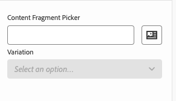
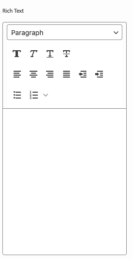

# モデル定義、フィールドおよびコンポーネントタイプ {#field-types}

ユニバーサルエディターがプロパティパネルで編集できるフィールドとコンポーネントタイプの例について説明します。モデル定義を作成し、コンポーネントにリンクすることで、独自のアプリを実装する方法を理解します。

## 概要 {#overview}

ユニバーサルエディターで使用する独自のアプリを適応させる場合は、コンポーネントを実装し、エディターのプロパティパネルで操作できるフィールドとコンポーネントタイプを定義する必要があります。これを行うには、モデルを作成し、コンポーネントからそのモデルにリンクします。

このドキュメントでは、モデル定義の概要、フィールドの概要および使用可能なコンポーネントタイプと設定例を説明します。

>[!TIP]
>
>ユニバーサルエディター用のアプリの実装方法がわからない場合は、[AEM 開発者向けのユニバーサルエディターの概要](/help/implementing/universal-editor/developer-overview.md)ドキュメントを参照してください。

## モデル定義構造 {#model-structure}

ユニバーサルエディターのプロパティパネルを使用してコンポーネントを設定するには、モデル定義が存在し、そのコンポーネントにリンクされている必要があります。

モデル定義は、モデルの配列から始まる JSON 構造です。

```json
[
  {
    "id": "model-id",        // must be unique
    "fields": []             // array of fields which shall be rendered in the properties panel
  }
]
```

`fields` 配列を定義する方法について詳しくは、このドキュメントの&#x200B;**[フィールド](#fields)**&#x200B;の節を参照してください。

モデルをコンポーネントにリンクするには、[コンポーネント定義](#component-definition)または[実装を使用](#instrumentation)の 2 つの方法があります。

### コンポーネント定義を使用したリンク {#component-definition}

モデルをコンポーネントにリンクするには、この方法をお勧めします。これにより、コンポーネント定義内でリンクを一元的に維持でき、コンテナ間でコンポーネントをドラッグできるようになります。

`component-definition.json` ファイルの `components` 配列のコンポーネントオブジェクトに `model` プロパティを含めるだけです。

詳しくは、[コンポーネント定義](/help/implementing/universal-editor/component-definition.md)のドキュメントを参照してください。

### 実装を使用したリンク {#instrumentation}

コンポーネントでモデル定義を使用するには、`data-aue-model` 属性を使用できます。

```html
<div data-aue-resource="urn:datasource:/content/path" data-aue-type="component"  data-aue-model="model-id">Click me</div>
```

>[!NOTE]
>
>ユニバーサルエディターは、最初にモデルが実装を介してリンクされているかどうかを確認し、コンポーネント定義を確認する前にそれを使用します。つまり、
>
>* 実装を介してモデルへのリンクを実装したプロジェクトは、変更を行わなくても、引き続きそのまま機能します。
>* [コンポーネント定義](#component-definition)と実装の両方でモデルを定義する場合、実装が常に使用されます。

## モデル定義の読み込み {#loading-model}

モデルを作成した後は、外部ファイルとして参照できます。

```html
<script type="application/vnd.adobe.aue.model+json" src="<url-of-model-definition>"></script>
```

または、モデルをインラインで定義することもできます。

```html
<script type="application/vnd.adobe.aue.model+json">
  { ... model definition ... }
</script>
```

## フィールド {#fields}

フィールドオブジェクトには次のタイプ定義があります。

| 設定 | 値タイプ | 説明 | 必須 |
|---|---|---|---|
| `component` | `ComponentType` | コンポーネントのレンダラー | はい |
| `name` | `string` | データが保存されるプロパティ[またはパス](#nesting) | はい |
| `label` | `FieldLabel` | フィールドのラベル | はい |
| `description` | `FieldDescription` | フィールドの説明 | いいえ |
| `value` | `FieldValue` | これはデフォルト値で、プレースホルダーとして機能します。 値を設定しない場合、ユニバーサルエディターは、モデル定義で `value` のように定義されたものは何でも保持します。 これにより、表示される内容が、バックエンドに保持される内容と一致するようになります。 | いいえ |
| `valueType` | `ValueType` | 標準の検証は次が可能です。`string`、`string[]`、`number`、`date`、`boolean` | いいえ |
| `required` | `boolean` | 必須フィールドです | いいえ |
| `readOnly` | `boolean` | フィールド読み取り専用です | いいえ |
| `hidden` | `boolean` | デフォルトで非表示になっているフィールドです | いいえ |
| `condition` | `RulesLogic` | [条件](/help/implementing/universal-editor/customizing.md#conditionally-hide)に基づいてフィールドの表示／非表示を切り替えるルール | いいえ |
| `multi` | `boolean` | このフィールドはマルチフィールドですか？<br/>プロパティパネルのマルチフィールドでは、コンテナーのネストは許可されていない点に注意してください。 | いいえ |
| `validation` | `ValidationType` | フィールドの検証ルール | いいえ |
| `raw` | `unknown` | コンポーネントで使用できる生データ | いいえ |

### 名前フィールドとネスト {#nesting}

`name` フィールドは、現在のリソースのプロパティを直接指すことができます。または、`cq:Pages` のコンポーネントの場合は、ネストされたプロパティへのパスを使用することもできます。例：

```json
"name": "teaser/image/fileReference"
```

### コンポーネントタイプ {#component-types}

次に、フィールドのレンダリングに使用できるコンポーネントタイプを示します。

| 説明 | コンポーネントのタイプ |
|---|---|
| [AEM タグ](#aem-tag) | `aem-tag` |
| [AEM コンテンツ](#aem-content) | `aem-content` |
| [ブーリアン](#boolean) | `boolean` |
| [チェックボックスグループ](#checkbox-group) | `checkbox-group` |
| [コンテナ](#container) | `container` |
| [コンテンツフラグメント](#content-fragment) | `aem-content-fragment` |
| [日時](#date-time) | `date-time` |
| [エクスペリエンスフラグメント](#experience-fragment) | `aem-experience-fragment` |
| [複数選択](#multiselect) | `multiselect` |
| [数値](#number) | `number` |
| [ラジオグループ](#radio-group) | `radio-group` |
| [参照](#reference) | `reference` |
| [リッチテキスト](#rich-text) | `richtext` |
| [選択](#select) | `select` |
| [タブ](#tab) | `tab` |
| [テキスト](#text) | `text` |

#### AEM タグ {#aem-tag}

AEM タグコンポーネントタイプでは、AEM タグピッカーを使用して、コンポーネントにタグを付けることができます。

>[!BEGINTABS]

>[!TAB サンプル]

```json
{
  "id": "aem-tag-picker",
  "fields": [
    {
      "component": "aem-tag",
      "label": "AEM Tag Picker",
      "name": "cq:tags",
      "valueType": "string"
    }
  ]
}
```

>[!TAB スクリーンショット]


>[!ENDTABS]

>[!TIP]
>
>スプレッドシートを使用して Edge Delivery Services プロジェクトの分類データを管理する方法について詳しくは、[分類データの管理](https://www.aem.live/docs/authoring-taxonomy)のドキュメントを参照してください。

#### AEM コンテンツ {#aem-content}

AEM コンテンツコンポーネントタイプでは、AEM コンテンツピッカーを使用して、任意の AEM リソースを選択できます。アセットのみを選択できる[参照コンポーネント](#reference)とは異なり、AEM コンテンツコンポーネントは、任意の AEM コンテンツを参照できます。追加の検証タイプを提供します。

| 検証タイプ | 値タイプ | 説明 | 必須 |
|---|---|---|---|
| `rootPath` | `string` | ユーザーが AEM コンテンツを選択できるようコンテンツピッカーが開き、そのディレクトリとサブディレクトリに選択を制限するパス | いいえ |

>[!BEGINTABS]

>[!TAB サンプル]

```json
{
  "id": "aem-content-picker",
  "fields": [
    {
      "component": "aem-content",
      "name": "reference",
      "value": "",
      "label": "AEM Content Picker",
      "valueType": "string",
      "validation": {
            "rootPath": "/content/refresh"
        }
    }
  ]
}
```

>[!TAB スクリーンショット]


>[!ENDTABS]

#### ブーリアン {#boolean}

ブーリアンのコンポーネントタイプは、切替スイッチとしてレンダリングされた単純な true／false 値を格納します。追加の検証タイプを提供します。

| 検証タイプ | 値タイプ | 説明 | 必須 |
|---|---|---|---|
| `customErrorMsg` | `string` | 入力された値がブーリアン値でない場合に表示されるメッセージ | いいえ |

>[!BEGINTABS]

>[!TAB サンプル 1]

```json
{
  "id": "boolean",
  "fields": [
    {
      "component": "boolean",
      "label": "Boolean",
      "name": "boolean",
      "valueType": "boolean"
    }
  ]
}
```

>[!TAB サンプル 2]

```json
{
  "id": "another-boolean",
  "fields": [
    {
      "component": "boolean",
      "label": "Boolean",
      "name": "boolean",
      "valueType": "boolean",
      "validation": {
        "customErrorMsg": "Think, McFly. Think!"
      }
    }
  ]
}
```

>[!TAB スクリーンショット]


>[!ENDTABS]

#### チェックボックスグループ {#checkbox-group}

ブール値と同様に、チェックボックスグループコンポーネントタイプでは、複数の true / false 項目を選択でき、複数のチェックボックスとしてレンダリングできます。

>[!BEGINTABS]

>[!TAB サンプル]

```json
{
  "id": "checkbox-group",
  "fields": [
    {
      "component": "checkbox-group",
      "label": "Checkbox Group",
      "name": "checkbox",
      "valueType": "string[]",
      "options": [
        { "name": "Option 1", "value": "option1" },
        { "name": "Option 2", "value": "option2" }
      ]
    }
  ]
}
```

>[!TAB スクリーンショット]


>[!ENDTABS]

#### コンテナ {#container}

コンテナコンポーネントタイプを使用すると、複数のサポートなどコンポーネントをグループ化できます。追加の設定を提供します。プロパティパネルの複数フィールドでは、コンテナのネストは許可されていません

| 設定 | 値タイプ | 説明 | 必須 |
|---|---|---|---|
| `collapsible` | `boolean` | コンテナが折りたたみ可能かどうか | いいえ |

>[!BEGINTABS]

>[!TAB サンプル]

```json
 {
  "id": "container",
  "fields": [
    {
      "component": "container",
      "label": "Container",
      "name": "container",
      "valueType": "string",
      "collapsible": true,
      "fields": [
        {
          "component": "text-input",
          "label": "Simple Text 1",
          "name": "text",
          "valueType": "string"
        },
        {
          "component": "text-input",
          "label": "Simple Text 2",
          "name": "text2",
          "valueType": "string"
        }
      ]
    }
  ]
}
```

>[!TAB スクリーンショット]


>[!TAB マルチフィールドのサポート]

```json
{
  "component": "container",
  "name": "test",
  "label": "Multi Text",
  "multi": true,
  "fields": [
    {
      "component": "reference",
      "name": "image",
      "value": "",
      "label": "Sample Image",
      "valueType": "string"
    },
    {
      "component": "text",
      "name": "alt",
      "value": "",
      "label": "Alt Text",
      "valueType": "string"
    }
  ]
}
```

>[!ENDTABS]


#### コンテンツフラグメント {#content-fragment}

コンテンツフラグメントピッカーを使用すると、[コンテンツフラグメント](/help/sites-cloud/authoring/fragments/content-fragments.md)と（必要に応じて）そのバリエーションを選択できます。追加の設定を提供します。

| 設定 | 値タイプ | 説明 | 必須 |
|---|---|---|---|
| `variationName` | `string` | 選択したバリエーションを保存する変数名。未定義の場合、バリエーションピッカーは表示されません | いいえ |

また、追加の検証タイプも提供します。

| 検証タイプ | 値タイプ | 説明 | 必須 |
|---|---|---|---|
| `rootPath` | `string` | ユーザーがコンテンツフラグメントを選択できるようコンテンツピッカーが開き、そのディレクトリとサブディレクトリに選択を制限するパス | いいえ |

>[!NOTE]
>
>ユニバーサルエディターでは、[モデルに基づいてコンテンツフラグメントフィールドを検証](/help/assets/content-fragments/content-fragments-models.md#validation)し、正規表現パターンや一意性制約などのデータ整合性ルールを適用できます。
>
>これにより、コンテンツを公開する前に、特定のビジネス要件が満たされます。

>[!BEGINTABS]

>[!TAB サンプル 1]

```json
[
  {
    "id": "aem-content-fragment",
    "fields": [
      {
        "component": "aem-content-fragment",
        "name": "picker",
        "label": "Content Fragment Picker",
        "valueType": "string",
        "variationName": "contentFragmentVariation",
        "validation": {
            "rootPath": "/content/refresh"
        }
      }
    ]
  }
]
```

>[!TAB スクリーンショット]



>[!ENDTABS]

#### 日時 {#date-time}

日時コンポーネントタイプを使用すると、日付、時刻、またはその組み合わせを指定できます。 追加の設定を提供します。

| 設定 | 値タイプ | 説明 | 必須 |
|---|---|---|---|
| `displayFormat` | `string` | 日付文字列を表示するフォーマット | はい |
| `valueFormat` | `string` | 日付文字列を格納する形式 | はい |

また、追加の検証タイプも提供します。

| 検証タイプ | 値タイプ | 説明 | 必須 |
|---|---|---|---|
| `customErrorMsg` | `string` |  `valueFormat` が満たされない場合に表示するメッセージ | いいえ |

>[!BEGINTABS]

>[!TAB サンプル 1]

```json
{
  "id": "date-time",
  "fields": [
    {
      "component": "date-time",
      "label": "Date & Time",
      "name": "date",
      "valueType": "date"
    }
  ]
}
```

>[!TAB サンプル 2]

```json
{
  "id": "another-date-time",
  "fields": [
    {
      "component": "date-time",
       "valueType": "date-time",
      "name": "field1",
      "label": "Date Time",
      "description": "This is a date time field that stores both date and time.",
      "required": true,
      "placeholder": "YYYY-MM-DD HH:mm:ss",
      "displayFormat": null,
      "valueFormat": null,
      "validation": {
        "customErrorMsg": "Marty! You have to come back with me!"
      }
    },
    {
      "component": "date-time",
      "valueType": "date",
      "name": "field2",
      "label": "Another Date Time",
      "description": "This is another date time field that only stores the date.",
      "required": true,
      "placeholder": "YYYY-MM-DD",
      "displayFormat": null,
      "valueFormat": null,
      "validation": {
        "customErrorMsg": "Back to the future!"
      }
    },
    {
      "component": "date-time",
      "valueType": "time",
      "name": "field3",
      "label": "Yet Another Date Time",
      "description": "This is another date time field that only stores the time.",
      "required": true,
      "placeholder": "HH:mm:ss",
      "displayFormat": null,
      "valueFormat": null,
      "validation": {
        "customErrorMsg": "Great Scott!"
      }
    }
  ]
}
```

>[!TAB スクリーンショット]


>[!ENDTABS]

#### エクスペリエンスフラグメント {#experience-fragment}

エクスペリエンスフラグメントピッカーを使用すると、[エクスペリエンスフラグメント](/help/sites-cloud/authoring/fragments/experience-fragments.md)と（必要に応じて）そのバリエーションを選択できます。追加の設定を提供します。

| 設定 | 値タイプ | 説明 | 必須 |
|---|---|---|---|
| `variationName` | `string` | 選択したバリエーションを保存する変数名。未定義の場合、バリエーションピッカーは表示されません | いいえ |

また、追加の検証タイプも提供します。

| 検証タイプ | 値タイプ | 説明 | 必須 |
|---|---|---|---|
| `rootPath` | `string` | ユーザーがエクスペリエンスフラグメントを選択できるようコンテンツピッカーが開き、そのディレクトリとサブディレクトリに選択を制限するパス | いいえ |

>[!BEGINTABS]

>[!TAB サンプル 1]

```json
[
  {
    "id": "experience-fragment",
    "fields": [
      {
        "component": "aem-experience-fragment",
        "valueType": "string",
        "name": "experience-fragment",
        "label": "experience-fragment",
        "variationName": "experienceFragmentVariation",
        "validation": {
            "rootPath": "/content/refresh"
        }
      }
    ]
  }
]
```

>[!TAB スクリーンショット]


>[!ENDTABS]


#### 複数選択 {#multiselect}

複数選択コンポーネントタイプでは、選択可能な要素をグループ化する機能など、ドロップダウンで選択する複数の項目が表示されます。

>[!BEGINTABS]

>[!TAB サンプル 1]

```json
{
  "id": "multiselect",
  "fields": [
    {
      "component": "multiselect",
      "name": "multiselect",
      "label": "Multi Select",
      "valueType": "string",
      "options": [
        { "name": "Option 1", "value": "option1" },
        { "name": "Option 2", "value": "option2" }
      ]
    }
  ]
}
```

>[!TAB サンプル 2]

```json
{
  "id": "multiselect-grouped",
  "fields": [
    {
      "component": "multiselect",
      "name": "property",
      "label": "Multiselect field",
      "valueType": "string",
      "required": true,
      "maxSize": 2,
      "options": [
        {
          "name": "Theme",
          "children": [
            { "name": "Light", "value": "light" },
            { "name": "Dark",  "value": "dark" }
          ]
        },
        {
          "name": "Type",
          "children": [
            { "name": "Alpha", "value": "alpha" },
            { "name": "Beta", "value": "beta" },
            { "name": "Gamma", "value": "gamma" }
          ]
        }
      ]
    }
  ]
}
```

>[!TAB スクリーンショット]


>[!ENDTABS]

#### 数値 {#number}

数値コンポーネントタイプを使用すると、数値を入力できます。 追加の検証タイプを提供します。

| 検証タイプ | 値タイプ | 説明 | 必須 |
|---|---|---|---|
| `numberMin` | `number` | 許可される最小数 | いいえ |
| `numberMax` | `number` | 許可される最大数 | いいえ |
| `customErrorMsg` | `string` | `numberMin` または `numberMax` が満たされない場合に表示するメッセージ。 | いいえ |

>[!BEGINTABS]

>[!TAB サンプル 1]

```json
{
  "id": "number",
  "fields": [
    {
      "component": "number",
      "name": "number",
      "label": "Number",
      "valueType": "number",
      "value": 0
    }
  ]
}
```

>[!TAB サンプル 2]

```json
{
  "id": "another-number",
  "fields": [
   {
      "component": "number",
      "valueType": "number",
      "name": "field1",
      "label": "Number Field",
      "description": "This is a number field.",
      "required": true,
      "placeholder": null,
      "validation": {
        "numberMin": 0,
        "numberMax": 88,
        "customErrorMsg": "You also need 1.21 gigawatts."
      }
    }
  ]
}
```

>[!TAB スクリーンショット]


>[!ENDTABS]

#### ラジオグループ {#radio-group}

ラジオグループコンポーネントタイプを使用すると、チェックボックスグループと同様のグループとしてレンダリングされる複数のオプションから、相互に排他的な選択を行うことができます。

>[!BEGINTABS]

>[!TAB サンプル]

```json
{
  "id": "radio-group",
  "fields": [
    {
      "component": "radio-group",
      "label": "Radio Group",
      "name": "radio",
      "valueType": "string",
      "options": [
        { "name": "Option 1", "value": "option1" },
        { "name": "Option 2", "value": "option2" }
      ]
    }
  ]
}
```

>[!TAB スクリーンショット]


>[!ENDTABS]

#### 参照 {#reference}

参照コンポーネントタイプでは、AEM アセットピッカーを使用して、参照する任意の AEM アセットを選択できます。任意の AEM リソースを選択できる [AEM コンテンツコンポーネント](#aem-content)とは異なり、参照コンポーネントは、アセットのみを参照できます。追加の検証タイプを提供します。

参照コンポーネントタイプを使用すると、現在のオブジェクトから別のデータオブジェクトへの参照が可能になります。

>[!BEGINTABS]

>[!TAB サンプル]

```json
{
  "id": "reference",
  "fields": [
    {
      "component": "reference",
      "label": "Reference",
      "name": "reference",
      "valueType": "string"
    }
  ]
}
```

>[!TAB スクリーンショット]


>[!ENDTABS]

#### リッチテキスト {#rich-text}

リッチテキストを使用すると、複数行のリッチテキスト入力が可能になります。

>[!BEGINTABS]

>[!TAB サンプル 1]

```json
{
  "id": "richtext",
  "fields": [
    {
      "component": "richtext",
      "name": "rte",
      "label": "Rich Text",
      "valueType": "string"
    }
  ]
}
```

>[!TAB スクリーンショット]



>[!ENDTABS]

#### 選択 {#select}

選択コンポーネントタイプでは、ドロップダウンメニューの定義済みオプションのリストから 1 つのオプションを選択できます。

>[!BEGINTABS]

>[!TAB サンプル]

```json
{
  "id": "select",
  "fields": [
    {
      "component": "select",
      "label": "Select",
      "name": "select",
      "valueType": "string",
      "options": [
        { "name": "Option 1", "value": "option1" },
        { "name": "Option 2", "value": "option2" }
      ]
    }
  ]
}
```

>[!TAB スクリーンショット]


>[!ENDTABS]

#### タブ {#tab}

タブコンポーネントタイプを使用すると、他の入力フィールドを複数のタブでグループ化して、作成者向けにレイアウト構成を改善することができます。

`tab` 定義は、`fields` の配列の区切り記号として見なすことができます。 `tab` より後のものはすべて、新しい `tab` が検出されるまでそのタブに配置され、それ以降は次の項目が新しいタブに配置されます。

すべてのタブに項目を表示する場合は、その項目をタブの前に定義する必要があります。

>[!BEGINTABS]

>[!TAB サンプル]

```json
{
  "id": "tab",
  "fields": [
    {
      "component": "tab",
      "label": "Tab 1",
      "name": "tab1"
    },
    {
      "component": "text-input",
      "label": "Text 1",
      "name": "text1",
      "valueType": "string"
    },
    {
      "component": "tab",
      "label": "Tab 2",
      "name": "tab2"
    },
    {
      "component": "text-input",
      "label": "Text 2",
      "name": "text2",
      "valueType": "string"
    }
  ]
}
```

>[!TAB スクリーンショット]


>[!ENDTABS]

#### テキスト {#text}

テキストを使用すると、1 行のテキスト入力が可能になります。追加の検証タイプも含まれます。

| 検証タイプ | 値タイプ | 説明 | 必須 |
|---|---|---|---|
| `minLength` | `number` | 許可される最小文字数 | いいえ |
| `maxLength` | `number` | 許可される最大文字数 | いいえ |
| `regExp` | `string` | 入力テキストが一致する必要がある正規表現 | いいえ |
| `customErrorMsg` | `string` | `minLength`、`maxLength`、または `regExp` が違反の場合に表示されるメッセージ | いいえ |

>[!BEGINTABS]

>[!TAB サンプル 1]

```json
{
  "id": "simpletext",
  "fields": [
    {
      "component": "text",
      "name": "text",
      "label": "Simple Text",
      "valueType": "string"
    }
  ]
}
```

>[!TAB サンプル 2]

```json
{
  "id": "another simpletext",
  "fields": [
    {
      "component": "text",
      "name": "text",
      "label": "Simple Text",
      "valueType": "string",
      "valueFormat": "regexp",
      "description": "This is a text input with validation.",
      "required": true,
      "validation": {
        "minLength": 1955,
        "maxLength": 1985,
        "regExp": "^foo:.*",
        "customErrorMsg": "Why don't you make like a tree and get outta here?"
      }
    }
  ]
}
```

>[!TAB スクリーンショット]


>[!ENDTABS]
