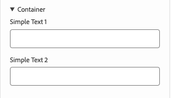
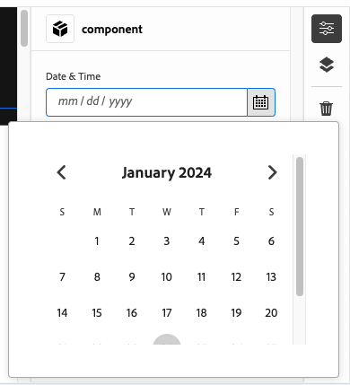

# モデル定義、フィールド、およびコンポーネントタイプ {#field-types}

プロパティパネルで編集できるフィールドとコンポーネントタイプの例について説明します。 モデル定義を作成し、コンポーネントにリンクすることで、独自のアプリを実装する方法を理解します。

{{universal-editor-status}}

## 概要 {#overview}

ユニバーサルエディターで使用する独自のアプリを適応させる場合は、コンポーネントを実装し、エディターのプロパティレールで操作できるフィールドとコンポーネントの種類を定義する必要があります。 これをおこなうには、モデルを作成し、コンポーネントからそのモデルにリンクします。

このドキュメントでは、モデル定義、フィールドの概要、および使用可能なコンポーネントタイプと設定例を説明します。

>[!TIP]
>
>ユニバーサルエディター用のアプリの実装方法がわからない場合は、ドキュメントを参照してください。 [AEM Developers 向けのユニバーサルエディターの概要。](/help/implementing/universal-editor/developer-overview.md)

## モデル定義構造 {#model-structure}

ユニバーサルエディターのプロパティレールを使用してコンポーネントを設定するには、モデル定義が存在し、そのコンポーネントにリンクされている必要があります。

モデル定義は、モデルの配列から始まる JSON 構造です。

```json
[
  {
    "id": "model-id",        // must be unique
    "fields": []             // array of fields which shall be rendered in the properties rail
  }
]
```

詳しくは、 **[フィールド](#fields)** このドキュメントの節で、 `fields` 配列。

コンポーネントでモデル定義を使用するには、 `data-aue-model` 属性を使用できます。

```html
<div data-aue-resource="urn:datasource:/content/path" data-aue-type="component"  data-aue-model="model-id">Click me</div>
```

## モデル定義のロード {#loading-model}

モデルを作成した後は、外部ファイルとして参照できます。

```html
<script type="application/vnd.adobe.aue.model+json" src="<url-of-model-definition>"></script>
```

または、モデルをインラインで定義することもできます。

```html
<script type="application/vnd.adobe.aue.model+json">
  { ... model definition ... }
</script>
```

## フィールド {#fields}

フィールドオブジェクトの型定義は次のとおりです。

| 設定 | 値タイプ | 説明 | 必須 |
|---|---|---|---|
| `component` | `ComponentType` | コンポーネントのレンダラー | はい |
| `name` | `string` | データを保持するプロパティ | はい |
| `label` | `FieldLabel` | フィールドのラベル | はい |
| `description` | `FieldDescription` | フィールドの説明 | いいえ |
| `placeholder` | `string` | フィールドのプレースホルダー | いいえ |
| `value` | `FieldValue` | デフォルト値 | いいえ |
| `valueType` | `ValueType` | 標準の検証では、次のことが可能です。 `string`, `string[]`, `number`, `date`, `boolean` | いいえ |
| `required` | `boolean` | 必須フィールドです | いいえ |
| `readOnly` | `boolean` | フィールドは読み取り専用です | いいえ |
| `hidden` | `boolean` | デフォルトで非表示になっているフィールドですか？ | いいえ |
| `condition` | `RulesLogic` | 次に基づいてフィールドの表示/非表示を切り替えるルール [条件](/help/implementing/universal-editor/customizing.md#conditionally-hide) | いいえ |
| `multi` | `boolean` | フィールドが複数フィールドである | いいえ |
| `validation` | `ValidationType` | フィールドの検証ルールまたはルール | いいえ |
| `raw` | `unknown` | コンポーネントで使用できる生データ | いいえ |

### コンポーネントタイプ {#component-types}

次に、フィールドのレンダリングに使用できるコンポーネントタイプを示します。

#### AEMタグ {#aem-tag}

AEMタグコンポーネントタイプでは、AEMタグピッカーを使用して、コンポーネントにタグを付けることができます。

>[!BEGINTABS]

>[!TAB サンプル]

```json
{
  "id": "aem-tag-picker",
  "fields": [
    {
      "component": "aem-tag",
      "label": "AEM Tag Picker",
      "name": "cq:tags",
      "valueType": "string"
    }
  ]
}
```

>[!TAB スクリーンショット]


>[!ENDTABS]

#### AEM Content {#aem-content}

AEMコンテンツコンポーネントタイプでは、AEMコンテンツピッカーを使用できます。このピッカーを使用して、コンテンツ参照を設定できます。

>[!BEGINTABS]

>[!TAB サンプル]

```json
{
  "id": "aem-content-picker",
  "fields": [
    {
      "component": "aem-content",
      "name": "reference",
      "value": "",
      "label": "AEM Content Picker",
      "valueType": "string"
    }
  ]
}
```

>[!TAB スクリーンショット]


>[!ENDTABS]

#### ブーリアン {#boolean}

ブール型のコンポーネントタイプは、切り替えとしてレンダリングされた単純な true/false 値を格納します。 追加の検証タイプを提供します。

| 検証タイプ | 値タイプ | 説明 | 必須 |
|---|---|---|---|
| `customErrorMsg` | `string` | 入力された値がブール値でない場合に表示されるメッセージ | いいえ |

>[!BEGINTABS]

>[!TAB サンプル 1]

```json
{
  "id": "boolean",
  "fields": [
    {
      "component": "boolean",
      "label": "Boolean",
      "name": "boolean",
      "valueType": "boolean"
    }
  ]
}
```

>[!TAB サンプル 2]

```json
{
  "id": "another-boolean",
  "fields": [
    {
      "component": "boolean",
      "label": "Boolean",
      "name": "boolean",
      "valueType": "boolean",
      "validation": {
        "customErrorMsg": "Think, McFly. Think!"
      }
    }
  ]
}
```

>[!TAB スクリーンショット]


>[!ENDTABS]

#### チェックボックスグループ {#checkbox-group}

ブール値と同様に、チェックボックスグループコンポーネントタイプでは、複数の true/false 項目を選択でき、複数のチェックボックスとしてレンダリングできます。

>[!BEGINTABS]

>[!TAB サンプル]

```json
{
  "id": "checkbox-group",
  "fields": [
    {
      "component": "checkbox-group",
      "label": "Checkbox Group",
      "name": "checkbox",
      "valueType": "string[]",
      "options": [
        { "name": "Option 1", "value": "option1" },
        { "name": "Option 2", "value": "option2" }
      ]
    }
  ]
}
```

>[!TAB スクリーンショット]


>[!ENDTABS]

#### コンテナ {#container}

コンテナコンポーネントタイプを使用すると、コンポーネントをグループ化できます。 追加の設定を提供します。

| 設定 | 値タイプ | 説明 | 必須 |
|---|---|---|---|
| `collapsible` | `boolean` | コンテナが折りたたみ可能かどうか | いいえ |

>[!BEGINTABS]

>[!TAB サンプル]

```json
 {
  "id": "container",
  "fields": [
    {
      "component": "container",
      "label": "Container",
      "name": "container",
      "valueType": "string",
      "collapsible": true,
      "fields": [
        {
          "component": "text-input",
          "label": "Simple Text 1",
          "name": "text",
          "valueType": "string"
        },
        {
          "component": "text-input",
          "label": "Simple Text 2",
          "name": "text2",
          "valueType": "string"
        }
      ]
    }
  ]
}
```

>[!TAB スクリーンショット]



#### コンテンツフラグメント {#content-fragment}

コンテンツフラグメントピッカーを使用して、 [コンテンツフラグメント](/help/sites-cloud/authoring/fragments/content-fragments.md) とそのバリエーション（必要に応じて） 追加の設定を提供します。

| 設定 | 値タイプ | 説明 | 必須 |
|---|---|---|---|
| `variationName` | `string` | 選択したバリエーションを保存する変数名。 未定義の場合、バリエーションピッカーは表示されません | いいえ |

>[!BEGINTABS]

>[!TAB サンプル 1]

```json
[
  {
    "id": "aem-content-fragment",
    "fields": [
      {
        "component": "aem-content-fragment",
        "name": "picker",
        "label": "Content Fragment Picker",
        "valueType": "string",
        "variationName": "contentFragmentVariation"
      }
    ]
  }
]
```

>[!TAB スクリーンショット]


>[!ENDTABS]

#### 日時 {#date-time}

日付時間コンポーネントタイプを使用すると、日付、時刻、またはその組み合わせを指定できます。 追加の設定を提供します。

| 設定 | 値タイプ | 説明 | 必須 |
|---|---|---|---|
| `displayFormat` | `string` | 日付文字列を表示するフォーマット | はい |
| `valueFormat` | `string` | 日付文字列を格納する形式 | はい |

また、追加の検証タイプも提供します。

| 検証タイプ | 値タイプ | 説明 | 必須 |
|---|---|---|---|
| `customErrorMsg` | `string` | 次の場合に表示するメッセージ： `valueFormat` 未満 | いいえ |

>[!BEGINTABS]

>[!TAB サンプル 1]

```json
{
  "id": "date-time",
  "fields": [
    {
      "component": "date-time",
      "label": "Date & Time",
      "name": "date",
      "valueType": "date"
    }
  ]
}
```

>[!TAB サンプル 2]

```json
{
  "id": "another-date-time",
  "fields": [
    {
      "component": "date-time",
       "valueType": "date-time",
      "name": "field1",
      "label": "Date Time",
      "description": "This is a date time field that stores both date and time.",
      "required": true,
      "placeholder": "YYYY-MM-DD HH:mm:ss",
      "displayFormat": null,
      "valueFormat": null,
      "validation": {
        "customErrorMsg": "Marty! You have to come back with me!"
      }
    },
    {
      "component": "date-time",
      "valueType": "date",
      "name": "field2",
      "label": "Another Date Time",
      "description": "This is another date time field that only stores the date.",
      "required": true,
      "placeholder": "YYYY-MM-DD",
      "displayFormat": null,
      "valueFormat": null,
      "validation": {
        "customErrorMsg": "Back to the future!"
      }
    },
    {
      "component": "date-time",
      "valueType": "time",
      "name": "field3",
      "label": "Yet Another Date Time",
      "description": "This is another date time field that only stores the time.",
      "required": true,
      "placeholder": "HH:mm:ss",
      "displayFormat": null,
      "valueFormat": null,
      "validation": {
        "customErrorMsg": "Great Scott!"
      }
    }
  ]
}
```

>[!TAB スクリーンショット]



>[!ENDTABS]

#### エクスペリエンスフラグメント {#experience-fragment}

エクスペリエンスフラグメントピッカーを使用して、 [エクスペリエンスフラグメント](/help/sites-cloud/authoring/fragments/experience-fragments.md) とそのバリエーション（必要に応じて） 追加の設定を提供します。

| 設定 | 値タイプ | 説明 | 必須 |
|---|---|---|---|
| `variationName` | `string` | 選択したバリエーションを保存する変数名。 未定義の場合、バリエーションピッカーは表示されません | いいえ |

>[!BEGINTABS]

>[!TAB サンプル 1]

```json
[
  {
    "id": "aem-experience-fragment",
    "fields": [
      {
        "component": "aem-experience-fragment",
        "name": "picker",
        "label": "Experience Fragment Picker",
        "valueType": "string",
        "variationName": "experienceFragmentVariation"
      }
    ]
  }
]
```

>[!TAB スクリーンショット]


>[!ENDTABS]


#### 複数選択 {#multiselect}

複数選択コンポーネントタイプは、選択可能な要素をグループ化する機能など、複数の項目をドロップダウンで選択するために表示します。

>[!BEGINTABS]

>[!TAB サンプル 1]

```json
{
  "id": "multiselect",
  "fields": [
    {
      "component": "multiselect",
      "name": "multiselect",
      "label": "Multi Select",
      "valueType": "string",
      "options": [
        { "name": "Option 1", "value": "option1" },
        { "name": "Option 2", "value": "option2" }
      ]
    }
  ]
}
```

>[!TAB サンプル 2]

```json
{
  "id": "multiselect-grouped",
  "fields": [
    {
      "component": "multiselect",
      "name": "property",
      "label": "Multiselect field",
      "valueType": "string",
      "required": true,
      "maxSize": 2,
      "options": [
        {
          "name": "Theme",
          "children": [
            { "name": "Light", "value": "light" },
            { "name": "Dark",  "value": "dark" }
          ]
        },
        {
          "name": "Type",
          "children": [
            { "name": "Alpha", "value": "alpha" },
            { "name": "Beta", "value": "beta" },
            { "name": "Gamma", "value": "gamma" }
          ]
        }
      ]
    }
  ]
}
```

>[!TAB スクリーンショット]


>[!ENDTABS]

#### 数値 {#number}

数値コンポーネントタイプを使用すると、数値を入力できます。 追加の検証タイプを提供します。

| 検証タイプ | 値タイプ | 説明 | 必須 |
|---|---|---|---|
| `numberMin` | `number` | 許可される最小数 | いいえ |
| `numberMax` | `number` | 許可される最大数 | いいえ |
| `customErrorMsg` | `string` | 次の場合に表示するメッセージ： `numberMin` または `numberMax` 未満 | いいえ |

>[!BEGINTABS]

>[!TAB サンプル 1]

```json
{
  "id": "number",
  "fields": [
    {
      "component": "number",
      "name": "number",
      "label": "Number",
      "valueType": "number",
      "value": 0
    }
  ]
}
```

>[!TAB サンプル 2]

```json
{
  "id": "another-number",
  "fields": [
   {
      "component": "number",
      "valueType": "number",
      "name": "field1",
      "label": "Number Field",
      "description": "This is a number field.",
      "required": true,
      "placeholder": null,
      "validation": {
        "numberMin": 0,
        "numberMax": 88,
        "customErrorMsg": "You also need 1.21 gigawatts."
      }
    }
  ]
}
```

>[!TAB スクリーンショット]


>[!ENDTABS]

#### ラジオグループ {#radio-group}

ラジオグループコンポーネントタイプを使用すると、チェックボックスグループと同様のグループとしてレンダリングされる複数のオプションから、相互に排他的な選択を行うことができます。

>[!BEGINTABS]

>[!TAB サンプル]

```json
{
  "id": "radio-group",
  "fields": [
    {
      "component": "radio-group",
      "label": "Radio Group",
      "name": "radio",
      "valueType": "string",
      "options": [
        { "name": "Option 1", "value": "option1" },
        { "name": "Option 2", "value": "option2" }
      ]
    }
  ]
}
```

>[!TAB スクリーンショット]


>[!ENDTABS]

#### 参照 {#reference}

参照コンポーネントタイプを使用すると、現在のオブジェクトから別のデータオブジェクトへの参照が可能になります。

>[!BEGINTABS]

>[!TAB サンプル]

```json
{
  "id": "reference",
  "fields": [
    {
      "component": "reference",
      "label": "Reference",
      "name": "reference",
      "valueType": "string"
    }
  ]
}
```

>[!TAB スクリーンショット]


>[!ENDTABS]

#### 選択 {#select}

コンポーネントタイプを選択すると、ドロップダウンメニューの定義済みオプションのリストから 1 つのオプションを選択できます。

>[!BEGINTABS]

>[!TAB サンプル]

```json
{
  "id": "select",
  "fields": [
    {
      "component": "select",
      "label": "Select",
      "name": "select",
      "valueType": "string",
      "options": [
        { "name": "Option 1", "value": "option1" },
        { "name": "Option 2", "value": "option2" }
      ]
    }
  ]
}
```

>[!TAB スクリーンショット]


>[!ENDTABS]

#### タブ {#tab}

タブコンポーネントタイプを使用すると、他の入力フィールドを複数のタブでグループ化して、作成者がレイアウトを構成しやすくすることができます。

A `tab` 定義は、 `fields`. 次の日以降のすべて `tab` 新しい `tab` が検出された後、次の項目が新しいタブに配置されます。

すべてのタブの上に項目を表示する場合は、その項目をタブの前に定義する必要があります。

>[!BEGINTABS]

>[!TAB サンプル]

```json
{
  "id": "tab",
  "fields": [
    {
      "component": "tab",
      "label": "Tab 1",
      "name": "tab1"
    },
    {
      "component": "text-input",
      "label": "Text 1",
      "name": "text1",
      "valueType": "string"
    },
    {
      "component": "tab",
      "label": "Tab 2",
      "name": "tab2"
    },
    {
      "component": "text-input",
      "label": "Text 2",
      "name": "text2",
      "valueType": "string"
    }
  ]
}
```

>[!TAB スクリーンショット]


>[!ENDTABS]

#### テキスト領域 {#text-area}

テキスト領域を使用すると、複数行のリッチテキスト入力が可能です。 追加の検証タイプを提供します。

| 検証タイプ | 値タイプ | 説明 | 必須 |
|---|---|---|---|
| `maxSize` | `number` | 許可される最大文字数 | いいえ |
| `customErrorMsg` | `string` | 次の場合に表示するメッセージ： `maxSize` が超過しています | いいえ |

>[!BEGINTABS]

>[!TAB サンプル 1]

```json
{
  "id": "richtext",
  "fields": [
    {
      "component": "text-area",
      "name": "rte",
      "label": "Rich Text",
      "valueType": "string"
    }
  ]
}
```

>[!TAB サンプル 2]

```json
{
  "id": "another-richtext",
  "fields": [
    {
      "component": "text-area",
      "name": "rte",
      "label": "Rich Text",
      "valueType": "string",
      "validation": {
        "maxSize": 1000,
        "customErrorMsg": "That's about as funny as a screen door on a battleship."
      }
    }
  ]
}
```

>[!TAB スクリーンショット]


>[!ENDTABS]

#### テキスト入力 {#text-input}

テキスト入力を使用すると、1 行のテキスト入力が可能になります。  追加の検証タイプも含まれます。

| 検証タイプ | 値タイプ | 説明 | 必須 |
|---|---|---|---|
| `minLength` | `number` | 使用できる最小文字数 | いいえ |
| `maxLength` | `number` | 許可される最大文字数 | いいえ |
| `regExp` | `string` | 入力テキストが一致する必要がある正規表現 | いいえ |
| `customErrorMsg` | `string` | 次の場合に表示するメッセージ： `minLength`, `maxLength`，および/または `regExp` 違反/違反 | いいえ |

>[!BEGINTABS]

>[!TAB サンプル 1]

```json
{
  "id": "simpletext",
  "fields": [
    {
      "component": "text-input",
      "name": "text",
      "label": "Simple Text",
      "valueType": "string"
    }
  ]
}
```

>[!TAB サンプル 2]

```json
{
  "id": "another simpletext",
  "fields": [
    {
      "component": "text-input",
      "name": "text",
      "label": "Simple Text",
      "valueType": "string",
      "description": "This is a text input with validation.",
      "required": true,
      "validation": {
        "minLength": 1955,
        "maxLength": 1985,
        "regExp": "^foo:.*",
        "customErrorMsg": "Why don't you make like a tree and get outta here?"
      }
    }
  ]
}
```

>[!TAB スクリーンショット]


>[!ENDTABS]
