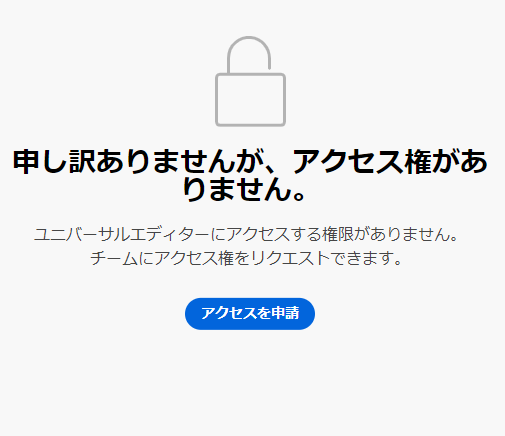

# AEM のユニバーサルエディターの概要 {#getting-started}

ユニバーサルエディターへのアクセス権を取得する方法と、これを使用するために最初の AEM アプリのインストルメントを開始する方法について説明します。

>[!TIP]
>
>すぐに例を確認したい場合は、[GitHub のユニバーサルエディターサンプルアプリ](https://github.com/adobe/universal-editor-sample-editable-app)を参照してください。

{{universal-editor-status}}

## オンボーディング手順 {#onboarding}

ユニバーサルエディターは任意のソースからコンテンツを編集できますが、このドキュメントでは AEM アプリを例として使用します。

AEM アプリをオンボーディングし、ユニバーサルエディターを使用できるようにするには、手順がいくつかあります。

1. [ユニバーサルエディターへのアクセスをリクエストします。](#request-access)
1. [ユニバーサルエディターのコアライブラリを含めます。](#core-library)
1. [必要な OSGi 設定を追加します。](#osgi-configurations)
1. [ページを実装します。](#instrument-page)

このドキュメントでは、これらの手順を説明します。

## ユニバーサルエディターへのアクセスをリクエスト {#request-access}

最初にユニバーサルエディターへのアクセスをリクエストする必要があります。開く [&#39;https://experience.adobe.com/#/aem/editor&quot;](https://experience.adobe.com/#/aem/editor)、ログインし、ユニバーサルエディターにアクセスできるかどうかを検証します。

アクセス権がない場合は、同じページにリンクされたフォームからリクエストできます。



「**利用申請**」をクリックして、アクセスをリクエストするフォームに入力します。リクエストを確認したアドビ担当者から、ユースケースについて話し合うために連絡が届きます。

## ユニバーサルエディターコアライブラリを含める {#core-library}

ユニバーサルエディターで使用できるようにアプリの実装を行う前に、次の依存関係を含める必要があります。

```javascript
@adobe/universal-editor-cors
```

実装を有効にするには、以下の読み込みを `index.js` に追加する必要があります。

```javascript
import "@adobe/universal-editor-cors";
```

### 非 React アプリの代替 {#alternative}

React アプリを実装していない場合や、サーバーサイドでのレンダリングが必要な場合は、ドキュメント本文に次のものを含める方法もあります。

```html
<script src="https://cdn.jsdelivr.net/gh/adobe/universal-editor-cors/dist/universal-editor-embedded.js" async></script>
```

## 必要な OSGi 設定を追加 {#osgi-configurations}

ユニバーサルエディターを使用して AEM コンテンツをアプリで編集するには、AEM 内で CORS と Cookie の設定を行う必要があります。

次の [OSGi 設定は、AEM オーサリングインスタンスで設定する必要があります。](/help/implementing/deploying/configuring-osgi.md)

* `com.day.crx.security.token.impl.impl.TokenAuthenticationHandler` の `SameSite Cookies = None`
* `org.apache.sling.engine.impl.SlingMainServlet` の X-FRAME-OPTIONS: SAMEORIGIN ヘッダーを削除します

### com.day.crx.security.token.impl.impl.impl.TokenAuthenticationHandler {#samesite-cookies}

ログイントークン cookie は、サードパーティドメインとして AEM に送信する必要があります。したがって、SameSite cookie を明示的に `None` に設定する必要があります。

このプロパティは、`com.day.crx.security.token.impl.impl.TokenAuthenticationHandler` OSGi 設定で設定される必要があります。

```xml
<?xml version="1.0" encoding="UTF-8"?>
<jcr:root xmlns:sling="http://sling.apache.org/jcr/sling/1.0"
          xmlns:jcr="http://www.jcp.org/jcr/1.0" jcr:primaryType="sling:OsgiConfig"
          token.samesite.cookie.attr="None" />
```

### org.apache.sling.engine.impl.SlingMainServlet {#sameorigin}

X-Frame-Options: SAMEORIGIN は、iframe 内で AEM ページのレンダリングを防ぎます。ヘッダーを削除すると、ページを読み込むことができます。

このプロパティは、`org.apache.sling.engine.impl.SlingMainServlet` OSGi 設定で設定する必要があります。

```xml
<?xml version="1.0" encoding="UTF-8"?>
<jcr:root xmlns:sling="http://sling.apache.org/jcr/sling/1.0"
          xmlns:jcr="http://www.jcp.org/jcr/1.0"
          jcr:primaryType="sling:OsgiConfig"
          sling.additional.response.headers="[X-Content-Type-Options=nosniff]"/>
```

## ページの実装 {#instrument-page}

ユニバーサルエディターサービスは、編集中のアプリのコンテンツに対して正しいバックエンドシステムを識別して利用するために、[統一リソース名（URN）](https://ja.wikipedia.org/wiki/Uniform_Resource_Name)を要求します。したがって、コンテンツをコンテンツリソースにマッピングし直すには、URN スキーマが必要です。

### 接続の作成 {#connections}

アプリで使用する接続は、ページの `<head>` 内に `<meta>` タグとして格納されます。

```html
<meta name="urn:adobe:aue:<category>:<referenceName>" content="<protocol>:<url>">
```

* `<category>` - これは、2 つのオプションを持つ接続の分類です。
   * `system` - 接続エンドポイントの場合
   * `config` - [オプション設定の定義](#configuration-settings)の場合
* `<referenceName>` - 接続を識別するためにドキュメントで再利用される短い名前です。例：`aemconnection`
* `<protocol>` - 使用するユニバーサルエディター永続化サービスの永続化プラグインを示します。例：`aem`
* `<url>` - 変更が保持されるシステムの URL です。例：`http://localhost:4502`

識別子 `urn:adobe:aue:system` は、Adobe Universal Editor の接続を表します。

`data-aue-resource` は `urn` プレフィックスを使用して識別子を短縮します。

```html
data-aue-resource="urn:<referenceName>:<resource>"
```

* `<referenceName>` - `<meta>` タグに記載されている名前付きリファレンスです。例：`aemconnection`
* `<resource>` - ターゲットシステム内のリソースへのポインターです。例：`/content/page/jcr:content` などの AEM コンテンツのパス

>[!TIP]
>
>ユニバーサルエディターが必要とするデータ属性とタイプについて詳しくは、ドキュメント[属性とタイプ](attributes-types.md)を参照してください。

### 接続例 {#example}

```html
<meta name="urn:adobe:aue:system:<referenceName>" content="<protocol>:<url>">

<html>
<head>
    <meta name="urn:adobe:aue:system:aemconnection" content="aem:https://localhost:4502">
    <meta name="urn:adobe:aue:system:fcsconnection" content="fcs:https://example.franklin.adobe.com/345fcdd">
</head>
<body>
        <aside>
          <ul data-aue-resource="urn:aemconnection:/content/example/list" data-aue-type="container">
            <li data-aue-resource="urn:aemconnection/content/example/listitem" data-aue-type="component">
              <p data-aue-prop="name" data-aue-type="text">Jane Doe</p>
              <p data-aue-prop="title" data-aue-type="text">Journalist</p>
              
            </li>

...

            <li data-aue-resource="urn:fcsconnection:/documents/mytext" data-aue-type="component">
              <p data-aue-prop="name" data-aue-type="text">John Smith</p>
              <p data-aue-resource="urn:aemconnection/content/example/another-source" data-aue-prop="title" data-aue-type="text">Photographer</p>
              
            </li>
          </ul>
        </aside>
</body>
</html>
```

### 設定 {#configuration-settings}

接続 URN で `config` プレフィックスを使用して、必要に応じてサービスおよび拡張エンドポイントを設定します。

アドビがホストするユニバーサルエディターサービスを使用しない場合は、これはメタタグで設定できます。ユニバーサルエディターが提供するデフォルトのサービスエンドポイントを上書きするには、独自のサービスエンドポイントを設定します。

* メタ名 - `urn:adobe:aue:config:service`
* メタコンテンツ - `content="https://adobe.com"`（例）

```html
<meta name="urn:adobe:aue:config:service" content="<url>">
```

ページに対して特定の拡張機能のみを有効にしたい場合は、メタタグで設定できます。拡張機能を取得するには、拡張機能エンドポイントを設定します。

* メタ名：`urn:adobe:aue:config:extensions`
* メタコンテンツ：`content="https://adobe.com,https://anotherone.com,https://onemore.com"`（例）

```html
<meta name="urn:adobe:aue:config:extensions" content="<url>,<url>,<url>">
```

## ユニバーサルエディターを使用する準備が整いました {#youre-ready}

ユニバーサルエディターを使用するようにアプリのインストルメントが行われました。

コンテンツ作成者が簡単かつ直感的にユニバーサルエディターを使用してコンテンツを作成する方法について詳しくは、[ユニバーサルエディターを使用したコンテンツの作成](authoring.md)を参照してください。

## その他のリソース {#additional-resources}

ユニバーサルエディターの詳細については、次のドキュメントを参照してください。

* [ユニバーサルエディターの概要](introduction.md) - ユニバーサルエディターを使用して、優れたエクスペリエンスを提供し、コンテンツベロシティを向上させ、最新のデベロッパーエクスペリエンスを提供するために、あらゆる実装、あらゆるコンテンツ、あらゆる側面の編集を可能にする方法を説明します。
* [ユニバーサルエディターを使用したコンテンツのオーサリング](authoring.md) - コンテンツ作成者がユニバーサルエディターを使用して、簡単かつ直感的にコンテンツを作成する方法について説明します。
* [ユニバーサルエディターを使用したコンテンツの公開](publishing.md) - ユニバーサルエディターでのコンテンツの公開方法と、アプリでの公開済みコンテンツの処理方法を説明します。
* [ユニバーサルエディターのアーキテクチャ](architecture.md) - ユニバーサルエディターのアーキテクチャと、そのサービスとレイヤー間でのデータのフローについて説明します。
* [属性とタイプ](attributes-types.md) - ユニバーサルエディターで必要なデータ属性とデータ型について説明します。
* [ユニバーサルエディターの認証](authentication.md) - ユニバーサルエディターの認証方法について説明します。
