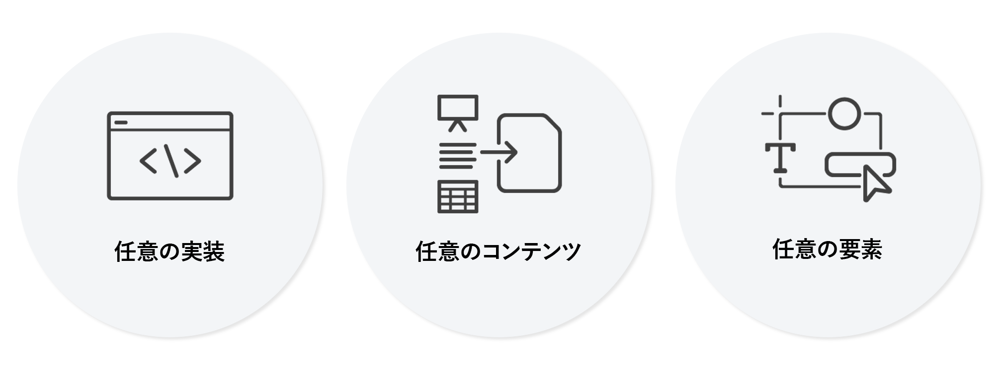

# ユニバーサルエディターの概要 {#introduction}

ユニバーサルエディターは、Adobe Experience Manager Sites の一部である多用途のビジュアルエディターです。これにより、作成者は任意のヘッドレスエクスペリエンスまたはヘッドフルエクスペリエンスを見たとおりに編集できる（WYSIWYG）ようになります。コンテンツ作成者が優れたエクスペリエンスを提供するうえでどのように役立つか、また開発者にもたらされる比類のない自由について説明します。

## 背景 {#background}

ユニバーサルエディターでは、最小限のトレーニングで効率的かつ直感的なコンテキストに応じたオーサリングを行えるようになります。これを使用すると、作成者は web エクスペリエンスのコンテキストでコンテンツを直接管理でき、訪問者にコンテンツがどのように表示されるかを正確に把握できます。サービスとしてのエディターの役割を真の意味で果たしており、全体的に柔軟性が向上しているので、最終的にはページエディターに取って代わる予定です。

ユニバーサルエディターはあらゆる形式の AEM コンテンツに対して同じ一貫したビジュアル編集をサポートしているので、作成者はその柔軟性の恩恵を受けることができます。コンテンツフラグメントに対してもページコンポーネントに対しても、同様にインプレース編集とレイアウト構成が可能です。この 2 つのコンテンツ形式を web エクスペリエンスで並べて表示して、作成者がコンテキストを切り替えることなく編集することさえできます。これは、1 つのコンテンツタイプしかサポートしていなかった AEM の以前のエディターと比べると、大幅な改善です。

ユニバーサルエディターは実装の真の分離もサポートしているので、開発者はユニバーサルエディターの汎用性の恩恵を受けることができます。これにより、開発者は SDK やテクノロジの制約を受けずに、事実上任意のフレームワークやアーキテクチャを利用できるようになります。このような柔軟性により、既存の web アプリを再設計しなくても、ユニバーサルエディター用に簡単に実装できるようになります。

## まさにユニバーサル {#universal}

ユニバーサルエディターは、あらゆる実装、あらゆるコンテンツ、コンテンツのあらゆる側面に対してインストルメントを行えます。

### あらゆる実装 {#any-implementation}

エクスペリエンスは様々な方法で構築できるので、ユニバーサルエディターはあらゆる実装で利用でき、作成者のコンテキスト内編集を可能にします。

ヘッドレス実装では、作成者はすべてのコンテンツの編集をフォームベースの UI で行うように制限されると考えられがちですが、ユニバーサルエディターではそのようなことはありません。

実装でユニバーサルエディターを使用するための要件はわかりやすく、以下をサポートしています。

* **任意のアーキテクチャ** - サーバーサイドレンダリング、エッジサイドレンダリング、クライアントサイドレンダリングなど。
* **あらゆるフレームワーク** - Vanilla AEM または React、Next.js、Angular などのあらゆるサードパーティフレームワーク。
* **あらゆるホスティング** - AEM に対してローカルで、またはリモートドメインでホスト可能

### あらゆるコンテンツ {#any-content}

コンテンツ作成者は、以前 AEM ページエディターで提供されていたものと同じ強力な編集操作を使用できます。ただし、ユニバーサルエディターを使用すると、コンテンツ作成者は&#x200B;**あらゆる**&#x200B;コンテンツを視覚的にコンテキスト内で編集でき、次のことがサポートされます。

* **AEM ページ構造** - エクスペリエンスフラグメントを含む、`cq:Pages` のネストされた `cq:Components`
* **AEM コンテンツフラグメント** - エクスペリエンスのコンテキスト内に表示されるコンテンツフラグメントのコンテンツの編集。
* **ドキュメント** - 概念実証により、Word、Excel、Google Docs、Markdown の各ドキュメントも同じ方法で編集できることが示されました（現在進行中です）。

### あらゆる側面 {#any-aspect}

コンテンツ作成者の場合、コンテンツは単に情報を含むものではなく、どのようにレンダリングされ、受信されるかが重要です。コンテンツには、次のようなメタデータとインストルメンテーションルールが追加されています。ユニバーサルエディターでは、これらを理解して編集することができます。

* **レイアウトとスタイルの適用** - スタイルシステムを使用すると、マーケティング実施者とコンテンツ作成者は、コンテンツに異なるスタイルを適用し、列、カルーセル、タブ、アコーディオンなどのコンテンツに異なるレイアウトを作成できます。

## 値 {#value}

コンテンツ編集エクスペリエンスを特定のコンテンツ配信システムから分離することで、エディターはまさにユニバーサルかつ柔軟になり、コンテンツ作成者が優れたエクスペリエンスを提供し、コンテンツベロシティを向上し、最新のデベロッパーエクスペリエンスを提供することを可能にします。

* **優れたエクスペリエンスを提供** - 実務担当者が訪問者にとって魅力的なエクスペリエンスを作成できるように、ユニバーサルエディターではプレビューのコンテキストでコンテンツを作成および編集できます。これにより、エクスペリエンスのデザインに合わせ、訪問者にとって意味のあるジャーニーを構成するコンテンツを作成できます。
* **コンテンツベロシティの向上** - 実務担当者の管理ワークフローを効率化するために、ユニバーサルエディターではプレビュー内のコンテンツを編集できるので、実務担当者はそのコンテキストに関連するオプションのみを表示し、ワークフローをコンテンツソースから独立させることができます。
* **最先端の開発者エクスペリエンス** - 現実世界では複数の異なるアプリケーションが使用される状況をサポートするために、ユニバーサルエディターは完全に分離され、テクノロジーに依存しないので、開発者は好みのテクノロジースタックを使用してエクスペリエンスを実装できます。

## ユニバーサルエディターとコンテンツフラグメントエディター {#universal-editor-content-fragment-editor}

一見すると、ユニバーサルエディターとコンテンツフラグメントエディターは、同様の編集機能が用意されているように思えるかもしれません。しかし、これらのエディターは極めて異なる機能を提供し、それぞれマーケティング実施者の異なる仕事を達成するのに使用されます。

### コンテンツフラグメントエディター {#content-fragment-editor}

マーケティング実施者は、レイアウトを気にすることなくコンテンツを作成したいので、コンテンツはエクスペリエンスの多くのコンテキストで再利用できます。

* 基本的な作業は、コンテンツ戦略を拡大することです。

### ユニバーサルエディター {#universal-editor}

マーケティング実施者は、特定のコンテキストのレイアウトに合わせたコンテンツを作成して、優れたエクスペリエンスを提供したいと考えています。

* 達成すべき基本的な仕事は、説得力を持って読者とつながることです。

## 制限事項 {#limitations}

ユニバーサルエディターを探索し、独自のプロジェクトへの実装を進める際には、次の制限事項に留意してください。

* 単一ページの実装として参照できる AEM リソース（コンテンツフラグメント、ページ、エクスペリエンスフラグメント、アセットなど）は 25 個以下にする必要があります。
* サポートされている AEM バックエンドは、AEM as a Cloud Service と ](https://experienceleague.adobe.com/ja/docs/experience-manager-65/content/implementing/developing/headless/universal-editor/introduction)AEM 6.5[ のみです。
* AEM as a Cloud Service リリース `2023.8.13099` 以降が必要です。
* コンテンツ作成者は、独自の Experience Cloud アカウントを持つ必要があります。
* AEM の一部として、ユニバーサルエディターは AEM と同じデスクトップブラウザーをサポートします。
   * これらのブラウザーのモバイルバージョンはサポートされていません。

{{ue-ip-allow-lists}}

## 次の手順 {#next-steps}

ユニバーサルエディターの一般的なユースケースの詳細と、プロジェクトをサポートする適切なドキュメントリソースを見つけるには、[ユニバーサルエディターのユースケースと学習パス](/help/implementing/universal-editor/use-cases.md)のドキュメントを参照してください。
