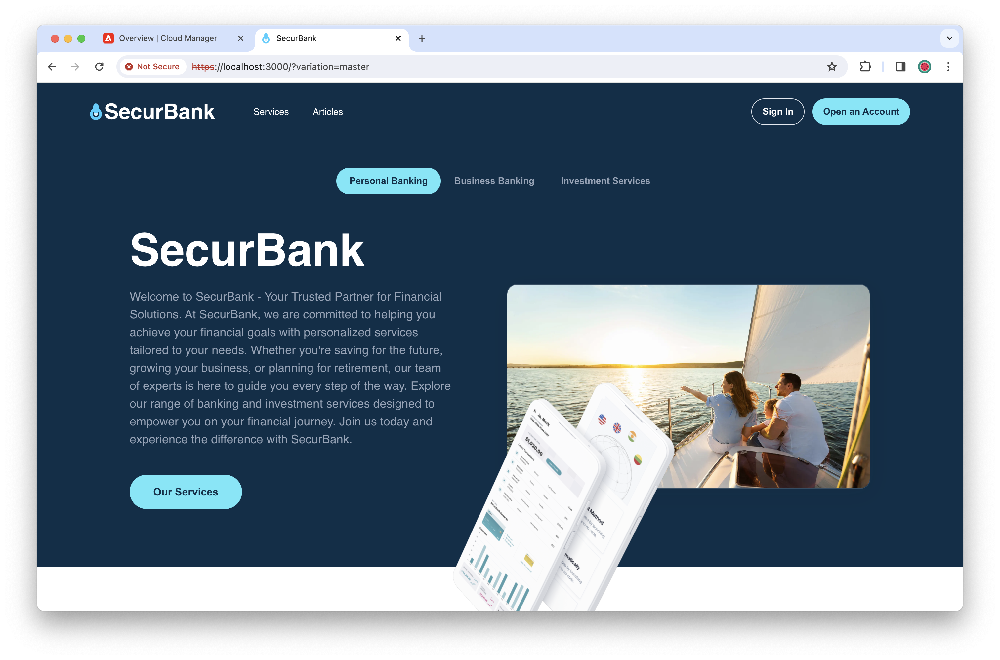

# ユニバーサルエディター用 SecurBank サンプルアプリ {#securbank}

ユニバーサルエディターの概要と、SecurBank アプリを使用した実践エクスペリエンスについて説明します。このアプリは、コンテンツ作成を高速化するユニバーサルエディターの機能、柔軟性、使いやすさを紹介するように設計されています。

## 前提条件 {#prerequisites}

* SecurBank アプリをインストールするには、**AEM 管理者**[製品プロファイル](/help/journey-onboarding/assign-profiles-aem.md)に割り当てられている必要があります。
* ローカル開発には、[Node.js](https://nodejs.org) バージョン 20 以降がインストールされている必要があります。

## SecurBank のインストール {#installation}

SecurBank アプリのインストールは簡単ですが、AEM as a Cloud Service の多くの領域に関係するので、いくつかの手順が必要になります。主な手順の概要は次のとおりです。

1. [Cloud Manager でサンドボックスプログラムを作成](#create-sandbox-program)
1. [プログラムの Git リポジトリのクローンを作成し、SecurBank AEM プロジェクトコンテンツで更新](#clone-and-update)
1. [パイプラインを実行して、SecurBank AEM プロジェクトをデプロイ](#run-pipeline)
1. [ローカル web アプリ開発用の Cloud Manager 資格情報を取得](#retrieve-credentials)
1. [SecurBank web アプリをダウンロードして設定](#download-web-app)
1. [SecurBank web アプリを実行](#run-web-app)

次の節では、必要な個々のタスクについて詳しく説明します。

### Cloud Manager でサンドボックスプログラムを作成 {#create-sandbox-program}

SecurBank をインストールできる新しい Cloud Manager プログラムが必要になります。

1. [my.cloudmanager.adobe.com](https://my.cloudmanager.adobe.com/) で Cloud Manager にログインし、適切な組織を選択します。

1. SecurBank アプリ用の新しいサンドボックスプログラムを作成します。

   * 「**ソリューションとアドオン**」を選択する際は、デフォルトのオプションを使用します。
   * サンドボックスプログラムの作成方法について詳しくは、[サンドボックスプログラムの作成](/help/implementing/cloud-manager/getting-access-to-aem-in-cloud/creating-sandbox-programs.md)ドキュメントを参照してください。

### プログラムの Git リポジトリのクローンを作成し、SecurBank AEM プロジェクトコンテンツで更新 {#clone-and-update}

1. プログラムを作成したら、これを開き、「**リポジトリ**」タブで「**リポジトリ情報へアクセス**」ボタンをタップまたはクリックして&#x200B;**リポジトリ情報**&#x200B;ダイアログを開き、サンドボックス環境の Git リポジトリにアクセスするために必要な資格情報を表示します。

   * リポジトリ情報にアクセスする方法について詳しくは、[リポジトリへのアクセス](/help/implementing/cloud-manager/managing-code/accessing-repos.md)ドキュメントを参照してください。

1. **リポジトリ情報**&#x200B;ダイアログの資格情報を使用して、ローカルマシンにリポジトリのクローンを作成します。

1. ローカルクローンのフォルダーを見つけて開き、非表示ファイル／ドットファイルを除くすべてのコンテンツを削除します。

1. ドロップダウンで「**コード**」、「**zip ファイルをダウンロード**」の順にクリックして、[`https://github.com/Adobe-Marketing-Cloud/summit-2024-l425-securbank`](https://github.com/Adobe-Marketing-Cloud/summit-2024-l425-securbank) の GitHub から最新の SecurBank AEM プロジェクトコードを取得します。

1. ローカルファイルシステムで zip ファイルの内容を解凍し、サンドボックスプログラムのローカルクローンの空になったフォルダーに移動します。

1. ターミナルを使用して、クローンが作成されたプロジェクトのフォルダーに切り替え、すべてのコンテンツをコミットして Git にプッシュします。

   1. `git add --all`
   1. `git commit -m "Adding SecurBank app code"`
   1. `git push`

### パイプラインを実行して、SecurBank AEM プロジェクトをデプロイ {#run-pipeline}

SecurBank の AEM プロジェクトをサンドボックスリポジトリにコミットすると、パイプラインを使用してデプロイできます。

1. Cloud Manager のサンドボックスプログラムの「**概要**」タブに戻り、フルスタックの実稼動以外の環境パイプラインを実行します。

   * パイプライン実行のすべてのオプションをオフにします。
   * パイプラインの実行について詳しくは、[パイプラインの管理](/help/implementing/cloud-manager/configuring-pipelines/managing-pipelines.md#running-pipelines)ドキュメントを参照してください。

### ローカル web アプリ開発用の Cloud Manager 資格情報を取得 {#retrieve-credentials}

SecurBank アプリを実行する前に、アプリを Cloud Manager に接続するための Cloud Manager 資格情報が必要になります。

1. パイプラインの実行中に、Cloud Manager の「**概要**」タブに戻り、環境名の横にある省略記号ボタンをタップまたはクリックして、「**Developer Console**」を選択します。

1. Developer Console で、「**統合**」タブ、「**ローカルトークン**」タブの順に選択して、「**ローカル開発トークンを取得**」をタップまたはクリックします。

1. アクセストークンを使用して JSON ファイルを生成します。Developer Console を閉じて Cloud Manager に戻る前に、トークン自体のみ（残りの JSON は不要）を、今後の手順で使用するために安全な場所にコピーします。

1. Cloud Manager に戻り、「**概要**」タブで環境の URL を右クリックしてコピーし、今後の手順で使用するために安全な場所に保存します。

### SecurBank web アプリをダウンロードして設定 {#download-web-app}

これで、SecurBank web アプリをダウンロードして設定できます。

1. ドロップダウンで「**コード**」、「**ZIP をダウンロード**」の順にクリックして、[`https://github.com/Adobe-Marketing-Cloud/summit-2024-l425/tree/ue-z-final-with-events`](https://github.com/Adobe-Marketing-Cloud/summit-2024-l425/tree/ue-z-final-with-events) の GitHub から最新の SecurBank アプリコードを取得します。

1. ローカルファイルシステムで zip ファイルの内容を解凍します。

1. 優先コードエディターを起動し、SecurBank アプリプロジェクトの `summit-2024-l425-ue-z-final-with-events/react-app/.env` にある非表示の環境ファイルを開きます。

1. `.env` ファイルに次の変更を行って、変更を保存します。

   * `REACT_APP_HOST_URI` の場合、環境の以前にコピーした URL の値をペーストします。
   * `REACT_APP_DEV_TOKEN` の場合、以前にコピーしたローカル開発トークンの値をペーストします。

### SecurBank web アプリを実行 {#run-web-app}

Cloud Manager とローカルの両方ですべてを設定すると、SecurBank web アプリを実行できます。

1. ローカルマシンのコマンドラインで、ダウンロードして解凍した SecurBank アプリプロジェクトの `react-app` フォルダーに移動します。

1. `react-app` フォルダーで、`node -i` コマンドを使用して SecurBank アプリをインストールします。

1. インストールしたら、`npm start` コマンドで SecurBank アプリを起動します。

1. インストールと起動が成功した場合は、次のように表示されます。

* ターミナルに次の出力が表示されます。

  ```text
  Compiled successfully!
  
  You can now view securbank in the browser.
  
    Local:            https://localhost:3000
    On Your Network:  https://192.168.1.15:3000
  
  Note that the development build is not optimized.
  To create a production build, use npm run build.
  
  webpack compiled successfully
  ```

   * ブラウザーウィンドウが開き、URL `https://localhost:3000` が表示されます。

      * これは開発目的であり、有効な証明書は提供されません。そのため、ブラウザーにページへのアクセスを許可するように通知する必要がある場合があります。

これで完了です。これで、ブラウザーで SecurBank アプリが正常に実行されていることがわかります。

コンテンツがまだ表示されない場合は、実行した&#x200B;**開発環境にデプロイ**&#x200B;パイプラインが正常に完了したことを確認してください。


