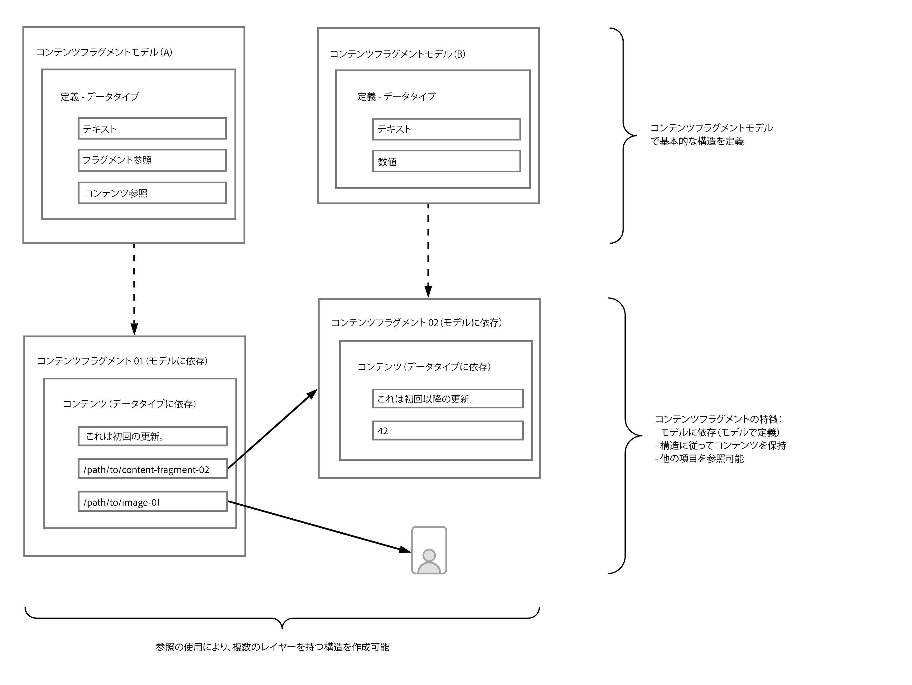

# AEM でのヘッドレス向けコンテンツモデリングの基本について {#content-modeling-headless-basics}

## これまでの説明内容 {#story-so-far}

[AEM ヘッドレスコンテンツアーキテクトジャーニー](overview.md)の冒頭の[はじめに](introduction.md)で、ヘッドレス向けコンテンツのモデリングに関連する基本概念と用語について説明しました。

この記事では、これらの原則に基づいて、AEM ヘッドレスプロジェクト用にコンテンツをモデル化する方法を理解します。

## 目的 {#objective}

* **対象読者**：初心者
* **目的**：ヘッドレス CMS 向けコンテンツモデリングの概念を紹介します。

## コンテンツフラグメントモデルを使用したコンテンツモデリング {#architect-content-fragment-models}

コンテンツ（データ）モデリングは確立された一連のテクニックで、関係データベースを開発する際によく使用されますが、AEM ヘッドレスではどのような意味を持つのでしょうか。

### 使用する理由 {#why}

アプリケーションが AEM から必要なコンテンツを一貫して効率的に要求し、受け取れるようにするには、このコンテンツが構造化されている必要があります。

つまり、アプリケーションは、事前に応答の形式を把握し、その処理方法を把握しています。これは、自由形式のコンテンツを受け取るよりもはるかに簡単です。自由形式のコンテンツを受け取る場合は、そのコンテンツの内容と使用方法を判断するために解析する必要があります。

### 仕組みの概要 {#how}

AEM は、コンテンツフラグメントを使用して、コンテンツをアプリケーションにヘッドレスに配信するために必要な構造を提供します。

コンテンツモデルの構造には次が当てはまります。

* コンテンツフラグメントモデルの定義によって実現される。
* コンテンツ生成に使用されるコンテンツフラグメントの基礎として使用される。

>[!NOTE]
>
>コンテンツフラグメントモデルは、AEM GraphQL スキーマの基礎としても使用され、コンテンツを取得するために使用されます。これについては開発者ジャーニーでさらに説明します。

コンテンツのリクエストは、標準の GraphQL API のカスタマイズされた実装である AEM GraphQL API を使用して行われます。AEM GraphQL API を使用すると、アプリケーションはコンテンツフラグメントで（複雑な）クエリを実行できます。各クエリは、特定のモデルタイプに従っています。

返されたコンテンツは、アプリケーションで使用できます。

## コンテンツフラグメントモデルを使用した構造の作成 {#create-structure-content-fragment-models}

コンテンツフラグメントモデルは、コンテンツの構造を定義するための様々なメカニズムを提供します。

コンテンツフラグメントモデルは、エンティティを記述します。

>[!NOTE]
>新しいモデルを作成できるように、設定ブラウザーでコンテンツフラグメント機能を有効にする必要があります。

>[!TIP]
>
>コンテンツフラグメントの作成時に選択するモデルをコンテンツ作成者が把握できるように、モデルに名前を付ける必要があります。

モデル内：

1. **データタイプ**&#x200B;を使用すると、個々の属性を定義できます。例えば、教師の名前を持つフィールドを **Text** とし、その勤続年数を **Number** と定義します。
1. **コンテンツ参照**&#x200B;および&#x200B;**フラグメント参照**&#x200B;データタイプを使用すると、AEM 内の他のコンテンツとの関係を作成できます。
1. **フラグメント参照**&#x200B;データタイプを使用すると、（モデルタイプに従って）コンテンツフラグメントをネストすることで、複数レベルの構造を実現できます。これは、コンテンツモデリングに不可欠です。

例：

## データタイプ {#data-types}

AEM では、コンテンツをモデル化するために次のデータタイプが用意されています。

* 1 行のテキスト
* 複数行テキスト
* 数値
* ブール値
* 日時
* 定義済みリスト
* タグ
* フラグメント参照
* フラグメント参照（UUID）
* コンテンツ参照
* コンテンツ参照（UUID）
* JSON オブジェクト
* タブプレースホルダー

>[!NOTE]
>
>詳しくは、「コンテンツフラグメントモデル - データタイプ」を参照してください。

## 参照とネストされたコンテンツ {#references-nested-content}

2 つのデータタイプは、特定のフラグメント外のコンテンツへの参照を提供します。

* **コンテンツ参照**/**コンテンツ参照（UUID）**
これにより、あらゆるタイプの他のコンテンツへの簡単な参照が提供されます。
例えば、指定した場所で画像を参照できます。

* **フラグメント参照**/**フラグメント参照（UUID）**
これにより、他のコンテンツフラグメントへの参照が提供されます。
このタイプの参照は、ネストされたコンテンツを作成するために使用され、コンテンツのモデル化に必要な関係を導き出します。このデータタイプは、フラグメント作成者が次の操作を行えるように設定可能です。
   * 参照先フラグメントの直接編集
   * 適切なモデルに基づいた新しいコンテンツフラグメントの作成

>[!NOTE]
>
>また、テキストブロック内でリンクを使用して即興参照を作成することもできます。

>[!NOTE]
>
>エディターでは、UUID 参照は参照されるリソースへのパスを指定します。内部的には、このような参照は、リソースを参照するユニバーサル固有識別子（UUID）として保持されます。

## 構造レベル（ネストされたフラグメント） {#levels-of-structure-nested-fragments}

コンテンツモデリングの場合、**フラグメント参照**&#x200B;データタイプを使用すると、複数の構造レベルとそれらの関係を作成できます。

このリファレンスでは、様々なコンテンツフラグメントモデルを&#x200B;*接続*&#x200B;して相互関係を表現できます。これにより、ヘッドレスアプリケーションが必要に応じて接続をたどってコンテンツにアクセスできます。

>[!NOTE]
>
>これは慎重に使用してください。「*必要なだけネストするが、できるだけ少なくする*」が、ネストに関するベストプラクティスです。

フラグメント参照の役割はまさにそれです。つまり、別のフラグメントを参照できるようにします。

例えば、次のコンテンツフラグメントモデルが定義されているとします。

* City（市区町村）
* Company（会社）
* Person（ユーザー）
* 授賞歴

とても簡単に見えますが、Company には CEO も Employees（従業員）もいます。これらはすべて人物で、それぞれが Person として定義されます。

また、Person は Award（1 つまたは複数）を持っている可能性があります。

* 私の会社 - Company
   * CEO - Person
   * 従業員 - Person
      * 個人賞 - Award

しかし、これはほんの一例です。複雑さに応じて、Award が Company 固有のものであったり、Company が特定の City に本社を置いていたりすることがあります。

こうした相互関係は、アーキテクト、コンテンツ作成者およびヘッドレスアプリケーションが理解できるように、フラグメント参照を使用して表すことができます。

## 次の手順 {#whats-next}

基本を理解したので、次のステップは [AEM でのコンテンツフラグメントモデルの作成について](model-structure.md)です。ここでは、使用可能な様々な参照を紹介し、ヘッドレス向けモデリングの重要な部分であるフラグメント参照を使用した構造レベルの作成方法について説明します。

## その他のリソース {#additional-resources}

* [コンテンツフラグメントモデル](/help/sites-cloud/administering/content-fragments/managing-content-fragment-models.md)

   * [コンテンツフラグメントモデル - データタイプ](/help/sites-cloud/administering/content-fragments/content-fragment-models.md#data-types)

* [オーサリングに関する概念](/help/sites-cloud/authoring/author-publish.md)

* [基本操作](/help/sites-cloud/authoring/basic-handling.md) - このページは主に **Sites** コンソールに基づいていますが、多くの／ほとんどの機能は **Assets** コンソールでの&#x200B;**コンテンツフラグメント**&#x200B;のオーサリングにも関連しています。

* [コンテンツフラグメントの使用方法](/help/sites-cloud/administering/content-fragments/overview.md)
