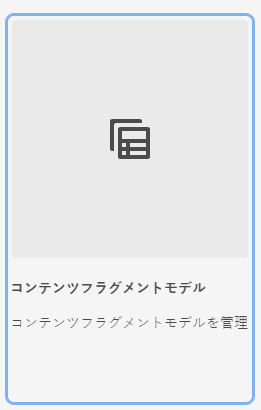

# AEM でのコンテンツフラグメントモデルの作成について {#architect-headless-content-fragment-models}

## これまでの説明内容 {#story-so-far}

[AEM ヘッドレスコンテンツ作成者ジャーニー](overview.md)の冒頭の [AEM でのヘッドレスのコンテンツモデリングの基本について](basics.md)で、ヘッドレス向けのオーサリングに関連する基本概念と用語について説明しました。

この記事では、これらに基づいて、AEM ヘッドレスプロジェクト用に独自のコンテンツフラグメントモデルを作成する方法を説明します。

## 目的 {#objective}

* **対象読者**：初心者
* **目的**：コンテンツフラグメントモデルを使用したヘッドレス CMS のコンテンツモデリングの概念と仕組みについて説明します。

<!-- which persona does this? -->
<!-- and who allows the configuration on the folders? -->

<!--
## Enabling Content Fragment Models {#enabling-content-fragment-models}

At the very start you need to enable Content Fragment Models for your site, this is done in the Configuration Browser; under Tools > General > Configuration Browser. You can either select to configure the global entry, or create a configuration. For example:

>[!NOTE]
>
>See Additional Resources - Content Fragments in the Configuration Browser
-->

## コンテンツフラグメントモデルの作成 {#creating-content-fragment-models}

コンテンツフラグメントモデルを作成し、構造を定義します。これは、**ツール**／**一般**／**コンテンツフラグメントモデル**&#x200B;で実行できます。

これを選択した後、モデルの場所に移動し、「**作成**」を選択します。ここでは、様々な主要情報を入力できます。

「**モデルを有効化**」オプションはデフォルトで有効になっています。つまり、モデルは、保存するとすぐに（コンテンツフラグメントの作成で）使用できます。必要に応じて、この機能を無効にすることができます。後で既存のモデルを有効（または無効）にすることができます。

「**作成**」で確定すると、モデルを&#x200B;**開いて**&#x200B;構造の定義を開始できます。

## コンテンツフラグメントモデルの定義 {#defining-content-fragment-models}

初めて新しいモデルを開くと、左側に大きな空白スペースがあり、右側に長い&#x200B;**データタイプ**&#x200B;のリストが表示されます。

では、何をすればよいのでしょうか。

「**データタイプ**」のインスタンスを左側のスペースにドラッグします。これでもうモデルを定義しているのです。

データタイプを追加したら、そのフィールドの「**プロパティ**」を定義する必要があります。プロパティは、使用するタイプによって異なります。次に例を示します。

フィールドは必要なだけ追加できます。次に例を示します。

### コンテンツ作成者 {#your-content-authors}

コンテンツ作成者には、モデルの作成に使用された実際のデータタイプとプロパティは表示されません。つまり、場合によっては、特定のフィールドへの入力方法に関するヘルプと情報をコンテンツ作成者に提供する必要があります。基本的な情報については「フィールドラベル」と「デフォルト値」を使用できますが、より複雑なケースでは、プロジェクト固有のドキュメントを準備する必要があるかもしれません。

>[!NOTE]
>
>詳しくは、「その他のリソース」の「コンテンツフラグメントモデル」を参照してください。

## コンテンツフラグメントモデルの管理 {#managing-content-fragment-models}

<!-- needs more details -->

コンテンツフラグメントモデルの管理には、以下の操作が必要になります。

* モデルの有効化（または無効化） - コンテンツフラグメントの作成時に作成者がモデルを使用できるようになります（または使用できなくなります）。
* モデルの削除 - 削除は必ず必要ですが、コンテンツフラグメント、特に公開済みのフラグメントに既に使用されているモデルの削除には注意する必要があります。

## 公開 {#publishing}

<!-- needs more details -->

コンテンツフラグメントモデルは、そのモデルに依存するコンテンツフラグメントの公開時または公開前に公開する必要があります。

>[!NOTE]
>
>まだ公開されていないモデルに基づくコンテンツフラグメントを作成者が公開しようとすると、選択リストにそのことが示され、モデルがフラグメントと共に公開されます。

モデルは、公開され次第、オーサー環境では読み取り専用モードに&#x200B;*ロック*&#x200B;されます。これは、変更によって、特にパブリッシュ環境で既存の GraphQL スキーマおよびクエリにエラーが発生するのを防ぐためです。コンソールには&#x200B;**ロック済み**&#x200B;と表示されます。

モデルが&#x200B;**ロック済み**（読み取り専用モード）の場合、モデルの内容と構造は表示できますが、モデルを直接編集することはできません。ただし、コンソールまたはモデルエディターを使用すれば&#x200B;**ロック済み**&#x200B;モデルを管理できます。

## 次の手順 {#whats-next}

これで基本を説明したので、次の手順は独自のコンテンツフラグメントモデルの作成を開始することです。

## その他のリソース {#additional-resources}

* [オーサリングに関する概念](/help/sites-cloud/authoring/author-publish.md)

* [基本操作](/help/sites-cloud/authoring/basic-handling.md) - このページは主に **Sites** コンソールに基づいていますが、ほとんどの機能は&#x200B;**一般**&#x200B;コンソールでの&#x200B;**コンテンツフラグメントモデル**&#x200B;への移動やアクションの実行にも関連しています。

* [コンテンツフラグメントの使用方法](/help/sites-cloud/administering/content-fragments/overview.md)

   * [コンテンツフラグメントモデル](/help/sites-cloud/administering/content-fragments/managing-content-fragment-models.md)

      * [コンテンツフラグメントモデルの定義](/help/sites-cloud/administering/content-fragments/content-fragment-models.md)

      * [コンテンツフラグメントモデルの有効化または無効化](/help/sites-cloud/administering/content-fragments/managing-content-fragment-models.md#enabling-disabling-a-content-fragment-model)

      * [アセットフォルダーでのコンテンツフラグメントモデルの許可](/help/sites-cloud/administering/content-fragments/managing-content-fragment-models.md#allowing-content-fragment-models-assets-folder)

      * [コンテンツフラグメントモデルの削除](/help/sites-cloud/administering/content-fragments/managing-content-fragment-models.md#deleting-a-content-fragment-model)

      * [コンテンツフラグメントモデルの公開](/help/sites-cloud/administering/content-fragments/managing-content-fragment-models.md#publishing-a-content-fragment-model)

      * [コンテンツフラグメントモデルを非公開にする](/help/sites-cloud/administering/content-fragments/managing-content-fragment-models.md#unpublishing-a-content-fragment-model)

      * [ロックされたコンテンツフラグメントモデル](/help/sites-cloud/administering/content-fragments/managing-content-fragment-models.md#locked-content-fragment-models)

* はじめる前に

   * [コンテンツフラグメントモデルの作成 - ヘッドレスセットアップ](/help/headless/setup/create-content-model.md)
