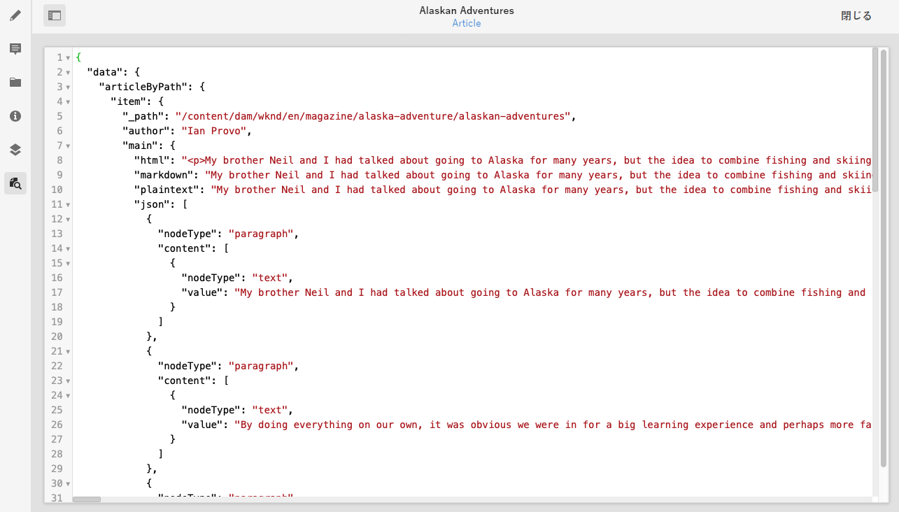
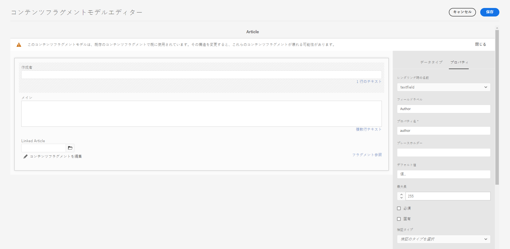

# AEM Delivery API を使用してコンテンツにアクセスする方法 {#access-your-content}

[AEM ヘッドレス開発者ジャーニー](overview.md) のこのパートでは、GraphQL クエリを使用してコンテンツフラグメントのコンテンツにアクセスし、アプリにフィード（ヘッドレス配信）する方法を説明します。

## これまでの説明内容 {#story-so-far}

AEM ヘッドレスジャーニーの前のドキュメント、[コンテンツをモデル化する方法](model-your-content.md)では、AEM でのコンテンツモデリングの基本を説明しました。これで、コンテンツ構造をモデル化し、AEM コンテンツフラグメントモデルおよびコンテンツフラグメントを使用してその構造を実現する方法を理解できました。具体的には以下を達成できました。

* コンテンツモデリングに関連する概念と用語を認識する。
* ヘッドレスコンテンツ配信にコンテンツモデリングが必要な理由を理解する。
* AEM コンテンツフラグメントモデルを使用してこの構造を実現する（およびコンテンツフラグメントを使用してコンテンツを作成する）方法を理解する。
* コンテンツをモデル化する方法（原則と基本サンプル）を理解する。

この記事は、これらの基本事項に基づいているので、AEM GraphQL API を使用して AEM の既存のヘッドレスコンテンツにアクセスする方法を理解できます。

* **対象読者**：初心者
* **目的**：AEM GraphQL クエリを使用してコンテンツフラグメントのコンテンツにアクセスする方法を説明します。具体的な内容は次のとおりです。
   * GraphQL と AEM GraphQL API の概要を説明します。
   * AEM GraphQL API の詳細を説明します。
   * いくつかのサンプルクエリを通じて実際の動作を確認します。

## コンテンツへのアクセス {#so-youd-like-to-access-your-content}

（コンテンツフラグメントで）整然と構造化されたコンテンツがすべて用意されていて、それらが新しいアプリにフィードされるのを待つばかりだとします。問題は、どうやってコンテンツにアクセスするかです。

必要なのは、特定のコンテンツをターゲットにし、必要なものを選択してさらに処理するためにアプリに返す方法です。

Adobe Experience Manager （AEM）as a Cloud Service では、AEM GraphQL API を使用して、コンテンツフラグメントに選択的にアクセスし、必要なコンテンツのみを返すことができます。つまり、アプリケーションで使用する構造化コンテンツのヘッドレス配信を実現できることになります。

>[!NOTE]
>
>AEM GraphQL API はカスタマイズされた実装で、標準の GraphQL API 仕様に基づいています。

## GraphQL - 概要 {#graphql-introduction}

GraphQL は、次の機能を提供するオープンソース仕様です。

* 構造化オブジェクトから特定のコンテンツを選択できるクエリ言語
* 構造化コンテンツに対してこれらのクエリを実行するためのランタイム

GraphQL は、厳密に型指定された API です。つまり、*すべての*&#x200B;コンテンツが型別に明確に構造化および編成されている必要があります。その結果、アクセスする対象と方法を GraphQL が&#x200B;*認識*&#x200B;できるようになります。データフィールドは、コンテンツオブジェクトの構造を定義する GraphQL スキーマ内で定義されます。

次に、GraphQL クエリに応答するパスを GraphQL エンドポイントが提供します。

つまり、AEM と組み合わせて使用する際に必要なコンテンツだけを、アプリが正確に確実かつ効率的に選択できるということです。

>[!NOTE]
>
>詳しくは、*GraphQL*.org や *GraphQL*.com を参照してください。

<!--
## AEM and GraphQL {#aem-graphql}

GraphQL is used in various locations in AEM; for example:

* Content Fragments
  * A customized API has been developed for this use-case (Headless Delivery to your app).
    * This is the AEM GraphQL API.
* Commerce
  * AEM Commerce consumes data from a Commerce platform via GraphQL.
  * There are GraphQL integrations between AEM and various third-party commerce solutions, used with the extension hooks provided by the CIF Core Components.
    * This does not use the AEM GraphQL API.

>[!NOTE]
>
>This step of the Headless Journey is only concerned with the AEM GraphQL API and Content Fragments.
-->

## AEM GraphQL API {#aem-graphql-api}

AEM GraphQL API は、標準の GraphQL API 仕様に基づくカスタマイズバージョンで、コンテンツフラグメントに対して（複雑な）クエリを実行できるように特別に設定されたものです。

コンテンツは、コンテンツフラグメントモデルに従って構造化されているので、コンテンツフラグメントが使用されます。これは GraphQL の基本要件を満たしています。

* コンテンツフラグメントモデルは、1 つ以上のフィールドで構成されます。
   * 各フィールドは、データタイプに従って定義されます。
* コンテンツフラグメントモデルは、対応する AEM GraphQL スキーマの生成に使用されます。

AEM（およびコンテンツ）の GraphQL に実際にアクセスするには、エンドポイントを使用してアクセスパスを指定します。

AEM GraphQL API を使用して返されたコンテンツは、アプリケーションで使用できます。

クエリを直接入力およびテストできるように、標準の GraphQL インターフェイスの実装も AEM GraphQL で使用できます（これは AEM と共にインストールできます）。構文のハイライト表示、オートコンプリート、自動候補表示などの機能と共に、履歴およびオンラインドキュメントが用意されています。

>[!NOTE]
>
>AEM GraphQL API の実装は、GraphQL Java ライブラリに基づいています。

<!--
### Use Cases for Author and Publish Environments {#use-cases-author-publish-environments}

The use cases for the AEM GraphQL API can depend on the type of AEM as a Cloud Service environment:

* Publish environment; used to: 
  * Query content for JS application (standard use-case)

* Author environment; used to: 
  * Query content for "content management purposes":
    * GraphQL in AEM as a Cloud Service is currently a read-only API.
    * The REST API can be used for CR(u)D operations.
-->

## AEM GraphQL API で使用するコンテンツフラグメント {#content-fragments-use-with-aem-graphql-api}

コンテンツフラグメントは、次の理由により、AEM スキーマおよびクエリ用の GraphQL の基盤となります。

* ヘッドレスに配信できる、ページに依存しないコンテンツの設計、作成、キュレーションおよび公開が可能になります。
* 選択したデータタイプを使用して、生成されるフラグメントの構造を事前に定義するコンテンツフラグメントモデルに基づいています。
* モデルの定義時に使用できるフラグメント参照データタイプを使用して、構造のレイヤーを追加できます。

### コンテンツフラグメントモデル {#content-fragments-models}

コンテンツフラグメントモデルは、

* **有効**&#x200B;にされると、スキーマの生成に使用されます。
* GraphQL に必要なデータタイプとフィールドを提供します。アプリケーションが、可能なことだけを要求して期待するものを受け取るようにします。
* データタイプ&#x200B;**フラグメント参照**&#x200B;は、別のコンテンツフラグメントを参照するためにモデル内で使用できるので、構造レベルを追加します。

### フラグメント参照 {#fragment-references}

**フラグメント参照**&#x200B;は、

* コンテンツフラグメントモデルの定義時に使用できる特定のデータタイプです。
* 特定のコンテンツフラグメントモデルに依存する別のフラグメントを参照します。
* 構造化データを作成し、取得できます。

   * **マルチフィード**&#x200B;として定義した場合、複数のサブフラグメントをプライムフラグメントで参照（取得）できます。

### JSON プレビュー {#json-preview}

コンテンツフラグメントモデルの設計と開発に役立てるため、コンテンツフラグメントエディターで JSON 出力をプレビューできます。



<!--
## GraphQL Schema Generation from Content Fragments {#graphql-schema-generation-content-fragments}

GraphQL is a strongly-typed API, which means that content must be clearly structured and organized by type. The GraphQL specification provides a series of guidelines on how to create a robust API for interrogating content on a certain instance. To do this, a client must fetch the Schema, which contains all the types necessary for a query. 

For Content Fragments, the GraphQL schemas (structure and types) are based on **Enabled** Content Fragment Models and their data types.

>[!CAUTION]
>
>All the GraphQL schemas (derived from Content Fragment Models that have been **Enabled**) are readable through the GraphQL endpoint.
>
>This means that you need to ensure that no sensitive content is available, to ensure that no sensitive data is exposed via GraphQL endpoints; for example, this includes information that could be present as field names in the model definition.

For example, if a user created a Content Fragment Model called `Article`, then AEM generates the object `article` that is of a type `ArticleModel`. The fields within this type correspond to the fields and data types defined in the model.

1. A Content Fragment Model:

   

1. The corresponding GraphQL schema (output from GraphiQL automatic documentation):
   

   This shows that the generated type `ArticleModel` contains several [fields](#fields). 
   
   * Three of them have been controlled by the user: `author`, `main` and `referencearticle`.

   * The other fields were added automatically by AEM, and represent helpful methods to provide information about a certain Content Fragment; in this example, `_path`, `_metadata`, `_variations`. These [helper fields](#helper-fields) are marked with a preceding `_` to distinguish between what has been defined by the user and what has been auto-generated.

1. After a user creates a Content Fragment based on the Article model, it can then be interrogated through GraphQL. For examples, see the Sample Queries.md#graphql-sample-queries) (based on a sample Content Fragment structure for use with GraphQL.

In GraphQL for AEM, the schema is flexible. This means that it is auto-generated each and every time a Content Fragment Model is created, updated or deleted. The data schema caches are also refreshed when you update a Content Fragment Model.

The Sites GraphQL service listens (in the background) for any modifications made to a Content Fragment Model. When updates are detected, only that part of the schema is regenerated. This optimization saves time and provides stability.

So for example, if you:

1. Install a package containing `Content-Fragment-Model-1` and `Content-Fragment-Model-2`:
 
   1. GraphQL types for `Model-1` and `Model-2` are generated.

1. Then modify `Content-Fragment-Model-2`:

   1. Only the `Model-2` GraphQL type will get updated.

   1. Whereas `Model-1` will remain the same. 

>[!NOTE]
>
>This is important to note in case you want to do bulk updates on Content Fragment Models through the REST api, or otherwise.

The schema is served through the same endpoint as the GraphQL queries, with the client handling the fact that the schema is called with the extension `GQLschema`. For example, performing a simple `GET` request on `/content/cq:graphql/global/endpoint.GQLschema` will result in the output of the schema with the Content-type: `text/x-graphql-schema;charset=iso-8859-1`.

### Schema Generation - Unpublished Models {#schema-generation-unpublished-models}

When Content Fragments are nested it can happen that a parent Content Fragment Model is published, but a referenced model is not.

>[!NOTE]
>
>The AEM UI prevents this happening, but if publishing is made programmatically, or with content packages, it can occur.

When this happens, AEM generates an *incomplete* Schema for the parent Content Fragment Model. This means that the Fragment Reference, which is dependent on the unpublished model, is removed from the schema.

## AEM GraphQL Endpoints {#aem-graphql-endpoints}

An endpoint is the path used to access GraphQL for AEM. Using this path you (or your app) can:

* access the GraphQL schemas,
* send your GraphQL queries,
* receive the responses (to your GraphQL queries).

AEM allows for:

* A global endpoint - available for use by all sites.
* Endpoints for specific Sites configurations - that you can configure (in the Configuration Browser), specific to a specified site/project.

## Permissions {#permissions}

The permissions are those required for accessing Assets.

## The AEM GraphiQL Interface {#aem-graphiql-interface}

To help you directly input, and test queries, an implementation of the standard GraphiQL interface is available for use with AEM GraphQL. This can be installed with AEM.

>[!NOTE]
>
>GraphiQL is bound the global endpoint (and does not work with other endpoints for specific Sites configurations).

It provides features such as syntax-highlighting, auto-complete, auto-suggest, together with a history and online documentation.


-->

## AEM GraphQL API を実際に使用する {#actually-using-aem-graphiql}

### 初期セットアップ {#initial-setup}

コンテンツに関するクエリを開始する前に、次の操作が必要です。

* エンドポイントの有効化
   * ツール／一般／GraphQL の使用
   * [GraphQL エンドポイントの有効化](/help/headless/graphql-api/graphql-endpoint.md)
      * これにより、GraphiQL IDE も有効になります。

### サンプル構造 {#sample-structure}

AEM GraphQL API をクエリで実際に使用するにあたって、次のような非常に基本的な 2 つのコンテンツフラグメントモデル構造を例として使用できます。

* 会社
   * 名前 - テキスト
   * CEO（人）- フラグメント参照
   * 従業員（人）- フラグメント参照（複数可）
* 人
   * 名前 - テキスト
   * 名前（名）- テキスト

ご覧のように、「CEO」フィールドと「従業員」フィールドは、「人」フラグメントを参照しています。

フラグメントモデルは次の場合に使用されます。

* コンテンツフラグメントエディターでコンテンツを作成する場合
* クエリの実行対象となる GraphQL スキーマを生成する場合

### クエリのテスト場所 {#where-to-test-your-queries}

クエリは、GraphiQL インターフェイスで入力できます。クエリエディターには、次のいずれかの方法でアクセスできます。

* **ツール**／**一般**／**GraphQL クエリエディター**
* 直接アクセス（例：`http://localhost:4502/aem/graphiql.html`）


### クエリの概要 {#getting-Started-with-queries}

わかりやすいクエリとしては、「会社」スキーマ内のすべてのエントリの名前を返す場合があります。以下では、すべての会社名のリストをリクエストします。

```xml
query {
  companyList {
    items {
      name
    }
  }
}
```

もう少し複雑なクエリとしては、「Jobs」という名前を持たないすべての人を選択する場合があります。以下では、「Jobs」という名前を持たないすべての人を抜き出します。これは EQUALS_NOT 演算子で実現します（演算子は他にも多数あります）。

```xml
query {
  personList(filter: {
    name: {
      _expressions: [
        {
          value: "Jobs"
          _operator: EQUALS_NOT
        }
      ]
    }
  }) {
    items {
      name
      firstName
    }
  }
}
```

また、もっと複雑なクエリを作成することもできます。例えば、「Smith」という名前の従業員が 1 人以上いるすべての会社をクエリする場合です。以下のクエリでは、「Smith」という名前の人を抜き出し、ネストされたフラグメントから取得した情報を返します。

```xml
query {
  companyList(filter: {
    employees: {
      _match: {
        name: {
          _expressions: [
            {
              value: "Smith"
            }
          ]
        }
      }
    }
  }) {
    items {
      name
      ceo {
        name
        firstName
      }
      employees {
        name
        firstName
      }
    }
  }
}
```

<!-- need code / curl / cli examples-->

AEM GraphQL API の使用と必要な要素の設定について詳しくは、次のドキュメントを参照してください。

* AEM での GraphQL の使用方法
* サンプルコンテンツフラグメント構造
* AEM での GraphQL の使用方法 - サンプルコンテンツとサンプルクエリ

## 次の手順 {#whats-next}

これで、AEM GraphQL API を使用してヘッドレスコンテンツにアクセスしクエリを実行する方法について説明します。次は、[REST API を使用してコンテンツフラグメントのコンテンツにアクセスしコンテンツを更新する方法](update-your-content.md)について説明します。

## その他のリソース {#additional-resources}

* [Adobe Experience Manager as a Cloud Service API](https://developer.adobe.com/experience-cloud/experience-manager-apis/)
* [GraphQL.org](https://graphql.org)
   * [スキーマ](https://graphql.org/learn/schema/)
   * [変数](https://graphql.org/learn/queries/#variables)
   * [GraphQL Java ライブラリ](https://graphql.org/code/#java)
* [GraphiQL](https://graphql.org/learn/serving-over-http/#graphiql)
* [AEM での GraphQL の使用方法](/help/headless/graphql-api/content-fragments.md)
   * [GraphQL エンドポイントの有効化](/help/headless/graphql-api/graphql-endpoint.md)
   * [AEM GraphiQL インターフェイスのインストール](/help/headless/graphql-api/graphiql-ide.md)
* [サンプルコンテンツフラグメント構造](/help/headless/graphql-api/sample-queries.md#content-fragment-structure-graphql)
* [AEM での GraphQL の使用方法 - サンプルコンテンツとサンプルクエリ](/help/headless/graphql-api/sample-queries.md)
   * [サンプルクエリ - 1 つの特定の都市フラグメント](/help/headless/graphql-api/sample-queries.md#sample-single-specific-city-fragment)
   * [メタデータのサンプルクエリ - 「GB」という賞のメタデータのリスト](/help/headless/graphql-api/sample-queries.md#sample-metadata-awards-gb)
   * [サンプルクエリ - 名前付きバリエーションを持つすべての都市](/help/headless/graphql-api/sample-queries.md#sample-cities-named-variation)
* [設定ブラウザーでコンテンツフラグメント機能を有効にする](/help/sites-cloud/administering/content-fragments/setup.md#enable-content-fragment-functionality-configuration-browser)
* [コンテンツフラグメントの使用方法](/help/sites-cloud/administering/content-fragments/overview.md)
   * [コンテンツフラグメントモデル](/help/sites-cloud/administering/content-fragments/content-fragment-models.md)
   * [JSON 出力](/help/assets/content-fragments/content-fragments-json-preview.md)
* [クロスオリジンリソース共有（CORS）について](https://experienceleague.adobe.com/docs/experience-manager-learn/foundation/security/understand-cross-origin-resource-sharing.html?lang=ja#understand-cross-origin-resource-sharing-(cors))
* [GraphQL の永続クエリ - Dispatcher でのキャッシュの有効化](/help/headless/deployment/dispatcher-caching.md)
* [サーバー側 API のアクセストークンの生成](/help/implementing/developing/introduction/generating-access-tokens-for-server-side-apis.md)
* [AEM ヘッドレス入門 - GraphQL](https://experienceleague.adobe.com/docs/experience-manager-learn/getting-started-with-aem-headless/graphql/overview.html?lang=ja) - AEM ヘッドレス機能（コンテンツモデリングや GraphQL など）の使用の概要を説明する短いビデオチュートリアルシリーズです。
