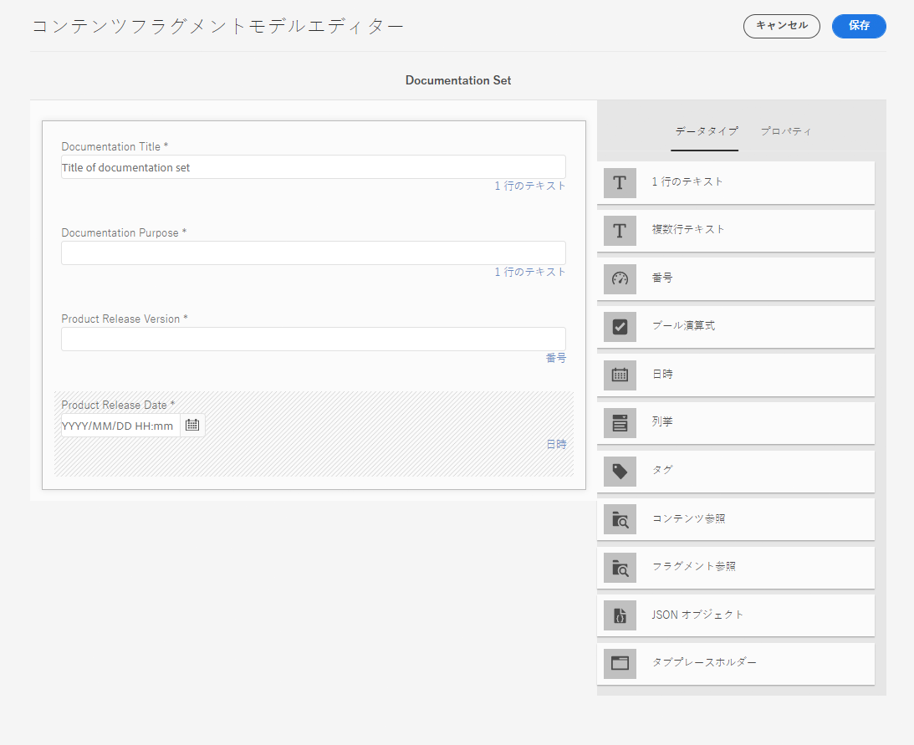

# コンテンツのモデル化方法{#model-your-content}

[AEMヘッドレス開発者ジャーニー](overview.md)のこのパートでは、コンテンツ構造のモデル化方法を学習できます。 次に、チャネル間での再利用のために、コンテンツフラグメントモデルとコンテンツフラグメントを使用したAdobe Experience Manager(AEM)の構造を実現します。

## {#story-so-far}までの話

最初の[CMSヘッドレス開発](learn-about.md)では、ヘッドレスコンテンツ配信を説明し、使用する理由を説明します。 次に、[Cloud ServiceとしてのAEMヘッドレスの使用の手引き](getting-started.md)独自のプロジェクトのコンテキストでAEMヘッドレスを説明しました。

AEMヘッドレスジャーニーの前のドキュメント([AEMヘッドレスを使用した初めてのエクスペリエンスへのパス](path-to-first-experience.md))では、最初のプロジェクトの実装に必要な手順を学びました。 読み終えた後は、次の操作を行う必要があります。

* コンテンツを設計する際の計画に関する重要な考慮事項の理解
* 統合レベルの要件に応じて、ヘッドレスを実装する手順を理解します。
* 必要なツールとAEM設定を設定します。
* ヘッドレスなジャーニーをスムーズにし、コンテンツ生成の効率を維持し、コンテンツを迅速に配信するためのベストプラクティスを理解します。

この記事は、これらの基本事項に基づいて構築され、独自のAEMヘッドレスプロジェクトの準備方法を理解できます。

## 目的 {#objective}

* **オーディエンス**:初心者
* **目的**:コンテンツ構造をモデル化し、AEMコンテンツフラグメントモデルとコンテンツフラグメントを使用して構造を実現する方法を説明します。
   * データ/コンテンツモデリングに関連する概念と用語を紹介します。
   * ヘッドレスコンテンツ配信にコンテンツモデリングが必要な理由を説明します。
   * AEMコンテンツフラグメントモデルを使用してこの構造を実現する（およびコンテンツフラグメントを使用してコンテンツを作成する）方法を説明します。
   * コンテンツのモデル化方法を学びます。原則と基本サンプル。

>[!NOTE]
>
>データモデリングは、リレーショナルデータベースを開発する際に使用される非常に大きなフィールドです。 本や情報源は多くあります。
>
>AEMヘッドレスで使用するデータをモデリングする際には、関心のある側面のみを考慮します。

## コンテンツモデリング{#content-modeling}

*大きくて悪い世界です*。

多分、そうではないかもしれませんが、確かに大きな&#x200B;***複雑な***&#x200B;世界であり、データモデリングを使用して、ある目的に必要な特定の情報を使用して、非常に（非常に）小さなサブセクションのシンプルな表現を定義します。

>[!NOTE]
>
>AEMではコンテンツを扱うので、データモデリングをコンテンツモデリングと呼びます。

次に例を示します。

多くの学校がありますが、それぞれに共通点があります。

* 場所
* 教頭
* 多くの教師
* 非教職員の多く
* 多くの生徒
* 多くの元教師
* 多くの元生徒
* 多くの教室
* 多くの本
* 多くの（多くの）機器
* 多くのカリキュラム外活動
* など.

このような小さな例でも、リストは無限に見える可能性があります。 ただし、アプリケーションで単純なタスクを実行するだけの場合は、情報を必要事項に制限する必要があります。

例えば、地域内のすべての学校向けに特別なイベントを広告します。

* 学校名
* 学校の場所
* 教頭
* イベントのタイプ
* イベントの日付
* イベントを主催する教師

### 概念  {#concepts}

説明したい内容は、**エンティティ**&#x200B;と呼ばれ、基本的には情報を保存したい「物」です。

これらに関して保存する情報は、**属性**（プロパティ）です（名前、教師の資格など）。

次に、エンティティ間に様々な&#x200B;**関係**&#x200B;があります。 例えば、通常、学校には教頭が1人しかなく、多くの教師（教頭も教師）がいます。

この情報を分析し定義するプロセスは、**コンテンツモデリング**&#x200B;と呼ばれます。

### 基本 {#basics}

エンティティとその関係を説明する&#x200B;**概念スキーマ**&#x200B;を作成することから始める必要が生じる場合が多いです。 通常、これは概念的なものです。

これが安定したら、エンティティを記述する&#x200B;**論理スキーマ**&#x200B;に、属性と関係と共にモデルを変換できます。 このレベルでは、重複を排除し、デザインを最適化するために、定義を詳細に調べる必要があります。

>[!NOTE]
>
>シナリオの複雑さに応じて、これら2つの手順が結合される場合があります。

例えば、`Head Teacher`と`Teacher`に別々のエンティティが必要ですか。それとも、`Teacher`モデルの追加属性だけが必要ですか。

### データの整合性の確保{#data-integrity}

ライフサイクル全体にわたってコンテンツの正確性と一貫性を保証するには、データの整合性が必要です。 これには、コンテンツ作成者が何を保存するかを容易に理解できるようにすることが含まれます。そのため、次のことが重要です。

* 明確な構造
* 可能な限り簡潔な構造（精度を犠牲にすることなく）
* 個々のフィールドの検証
* 必要に応じて、特定のフィールドの内容を意味のある内容に制限する

### データの冗長性{#data-redundancy}を排除

データの冗長性は、同じ情報がコンテンツ構造内に2回格納される場合に発生します。 コンテンツの作成時に混乱が生じ、クエリ時にエラーが生じる可能性があるので、この方法は避けてください。記憶領域の誤用は言うまでもない。

### 最適化とパフォーマンス{#optimization-and-performance}

構造を最適化することで、コンテンツの作成とクエリの両方でパフォーマンスを向上できます。

すべてがバランスの取れた行為ですが、複雑すぎる構造を作成したり、レベルが多すぎる構造を作成したりすると、次のことが可能です。

* 作成者がコンテンツを生成する際には混乱を招く可能性があります。

* 必要なコンテンツを取得するために、クエリがネストされた（参照された）コンテンツフラグメントにアクセスする必要がある場合、パフォーマンスに大きく影響します。

## AEMヘッドレスのコンテンツモデリング{#content-modeling-for-aem-headless}

データモデリングは確立された一連のテクニックで、関係データベースを開発する際によく使用されます。そのため、コンテンツモデリングはAEMヘッドレスに対して何を意味しますか。

### 使用する理由 {#why}

アプリケーションがAEMから必要なコンテンツを一貫して効率的に要求し、受け取れるようにするには、このコンテンツが構造化されている必要があります。

つまり、アプリケーションは、事前に応答の形式を把握し、その処理方法を把握しています。 これは、自由形式のコンテンツを受け取るよりもはるかに簡単です。自由形式のコンテンツを受け取る場合は、そのコンテンツの内容と使用方法を判断するために解析する必要があります。

### 概要 {#how}

AEMは、コンテンツフラグメントを使用して、コンテンツをアプリケーションにヘッドレスに配信するために必要な構造を提供します。

コンテンツモデルの構造は次のとおりです。

* コンテンツフラグメントモデルの定義によって認識される
* は、コンテンツ生成に使用されるコンテンツフラグメントの基礎として使用されます。

>[!NOTE]
>
>コンテンツフラグメントモデルは、AEM GraphQLスキーマの基礎としても使用され、後のセッションでコンテンツを取得するために使用されます。

コンテンツのリクエストは、標準のGraphQL APIのカスタマイズされた実装であるAEM GraphQL APIを使用しておこなわれます。 AEM GraphQL APIを使用すると、コンテンツフラグメントに対して（複雑な）クエリを実行でき、各クエリが特定のモデルタイプに従っています。

返されたコンテンツは、アプリケーションで使用できます。

## コンテンツフラグメントモデルを使用した構造の作成{#create-structure-content-fragment-models}

コンテンツフラグメントモデルは、コンテンツの構造を定義できる様々なメカニズムを提供します。

コンテンツフラグメントモデルは、エンティティを記述します。

>[!NOTE]
>新しいモデルを作成するには、設定ブラウザーでコンテンツフラグメント機能を有効にする必要があります。

>[!TIP]
>
>コンテンツフラグメントの作成時に選択するモデルをコンテンツ作成者が把握できるように、モデルに名前を付ける必要があります。

モデル内：

1. **データ** 型を使用すると、個々の属性を定義できます。例えば、教師の名前を持つフィールドを&#x200B;**Text**&#x200B;とし、その勤続年数を&#x200B;**Number**&#x200B;と定義します。
1. データ型&#x200B;**コンテンツ参照**&#x200B;および&#x200B;**フラグメント参照**&#x200B;を使用すると、AEM内の他のコンテンツとの関係を作成できます。
1. **フラグメント参照**&#x200B;データ型を使用すると、（モデルタイプに従って）コンテンツフラグメントをネストすることで、複数レベルの構造を実現できます。 これは、コンテンツモデリングに不可欠です。

例：

### データタイプ {#data-types}

AEMでは、コンテンツをモデル化するための次のデータタイプが提供されます。

* 1 行のテキスト
* 複数行テキスト
* 数値
* ブール値
* 日時
* 列挙
* タグ
* コンテンツ参照
* フラグメント参照
* JSON オブジェクト

### 参照とネストされたコンテンツ{#references-nested-content}

2つのデータ型は、特定のフラグメント外のコンテンツへの参照を提供します。

* **コンテ**
ンツの参照任意のタイプの他のコンテンツへの簡単な参照を提供します。例えば、指定した場所で画像を参照できます。

* **フラグメ**
ントの参照他のコンテンツフラグメントへの参照を提供します。このタイプの参照は、ネストされたコンテンツを作成するために使用され、コンテンツのモデル化に必要な関係を導き出します。
フラグメント作成者が次の操作をおこなえるようにデータタイプを設定可能
   * 参照先フラグメントの直接編集
   * 適切なモデルに基づいた新しいコンテンツフラグメントの作成

### コンテンツフラグメントモデルの作成{#creating-content-fragment-models}

サイトのコンテンツフラグメントモデルを最初に有効にする必要がある場合は、設定ブラウザーでおこないます。ツール/一般/設定ブラウザーで、次の操作を行います。 グローバルエントリを設定するか、新しい設定を作成できます。 次に例を示します。

>[!NOTE]
>
>設定ブラウザーの「その他のリソース — コンテンツフラグメント」を参照してください。

その後、コンテンツフラグメントモデルを作成し、構造を定義できます。 これは、ツール/アセット/コンテンツフラグメントモデルで実行できます。 次に例を示します。

>[!NOTE]
>
>その他のリソース — コンテンツフラグメントモデルを参照してください。

## モデルを使用したコンテンツフラグメントでのコンテンツのオーサリング{#use-content-to-author-content}

コンテンツフラグメントは、常にコンテンツフラグメントモデルに基づいています。 モデルが構造を提供し、フラグメントがコンテンツを保持します。

### 適切なモデルの選択{#select-model}

コンテンツを実際に作成する最初の手順は、コンテンツフラグメントを作成することです。 これは、アセット/ファイルの下の必要なフォルダーに作成/コンテンツフラグメントを使用しておこないます。 ウィザードの指示に従って手順を進めます。

コンテンツフラグメントは、作成プロセスの最初の手順として選択する特定のコンテンツフラグメントモデルに基づいています。

### 構造化コンテンツ{#create-edit-structured-content}の作成と編集

フラグメントを作成したら、コンテンツフラグメントエディターで開くことができます。 ここでは、以下のことができます。

* コンテンツを通常モードまたはフルスクリーンモードで編集します。
* コンテンツの形式を「フルテキスト」、「プレーンテキスト」または「Markdown」にします。
* コンテンツのバリエーションを作成および管理します。
* コンテンツを関連付け.
* メタデータを編集します。
* ツリー構造を表示します。
* JSON表現をプレビューします。

### コンテンツフラグメントの作成 {#creating-content-fragments}

適切なモデルを選択すると、コンテンツフラグメントが開いてコンテンツフラグメントエディターで編集できます。

>[!NOTE]
>
>その他のリソース — コンテンツフラグメントの操作を参照してください。

## いくつかの例を使用する前に{#getting-started-examples}

<!--
tbc...
...and/or see the structures covered for the GraphQL samples...
...will those (ever) be delivered as an official sample package?
-->

基本的な構造のサンプルについては、サンプルコンテンツフラグメント構造を参照してください。

## 次の手順{#whats-next}

これで、構造のモデル化方法とそれに応じたコンテンツの作成方法を学びました。次の手順は、[GraphQLクエリを使用してコンテンツフラグメントのコンテンツにアクセスし、取得する方法を学びます。](access-your-content.md) これにより、GraphQLについて紹介し、その後、サンプルクエリを見て、実際の動作を確認します。

## その他のリソース {#additional-resources}

* [コンテンツフラグメントの操作](/help/assets/content-fragments/content-fragments.md)  — コンテンツフラグメントのリードインページ
   * [設定ブラウザーのコンテンツフラグメント](/help/assets/content-fragments/content-fragments-configuration-browser.md)  — 設定ブラウザーでコンテンツフラグメント機能を有効にします。
   * [コンテンツフラグメントモデル](/help/assets/content-fragments/content-fragments-models.md)  — コンテンツフラグメントモデルの作成と編集
   * [コンテンツフラグメントの管理](/help/assets/content-fragments/content-fragments-managing.md)  — コンテンツフラグメントの作成とオーサリングこのページでは、その他の詳細な節を示します
* [AEM GraphQLスキーマ](access-your-content.md)  - GraphQLによるモデルの実現方法
* [サンプルコンテンツフラグメント構造](/help/assets/content-fragments/content-fragments-graphql-samples.md#content-fragment-structure-graphql)
* [AEMヘッドレスの概要](https://experienceleague.adobe.com/docs/experience-manager-learn/getting-started-with-aem-headless/graphql/overview.html?lang=ja)  — コンテンツモデリングやGraphQLなど、AEMヘッドレス機能の使用の概要を説明する短いビデオチュートリアルシリーズです。
