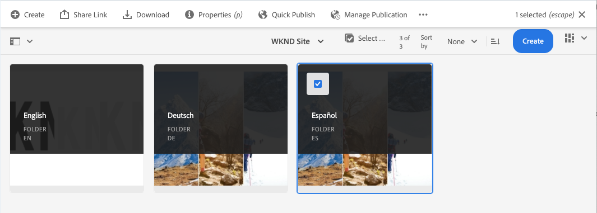

# 翻訳コンテンツの公開 {#publish-content}

ローカライズされたコンテンツを公開する方法を説明します。

## これまでの話 {#story-so-far}

AEMヘッドレスローカリゼーションジャーニーの前のドキュメントでは、コンテンツ[翻訳](configure-connector.md)を参照し、AEM翻訳プロジェクトを使用してヘッドレスコンテンツを翻訳する方法を学びました。 次の手順を実行します。

* 翻訳プロジェクトの概要を説明します。
* 新しい翻訳プロジェクトを作成できる。
* 翻訳プロジェクトを使用して、ヘッドレスコンテンツを翻訳します。

最初の翻訳が完了したので、この記事では、次の手順でそのコンテンツを公開し、基になる言語ルートコンテンツの変更に応じて翻訳を更新する方法を説明します。

## 目的 {#objective}

このドキュメントでは、ヘッドレスコンテンツをAEMに公開する方法と、翻訳を最新の状態に保つための継続的なワークフローを作成する方法を説明します。 このドキュメントを読んだ後、次の操作を行う必要があります。

* AEMのオーサーとパブリッシュのモデルを理解します。
* 翻訳済みコンテンツの公開方法を理解します。
* 翻訳済みコンテンツの継続的な更新モデルを実装できる。

## AEMオーサーとパブリッシュのモデル {#author-publish}

コンテンツを公開する前に、AEMのオーサーとパブリッシュのモデルを理解しておくことをお勧めします。 最も単純な用語では、AEMはシステムのユーザーを2つのグループに分けます。

1. コンテンツおよびシステムを作成および管理するユーザー
1. システムからコンテンツを使用するユーザー。

したがって、AEMは物理的に2つのインスタンスに分けられます。

1. **オーサー**&#x200B;インスタンスは、コンテンツ作成者と管理者がコンテンツの作成と管理をおこなうシステムです。
1. **publish**&#x200B;インスタンスは、コンシューマーにコンテンツを配信するシステムです。

オーサーインスタンスでコンテンツを作成したら、パブリッシュインスタンスに転送して、使用できるようにする必要があります。 オーサーからパブリッシュに転送するプロセスは、**パブリッシュ**&#x200B;と呼ばれます。

## 翻訳済みコンテンツのパブリッシュ {#publishing}

翻訳されたコンテンツの状態に満足したら、ヘッドレスサービスでコンテンツを使用できるように、コンテンツを公開できます。 これをおこなう最も簡単な方法は、プロジェクトアセットフォルダーに移動することです。

```text
/content/dam/<your-project>/
```

このパスには、各翻訳言語のサブフォルダーが含まれ、公開するフォルダーを選択できます。

1. **ナビゲーション** -> **アセット** -> **ファイル**&#x200B;に移動し、プロジェクトフォルダーを開きます。
1. 言語ルートフォルダーとその他すべての言語フォルダーが表示されます。 発行するローカライズ言語を選択します。
   
1. 「**公開を管理**」をタップまたはクリックします。
1. **公開を管理**&#x200B;ウィンドウで、**アクション**&#x200B;で「**公開**」が自動的に選択され、**今すぐ**&#x200B;が&#x200B;**スケジュール**&#x200B;で選択されていることを確認します。 「**次へ**」をタップまたはクリックします。
   
1. 次の&#x200B;**公開を管理**&#x200B;ウィンドウで、適切なパスが選択されていることを確認します。 「**公開**」をタップまたはクリックします。
   
1. AEMは、画面の下部にポップアップメッセージを表示して、公開アクションを確認します。
   

ローカライズされたヘッドレスコンテンツが公開されました。 これで、ヘッドレスサービスでアクセスし、使用できるようになりました。

>[!TIP]
>
>公開時に複数の項目（複数の言語フォルダー）を選択して、一度に複数のローカライゼーションを公開できます。

コンテンツを公開する際には、公開時間のスケジュールなど、このジャーニーの範囲外の追加オプションがあります。 詳しくは、ドキュメントの最後にある「[その他のリソース](#additional-resources)」の節を参照してください。

## 翻訳済みコンテンツの更新 {#updating-translations}

ローカリゼーションと翻訳が一度で行われることはほとんどありません。 通常、コンテンツ作成者は、最初のローカライゼーションが完了した後も、引き続き言語ルートのコンテンツをに追加および変更します。 つまり、翻訳されたコンテンツも更新する必要があります。

特定のプロジェクト要件によって、翻訳の更新頻度と、更新を実行する前に実行される決定プロセスが定義されます。 翻訳の更新を決定したら、AEMでの処理は非常に簡単です。 最初の翻訳は翻訳プロジェクトに基づいていたので、更新もおこなわれます。

1. **ナビゲーション** -> **アセット** -> **ファイル**&#x200B;に移動します。 AEMのヘッドレスコンテンツは、コンテンツフラグメントと呼ばれるアセットとして保存されます。
1. プロジェクトの言語ルートを選択します。 この場合、`/content/dam/wknd/en`を選択します。
1. パネルセレクターをタップまたはクリックし、**参照**&#x200B;パネルを表示します。
1. 「**言語コピー**」をタップまたはクリックします。
1. 「**言語コピー**」チェックボックスをオンにします。
1. 参照パネルの下部にある「**言語コピーを更新**」セクションを展開します。
1. **プロジェクト**&#x200B;ドロップダウンで、「**既存の翻訳プロジェクトに追加**」を選択します。
1. **既存の翻訳プロジェクト**&#x200B;ドロップダウンで、最初の翻訳用に作成したプロジェクトを選択します。
1. 「**開始**」をタップまたはクリックします。


コンテンツが既存の翻訳プロジェクトに追加されます。 翻訳プロジェクトを表示するには：

1. **ナビゲーション** -&amp; **プロジェクト**&#x200B;に移動します。
1. 更新したプロジェクトをタップまたはクリックします。
1. 更新した言語をタップまたはクリックします。

新しいジョブカードがプロジェクトに追加されたことがわかります。 この例では、別のスペイン語の翻訳が追加されました。


新しいカードに表示される統計情報（アセット数とコンテンツフラグメント数）が異なることがわかります。 これは、AEMが前回の翻訳以降に変更された内容を認識し、翻訳が必要な新しいコンテンツ（再翻訳された更新コンテンツまたは新しいコンテンツの初回翻訳の両方）のみを含むからです。

この時点から、元の翻訳ジョブと同じように[翻訳ジョブを開始し管理します。](translate-content.md#using-translation-project)

## ジャーニー? {#end-of-journey}

おめでとうございます。ヘッドレスなローカリゼーションのジャーニーを完了しました。 次の手順を実行します。

* ヘッドレスコンテンツ配信の概要を説明します。
* ヘッドレス機能についての基本的な理解を持っているAEM。
* AEMのローカライゼーション機能と、ヘッドレスコンテンツとの関連を理解します。
* 独自のヘッドレスコンテンツのローカライズを開始できます。

これで、独自のヘッドレスコンテンツをAEMでローカライズする準備が整いました。 ただし、AEMは強力なツールであり、多くの追加オプションを使用できます。 このジャーニーで得られた機能の詳細については、次の節で説明するその他のリソースを参照してください。

## その他のリソース {#additional-resources}

* [翻訳プロジェクトの管理](/help/sites-cloud/administering/translation/managing-projects.md)  — 翻訳プロジェクトの詳細と、人間による翻訳ワークフローや多言語プロジェクトなどの追加機能について説明します。
* [オーサリングの概念](/help/sites-cloud/authoring/getting-started/concepts.md)  - AEMのオーサーとパブリッシュのモデルについて詳しく説明します。このドキュメントでは、コンテンツフラグメントではなくページのオーサリングに焦点を当てていますが、理論は依然として当てはまります。
* [ページの公開](/help/sites-cloud/authoring/fundamentals/publishing-pages.md)  — コンテンツを公開する際に使用できる追加機能について説明します。このドキュメントでは、コンテンツフラグメントではなくページのオーサリングに焦点を当てていますが、理論は依然として当てはまります。
