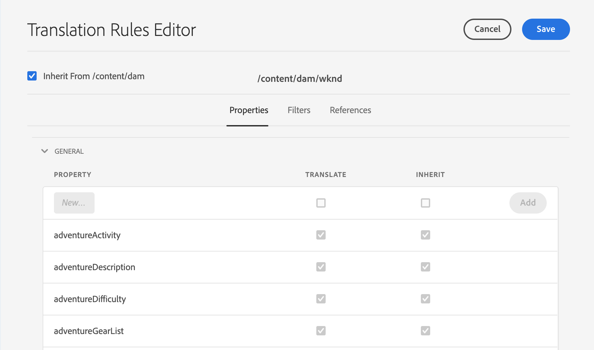

# 翻訳ルールの設定 {#configure-translation-rules}

翻訳ルールを定義して、ローカライゼーション用のコンテンツを特定する方法を説明します。

## これまでの話 {#story-so-far}

AEMヘッドレスローカリゼーションジャーニーの前のドキュメントで、翻訳コネクタのインストールと設定の方法を学習した[翻訳コネクタの設定](configure-connector.md)を、次の手順でおこないました。

* AEMの翻訳統合フレームワークの重要なパラメーターについて説明します。
* 翻訳サービスへの接続を独自に設定できる。

コネクタの設定が完了したので、この記事では、次の手順を実行して、翻訳する必要のあるコンテンツを特定します。

## 目的 {#objective}

このドキュメントでは、AEM翻訳ルールを使用して翻訳コンテンツを特定する方法を説明します。 読み終えると、以下を達成できます。

* 翻訳ルールの動作を理解します。
* 独自の翻訳ルールを定義できる。

## 翻訳ルール {#translation-rules}

翻訳ルールは、翻訳プロジェクトに含まれる、または翻訳プロジェクトから除外されるコンテンツを識別します。 コンテンツが翻訳されると、AEMは、設定済みのコネクタを介して翻訳サービスに送信できるように、これらのルールに基づいてコンテンツを抽出します。

翻訳ルールには、次の情報が含まれます。

* ルールを適用するコンテンツのパス
   * ルールはコンテンツの子孫にも適用されます
* 翻訳するコンテンツを含むプロパティの名前
   * プロパティは、特定のリソースタイプまたはすべてのリソースタイプに固有です

コンテンツフラグメントモデルは独自のプロジェクトに固有なので、AEMが翻訳するコンテンツモデルの要素を把握できるように、翻訳ルールを設定することが不可欠です。

## 翻訳ルールの作成 {#creating-rules}

複雑な翻訳要件をサポートするために、複数のルールを作成できます。 例えば、作業中のプロジェクトでは、モデルのすべてのフィールドを翻訳する必要がありますが、タイトルは未翻訳のままにして、別の説明フィールドのみを翻訳する必要があります。

翻訳ルールは、このようなシナリオを処理するように設計されています。 ただし、この例では、単純な単一の設定に焦点を当ててルールを作成する方法を説明します。

**翻訳設定**&#x200B;コンソールを使用して、翻訳ルールを設定できます。 コンソールにアクセスするには：

1. **ツール** -> **一般**&#x200B;に移動します。
1. 「**翻訳設定**」をタップまたはクリックします。

**翻訳設定** UIには、翻訳ルールに使用できるオプションが多数あります。 ここでは、基本的なヘッドレスローカリゼーション設定に必要な、最も必要で一般的な手順を説明します。

1. 「**コンテキストを追加**」をタップまたはクリックして、パスを追加できます。 これは、ルールの影響を受けるコンテンツのパスです。
   
1. パスブラウザーを使用して必要なパスを選択し、「**確認**」ボタンをタップまたはクリックして保存します。 ヘッドレスコンテンツを保持するコンテンツフラグメントは、通常`/content/dam/<your-project>`の下に配置されます。
   
1. AEMは設定を保存します。
1. 作成したコンテキストを選択し、「**編集**」をタップまたはクリックします。 これにより、**翻訳ルールエディター**が開き、プロパティが設定されます。
   
1. デフォルトでは、すべての設定は親パスから継承されます（この場合は`/content/dam`）。 設定にフィールドを追加するには、「**`/content/dam`**&#x200B;から継承」オプションのチェックを外します。
1. オフにした後、リストの「**一般**」セクションで、以前に翻訳用のフィールドとして識別したプロパティ名を[追加します。](getting-started.md#content-models)
   1. 「**新しいプロパティ**」フィールドにプロパティ名を入力します。
   1. 「**翻訳**」と「**継承**」の各オプションが自動的にオンになります。
   1. 「**追加**」をタップまたはクリックします。
   1. 翻訳する必要のあるすべてのフィールドに対して、これらの手順を繰り返します。
   1. 「**保存して閉じる**」をタップまたはクリックします。
      

これで、翻訳ルールが設定されました。

## 高度な使用方法 {#advanced-usage}

翻訳ルールの一部として設定できる追加のプロパティは多数あります。 さらに、ルールをXMLとして手動で指定することもできます。これにより、特異性と柔軟性が高まります。

このような機能は、通常、ヘッドレスコンテンツのローカライズを開始する際には必要ありませんが、必要に応じて、[「その他のリソース](#additional-resources)」の節で詳しく説明します。

## 次の手順 {#what-is-next}

これで、ヘッドレスローカリゼーションジャーニーのこの部分を完了し、次の作業をおこなう必要があります。

* 翻訳ルールの動作を理解します。
* 独自の翻訳ルールを定義できる。

この知識に基づき、次に[Translate content](translate-content.md)ドキュメントを確認し、ヘッドレスコンテンツを翻訳する際のコネクタとルールの連携方法を学び、AEMヘッドレスローカリゼーションのジャーニーを継続します。

## その他のリソース {#additional-resources}

ドキュメント[コンテンツの翻訳を確認して、ヘッドレスローカリゼーションの次のパートに進むことをお勧めしますが、以下に、このドキュメントで取り上げるいくつかの概念について詳しく説明する追加のオプションリソースを示します。](translate-content.md)

* [翻訳するコンテンツの識別](/help/sites-cloud/administering/translation/rules.md)  — 翻訳ルールによって翻訳が必要なコンテンツが識別される方法を説明します。
