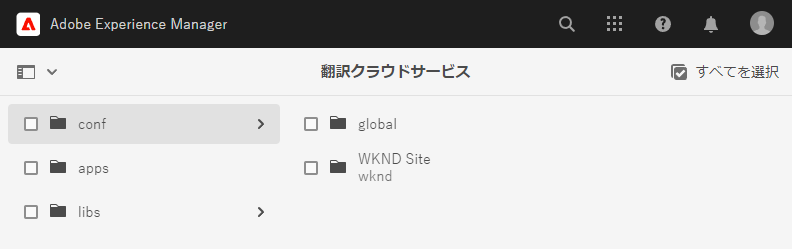
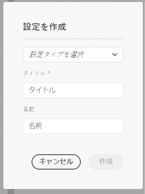
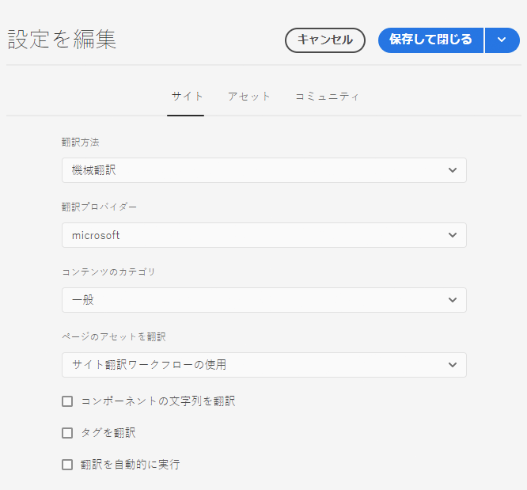
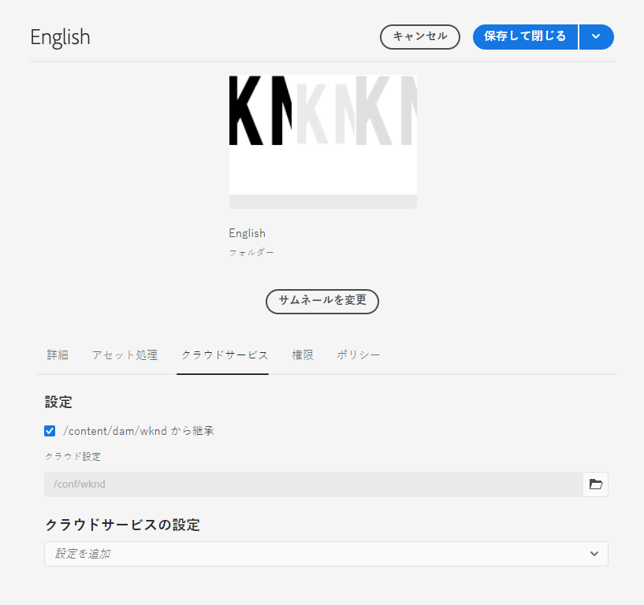

# 翻訳統合の設定 {#configure-integration}

AEM を翻訳サービスに接続する方法を説明します。

## これまでの説明内容 {#story-so-far}

AEM ヘッドレス翻訳ジャーニーの以前のドキュメント（[AEM ヘッドレス翻訳の基本を学ぶ](learn-about.md)）では、ヘッドレスコンテンツを整理する方法と AEM の翻訳ツールの仕組みについて説明し、以下を達成しました。

* 翻訳におけるコンテンツ構造の重要性を理解する
* AEM のヘッドレスコンテンツの保存方法を理解する
* AEM の翻訳ツールに詳しくなる

この記事ではこれらの基本事項に基づいて、最初の設定手順を実行し翻訳サービスをセットアップします。ジャーニーで後ほどそのサービスを使用して、コンテンツを翻訳します。

## 目的 {#objective}

このドキュメントでは、選択した翻訳サービスに AEM 統合をセットアップする方法を説明します。読み終えると、次のことができるようになります。

* AEM の翻訳統合フレームワークの重要なパラメーターを理解する
* 翻訳サービスへの独自の接続をセットアップできる

## 翻訳統合フレームワーク {#tif}

AEM の翻訳統合フレームワーク（TIF）は、AEM コンテンツの翻訳を調整するためにサードパーティの翻訳サービスと統合されています。これには 3 つの基本的な手順が必要です。

1. 翻訳サービスプロバイダーに接続します。
1. 翻訳統合フレームワーク設定を作成します。
1. 設定をコンテンツに関連付けます。

この後の節では、これらの手順を詳しく説明します。

## 翻訳サービスプロバイダーへの接続 {#connect-translation-provider}

まず、使用する翻訳サービスを選択します。AEM で使用できる人間による翻訳サービスと機械翻訳サービスには、様々な選択肢があります。ほとんどのプロバイダーは、インストールの必要なトランスレーターパッケージを提供しています。使用可能なオプションの選択については、 [その他のリソース](#additional-resources) の節を参照してください。

>[!NOTE]
>
>通常、使用する翻訳サービスを選択するのは翻訳担当者ですが、必要な翻訳コネクタパッケージをインストールするのは管理者です。

このジャーニーでは、AEM に体験版ライセンスが標準で付与されている Microsoft Translator を使用します。このプロバイダーについて詳しくは、 [その他のリソース](#additional-resources) の節を参照してください。

別のプロバイダーを選択する場合は、管理者が、その翻訳サービスの指示に従って、コネクタパッケージをインストールする必要があります。

>[!NOTE]
>
>AEM に標準で搭載されている Microsoft Translator を使用する場合は、追加のセットアップは必要なく、追加のコネクタ設定なしでそのまま機能します。
>
>テスト目的でMicrosoft Translator コネクタを使用する場合は、この後の 2 つの節で示している手順を実行する必要はありません [Translation Integration Configuration の作成 ](#create-config) および [ 設定とコンテンツの関連付け ](#associate)。 ）。ただし、希望するコネクタを設定する必要がある場合に備えて手順を把握しておけるように、これらの節に目を通しておくことをお勧めします。
>
>Microsoft Translator コネクタの体験版ライセンスは、実稼動用ではありません。ライセンスを取得する場合、システム管理者はこのドキュメントの最後にある[その他のリソース](#additional-resources)の節で詳述されている手順に従ってライセンスを設定する必要があります。

## 翻訳統合フレームワーク設定の作成 {#create-config}

希望する翻訳サービスのコネクタパッケージをインストールしたら、そのサービスの翻訳統合フレームワーク設定を作成する必要があります。この設定には以下の情報が含まれます。

* 使用する翻訳サービスプロバイダー
* 人間による翻訳と機械翻訳のどちらを実行するか
* コンテンツフラグメントに関連付けられている他のコンテンツ（タグなど）を翻訳するかどうか

翻訳設定を作成するには、以下を実行します。

1. グローバルナビゲーションメニューで、**ツール**／**クラウドサービス**／**翻訳クラウドサービス**&#x200B;を選択します。
1. コンテンツ構造内で設定を作成する場所に移動します。この場所は多くの場合、特定のプロジェクトに基づいている場合もあれば、グローバルな場合もあります。
   * 例えば、下図の場合、設定を、すべてのコンテンツに適用されるようにグローバルに作成することも、WKND プロジェクトにのみ適用されるように作成することもできます。

   

1. フィールドに次の情報を入力し、「**作成**」を選択します。
   1. ドロップダウンで「**設定タイプ**」を選択します。リストから「**翻訳統合**」を選択します。
   1. 設定の&#x200B;**タイトル**&#x200B;を入力します。この&#x200B;**タイトル**&#x200B;によって、**クラウドサービス**&#x200B;コンソールおよびページプロパティのドロップダウンリストで設定が識別されます。
   1. オプションとして、設定を格納するリポジトリノードに使用する&#x200B;**名前**&#x200B;を入力します。

   

1. 「**作成**」を選択すると、**設定を編集**&#x200B;ウィンドウが表示されるので、そこで設定プロパティを指定できます。

1. コンテンツフラグメントは、AEM にアセットとして保存されることに注意してください。「**アセット**」タブを選択します。



1. 以下の情報を入力します。

   1. **翻訳方法** - 翻訳プロバイダーに応じて、「**機械翻訳**」または「**人間翻訳**」を選択します。このジャーニーでは、機械翻訳を想定しています。
   1. **翻訳プロバイダー** - 翻訳サービス用にインストールしたコネクタをリストから選択します。
   1. **コンテンツのカテゴリ** - 翻訳のターゲットを絞り込むために最も適したカテゴリを選択します（機械翻訳の場合のみ）。
   1. **コンテンツフラグメントアセットを翻訳** - コンテンツフラグメントに関連付けられているアセットを翻訳する場合は、これをオンにします。
   1. **アセットを翻訳** - アセットを翻訳する場合は、これをオンにします。
   1. **メタデータを翻訳** - アセットのメタデータを翻訳する場合は、これをオンにします。
   1. **タグを翻訳** - アセットに関連付けられているタグを翻訳する場合は、これをオンにします。
   1. **翻訳を自動実行** - 翻訳を翻訳サービスに自動的に送信する場合は、これをオンにします。
   1. **更新のみの翻訳を無効にする** - このオプションをオンにすると、翻訳プロジェクトを更新すると、前回の翻訳以降に変更されたフィールドだけでなく、翻訳用のすべての翻訳可能なフィールドが送信されます。翻訳プロジェクトの更新については、ジャーニーの後半で説明します。
   1. **翻訳用にコンテンツモデルフィールドを有効にする** - このオプションをオンにすると、**翻訳可能**&#x200B;フラグに基づいてコンテンツモデルのフィールドが翻訳設定によって自動的に認識されます。

1. 「**保存して閉じる**」を選択します。

これで、翻訳サービスにコネクタが設定されました。

## 設定とコンテンツの関連付け {#associate}

AEM は柔軟かつ強力なツールで、複数のコネクタと複数の設定を使用して複数の同時翻訳サービスをサポートしています。このような設定のセットアップはこのジャーニーの範囲外ですので、ここでは扱いません。ただし、このような柔軟性があるので、この設定をコンテンツに関連付けることで、コンテンツの翻訳に使用するコネクタと設定を指定する必要があります。

それには、まずコンテンツの言語ルートに移動します。この例では、言語ルートは次のとおりです。

```text
/content/dam/<your-project>/en
```

1. グローバルナビゲーションで&#x200B;**ナビゲーション**／**アセット**／**ファイル**&#x200B;に移動します。
1. アセットコンソールで、設定する言語ルートを選択して、「**プロパティ**」を選択します。
1. 「**クラウドサービス**」タブを選択します。
1. 「**設定を追加**」ドロップダウンリストの「**クラウドサービスの設定**」で、コネクタを選択します。（前述の説明 [ としてパッケージをインストールすると、ドロップダウンリストに表示されるはず ](#connect-translation-provider) す。
1. 「**設定を追加**」ドロップダウンリストの「**クラウドサービスの設定**」で、設定も選択します。
1. 「**保存して閉じる**」を選択します。



## 次の手順 {#what-is-next}

これで、ヘッドレス翻訳ジャーニーのこの手順が完了し、以下のことができるようになりました。

* AEM の翻訳統合フレームワークの重要なパラメーターを理解する
* 翻訳サービスへの独自の接続をセットアップできる

この知識を基に、AEM ヘッドレス翻訳ジャーニーを続けてください。次は、[ コンテンツの翻訳 ](translation-rules.md) のドキュメントを参照して、これまでの設定を使って、実際にコンテンツを翻訳する方法を確認してください。

## その他のリソース {#additional-resources}

[翻訳ルールの設定](translation-rules.md)のドキュメントを確認して、ヘッドレス翻訳ジャーニーの次のステップに進むことをお勧めします。ヘッドレスジャーニーの続行に必須ではありませんが、この記事で取り上げたいくつかの概念について詳しく説明している追加のオプションリソースを以下に挙げておきます。

* [翻訳統合フレームワークの設定](/help/sites-cloud/administering/translation/integration-framework.md) - 選択した翻訳コネクタのリストを示し、サードパーティの翻訳サービスと統合できるように翻訳統合フレームワークを設定する方法について説明します。
* [Microsoft Translator への接続](/help/sites-cloud/administering/translation/connect-ms-translator.md) - AEM には、テスト用に Microsoft Translation の体験版アカウントが用意されています。
