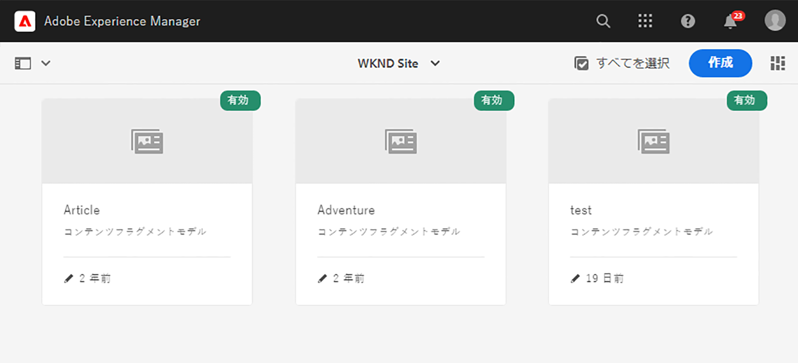
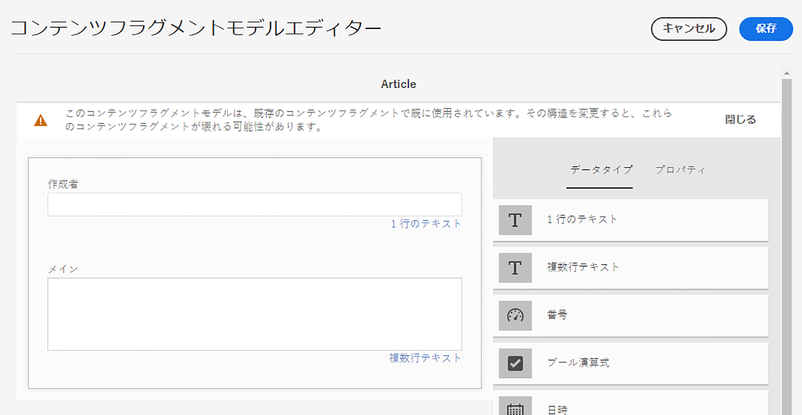
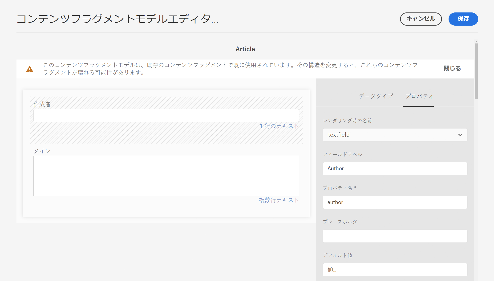

# Get Started with AEM Headless Translation {#getting-started}

Get to know how to organize your headless content and how AEM&#39;s translation tools work.

## これまでの説明内容 {#story-so-far}

[](learn-about.md)

* Understand the basic concepts of headless content delivery.
* Be familiar with how AEM supports headless and translation.

This article builds on those fundamentals so you understand how AEM stores and manages headless content and how you can use AEM&#39;s translation tools to translate that content.

## 目的 {#objective}

This document helps you understand how to get started translating headless content in AEM. ドキュメントを読めば、以下が可能です。

* Understand the importance of content structure to translation.
* Understand how AEM stores headless content.
* Be familiar with AEM&#39;s translation tools.

## 要件と前提条件 {#requirements-prerequisites}

There are a number of requirements before you begin translating your headless AEM content.

### 知識 {#knowledge}

* Experience translating content in a CMS
* Experience using the basic features of a large-scale CMS
* Have a working knowledge of AEM basic handling
* Understanding of the translation service you are using
* Have a basic understanding of the content you are translating

>[!TIP]
>
>[](/help/sites-cloud/authoring/getting-started/basic-handling.md)The Basic Handling documentation is not part of the journey, so please return to this page when complete.

### ツール {#tools}

* Sandbox access for testing translating your content
* Credentials to connect to your preferred translation service
* `project-administrators`

## Structure is Key {#content-structure}

AEM&#39;s content, be it headless or traditional web pages, is driven by its structure. AEM imposes few requirements on the content structure, but careful consideration of your content hierarchy as part of the project planning can make translation much simpler.

>[!TIP]
>
>Plan for translation at the very beginning of the headless project. Work closely with the project manager and content architects early.
>
>An Internationalization Project Manager may be required as a separate persona whose responsibility it is to define what content should be translated and what not, and what translated content may be modified by regional or local content producers.

## How AEM Stores Headless Content {#headless-content-in-aem}

For the translation specialist, it is not important to understand in-depth how AEM manages headless content. However being familiar with the basic concepts and terminology will be helpful as you later use AEM&#39;s translation tools. Most importantly you need to understand your own content and how it is structured in order to effectively translate it.

### コンテンツモデル {#content-models}

In order for headless content to be delivered consistently across channels, regions, and languages, content must be highly structured. AEM uses Content Models to enforce this structure. Think of Content Models as a kind of template or pattern for creating headless content. Because every project has its own needs, every project defines its own Content Fragment Models. AEM has no fixed requirements or structure for such models.

The content architect works early in the project to define this structure. As the translation specialist, you should work closely with the content architect to understand and organize the content.

>[!NOTE]
>
>It is the responsibility of the content architect to define the Content Models. The translation specialist should only be familiar with their structure as outlined in the following steps.

Because the Content Models define the structure of your content, you need to know which fields of your models must be translated. Generally you work with the content architect to define this. To browse the fields of your content models, follow the steps below.

1. ************
1. Content Fragment Models are generally stored in a folder structure. Tap or click on the folder for your project.
1. The models are listed. Tap or click on the model to see the details.
   
1. ****
   1. The left column contains the fields of the model. This column interests us.
   1. The right column contains the fields that can be added to the model. This column we can ignore.
      
1. Tap or click one of the fields of the model. AEM marks it and the details of that field are shown in the right column.
   

**** You will need this information later in the journey. ****

>[!TIP]
>
>**** These field names are needed for later in the journey. The prior steps are provided for the understanding of the translation specialist.

### コンテンツフラグメント {#content-fragments}

Content Models are used by the content authors to create the actual headless content. Content authors select which model to base their content on an then create Content Fragments. Content Fragments are instances of the models and represent actual content to be delivered headlessly.

If the Content Models are the patterns for the content, the Content Fragments are the actual content based on those patterns. The Content Fragments represent the content that must be translated.

Content Fragments are managed as assets in AEM as part of digital asset management (DAM). `/content/dam`

## Recommended Content Structure {#recommended-structure}

As previously recommended, work with your content architect to determine the appropriate content structure for your own project. However the following is a proven, simple, and intuitive structure which is quite effective.

`/content/dam`

```text
/content/dam/<your-project>
```

The language in which your content is authored is called the language root. In our example it is English and it should be below this path.

```text
/content/dam/<your-project>/en
```

All project content that may need to be localized should be placed under the language root.

```text
/content/dam/<your-project>/en/<your-project-content>
```

Translations should be created as sibling folders alongside the language root with their folder name representing the ISO-2 language code of the language. For example, German would have the following path.

```text
/content/dam/<your-project>/de
```

>[!NOTE]
>
>The content architect generally is responsible for creating these language folders. If they are not created, AEM will not be able to later create translation jobs.

The final structure may look something like the following.

```text
/content
    |- dam
        |- your-project
            |- en
                |- some
                |- exciting
                |- headless
                |- content
            |- de
            |- fr
            |- it
            |- ...
        |- another-project
        |- ...
```

You should take note of the specific path of your content as it will be required later to configure your translation.

>[!NOTE]
>
>It is generally the responsibility of the content architect to define the content structure, but can collaborate with the translation specialist.
>
>It is detailed here for completeness.

## AEM Translation Tools {#translation-tools}

Now that you understand what Content Fragments are and the importance of content structure, we can look at how to translate this content. The translation tools in AEM are quite powerful, but are simple to understand at a high level.

* ****
* ****
* ****

You generally only set up your connector once for your instance and rules per headless project. Then you use translation projects to translate your content and keep its translations up to date on a continual basis.

## 次の手順 {#what-is-next}

Now that you have completed this part of the headless translation journey you should:

* Understand the importance of content structure to translation.
* Understand how AEM stores headless content.
* Be familiar with AEM&#39;s translation tools.

[](configure-connector.md)

## その他のリソース {#additional-resources}

[](configure-connector.md)

* [](/help/sites-cloud/authoring/getting-started/basic-handling.md)
* [](/help/sites-cloud/administering/translation/rules.md)
* [](/help/sites-cloud/administering/translation/integration-framework.md)
* [](/help/sites-cloud/administering/translation/managing-projects.md)
