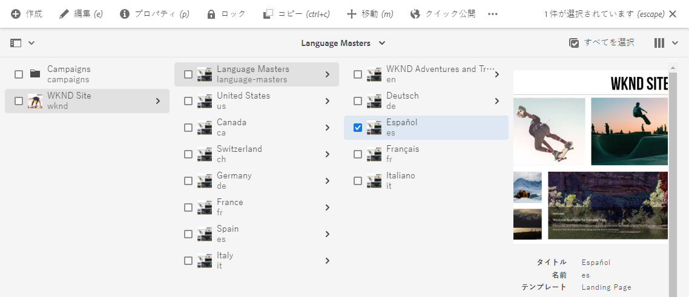
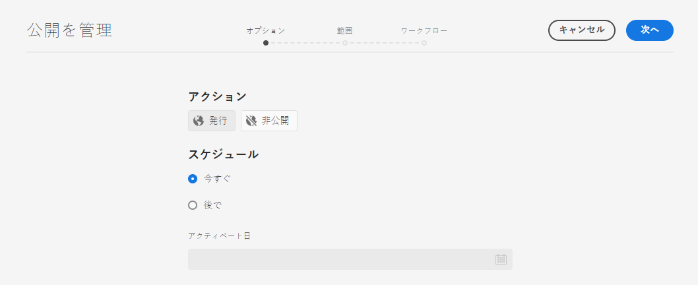
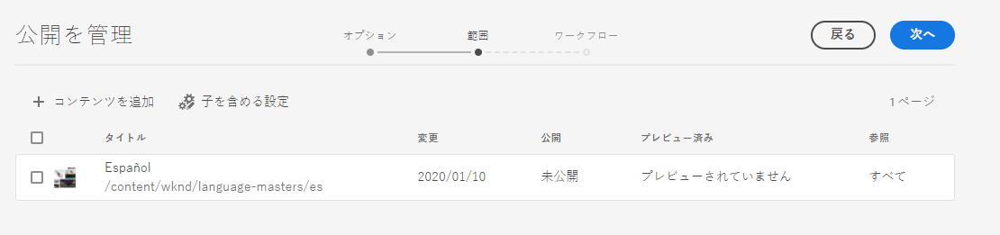
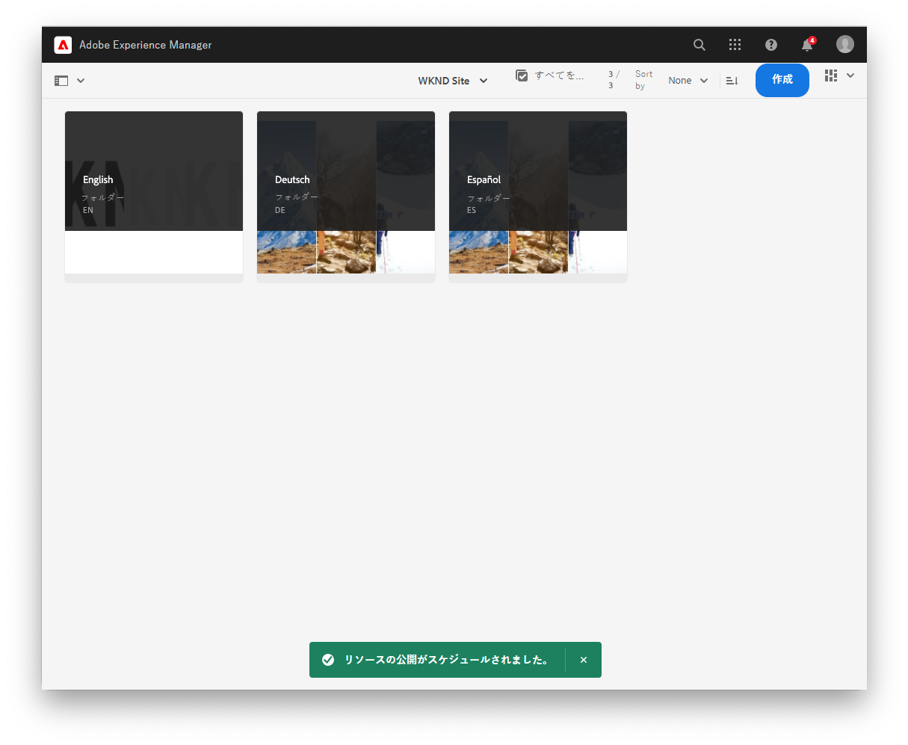
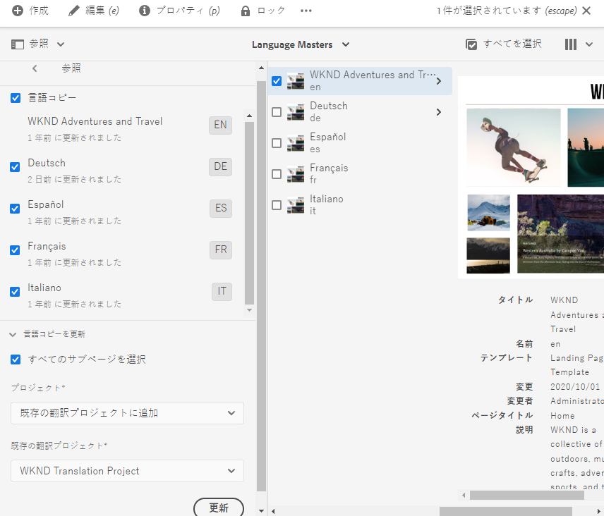
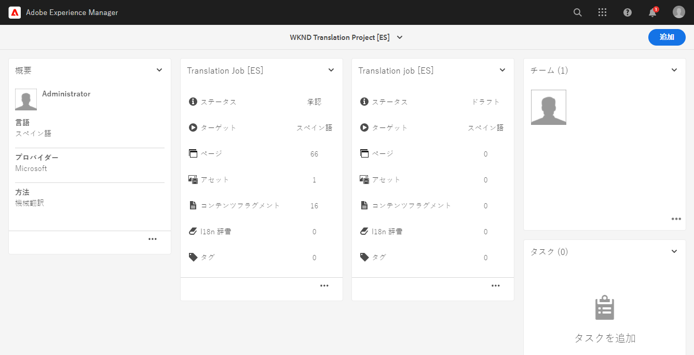
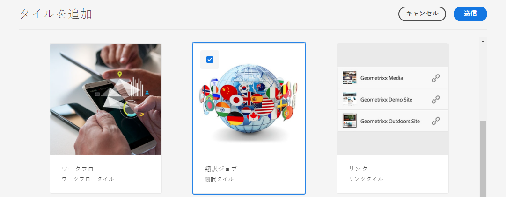
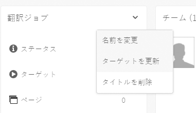
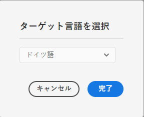

# Publish Translated Content {#publish-content}

Learn how to publish your translated content and update the translations as the content updates.

## これまでの説明内容 {#story-so-far}

[](configure-connector.md)You should now:

* Understand what a translation project is.
* Be able to create new translation projects.
* Use translation projects to translate your headless content.

Now that your initial translation is complete, this article takes you through the next step of publishing that content and what to do to update your translations as the underlying content in the language root  changes.

## 目的 {#objective}

This document helps you understand how to publish headless content in AEM and how to create a continual workflow to keep your translations up-to-date. 読み終えると、以下を達成できます。

* Understand the author-publish model of AEM.
* Know how to publish your translated content.
* Be able to implement a continual update model for your translated content.

## AEM&#39;s Author-Publish Model {#author-publish}

Before you publish your content, it is a good idea to understand AEM&#39;s author-publish model. In simplified terms, AEM divides users of the system into two groups.

1. Those who create and manage the content and the system
1. Those who consume the content from the system

AEM is therefore physically separated into two instances.

1. ****
1. ****

Once content is created on the author instance, it must be transferred to the publish instance for it to be available for consumption. ****

## Publishing Your Translated Content {#publishing}

Once you are happy with the state of your translated content, it must be published so headless services can consume it. This task is usually not the responsibility of the translation specialist, but is documented here to illustrate the complete workflow.

>[!NOTE]
>
>Generally when the translation is complete, the translations specialist informs the content owners that the translations are ready for publication. The content owners then publish them.
>
>The following steps are provided for completeness.

The simplest way to publish the translations is to navigate to the project assets folder.

```text
/content/dam/<your-project>/
```

Under this path you have sub-folders for each translation language and can choose which to publish.

1. ************
1. Here you see the language root folder and all other language folders. Select the localized language or languages that you wish to publish.
   
1. ****
1. ********************「**次へ**」をタップまたはクリックします。
   
1. ********
   
1. AEM confirms the publish action with a pop-up message at the bottom of the screen.
   

Your translated headless content is now published! It can now be accessed and consumed by your headless services.

>[!TIP]
>
>You can select multiple items (i.e. multiple language folders) when publishing in order to publish multiple translations at one time.

There are additional options when publishing your content, such as scheduling a publication time, which are beyond the scope of this journey. [](#additional-resources)

## Updating Your Translated Content {#updating-translations}

Translation is rarely a one-off exercise. Typically your content authors continue to add to and modify your content in the language root after initial translation is complete. This means that you need to also update your translated content.

Specific project requirements define how often you need to update your translations and what decision process is followed before performing an update. Once you have decided to update your translations, the process in AEM is very simple. As the initial translation was based on a translation project, so too are any updates.

However as before, the process differs slightly if you chose to automatically create your translation project or manually create your translation project.

### Updating an Automatically Created Translation Project {#updating-automatic-project}

1. ************ Remember that headless content in AEM is stored as assets known as Content Fragments.
1. Select the language root of your project. `/content/dam/wknd/en`
1. ****
1. ****
1. ****
1. ****
1. ********
1. ****
1. ****



The content is added to the existing translation project. To view the translation project:

1. ********
1. Tap or click the project that you just updated.
1. Tap or click the language or one of the languages that you updated.

You see that a new job card was added to the project. In this example, another Spanish translation was added.



You may notice that the statistics listed on the new card (number of assets and content fragments) is different. This is because AEM recognizes what has changed since the last translation and only includes the content that needs to be translated. This includes re-translation of updated content as well as the first-time translation of new content.

[](translate-content.md#using-translation-project)

### Updating a Manually Created Translation Project {#updating-manual-project}

To update a translation you can add a new job to your existing project that is responsible for translating the updated content.

1. ********
1. Tap or click the project that you need to update.
1. ****
1. ************

   

1. ****

   

1. ********

   

1. Once your new translation job&#39;s target language is set, tap or click on the ellipsis button at the bottom of the job card to view the details of the job.
1. The job is empty when first created. ****[](translate-content.md##manually-creating)

>[!TIP]
>
>The path browser&#39;s powerful filters can again be useful to find just the content that has been updated.
>
>[](#additional-resources)

[](translate-content.md#using-translation-project)

## End of the Journey? {#end-of-journey}

おめでとうございます。You have completed the headless translation journey! You should now:

* Have an overview of what headless content delivery is.
* Have a basic Understanding AEM&#39;s headless features.
* Understand AEM&#39;s translation features and how they related to headless content.
* Have the ability to start translating your own headless content.

You are now ready to translate your own headless content in AEM. However AEM is a powerful tool and there are many additional options available. [](#additional-resources)

## その他のリソース {#additional-resources}

* [](/help/sites-cloud/administering/translation/managing-projects.md)
* [](/help/sites-cloud/authoring/getting-started/concepts.md)This document is focused on authoring pages rather than Content Fragments, but the theory still applies.
* [](/help/sites-cloud/authoring/fundamentals/publishing-pages.md)This document is focused on authoring pages rather than Content Fragments, but the theory still applies.
* [](/help/sites-cloud/authoring/fundamentals/environment-tools.md##path-selection)
