# ヘッドレスコンテンツの翻訳 {#translate-content}

翻訳統合を使用してヘッドレスコンテンツを翻訳する方法について説明します。

## これまでの説明内容 {#story-so-far}

AEM ヘッドレス翻訳ジャーニーのこれまでのドキュメント、[翻訳コネクタの設定](configure-connector.md)では、AEM の翻訳フレームワークについて説明しました。その結果、以下を習得しました。

* AEM の翻訳統合フレームワークの重要なパラメーターを理解する
* 翻訳サービスへの独自の接続をセットアップできる

コネクタがセットアップされたので、この記事では、ヘッドレスコンテンツ翻訳の次のステップについて説明します。

## 目的 {#objective}

このドキュメントでは、AEM の翻訳プロジェクトをコネクタと共に使用してコンテンツを翻訳する方法を説明します。このドキュメントを読み終えると、次のことが可能になります。

* 翻訳プロジェクトの概要を理解。
* 新しい翻訳プロジェクトの作成。
* 翻訳プロジェクトを使用したヘッドレスコンテンツの翻訳。

## 翻訳プロジェクトの作成 {#creating-translation-project}

翻訳プロジェクトを使用すると、ヘッドレス AEM コンテンツの翻訳を管理できます。翻訳プロジェクトでは、他の言語に翻訳するコンテンツを 1 か所に集めて、翻訳作業を一元管理できるようにします。

翻訳プロジェクトにコンテンツが追加されると、そのコンテンツの翻訳ジョブが作成されます。ジョブには、リソースで実行される人間による翻訳と機械翻訳のワークフローの管理に使用するコマンドとステータス情報が含まれています。

翻訳プロジェクトを作成する方法は、2 つあります。

1. コンテンツの言語ルートを選択したあと、コンテンツパスに基づいて AEM が翻訳プロジェクトを自動的に作成する
1. 空のプロジェクトを作成し、翻訳プロジェクトに追加するコンテンツを手動で選択する

どちらのアプローチも有効で、通常は、翻訳を実行するペルソナによって異なるだけです。

* 翻訳プロジェクトマネージャー（TPM）には、翻訳プロジェクトに追加するコンテンツを手動で選択できる柔軟性が必要です。
* コンテンツ所有者が翻訳の責任者でもある場合は、選択したコンテンツパスに基づいて AEM でプロジェクトを自動的に作成する方が、多くの場合簡単です。

両方のアプローチについて、以降の節で説明します。

### コンテンツパスに基づく翻訳プロジェクトの自動作成 {#automatically-creating}

コンテンツ所有者が翻訳も担当する場合、AEM で翻訳プロジェクトを自動的に作成する方が、多くの場合簡単です。コンテンツパスに基づいて AEM で翻訳プロジェクトを自動的に作成するには、次の手順に従います。

1. **ナビゲーション**／**アセット**／**ファイル**&#x200B;に移動します。AEM のヘッドレスコンテンツは、コンテンツフラグメントと呼ばれるアセットとして保存されています。
1. プロジェクトの言語ルートを選択します。ここでは、`/content/dam/wknd/en` を選択しました。
1. パネルセレクターを選択し、「**参照**」パネルを表示します。
1. 「**言語コピー**」を選択します。
1. 「**言語コピー**」チェックボックスをオンにします。
1. 参照パネル下部の「**言語コピーを更新**」セクションを展開します。
1. **プロジェクト**&#x200B;ドロップダウンリストで「**翻訳プロジェクトを作成**」を選択します。
1. 翻訳プロジェクトに適したタイトルを指定します。
1. 「**開始**」を選択します。

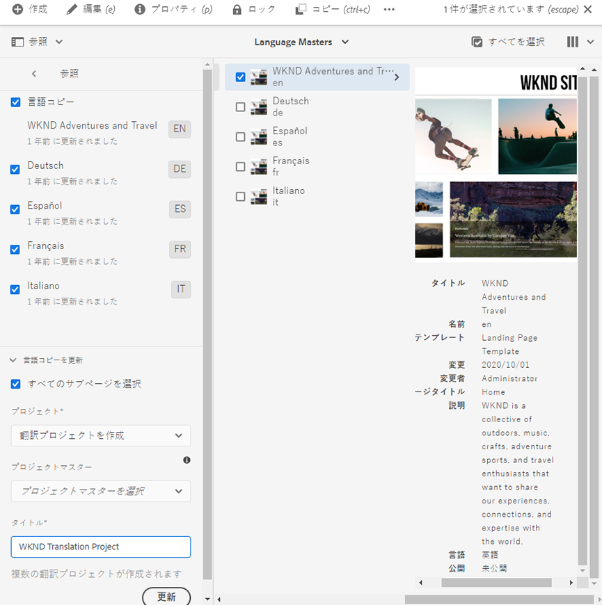

プロジェクトが作成されたことを示すメッセージが表示されます。

>[!NOTE]
>
>翻訳言語に必要な言語構造が、[コンテンツ構造の定義](getting-started.md#content-structure)の一部として既に作成されていることを前提としています。これは、コンテンツアーキテクトと協力して行う必要があります。
>
>前の手順で説明したように、言語フォルダーが事前に作成されていない場合は、言語コピーを作成できません。

### コンテンツの選択による翻訳プロジェクトの手動作成 {#manually-creating}

翻訳プロジェクトマネージャーは、多くの場合、翻訳プロジェクトに含める特定のコンテンツを手動で選択する必要があります。そうした手動翻訳プロジェクトを作成するには、まず空のプロジェクトを作成してから、そのプロジェクトに追加するコンテンツを選択する必要があります。

1. **ナビゲーション**／**プロジェクト**&#x200B;に移動します。
1. **作成**／**フォルダー**&#x200B;を選択して、プロジェクトのフォルダーを作成します。
   * これはオプションですが、翻訳作業を系統立てて行うのに役立ちます。
1. **プロジェクトを作成**&#x200B;ウィンドウで、フォルダーの「**タイトル**」を追加して「**作成**」を選択します。

   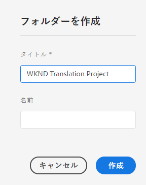

1. フォルダーを選択して開きます。
1. 新しいプロジェクトフォルダーで、**作成**／**プロジェクト**&#x200B;を選択します。
1. プロジェクトはテンプレートを基にしています。**翻訳プロジェクト**&#x200B;テンプレートを選択し、「**次へ**」を選択します。

   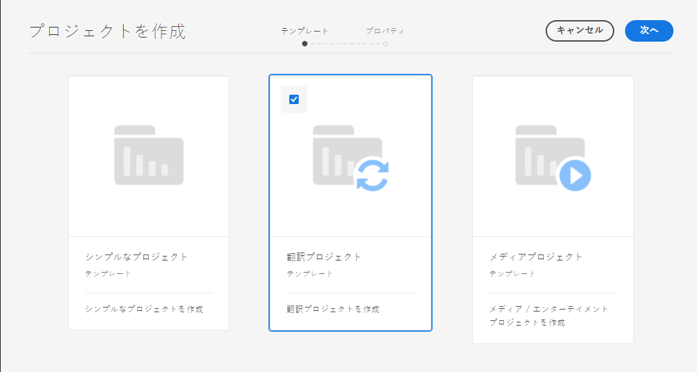

1. 「**基本**」タブで、新規プロジェクトの名前を入力します。

   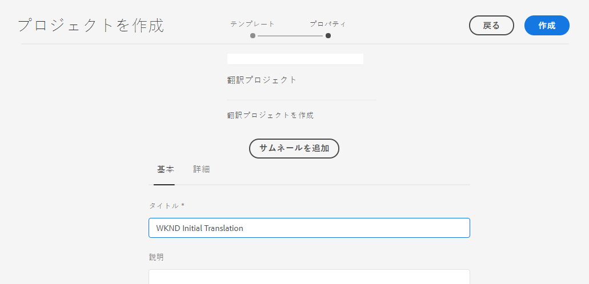

1. 「**詳細**」タブの「**ターゲット言語**」ドロップダウンで、コンテンツの翻訳先の言語を選択します。「**作成**」を選択します。

   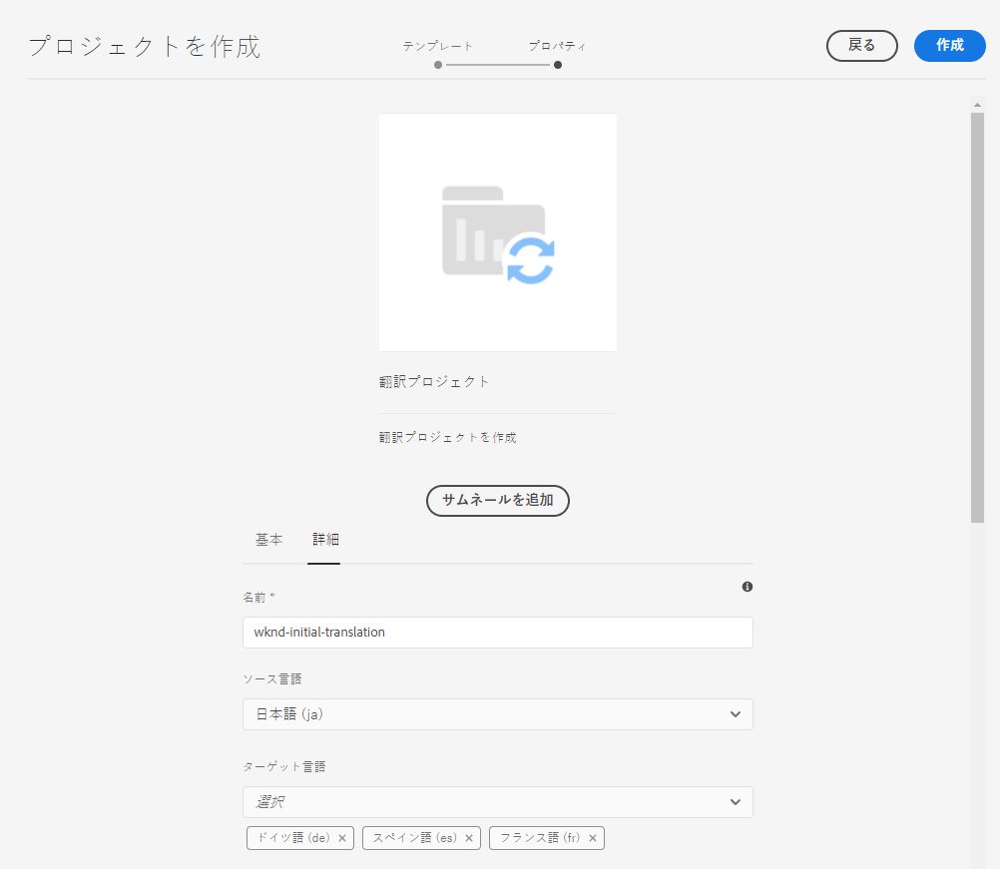

1. 確認ダイアログで「**開く**」を選択します。

   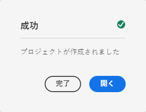

これでプロジェクトが作成されましたが、翻訳するコンテンツがまだ含まれていません。次の節では、プロジェクトを構造化する方法とコンテンツの追加方法について詳しく説明します。

## 翻訳プロジェクトの使用 {#using-translation-project}

翻訳プロジェクトは、翻訳作業に関連するコンテンツとタスクを 1 か所に集めて、翻訳を簡単で管理しやすいものにするように設計されています。

翻訳プロジェクトを表示するには、次の操作を実行します。

1. **ナビゲーション**／**プロジェクト**&#x200B;に移動します。
1. 前の節で作成したプロジェクトを選択します。

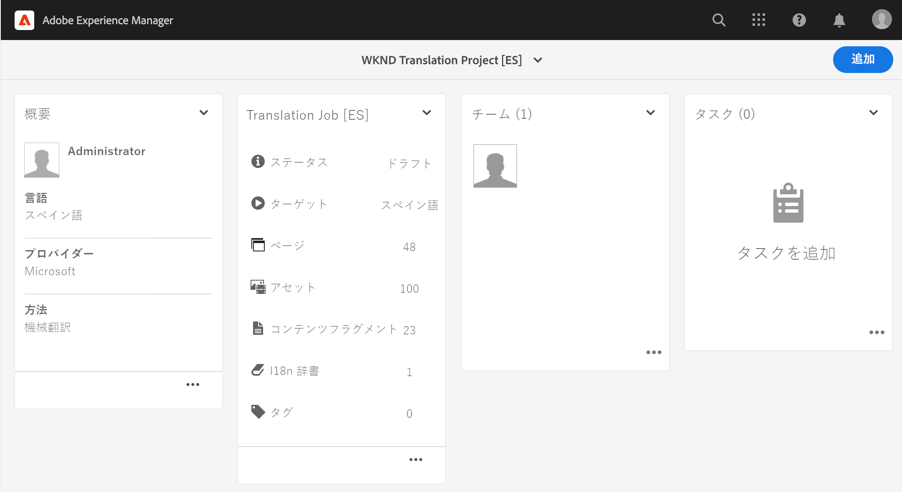

プロジェクトは、次のような複数のカードに分かれています。

* **概要** - 所有者、言語、翻訳プロバイダーなど、プロジェクトの基本的なヘッダー情報が表示されます。
* **翻訳ジョブ** - このカードには、ステータスやアセット数といった実際の翻訳ジョブの概要が表示されます。一般に、言語ごとに 1 つのジョブが存在し、ジョブ名に ISO-2 言語コードが付加されたます。
* **チーム** - この翻訳プロジェクトに共同で取り組んでいるユーザーが表示されます。このジャーニーでは、このトピックについては扱いません。
* **タスク** - コンテンツの翻訳に関連する追加タスク（TODO 項目やワークフロー項目の実行など）。このジャーニーでは、このトピックについては扱いません。

翻訳プロジェクトの使用方法は、作成方法（AEM による自動作成か手動作成か）によって異なります。

### 自動作成された翻訳プロジェクトの使用 {#using-automatic-project}

翻訳プロジェクトを自動的に作成する場合、AEM は選択されたパスの下のヘッドレスコンテンツを評価します。この評価に基づいて、新規翻訳プロジェクトへの翻訳が必要なコンテンツが抽出されます。コンテンツアーキテクトによって&#x200B;**翻訳可能**&#x200B;のフラグが設定されたフィールドに基づいて、翻訳するフィールドがわかります。

このプロジェクトに含まれているヘッドレスコンテンツの詳細を表示するには、次の操作を実行します。

1. **翻訳ジョブ**&#x200B;カードの下部にある省略記号ボタンを選択します。
1. **翻訳ジョブ**ウィンドウには、ジョブ内のすべての項目が一覧表示されます。
   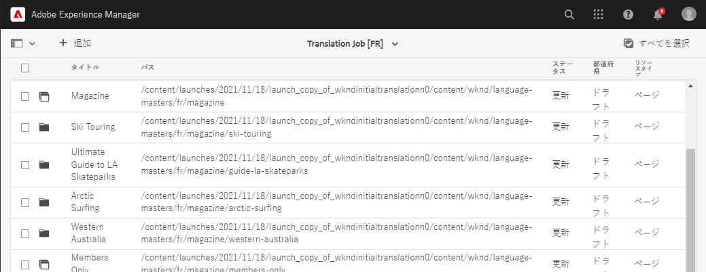
1. 行を選択すると、その行の詳細が表示されます。なお、1 つの行が、翻訳する複数のコンテンツ項目を表している場合があることに留意してください。
1. 行項目の選択用チェックボックスを選択すると、その項目をジョブから削除するオプションや、コンテンツフラグメントコンソールまたは Assets コンソールに表示するオプションなどがさらに表示されます。

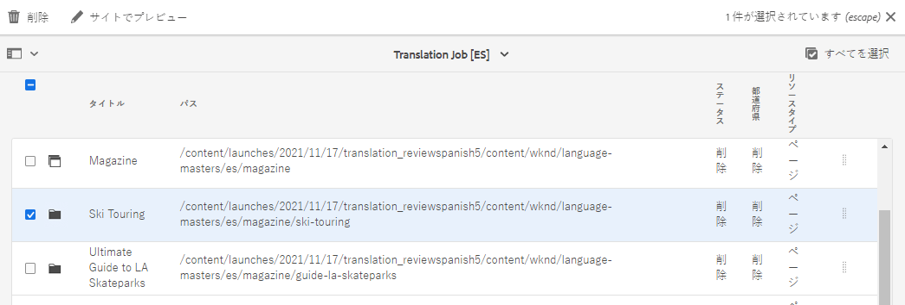

通常、翻訳ジョブのコンテンツは&#x200B;**ドラフト**&#x200B;状態で始まります。状態は、**翻訳ジョブ**&#x200B;ウィンドウの「**状態**」列に表示されます。

翻訳ジョブを開始するには、翻訳プロジェクトの概要に戻り、**翻訳ジョブ**&#x200B;カードの上部にある山形ボタンを選択して、「**開始**」を選択します。

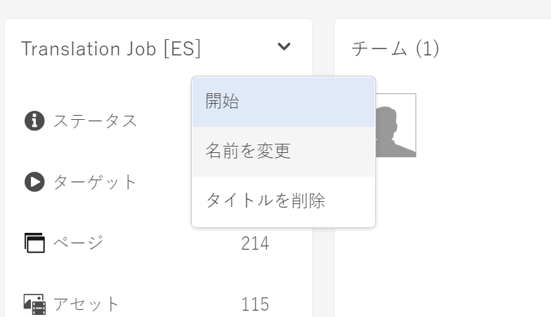

これで、AEM は翻訳設定およびコネクタと通信して、コンテンツを翻訳サービスに送信します。翻訳の進行状況を確認するには、**翻訳ジョブ**&#x200B;ウィンドウに戻ってエントリの「**状態**」列を確認します。

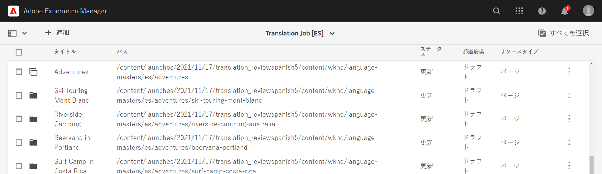

機械翻訳は、自動的に&#x200B;**承認済み**&#x200B;状態で戻されます。人間による翻訳の場合は、さらにやり取りが可能ですが、それはこのジャーニーの範囲外ですので、ここでは扱いません。

### 手動で作成された翻訳プロジェクトの使用 {#using-manual-project}

翻訳プロジェクトを手動で作成する場合、必要なジョブは AEM が作成しますが、そこに含めるコンテンツは自動的には選択されません。これにより、翻訳するコンテンツを翻訳プロジェクトマネージャーが柔軟に選択できます。

翻訳ジョブにコンテンツを追加するには：

1. **翻訳ジョブ**&#x200B;カードの下部にある省略記号ボタンを選択します。
1. ジョブにコンテンツが含まれていないことを確認します。ウィンドウの上部にある「**追加**」ボタンを選択して、ドロップダウンから「**アセット／ページ**」を選択します。

   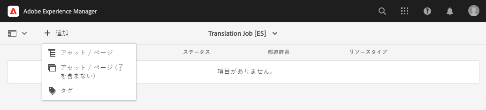

1. パスブラウザーが開き、追加するコンテンツを選択できます。コンテンツを探し、選択します。

   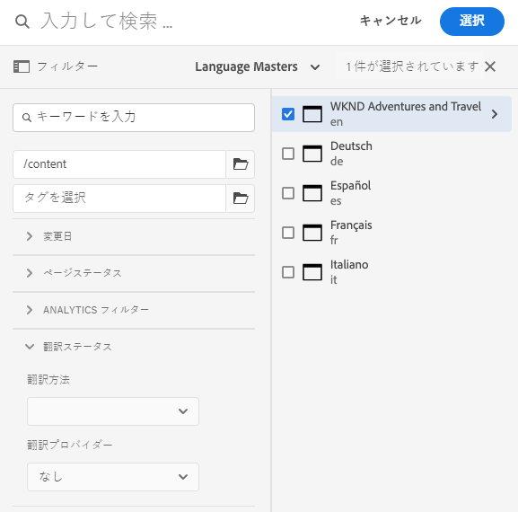

1. 「**選択**」を選択して、選択したコンテンツをジョブに追加します。
1. **翻訳**&#x200B;ダイアログで、「**言語コピーを作成**」を指定します。

   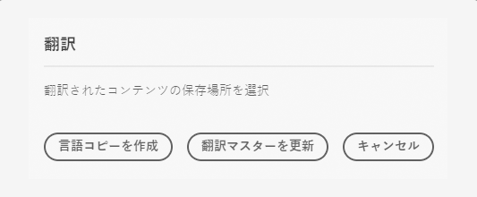

1. これで、コンテンツがジョブに追加されます。

   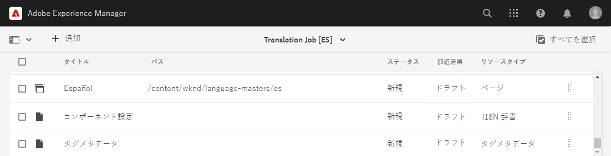

1. 行項目の選択用チェックボックスを選択すると、その項目をジョブから削除するオプションや、コンテンツフラグメントコンソールまたは Assets コンソールに表示するオプションなどがさらに表示されます。


1. 上記の手順を繰り返して、必要なコンテンツをすべてジョブに追加します。

>[!TIP]
>
>パスブラウザーは、コンテンツの検索、フィルタリングおよびナビゲーションを行える強力なツールです。「**コンテンツのみ／フィルター**」ボタンを選択すると、サイドパネルが切り替わり、「**変更日**」や「**翻訳ステータス**」などの詳細フィルターが表示されます。
>
>パスブラウザーについて詳しくは、[その他のリソース](#additional-resources)の節を参照してください。

これまでの手順を使用して、必要なコンテンツをプロジェクトのすべての言語（ジョブ）に追加できます。コンテンツをすべて選択したら、翻訳を開始できます。

通常、翻訳ジョブのコンテンツは&#x200B;**ドラフト**&#x200B;状態で始まります。状態は、**翻訳ジョブ**&#x200B;ウィンドウの「**状態**」列に表示されます。

翻訳ジョブを開始するには、翻訳プロジェクトの概要に戻り、**翻訳ジョブ**&#x200B;カードの上部にある山形ボタンを選択して、「**開始**」を選択します。


これで、AEM は翻訳設定およびコネクタと通信して、コンテンツを翻訳サービスに送信します。翻訳の進行状況を確認するには、**翻訳ジョブ**&#x200B;ウィンドウに戻ってエントリの「**状態**」列を確認します。


機械翻訳は、自動的に&#x200B;**承認済み**&#x200B;状態で戻されます。人間による翻訳の場合は、さらにやり取りが可能ですが、それはこのジャーニーの範囲外ですので、ここでは扱いません。

## 翻訳済みコンテンツのレビュー {#reviewing}

[前述](#using-translation-project)のとおり、機械翻訳されたコンテンツは、**承認済み**&#x200B;のステータスで AEM に戻されます。機械翻訳が使用されているので人間の介入は必要ないという前提があるからです。ただし、翻訳済みコンテンツをレビューすることは、もちろん可能です。

完了した翻訳ジョブに移動し、チェックボックスをタップまたはクリックして行項目を選択するだけです。「**コンテンツフラグメントで表示**」アイコンがツールバーに表示されます。

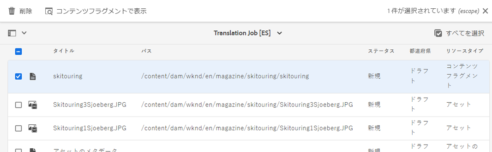

そのアイコンを選択すると、翻訳済みコンテンツフラグメントがエディターコンソールで開き、翻訳済みコンテンツの詳細が表示されます。

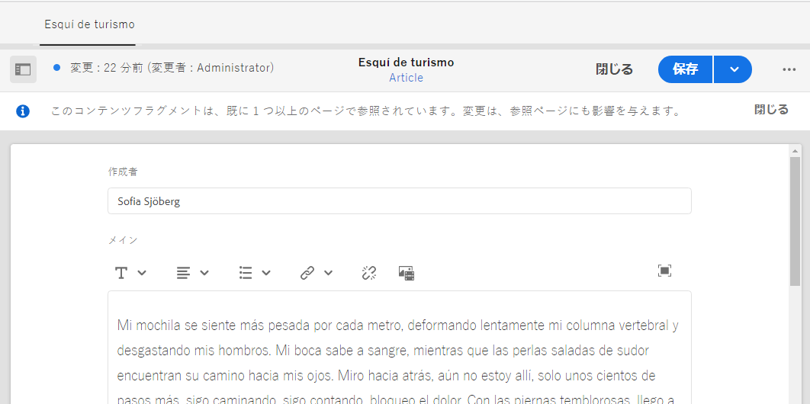

適切な権限があれば、コンテンツフラグメントを必要に応じてさらに変更できますが、コンテンツフラグメントの編集はこのジャーニーの範囲外ですので、ここでは扱いません。このトピックについて詳しくは、このドキュメントの最後にある[その他のリソース](#additional-resources)の節を参照してください。

プロジェクトの目的は、翻訳に関連するすべてのリソースを 1 か所に集めて、簡単にアクセスでき概要を明確に把握できるようにすることです。ただし、翻訳済み項目の詳細を確認すればわかるように、翻訳自体は翻訳言語のアセットフォルダーに戻ります。この例では、次のフォルダーです。

```text
/content/dam/wknd/es
```

**ナビゲーション**／**ファイル**／**アセット**&#x200B;を選択してこのフォルダーに移動すると、翻訳済みコンテンツが表示されます。

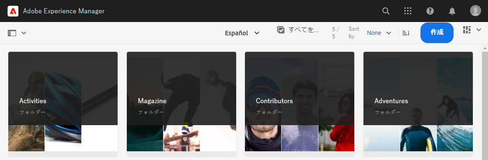

AEM の翻訳フレームワークは、翻訳コネクタから翻訳を受け取ると、言語ルートに基づき、コネクタから提供される翻訳を使用して、コンテンツ構造を自動的に作成します。

このコンテンツは公開されないのでヘッドレスサービスでは使用できないことを理解しておくことが重要です。翻訳ジャーニーの次のステップでは、このオーサーと公開の構造や、翻訳済みコンテンツの公開方法について説明します。

## 人間による翻訳 {#human-translation}

翻訳サービスが人間による翻訳を提供する場合は、レビュープロセスには追加のオプションが用意されています。例えば、翻訳が&#x200B;**ドラフト**&#x200B;ステータスでプロジェクトに戻った場合は、翻訳を手動でレビューし、承認または却下する必要があります。

人間による翻訳は、このローカライゼーションジャーニーの範囲外です。このトピックについて詳しくは、このドキュメントの最後にある[その他のリソース](#additional-resources)の節を参照してください。ただし、追加の承認オプション以外は、このジャーニーで説明しているように、人間による翻訳のワークフローは機械翻訳のものと同じです。

## 次のステップ {#what-is-next}

これで、ヘッドレス翻訳ジャーニーのこの手順が完了し、以下のことができるようになりました。

* 翻訳プロジェクトの概要を理解。
* 新しい翻訳プロジェクトの作成。
* 翻訳プロジェクトを使用したヘッドレスコンテンツの翻訳。

この知識を踏まえて、[翻訳済みコンテンツの公開](publish-content.md)のドキュメントを次に参照しながら、AEM ヘッドレス翻訳ジャーニーを続けてください。このドキュメントでは、翻訳済みコンテンツを公開する方法と、言語ルートコンテンツの変更に合わせてこれらの翻訳を更新する方法について説明します。

## その他のリソース {#additional-resources}

[翻訳済みコンテンツの公開](publish-content.md)のドキュメントを確認して、ヘッドレス翻訳ジャーニーの次のパートに進むことをお勧めします。以下のリソースでは、このドキュメントで取り上げた概念についてより詳しく説明しています。なお、これらは追加のオプションリソースであり、ジャーニーを続けるうえで必須ではありません。

* [翻訳プロジェクトの管理](/help/sites-cloud/administering/translation/managing-projects.md) - 翻訳プロジェクトの詳細と、人間による翻訳のワークフローや多言語プロジェクトなどの追加機能について説明します。
* [オーサリング環境とツール](/help/sites-cloud/authoring/path-selection.md#path-selection) - AEM には、堅牢なパスブラウザーなど、コンテンツを整理および編集するための様々なメカニズムが用意されています。このドキュメントでは、それらについて説明します。
