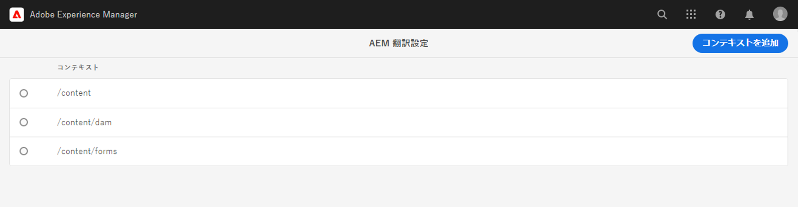

# 翻訳ルールの設定 {#configure-translation-rules}

翻訳するコンテンツを特定するための翻訳ルールを定義する方法を説明します。

## これまでの説明内容 {#story-so-far}

AEM ヘッドレス翻訳ジャーニーの以前のドキュメント、[翻訳統合の設定](configure-connector.md)では、翻訳統合をインストールおよび設定する方法について確認し、次のことができるようになりました。

* AEM の翻訳統合フレームワークの重要なパラメーターを理解する
* 翻訳サービスへの独自の接続をセットアップできる

統合がセットアップされたので、この記事では次のステップとして、翻訳が必要なコンテンツを特定する方法について説明します。

>[!CAUTION]
>
>このドキュメントジャーニーの手順は、コンテンツフラグメントで&#x200B;**翻訳可能**&#x200B;フラグを使用しない場合のみ必要です。
>
>* **翻訳可能**&#x200B;フラグは、自動的に翻訳ルールを作成するので、操作は必要ありません。
>* **翻訳可能**&#x200B;フラグは、翻訳統合フレームワークの設定が「**[翻訳用にコンテンツモデルフィールドを有効にする](/help/sites-cloud/administering/translation/integration-framework.md)**」に設定されている場合にのみ使用されます。
>* TIF 設定でこのオプションを有効にすると、手動で作成した翻訳ルールが置き換えられます。|

## 目的 {#objective}

このドキュメントを通じて、AEM の翻訳ルールを使用して翻訳コンテンツを特定する方法を理解できるようになります。このドキュメントを読み終えると、次のことが可能になります。

* 翻訳ルールの機能を理解する
* 独自の翻訳ルールを定義できる

## 翻訳ルール {#translation-rules}

コンテンツフラグメントはヘッドレスコンテンツを表すものですが、その中には、構造化されたフィールドにより整理された多くの情報を含めることができます。プロジェクトのニーズによっては、必ずしもコンテンツフラグメント内のすべてのフィールドを翻訳する必要はありません。

翻訳ルールは、翻訳プロジェクトに含める、または翻訳プロジェクトから除外するコンテンツを特定します。コンテンツが翻訳されると、AEM はこれらのルールに基づいてコンテンツを抜き出すか組み込みます。このようにして、翻訳が必要なコンテンツのみが翻訳サービスに送信されます。

翻訳ルールには以下の情報が含まれます。

* ルールが適用されるコンテンツのパス
   * コンテンツの子ノードにもルールが適用されます
* 翻訳するコンテンツを含んだプロパティの名前
   * このプロパティは、特定のリソースタイプに固有のものでも、すべてのリソースタイプに固有のものでもかまいません

コンテンツフラグメントモデルは、コンテンツフラグメントの構造を定義するものであり、プロジェクトに固有のものなので、コンテンツモデルのどの要素を翻訳するかを AEM が把握できるように、翻訳ルールをセットアップすることが不可欠です。

>[!TIP]
>
>通常は、コンテンツアーキテクトが翻訳担当者に対し、翻訳が必要なすべてのフィールドの&#x200B;**プロパティ名**&#x200B;を提供します。これらの名前は、翻訳ルールを設定するために必要です。このジャーニーで前述したように、翻訳担当者は[これらの「**プロパティ名**」を自分でを見つけることができます](getting-started.md#content-modlels)。

## 翻訳ルールの作成 {#creating-rules}

複数のルールを作成して、複雑な翻訳要件をサポートすることができます。例えば、取り組んでいるプロジェクトのうち一方では、モデルのすべてのフィールドを翻訳する必要があるのに対して、もう一方では、説明フィールドのみ翻訳が必要で、タイトルは翻訳せずにそのままにしておく、といった場合があります。

翻訳ルールは、このようなシナリオに対応できるように設計されています。ただし、ここでは、シンプルな単一の設定に的を絞って、ルールの作成方法を説明します。

翻訳ルールの設定に使用できる&#x200B;**翻訳設定**&#x200B;コンソールがあります。これにアクセスするには：

1. **ツール**／**一般**&#x200B;に移動します。
1. 「**翻訳設定**」を選択します。

**翻訳設定** UI には、翻訳ルールに使用できるいくつかのオプションがあります。ここでは、基本的なヘッドレスローカライゼーション設定に必要な最も一般的な手順を示します。

1. 「**コンテキストを追加**」を選択してパスを追加します。これは、ルールの影響を受けるコンテンツのパスです。
   
1. パスブラウザーを使用して必要なパスを選択し、「**確認**」をクリックして保存します。なお、ヘッドレスコンテンツを保持するコンテンツフラグメントは、通常、`/content/dam/<your-project>` の配下に配置されます。
   
1. 作成したコンテキスト、「**編集**」の順に選択します。これにより、プロパティを設定するための&#x200B;**翻訳ルールエディター**が開きます。
   
1. デフォルトでは、すべての設定が親パス（この例では `/content/dam`）から継承されます。設定にフィールドを追加するには、「**継承元`/content/dam`**」オプションをオフにします。
1. オフにしたら、コンテンツフラグメントモデルのプロパティ名のうち、[翻訳対象のフィールドとして既に特定されている](getting-started.md#content-models)ものを、リストの「**一般**」セクションに追加します。
   1. 「**新しいプロパティ**」フィールドで、プロパティ名を入力します。「**翻訳**」オプションと「**継承**」オプションが自動的にオンになることに注意してください。
   1. 「**追加**」を選択します。
   1. 翻訳が必要なすべてのフィールドについて、上記の手順を繰り返します。
   1. 「**保存**」を選択します。
      

これで、翻訳ルールが設定されました。

## 高度な使用方法 {#advanced-usage}

翻訳ルールの一部として設定できる追加のプロパティがいくつかあります。さらに、ルールを XML として手動で指定できるので、個別の要件への対応能力と柔軟性を高めることができます。

このような機能は、通常、ヘッドレスコンテンツのローカライズを開始する際に必要なものではありませんが、興味があれば、[その他のリソース](#additional-resources)の節を参照して詳細を確認してください。

## 次のステップ {#what-is-next}

これで、ヘッドレス翻訳ジャーニーのこの手順が完了し、以下のことができるようになりました。

* 翻訳ルールの機能を理解する
* 独自の翻訳ルールを定義できる

この知識を基に、AEM ヘッドレス翻訳ジャーニーを続けてください。次に、[コンテンツの翻訳](translate-content.md)のドキュメントを参照しながら、統合とルールを連携させてヘッドレスコンテンツを翻訳する方法について説明します。

## その他のリソース {#additional-resources}

[コンテンツの翻訳](translate-content.md)のドキュメントを確認して、ヘッドレス翻訳ジャーニーの次のパートに進むことをお勧めしますが、以下のリソースではこのドキュメントで取り上げた概念についてより詳しく説明しています。追加的なオプションであり、ジャーニーを続ける上で必須のリソースではありません。

* [翻訳するコンテンツの特定](/help/sites-cloud/administering/translation/rules.md) - 翻訳が必要なコンテンツを翻訳ルールで特定する方法について説明します。
