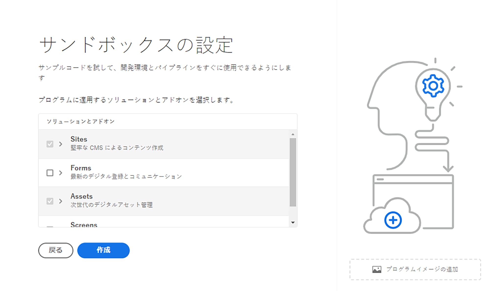

# プログラムの作成 {#create-program}

[オンボーディングジャーニー](overview.md)のこのパートでは、Cloud Manager を使用して最初のプログラムを作成する方法を説明します。

## 目的 {#objective}

オンボーディングジャーニーの前のドキュメント（[Cloud Manager へのアクセス](cloud-manager.md)）を確認し、Cloud Manager への適切なアクセス権があることを確認しました。これで、最初のプログラムを作成できます。

このドキュメントを読み終えると、次のことができるようになります。

* プログラムとは何かを理解し、説明する。
* 実稼動プログラムとサンドボックスプログラムの違いを理解する。
* 独自のプログラムを作成する。

## プログラムとは {#programs}

プログラムとは、Cloud Manager での最上位レベルの組織です。 ご利用のアドビのライセンスによりますが、プログラムを使用するとソリューションを整理し、特定のチームメンバーにそのプログラムへのアクセス権を付与できます。

Cloud Manager のプログラムは、Cloud Manager の一連の環境を表します。 これらのプログラムは、論理的な一連のビジネスイニシアチブをサポートします。通常、ライセンス済みのサービスレベル契約（SLA）に対応しています。 例えば、あるプログラムが組織のグローバルなパブリック web サイトをサポートする Adobe Experience Manager（AEM）リソースを表す一方で、別のプログラムは社内の中核的 DAM を表す場合があります。

旅行関連のメディアに焦点を当てたテナントである理論上の WKND Travel and Adventure Enterprises の例を思い出すと、2 つのプログラムが含まれています。WKND マガジン部門用の 1 つの AEM Sites プログラムと、WKND メディア部門用の 1 つの Assets プログラムです。そして、チームメンバーの分業の必要性によって、異なるメンバーが異なるプログラムにアクセスできるようになります。

2 種類のプログラムがあります。

* **実稼動プログラム**&#x200B;は、サイトのライブトラフィックを有効にするために作成されます。これは、「実際の」環境です。
* **サンドボックスプログラム**&#x200B;は、通常、トレーニング、デモの実行、イネーブルメント、POC またはドキュメントの目的にかなうように作成されます。

様々な目的があるので、環境の違いによってオプションが異なります。 ただし、環境を作成するプロセスは似ています。 このオンボーディングジャーニーでは、サンドボックス環境を作成します。

>[!TIP]
>
>実稼動プログラムを作成する必要がある場合は、[その他のリソース](#additional-resources)の節で、プログラムを詳細に説明しているドキュメントへのリンクを参照してください。

## サンドボックスプログラムの作成 {#create-sandbox}

1. [my.cloudmanager.adobe.com](https://my.cloudmanager.adobe.com/) で Cloud Manager にログインし、適切な組織を選択します。

1. Cloud Manager のランディングページで、画面の右上隅にある「**プログラムを追加**」をクリックします。

   

1. プログラム作成ウィザードで、「**サンドボックスを設定**」を選択し、プログラム名を入力して、「**続行**」を選択します。

   

1. **サンドボックスの設定**&#x200B;ダイアログボックスで、サンドボックスプログラムで有効にするソリューションを選択できます。**Sites** および **Assets** ソリューションは、常にサンドボックスプログラムに含まれ、自動的に選択されます。オンボーディングの例ではこれで十分です。「**作成**」をクリックします。

   

ランディングページに新しいサンドボックスプログラムカードが表示され、セットアッププロセスの進行に応じてステータスインジケーターも表示されます。

プログラムが完了すると、**開発者**&#x200B;製品プロファイルに割り当てられた組織のメンバーは、 Cloud Manager にログインして Cloud Manager の Git リポジトリを管理できるようになります。

## 次のステップ {#whats-next}

最初のプログラムを作成したので、そのプログラムの環境を作成できるようになりました。次に、[環境の作成](create-environments.md)ドキュメントを確認し、オンボーディングジャーニーを続けてください。

## その他のリソース {#additional-resources}

オンボーディングジャーニーのコンテンツの範囲を超えてさらに詳しく知りたい場合に役立つ、追加のオプションリソースを次に示します。

* [プログラムとプラグラムの種類](/help/implementing/cloud-manager/getting-access-to-aem-in-cloud/program-types.md) - Cloud Manager の階層、その構造に様々な種類のプログラムが収まる仕組み、それらのプログラムの違いなどについて説明します。
* [サンドボックスプログラムの作成](/help/implementing/cloud-manager/getting-access-to-aem-in-cloud/creating-sandbox-programs.md) - Cloud Manager を使用して、トレーニング、デモ、POC などの実稼動以外の用途に使用する独自のサンドボックスプログラムを作成する方法を説明します。
* [実稼動プログラムの作成](/help/implementing/cloud-manager/getting-access-to-aem-in-cloud/creating-production-programs.md) - Cloud Manager を使用して、実トラフィックを取り扱う独自の実稼動プログラムを作成する方法について説明します。
* [Adobe Cloud Manager の使用 - プログラム](https://experienceleague.adobe.com/docs/experience-manager-learn/cloud-service/cloud-manager/programs.html?lang=ja) - Cloud Manager のプログラムは、論理的な一連のビジネスイニシアチブをサポートする一連の AEM 環境を表し、通常、購入したサービス契約（SLA）に対応しています。
* [AEM as a Cloud Service のチームおよび製品プロファイル](/help/onboarding/aem-cs-team-product-profiles.md) - ライセンス取得済みのアドビソリューションに対するアクセスを AEM as a Cloud Service のチームおよび製品プロファイルで許可および制限する方法について説明します。
