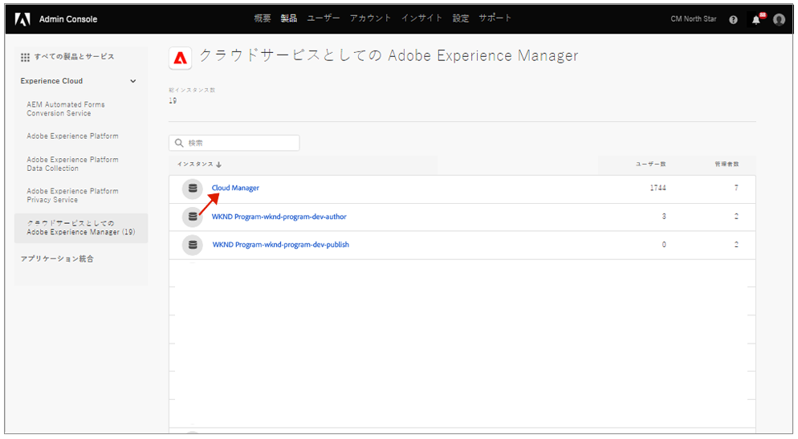
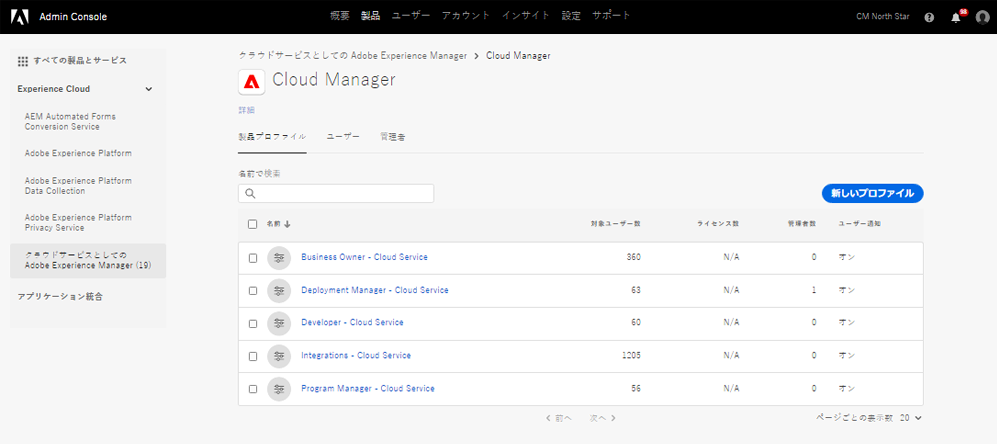
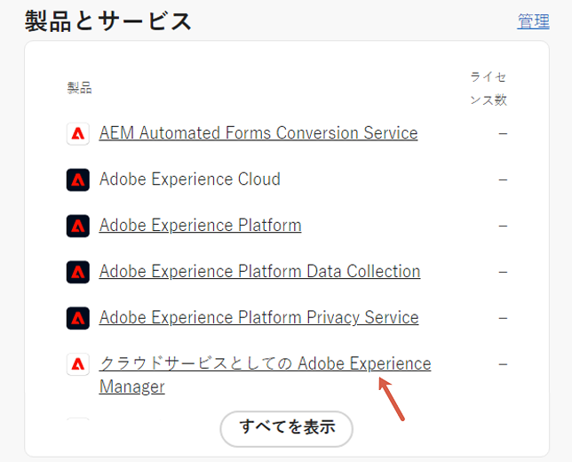
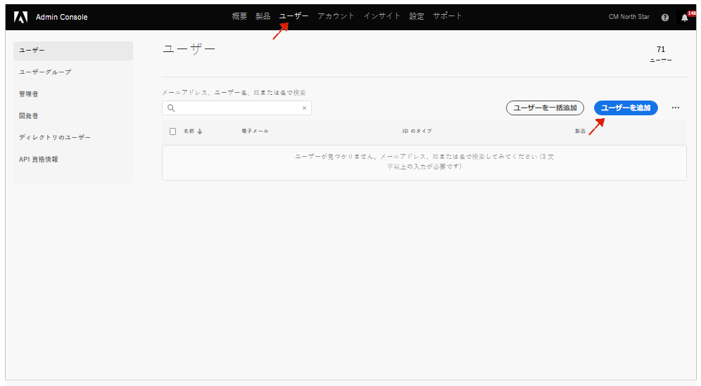

# 通知プロファイル {#notification-profiles}

Admin Console でユーザープロファイルを作成して重要なメール通知の受信を管理する方法を説明します。

## 概要 {#overview}

アドビでは、場合によって、AEM as a Cloud Service 環境に関してユーザーに連絡する必要があります。アドビは、製品内通知に加えて、通知にメールを使用する場合もあります。 このようなメール通知には、次の 2 種類があります。

* **インシデント通知** - これらの通知は、インシデント発生時またはアドビが AEM as a Cloud Service 環境の可用性に関する潜在的な問題を特定した場合に送信されます。
* **事前通知** - これらの通知は、アドビのサポートチームメンバーが、AEM as a Cloud Service 環境に役立つ、潜在的な最適化やレコメンデーションに関するガイダンスを提供したい場合に送信されます。

また、ユーザーは、[カスタムグループ権限](/help/implementing/cloud-manager/custom-permissions.md)に基づいて、特定のプログラムに対するこれらの通知を受信することもできます。

さらに、事前通知へのグループの割り当てがサポートされ、ユーザーとグループを製品プロファイルに直接割り当てることができます。

* インシデント通知グループと事前通知グループのユーザーは、デフォルトですべてのプログラムの通知を受信します。
* ただし、ユーザーがすべての通知を受信しない場合は、カスタム読み取り権限を使用して、受信するプログラム通知を指定できます。

これらの通知を正しいユーザーが受け取るには、ユーザープロファイルを設定して割り当てる必要があります。それについて、このドキュメントで説明しています。

## 前提条件 {#prerequisites}

ユーザープロファイルの作成と管理は Admin Console で行われるので、通知用のユーザープロファイルを作成する前に以下が必要です。

* プロファイルメンバーシップを追加および編集する権限があること。
* 有効な Adobe Admin Console プロファイルがあること。

## 新しい Cloud Manager 製品プロファイルの作成 {#create-profiles}

通知の受信を適切に設定するには、2 つのユーザープロファイルを作成します。これらの手順は 1 回だけ実行されます。

1. [`https://adminconsole.adobe.com`](https://adminconsole.adobe.com) で Admin Console にログインします。

1. 自分が正しい組織に属していることを確認します。

1. **概要**&#x200B;ページで、**製品とサービス**&#x200B;カードから「**Adobe Experience Manager as a Cloud Service**」を選択します。

   

1. すべてのインスタンスのリストから **Cloud Manager** インスタンスを選択して、そこに移動します。

   

1. 設定済みのすべての Cloud Manager 製品プロファイルのリストが表示できます。

   

1. 「**新規プロファイル**」をクリックし、次の詳細を入力します。

   * **製品プロファイル名**：`Incident Notification - Cloud Service`
   * **表示名**：`Incident Notification - Cloud Service`
   * **説明**：インシデント発生時、またはアドビが AEM as a Cloud Service 環境の可用性に関する潜在的な問題を特定した場合に通知を受信する、ユーザーのための Cloud Manager プロファイル。
      * 特定のプログラムに対するカスタム読み取り権限を持つユーザーは、カスタム権限の使用を選択した場合、それらのプログラムに関する通知のみを受信します。

1. 「**保存**」をクリックします。

1. 「**新規プロファイル**」をもう一度クリックし、次の詳細を入力します。

   * **製品プロファイル名**：`Proactive Notification - Cloud Service`
   * **表示名**：`Proactive Notification - Cloud Service`
   * **説明**：アドビのサポートチームメンバーが、AEM as a Cloud Service 環境設定で行う潜在的な最適化やレコメンデーションに関するガイダンスを提供したい場合に通知を受け取るユーザーの Cloud Manager プロファイル
      * 特定のプログラムに対するカスタム読み取り権限を持つユーザーは、カスタム権限の使用を選択した場合、それらのプログラムに関する通知のみを受信します。

1. 「**保存**」をクリックします。

2 つの新しい通知プロファイルが作成されます。

>[!NOTE]
>
>Cloud Manager **製品プロファイル名**&#x200B;が指定されたものとまったく同じであることが重要です。エラーを避けるために、指定された製品プロファイル名をコピー＆ペーストしてください。逸脱や入力ミスがあれば、通知が意図したとおりに送信されません。
>
>エラーが発生した場合やプロファイルが定義されていない場合、アドビはデフォルトで **Cloud Manager 開発者**&#x200B;または&#x200B;**デプロイメントマネージャー**&#x200B;プロファイルに割り当てられた既存のユーザーに通知します。

## 通知プロファイルにユーザーを割り当てる {#add-users}

プロファイルが作成されたら、適切なユーザーを割り当てる必要があります。これは、新規ユーザーの作成時または既存ユーザーの更新時に実行できます。

### プロファイルに新規ユーザーを追加する {#new-user}

Federated ID がまだ設定されていないユーザーを追加するには、次の手順に従います。

1. インシデントまたは事前通知のいずれかを受信する、ユーザーまたはグループを特定します。

1. まだログインしていない場合は、[`https://adminconsole.adobe.com`](https://adminconsole.adobe.com) で Admin Console にログインします。

1. 適切な組織が選択されていることを確認します。

1. **概要**&#x200B;ページで、**製品とサービス**&#x200B;カードから「**Adobe Experience Manager as a Cloud Service**」を選択します。

   

1. チームメンバーの Federated ID がまだ設定されていない場合は、上部のナビゲーションから「**ユーザー**」タブを選択し、「**ユーザーを追加**」を選択します。それ以外の場合は、[プロファイルに既存ユーザーを追加する](#existing-users)の節にスキップします。

   

1. **チームにユーザーを追加**&#x200B;ダイアログで、追加するユーザーのメール ID を入力し、「**ID タイプ**」に `Adobe ID` を選択します。

1. **製品を選択**&#x200B;見出しの下にあるプラスボタンをクリックして、製品の選択を開始します。 

1. 「**Adobe Experience Manager as a Cloud Service**」を選択し、新しいプロファイルの一方または両方をユーザーに割り当てます。

   * **インシデント通知 - Cloud Service**
   * **事前通知 - Cloud Service**

1. 「**保存**」をクリックすると、追加したユーザーにウェルカムメールが送信されます。

招待されたユーザーに通知が届くようになります。 特定のプログラムに対するカスタム読み取り権限を持つユーザーは、カスタム権限の使用を選択した場合、それらのプログラムに関する通知のみを受信します。

通知を受信するチームのユーザーに対して、これらの手順を繰り返します。

### プロファイルに既存ユーザーを追加する {#existing-user}

Federated ID が既に存在するユーザーを追加するには、次の手順に従います。

1. インシデントまたは事前通知のいずれかを受信する、ユーザーまたはグループを特定します。

1. まだログインしていない場合は、[`https://adminconsole.adobe.com`](https://adminconsole.adobe.com) で Admin Console にログインします。

1. 適切な組織が選択されていることを確認します。

1. **概要**&#x200B;ページで、**製品とサービス**&#x200B;カードから「**Adobe Experience Manager as a Cloud Service**」を選択します。

1. 上部のナビゲーションから「**ユーザー**」タブを選択します。

1. 通知プロファイルに追加するチームメンバーの Federated ID が既に存在する場合は、そのユーザーをリスト内で見つけて、クリックします。それ以外の場合は、[プロファイルに新規ユーザーを追加する](#add-user)の節にスキップします。

1. ユーザー詳細ウィンドウの「**製品**」セクションで、省略記号ボタンをクリックし、「**編集**」を選択します。

1. **製品を編集**&#x200B;ウィンドウで、**製品を選択**&#x200B;見出しの下にある鉛筆ボタンをクリックして、製品の選択を開始します。

1. 「**Adobe Experience Manager as a Cloud Service**」を選択し、新しいプロファイルの一方または両方をユーザーに割り当てます。

   * **インシデント通知 - Cloud Service**
   * **事前通知 - Cloud Service**

1. 「**保存**」をクリックすると、追加したユーザーにウェルカムメールが送信されます。

招待されたユーザーに通知が届くようになります。 特定のプログラムに対するカスタム読み取り権限を持つユーザーは、カスタム権限の使用を選択した場合、それらのプログラムに関する通知のみを受信します。

通知を受信するチームのユーザーに対して、これらの手順を繰り返します。

## その他のリソース {#additional-resources}

オンボーディングジャーニーのコンテンツの範囲を超えてさらに詳しく知りたい場合に役立つ、追加のオプションリソースを次に示します。

* [アクションセンター](/help/operations/actions-center.md) - アクションセンターを活用して、インシデントやその他の重要な情報に便利に対応します。
