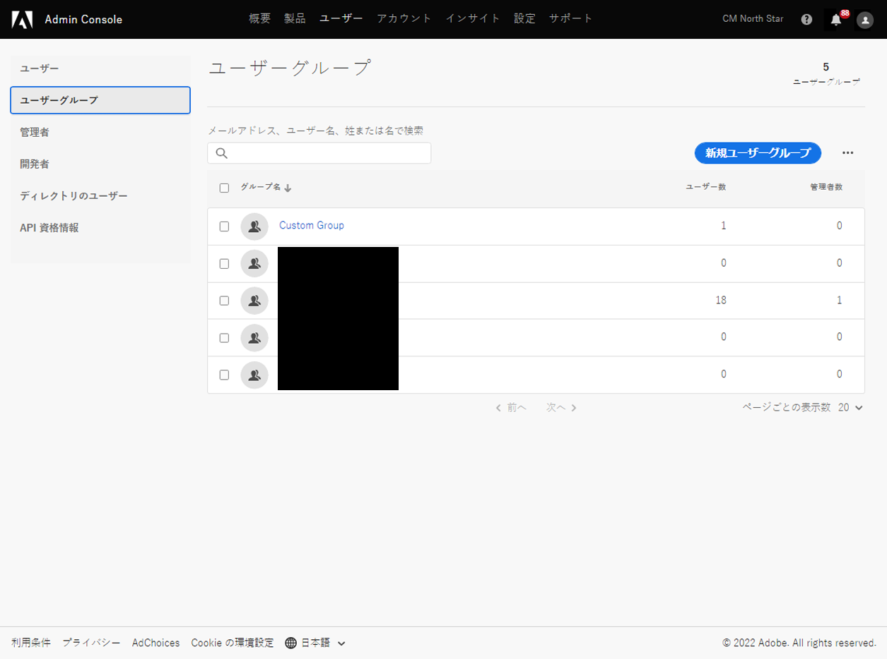
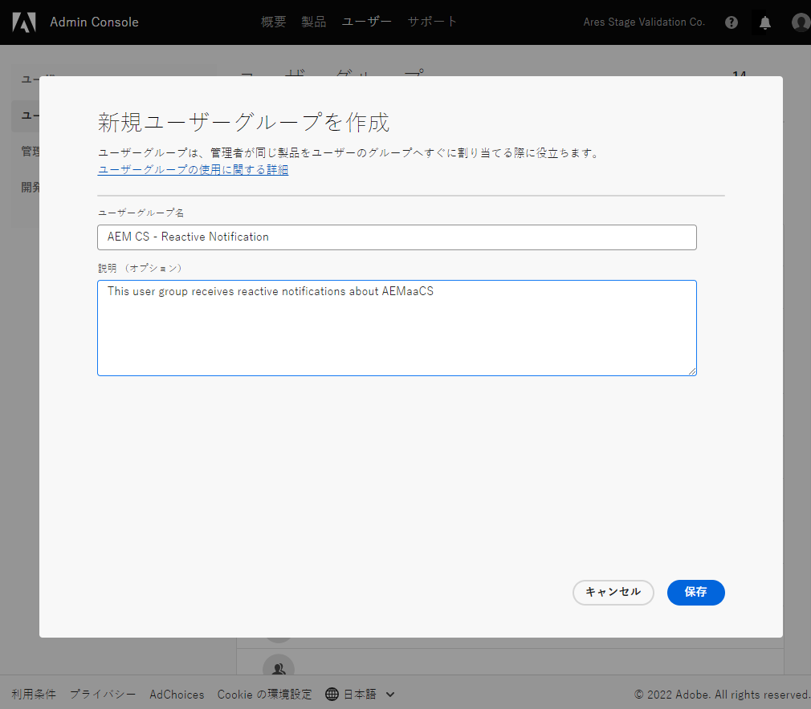
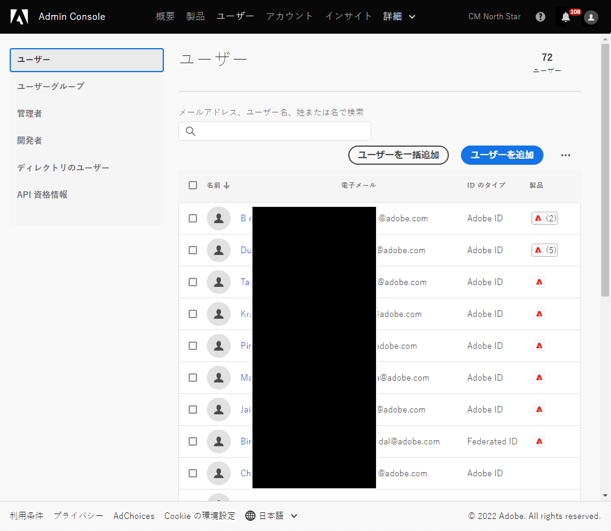
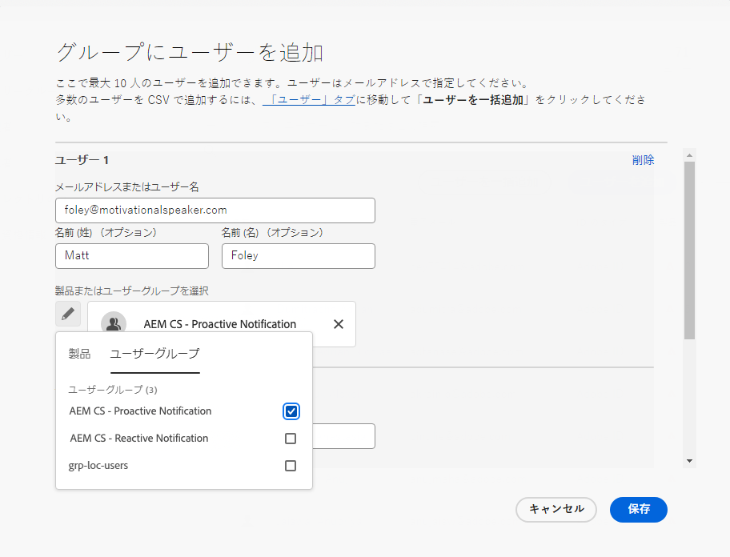
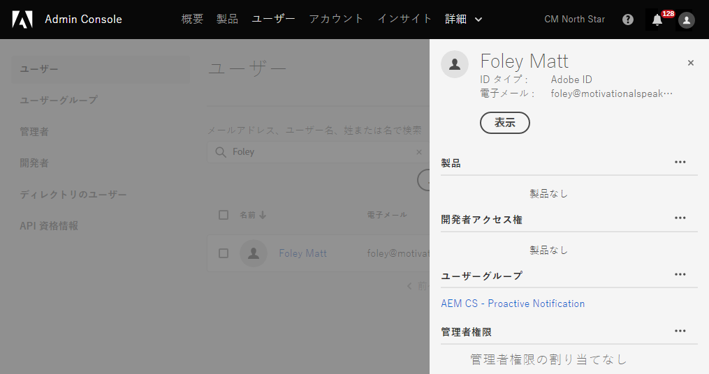

# 通知用のユーザーグループ {#user-groups}

重要な電子メール通知の受信を管理するために、Admin Consoleでユーザーグループを作成する方法を説明します。

## 概要 {#overview}

時々、Adobeは、AEMのas a Cloud Service環境に関してに連絡する必要があります。 Adobeは、製品内通知に加えて、このような通知に E メールを使用する場合もあります。 このような通知には次の 2 種類があります。

* **リアクティブな通知**  — これらの通知は、インシデント発生時またはAdobeがAEM as a Cloud Service環境で可用性の問題を特定した際に送信されます。
* **事前通知**  — これらの通知は、Adobeサポートチームのメンバーが、AEMのas a Cloud Service環境に役立つ潜在的な最適化または推奨事項に関するガイダンスを提供したい場合に送信されます。

正しいユーザーがこれらの通知を受け取るには、ユーザーグループを設定する必要があります。

## 前提条件 {#prerequisites}

ユーザーグループはAdmin Console内で作成および管理されるので、通知用のユーザーグループを作成する前に、次の操作を行う必要があります。

* グループメンバーシップを追加および編集する権限を持っている。
* 有効なAdobe Admin Consoleプロファイルがある。

## 通知用のユーザーグループの作成 {#create-groups}

通知の受信を適切に設定するには、2 つのユーザーグループを作成する必要があります。 これらの手順は、1 回のみ実行する必要があります。

1. 次の場所でAdmin Consoleにログイン [`https://adminconsole.adobe.com`.](https://adminconsole.adobe.com)

1. をクリックします。 **ユーザー** タブ、 **ユーザーグループ** 」オプションを使用します。

   

1. 次をクリック： **新規ユーザーグループ** ボタンをクリックし、 **ユーザーグループ名** 指定されたとおり、オプション **説明**.

   * グループ名は、次の名前と一致する必要があります。 グループ名を調整または修正しないでください。
      * `AEM CS - Reactive Notification`
      * `AEM CS - Proactive Notification`

   

1. 「**保存**」をクリックします。

1. 2 つ目のグループの手順を繰り返します。

グループが定義されていない場合、Adobeは Cloud Manager を使用して既存のユーザーに通知します **開発者** または **導入** プロファイル：

## グループにユーザーを追加 {#add-users}

グループが作成されたら、適切なユーザーを割り当てる必要があります。 これは、新しいユーザーを作成する際に実行するか、既存のユーザーを更新する際に実行できます。

### グループに新しいユーザーを追加 {#new-user}

1. 次の場所でAdmin Consoleにログイン [`https://adminconsole.adobe.com`](https://adminconsole.adobe.com) まだログインしていない場合は、をクリックします。

1. をクリックします。 **ユーザー** タブ、 **ユーザー** 」オプションを使用します。

   

1. 次をクリック： **ユーザーを追加** 」ボタンをクリックし、ユーザーの電子メールアドレスを入力します。 オプションで、姓と名を指定することもできます。

   * ユーザーが既に存在する場合、Admin Consoleは E メールアドレスと一致し、フィールドに事前入力します。

1. ユーザー名フィールドの下のプラス記号をクリックし、 **ユーザーグループ** 」タブをクリックして、そのユーザーのグループを選択します。

   

1. クリック **保存** をクリックして、新しいユーザーを保存します。

通知グループを割り当てる必要があるユーザーごとに、これらの手順を繰り返します。

### グループに既存のユーザーを追加 {#existing-user}

1. 次の場所でAdmin Consoleにログイン [`https://adminconsole.adobe.com`](https://adminconsole.adobe.com) まだログインしていない場合は、をクリックします。

1. をクリックします。 **ユーザー** タブ、 **ユーザー** 」オプションを使用します。

   

1. 通知グループに追加するユーザーの行をクリックします。 ユーザーの詳細を表示するパネルが開きます。

1. 「 **ユーザーグループ** 」セクションを使用して、詳細パネルに表示されます。